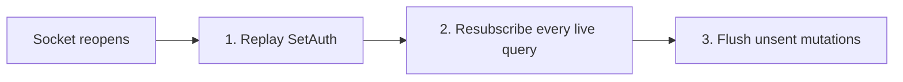

{/* diataxis: how-to */}

`@stackbase/client` is the framework-agnostic client that runs the reactive sync protocol underneath
your app: a transport, a `StackbaseClient` built on top of it, and (via `@stackbase/client/react`)
hooks that subscribe a component to a query and re-render it on every push.

This page covers the whole client surface: construction, transports, every `StackbaseClient` method,
the React hooks, the wire lifecycle, auth, typed codegen, and error handling. For deep dives on the
two biggest features built on this client, see [Optimistic updates](/docs/client/optimistic-updates)
and [Offline sync](/docs/client/offline-sync).

## Construct a client

`StackbaseClient` takes a **transport** (the thing that actually carries the sync protocol) plus
optional configuration:

```tsx title="examples/chat/web/main.tsx"
import { StackbaseClient, webSocketTransport } from "@stackbase/client";

const wsProtocol = location.protocol === "https:" ? "wss" : "ws";
const client = new StackbaseClient(webSocketTransport(`${wsProtocol}://${location.host}/api/sync`));
```

`StackbaseClient` itself never touches the network directly. Every method (`subscribe`, `query`,
`mutation`, `action`, `setAuth`) goes through the transport. That's what makes an embedded, in-process
connection (`loopbackTransport`) and a networked one (`webSocketTransport`) behave identically from
the app's point of view.

### Constructor options

The second constructor argument configures durable offline sync and a few knobs most apps never need
to touch:

```ts
new StackbaseClient(transport, {
  outbox: indexedDBOutbox(),        // opt into the durable offline outbox, see Offline sync
  onClientReset: (info) => { ... }, // the server disowned this client's mutation history
  onMutationFailed: (info) => { ... }, // a terminal durable failure with no live awaiter
  poisonPolicy: "skip",             // "skip" (default) or "pause", see Offline sync
  outboxMaxQueueSize: 1000,         // cap on unsettled durable entries (default 1000)
  optimisticUpdates: { "messages:send": (store, args) => { ... } }, // registry for hydrated entries
  gateTimeoutMs: 10_000,            // internal reconcile-gate timeout (default 10s, rarely overridden)
});
```

Everything outbox-related (`outbox`, `poisonPolicy`, `outboxMaxQueueSize`, `outboxLocks`,
`outboxDeployment`, `outboxDrainIntervalMs`, `outboxChunkSize`, `outboxBroadcast`,
`outboxBackoffMs` (a custom retry-delay function for the drain), `onOutboxPause` (fires when a
`"pause"` poison policy halts the drain), `onClientReset`, `onMutationFailed`, `optimisticUpdates`)
is documented in full in [Offline sync](/docs/client/offline-sync). A client constructed with no
`outbox` behaves exactly as if none of this existed.

## Transports

The client logic itself is transport-agnostic. There are two transports to pick between.

<Tabs items={['loopbackTransport', 'webSocketTransport']}>

<Tab value="loopbackTransport">

`loopbackTransport(connection)` is for an embedded, in-process connection: no network hop, used when
the client and the engine run in the same process (tests, `@stackbase/test`, single-process
deployments). It wraps anything shaped like `{ send, onMessage, close }` and never reconnects.
`onReopen` is simply absent, and the client treats a transport without it as one that doesn't support
reconnection.

</Tab>

<Tab value="webSocketTransport">

`webSocketTransport(url, options?)` is for a real deployment, talking to `stackbase dev`/`stackbase
serve` over the network:

```ts
import { webSocketTransport } from "@stackbase/client";

const transport = webSocketTransport("wss://myapp.example.com/api/sync", {
  reconnect: true,          // default true
  initialBackoffMs: 300,    // default 300
  maxBackoffMs: 30_000,     // default 30s
});
```

<TypeTable
  type={{
    reconnect: {
      description: "Reconnect automatically after a disconnect. Set to false to restore the old terminal-on-close transport: one dead socket ends the session, exactly as it worked before reconnect support existed.",
      type: "boolean",
      default: "true",
    },
    initialBackoffMs: {
      description: "Base delay before the first reconnect attempt.",
      type: "number",
      default: "300",
    },
    maxBackoffMs: {
      description: "The backoff cap, about 30 seconds.",
      type: "number",
      default: "30_000",
    },
    createWebSocket: {
      description: "Test and embedding seam: how to construct the underlying WebSocket.",
      type: "(url: string) => WebSocket",
      default: "(url) => new WebSocket(url)",
    },
  }}
/>

</Tab>

</Tabs>

## Reconnection, in detail

**The WebSocket transport reconnects by default.** This is the behavior an app gets for free unless it
opts out with `{ reconnect: false }`.

### Backoff schedule

Each reconnect attempt waits an exponentially-growing, jittered delay, capped at `maxBackoffMs`.

<Accordions type="single">

<Accordion title="The exact backoff math">

Each attempt waits `reconnectDelayMs(attempt, initialBackoffMs, maxBackoffMs)`. The schedule uses
equal jitter: half the exponential delay, plus up to another half at random. This never produces a
zero wait, which avoids a thundering-herd reconnect storm the instant a server comes back:

```ts
import { reconnectDelayMs } from "@stackbase/client";

// half of min(maxBackoffMs, initialBackoffMs * 2**attempt), plus up to another half at random
const delay = reconnectDelayMs(attempt, 300, 30_000);
```

`reconnectDelayMs` is exported directly so the schedule itself is testable without simulating a
socket.

</Accordion>

</Accordions>

### What happens on reopen

`onReopen` fires once per successful reconnect, never for the very first connect. When it fires, the
client runs a fixed sequence, in order:



1. Replay `SetAuth`: if `setAuth(token)` was ever called, the same token is resent first, so every
   subscription that follows re-runs under the right identity.
2. Resubscribe every live query: every subscription the app still holds open is re-sent as a fresh
   `ModifyQuerySet`, and the server's reply is adopted as a brand-new baseline regardless of version.
   There's no way to know what was missed while disconnected, so the client doesn't try to diff across
   the gap. It re-establishes from scratch. If a query result hasn't changed since disconnect, the
   server can answer with a lightweight `QueryUnchanged` instead of resending the full value. See
   [Subscription lifecycle](#subscription-lifecycle-and-wire-messages) below.
3. FIFO-flush only `unsent` mutations: any mutation that was queued because the socket was down when
   it was called goes out now, oldest first, reusing its original `requestId` so the promise created
   at the original `mutation()` call site is the one that eventually resolves.

An `inflight` mutation (one whose `Mutation` frame had already been sent when the socket dropped) is a
different story. Its outcome is genuinely unknowable: the server may or may not have received and
committed it before the drop. Without a durable outbox configured, that promise rejects with
`MutationUndeliveredError` rather than being blindly resent, since a resend could double-apply a
mutation that actually succeeded. With a durable outbox configured and armed (see
[Offline sync](/docs/client/offline-sync)), the entry instead parks, and a later drain resolves it
exactly once via server-side dedup.

```ts
import { MutationUndeliveredError } from "@stackbase/client";

try {
  await client.mutation(api.messages.send, { body });
} catch (err) {
  if (err instanceof MutationUndeliveredError) {
    // the connection dropped before we learned whether this committed.
    // without an outbox, it's on the app to decide whether re-sending is safe for this mutation.
  }
}
```

### The pre-first-open case

While the very first connection attempt is still pending, the transport buffers frames and flushes
them the moment the socket opens. That covers normal connection latency. If that first attempt
*fails* before ever opening (constructed while offline, or a network blip on load), the buffered
frames are dropped, not held: the transport announces the close, and recovery moves up a level.
When a socket finally does open, the client runs the same reopen sequence (`SetAuth` replay,
resubscribe, flush unsent mutations) as a mid-session reconnect, rebuilding everything from its own
state rather than from replayed raw frames.

The same holds for any later down period: once a socket has opened at least once (with reconnect
on), a frame sent while disconnected is deliberately dropped rather than buffered, because the
reopen sequence re-derives everything it could have represented. From the app's point of view there
is exactly one code path for "the client now has a live connection and needs to rebuild state from
what it remembers": first connect after a failed attempt, and every subsequent reconnect.

## Wrap your app in the provider

The React hooks read the client from context:

```tsx title="examples/chat/web/main.tsx"
import { StackbaseProvider } from "@stackbase/client/react";

createRoot(root).render(
  <StackbaseProvider client={client}>
    <Chat />
  </StackbaseProvider>,
);
```

`useStackbaseClient()` reads it back out. It throws if called outside a `StackbaseProvider` (every
other hook below is built on it):

```tsx
import { useStackbaseClient } from "@stackbase/client/react";

function DebugPanel() {
  const client = useStackbaseClient();
  return <button onClick={() => client.close()}>Disconnect</button>;
}
```

## Subscribe with `useQuery`

`useQuery` takes a generated function reference (`api.messages.list`) and its arguments, and returns
the current result: `undefined` until the first result arrives.

```tsx title="examples/chat/web/main.tsx"
import { useQuery } from "@stackbase/client/react";
import { api } from "../stackbase/_generated/api";

function Chat({ conversationId }: { conversationId: string }) {
  const messages = useQuery(api.messages.list, { conversationId });
  if (messages === undefined) return <p>connecting…</p>;
  return (
    <ul>
      {messages.map((m) => (
        <li key={m._id}>{m.author}: {m.body}</li>
      ))}
    </ul>
  );
}
```

Passing a codegen `api.*` reference infers typed args and a typed return value from the query's
declared `args`/`returns` validators (see [Typed codegen api](#typed-codegen-api) below). Under the
hood, `useQuery` calls `client.subscribe(...)` in an effect and re-subscribes only when the reference
or its (serialized) arguments change. The subscription is torn down automatically when the component
unmounts.

There's no manual refresh, no polling interval, and nothing to invalidate by hand. The component
re-renders on its own whenever the query's read set is touched by a committed write. See
[Queries](/docs/core-concepts/queries) and [How it works](/docs/get-started/how-it-works) for why
that works.

## The lower-level client: `subscribe`, `query`, `mutation`, `action`

`useQuery`/`useMutation`/`useAction` are thin wrappers over `StackbaseClient` methods you can also
call directly. That's useful outside React, or when you need a one-shot read rather than a live
subscription.

### `client.subscribe(ref, args, onUpdate, onError?)`

The primitive underneath `useQuery`. Subscribes to a query. `onUpdate` fires with the latest value
(synchronously, if a cached value is already on hand) every time it changes, and the optional
`onError` fires if the query's handler throws server-side. Returns an unsubscribe function:

```ts
const unsubscribe = client.subscribe(
  api.messages.list,
  { conversationId },
  (messages) => console.log("updated:", messages),
  (error) => console.error("query failed:", error),
);

// later
unsubscribe();
```

Calling `subscribe` twice with the same function reference and (serialized) arguments dedupes onto
one underlying server subscription. Each call gets its own listener, and the server subscription is
torn down only once every listener has unsubscribed. If a subscribing query throws, its last known
value stays in place for any caller that only registered `onUpdate`. A failing query is otherwise
just logged.

### `client.query(ref, args?)`

A one-shot read: resolves with the first value delivered (which may already be an actively-updating
composed value if an optimistic layer is in play), or rejects if the query throws. Then it
unsubscribes automatically:

```ts
const messages = await client.query(api.messages.list, { conversationId });
```

Use `useQuery`/`subscribe` when you want live updates. Use `query` for a single read, for example
inside an event handler, or outside a React tree entirely.

### `client.mutation(ref, args?, opts?)`

Runs a mutation. It resolves with its return value at commit (see
[Promise timing](#the-mutation-promise-resolves-at-commit) below), or rejects with its error:

```ts
await client.mutation(api.messages.send, { conversationId, author, body });
```

`opts` accepts:

- `optimisticUpdate`: render a predicted result before the round trip completes. See
  [Optimistic updates](/docs/client/optimistic-updates) for the full `OptimisticLocalStore` API,
  purity rules, and the no-flicker reconciliation contract.
- `transient: true`: skip the durable offline outbox for this call only, even when an `outbox` is
  configured on the client. It's meant for mutations that must never be durably replayed after a
  reload. The canonical example is an auth token refresh: blindly replaying a stale refresh token
  trips reuse-detection and force-signs-out an honest user. A client with no `outbox` configured is
  unaffected either way.

```ts
await client.mutation(api.auth.refresh, { refreshToken }, { transient: true });
```

### `client.action(ref, args?)`

Runs an action and resolves with its return value (or rejects with its error). Actions aren't
reactive: there's no subscription here, just a single call and response.

```ts
await client.action(api.users.sendWelcomeEmail, { userId });
```

## Call functions with `useMutation` and `useAction`

`useMutation` returns a callable that runs a mutation and resolves with its return value:

```tsx title="examples/chat/web/main.tsx"
import { useMutation } from "@stackbase/client/react";

function Chat() {
  const send = useMutation(api.messages.send);

  function submit(body: string) {
    void send({ conversationId, author, body });
  }
  // ...
}
```

`.withOptimisticUpdate(fn)` chains onto the callable `useMutation` returns, producing a new callable
with the updater bound. It doesn't mutate the original, so `useMutation(ref)` itself stays reusable
without an optimistic update:

```tsx
const send = useMutation(api.messages.send).withOptimisticUpdate((store, args) => {
  const existing = store.getQuery(api.messages.list, { conversationId: args.conversationId }) ?? [];
  store.setQuery(api.messages.list, { conversationId: args.conversationId }, [
    ...existing,
    { _id: store.placeholderId("messages"), _creationTime: store.now(), ...args },
  ]);
});
```

Calling `.withOptimisticUpdate` repeatedly with the same updater function reference across renders
returns the same bound callable, with no identity churn, as long as that reference itself is stable
(for example module-scoped, or memoized with `useCallback`). A fresh inline closure every render
churns by necessity, since there's no way to detect "this is the same update" without a reference.
Full coverage, including the store's `getQuery`/`setQuery`, `placeholderId()`/`now()` purity rules,
and the no-flicker reconciliation contract, is in [Optimistic updates](/docs/client/optimistic-updates).

`useAction` mirrors `useMutation` for actions: the side-effecting functions that run outside the
transaction (`fetch`, timers, and so on):

```tsx
import { useAction } from "@stackbase/client/react";

const sendWelcomeEmail = useAction(api.users.sendWelcomeEmail);
await sendWelcomeEmail({ userId });
```

Unlike `useQuery`, neither `useMutation` nor `useAction` subscribes to anything. Calling the returned
function runs the mutation or action once and returns a promise.

## Subscription lifecycle and wire messages

A `subscribe()`/`useQuery()` call sends a `ModifyQuerySet` frame adding the query. Unsubscribing (or a
component unmounting) sends one removing it. In between, the server pushes `Transition` frames:
batches of modifications, one per changed subscription, bracketed by a version pair so the client can
detect a dropped frame and resync from scratch rather than silently miss an update. Each modification
is one of:

| Wire type | When | What the client does |
|---|---|---|
| `QueryUpdated` | The query has a new (or its first) value | Store the value, deliver it to every listener. |
| `QueryFailed` | The query's handler threw | Deliver the error to `onError`; the last known value (if any) stays in place for `onUpdate` listeners. |
| `QueryUnchanged` | A resubscribe's fresh re-run matched the value the client already had | Keep the existing value. No bytes for the value itself cross the wire. This is what lets a reconnect resubscribe skip resending unchanged data. |
| `QueryDiff` | An incremental row-level diff for certain query shapes (by-id lookups, index-range scans, paginated pages) | Apply the row changes to a keyed map instead of replacing the whole value; a checksum lets the client detect drift and fall back to a full resync. |

None of this is something app code touches directly. It's the mechanism `useQuery`'s live updates and
reconnect's bandwidth savings are built on. The one part apps care about at the API level: `onError`
on `subscribe()` fires exactly once per `QueryFailed`, and the last delivered value is never cleared
out from under an `onUpdate` listener just because a later run failed.

## Auth: `setAuth`

`setAuth(token)` sets (or, with `null`, clears) the caller's identity for the whole connection:

```ts
client.setAuth(sessionToken);
// ...
client.setAuth(null); // sign out
```

Sending `SetAuth` causes the server to re-run every live subscription under the new identity. Any
query whose result depends on `ctx.auth` (or on an identity-scoped `db.get`) re-answers with whatever
it evaluates to for the new caller, exactly like a write intersecting its read set. This is why the
reconnect sequence replays `SetAuth` before resubscribing (see
[Reconnection](#reconnection-in-detail) above): the server must know the caller's identity before it
re-establishes subscriptions, not after.

For anything more than a raw bearer token (refresh scheduling, rotation, cross-tab session sharing),
use `createAuthClient`, the higher-level session manager built on top of `setAuth`. It owns calling
`setAuth` for you as tokens rotate, and (when a durable outbox is configured) derives the outbox's
identity fingerprint from the stable session id rather than the rotating access token, so a
mid-drain rotation never orphans queued offline mutations. See [Auth](/docs/components/auth) for the
full API.

## Typed codegen api

`stackbase codegen` generates a typed `api` object from your `stackbase/` functions. That's what makes
`api.messages.list` a real, autocompleting, type-checked reference instead of a magic string.

### `anyApi` and `getFunctionPath`

Underneath, a function reference is just `{ __path: string }`: a module path plus a function name
(`"messages:list"`, or `"admin/users:list"` for a nested module). `@stackbase/client` exports the
untyped proxy this is built on, `anyApi`, for hosts without codegen output at hand:

```ts
import { anyApi, getFunctionPath } from "@stackbase/client";

const api = anyApi as Api; // your app's `_generated/server.ts` does exactly this
getFunctionPath(api.messages.list); // "messages:list"
```

Every public entry point that accepts a function reference (`client.query`/`mutation`/`subscribe`/
`action`, `useQuery`/`useMutation`/`useAction`) also accepts a raw string path or the untyped `anyApi`
value directly. A generated typed `api` isn't required, just recommended.

In the same spirit, `@stackbase/client` also exports an untyped `mintDocumentId`, the core mint
underneath codegen's typed `mintId` helper for client-supplied ids. Reach for it only in hosts
without codegen output; see [Offline sync](/docs/client/offline-sync) for the typed path.

### `FunctionReference`, `FunctionArgs`, `FunctionReturnType`

Codegen's generated reference type carries phantom `__args`/`__returns` fields derived from a
function's declared `args`/`returns` validators. Two type helpers extract them:

```ts
import type { FunctionArgs, FunctionReturnType } from "@stackbase/client";

type SendArgs = FunctionArgs<typeof api.messages.send>;       // { conversationId, author, body }
type SendResult = FunctionReturnType<typeof api.messages.send>; // whatever `returns` declares
```

This is what makes `useQuery(api.messages.list, { conversationId })`'s second argument type-checked
and its return value typed, with zero manual annotation. A function with no `returns` validator
resolves to `any` for its return type. The args side is always typed, since `args` is far more
commonly declared. Add a `returns` validator to narrow it (see
[Queries](/docs/core-concepts/queries) and [Optimistic updates](/docs/client/optimistic-updates),
which requires `returns` to type its store).

## Error types

| Error | Thrown from | Meaning |
|---|---|---|
| `MutationUndeliveredError` | A mutation's promise, on reconnect | The socket dropped after the `Mutation` frame was sent but before a response arrived, with no durable outbox to hand it off to. The outcome is genuinely unknown, so resending blindly could double-apply it. |
| `OfflineClientResetError` | A durable outbox entry's promise | The server disowned this client's mutation history (`ConnectAck{known: false}`, a swept or foreign timeline). An entry that was in-flight at disconnect has no safe way to resend under a fresh identity, so it rejects loudly instead of guessing. Only relevant with a durable outbox configured, see [Offline sync](/docs/client/offline-sync). |
| `OutboxOverflowError` (`.code === "OUTBOX_OVERFLOW"`) | `client.mutation()`, synchronously as a rejected promise | The durable outbox is at its cap (`outboxMaxQueueSize`, default 1000 unsettled entries). The new call is rejected rather than evicting an older queued entry, since an older entry may have no live promise awaiter at all (it could have survived a reload). |

```ts
import { MutationUndeliveredError, OfflineClientResetError, OutboxOverflowError } from "@stackbase/client";

try {
  await client.mutation(api.messages.send, { body });
} catch (err) {
  if (err instanceof OutboxOverflowError) {
    // back off, surface a "too many pending changes" banner, etc.
  } else if (err instanceof OfflineClientResetError) {
    // this specific in-flight mutation's fate is unknowable after a reset.
    // decide whether to retry.
  } else if (err instanceof MutationUndeliveredError) {
    // no outbox configured. the reconnect dropped this one.
  }
}
```

A plain mutation-handler error (your own `throw new Error(...)` inside the function) surfaces as an
ordinary `Error` with an optional `.code` string, distinguishable from all three of the above by
`instanceof`.

### `onMutationFailed`

For a durable outbox, a mutation can fail terminally with no live promise to reject. The call that
originally enqueued it may be long gone: a prior page load, a retried entry, or a failure discovered
already-recorded when the client starts up. `onMutationFailed`, passed at client construction, is how
an app hears about those:

```ts
new StackbaseClient(transport, {
  outbox: indexedDBOutbox(),
  onMutationFailed: ({ clientId, seq, udfPath, error }) => {
    console.error(`mutation ${udfPath} failed:`, error.message);
  },
});
```

Without a handler registered, a failure like this logs loudly to `console.error` in dev mode rather
than failing silently. It never double-fires for a failure the original caller's own promise already
saw reject this session. Combine it with `usePendingMutations()` (below) for a full pending-mutations
tray, see the recipe in [Offline sync](/docs/client/offline-sync).

## Observing pending mutations: `usePendingMutations`

`usePendingMutations()` returns a live, reactive snapshot of the durable outbox: `[]` with no `outbox`
configured, and forever after:

```tsx
import { usePendingMutations } from "@stackbase/client/react";

function PendingTray() {
  const pending = usePendingMutations();
  return (
    <ul>
      {pending.map((entry) => (
        <li key={`${entry.clientId}:${entry.seq}`}>
          {entry.udfPath}: {entry.status}
          {entry.status === "failed" && (
            <>
              <button onClick={() => entry.retry()}>Retry</button>
              <button onClick={() => entry.dismiss()}>Dismiss</button>
            </>
          )}
        </li>
      ))}
    </ul>
  );
}
```

Each entry's `status` is one of `unsent`/`inflight`/`parked`/`completed`/`failed`. `retry()`/
`dismiss()` are meaningful only on a `failed` entry (a terminal, server-recorded verdict) and are
harmless no-ops otherwise: `retry()` re-enqueues under a fresh `(clientId, seq)` rather than reviving
the old record, since a seq is never reused once minted. The hook re-reads on every local outbox
change and on a cross-tab `BroadcastChannel` nudge, so a second browser tab's queued mutations show up
here too. Non-React hosts get the same signal from `client.onOutboxChange(listener)`, which fires on
every local outbox change and every cross-tab nudge, and returns an unsubscribe. The underlying client methods, `client.pendingMutations()` and `client.pendingSummary()`
(count plus oldest-age, for a "changes may be lost soon" banner), are documented alongside the full
durable-outbox model in [Offline sync](/docs/client/offline-sync).

## Notifications helpers

`@stackbase/client/react` re-exports a small set of typed hooks for
[`@stackbase/notifications`](/docs/components/notifications)'s reactive in-app inbox. No per-app
codegen is required, since these hooks call the component's well-known function paths directly:

```tsx
import { useNotifications, Inbox, useNotificationPreferences } from "@stackbase/client/react";

function Bell() {
  const { notifications, unreadCount, markRead, markAllRead } = useNotifications({ limit: 50 });
  return (
    <button onClick={() => markAllRead()}>
      Inbox ({unreadCount})
    </button>
  );
}

// or the headless render-prop form:
<Inbox limit={50}>
  {({ notifications, unreadCount, markRead }) => (
    <ul>{notifications.map((n) => <li key={n._id} onClick={() => markRead(n._id)}>{n.title}</li>)}</ul>
  )}
</Inbox>
```

`useNotificationPreferences()` gives a live view of the caller's own per-category/per-channel
preferences plus a setter (`setPreference({ category, channel, enabled })`). `registerForPush`/
`unregisterForPush` are plain async functions, not hooks, since registration happens once at boot,
not on every render, for wiring a device's push token. Full server-side setup (channels, providers,
topics, digests) is in [Notifications](/docs/components/notifications).

## Ephemeral broadcasts

Presence and typing-indicator style events don't need durability or reactivity. They bypass the
engine entirely and fan out to other connected clients:

```ts
client.publishEphemeral("typing", { conversationId, userId });

const unsubscribe = client.onBroadcast((topic, event) => {
  if (topic === "typing") showTypingIndicator(event);
});
```

These are fire-and-forget: no persistence, no read set, no replay on reconnect.

## The mutation promise resolves at commit

`client.mutation(...)` (and therefore `useMutation`) resolves when the server's `MutationResponse`
arrives: at commit, once the write is durable, carrying the commit's timestamp.

<Callout type="warn" title="Resolution and re-render can arrive in either order">

Because the promise resolves at commit (not at the moment your own reactive feed has observed the
write), the promise's resolution and the query re-render triggered by the same write can arrive in
either order relative to each other. If you read freshly-committed state synchronously right after
`await mutation(...)`, keep that in mind. See
[Optimistic updates](/docs/client/optimistic-updates#the-promise-resolves-at-commit-not-at-the-flicker-free-gate)
for exactly how the two are sequenced and why, and the
[migration guide](/docs/reference/migrate-from-convex) if you are porting code that relied on
earlier resolution timing.

</Callout>

## Closing a client

```ts
client.close();
```

Stops the durable-outbox drain (if any), tears down the transport, and rejects every in-flight action
promise with a "connection closed" error. A closed client should be discarded: construct a new
`StackbaseClient` (with a fresh transport) rather than reusing a closed instance.

## Related

- [Queries](/docs/core-concepts/queries) and [Mutations](/docs/core-concepts/mutations): the
  server-side functions this client calls.
- [Optimistic updates](/docs/client/optimistic-updates): instant local UI with exact rollback, the
  `OptimisticLocalStore` API, and the no-flicker reconciliation contract in full.
- [Offline sync](/docs/client/offline-sync): the durable outbox, backing stores, the drain,
  client-supplied ids, and the conflict taxonomy.
- [Auth](/docs/components/auth): `createAuthClient`, the higher-level session manager built on
  `setAuth`.
- [Notifications](/docs/components/notifications): the server-side setup behind the notifications
  hooks above.
