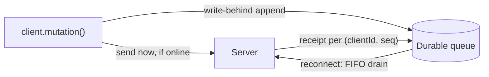

{/* diataxis: explanation */}

[Optimistic updates](/docs/client/optimistic-updates) and the transport's [automatic
reconnect](/docs/client/client-sdk#reconnection-in-detail) cover a connection that drops for a few
seconds and comes back. Neither one covers a reload.

Close the laptop mid-flight, or crash the tab, and by default any mutation that was still `unsent`
(queued while offline) or `inflight` (sent, response unknown) is simply gone. Nothing persists it,
and nothing tells you what happened to it.

The Receipted Outbox closes that gap. It's an **opt-in** layer on top of the reactive client:
mutations you make offline get written to durable storage, survive a full reload or crash, and
drain in order once the connection returns. The server keeps a per-client receipt for each one, so
a resend can never double-apply.

<Callout type="info">

A client constructed with no `outbox` option behaves **exactly** as if this feature doesn't
exist. Every code path below is inert until you configure one.

</Callout>



## The model: queue, drain, receipts

Three moving parts explain the whole design: a queue, a drain, and a receipt.

**Queue.** Once you configure an outbox, every `client.mutation(...)` call gets a durable identity:
a `clientId` (minted once per tab session, at client construction, from `crypto.randomUUID()`
where available) and a `seq` (a per-tab counter that increments once per mutation and is never
reused). That pair, plus the function path, arguments, and a deterministic `seed` for
optimistic-replay purity, gets appended to durable storage.

The append is **write-behind**. Your call still sends over the wire immediately if you're online.
It never waits for the disk write to finish. If you're offline, the entry just sits durably as
`unsent`.

**Drain.** On reconnect, the client sends a `Connect` handshake naming every durable entry it still
holds (`held`, plus an `ackedThrough` watermark per `clientId` for server-side retention pruning).
The server classifies each one via `ConnectAck`. Then the client sends the still-unresolved
entries as `MutationBatch` chunks: one unacked chunk in flight at a time, FIFO across the *whole
shared queue* (every tab, not just the one that's currently draining).

**Receipts.** Every mutation that actually commits gets a durable server-side record keyed by
`(identity, clientId, seq)`, written **atomically with the mutation's own commit**, not as a
separate step that could land out of sync with it. If the device drops offline again mid-drain, or
the app crashes right after a commit but before the response arrives, the next attempt resends the
same pair. The server finds the existing record and replies with the *original* result instead of
re-running the handler. Nothing is ever silently lost, and nothing is ever silently re-executed.

This is why it's the *Receipted* Outbox specifically. Correctness comes from a durable, atomic
receipt the server keeps for exactly this purpose, never from the queue staying in strict lockstep
with the server, which is exactly what breaks under a crash or a lost response.

## Choosing a backing store

Three implementations share one `OutboxStorage` seam: `append`/`updateStatus`/`dequeue`/`loadAll`/
`getMeta`/`setMeta`/`persist`, plus the optional `listMetaClientIds`/`deleteMeta`/`close`. The
model above (queue, drain, receipts) is identical regardless of which one you pick.

<Tabs items={['indexedDBOutbox()', 'fsOutbox()', 'memoryOutbox()']}>

<Tab value="indexedDBOutbox()">

The browser backend.

```ts
import { StackbaseClient, webSocketTransport, indexedDBOutbox } from "@stackbase/client";

const client = new StackbaseClient(webSocketTransport(url), {
  outbox: indexedDBOutbox(), // browser, durable; probes IndexedDB, falls back to memory if unavailable
});
```

It keeps everything in one IndexedDB database (`stackbase-outbox`), on purpose: the shared
mutation queue and the per-`clientId` identity metadata both live there, so a whole-origin storage
eviction takes both atomically. There's no separate identity store that can drift out of sync with
the queue.

Writes are **write-behind-batched**. Every mutating call made in the same microtask turn (several
`append`s fired back-to-back, for instance) collapses into one physical `readwrite` transaction
rather than one per call.

If IndexedDB isn't available in this runtime, or `open()` fails for any reason (private-mode
Safari, a corrupt origin), every method transparently falls back to a fresh in-memory queue: same
interface, same call sites, only durability is lost. Pass `onFallback` to learn when that happens:

```ts
const outbox = indexedDBOutbox({
  onFallback: (reason) => console.warn("outbox degraded to memory:", reason),
});
```

</Tab>

<Tab value="fsOutbox()">

For Node/Bun processes, Electron main processes, and Tauri sidecars. Imported from the
`@stackbase/client/outbox-fs` subpath, so browser bundles never see its `node:*` imports:

```ts
import { StackbaseClient, webSocketTransport } from "@stackbase/client";
import { fsOutbox } from "@stackbase/client/outbox-fs";

const client = new StackbaseClient(webSocketTransport(url), {
  outbox: fsOutbox({ dir: "./data/outbox" }),
});
```

One durable queue per directory: an append-only `journal.jsonl` plus a `lock` pidfile, both
created on first use. Every mutating call appends one JSON line through a serialized write-behind
appender (the filesystem twin of IndexedDB's microtask batcher) and `fsync`s by default before
resolving. Pass `fsOutbox({ dir, fsync: false })` to trade the durability of the very last writes
for throughput.

A journal that grows past 4096 ops (or is found oversized at open) gets compacted: live state is
rewritten to a temp file, `fsync`ed, and renamed over the original.

Recovery from a crash mid-append is automatic. A torn tail (the one thing an interrupted write can
produce, detected by a missing trailing newline) is physically truncated back to the last
known-good byte. A corrupt line in the *middle* of the file is quarantined to `journal.quarantine`
and skipped, rather than either crashing hydration or losing the rest of the journal.

<Callout type="warn" title="One writer per directory">

A second process (or a second `fsOutbox()` call in the same process) opening the same directory
doesn't throw. It transparently falls back to `memoryOutbox()` instead (no cross-restart
durability, everything else identical), firing `onFallback` once so you can log it. A lock left
behind by a killed process is detected (the pid no longer exists) and stolen automatically on the
next open.

This is the practical split for Electron: renderer processes are browsers, so keep
`indexedDBOutbox()` there, and use `fsOutbox()` in the main process or a Node/Tauri sidecar, each
pointed at its own directory. Point `dir` at **local disk only**. The lock's pid-liveness probing
and atomic-create semantics aren't reliable over NFS or SMB.

</Callout>

A disk I/O failure (disk full, a yanked mount, a permissions change) fails that `fsOutbox()`
instance **stop, not silently**. Once a journal write fails, every subsequent append rejects
rather than quietly degrading to an in-memory-only state that pretends nothing happened. Work
already on disk is safe, and the app keeps running. New mutations surface the failure through
`onMutationFailed` (or a dev-mode `console.error` with no handler registered) instead of becoming
an unhandled promise rejection, which several Node/Electron hosts treat as fatal.

Recovery is a process restart. The fresh instance replays the journal from disk, and server-side
receipts make any resend of an already-applied mutation safe regardless.

</Tab>

<Tab value="memoryOutbox()">

Same identity and dedup machinery as the other two, every mutation still gets a `(clientId, seq)`,
still gets exact-once server receipts, still gets the FIFO drain-on-reconnect behavior, backed by
a plain `Map` instead of a disk. Nothing survives a reload.

Don't mistake it for "the same as no outbox," though. A client with no `outbox` option sends no
`clientId`/`seq` at all and gets no server-side dedup; only the lack of cross-reload durability is
equivalent. `memoryOutbox()` is the right tool for two deliberate use cases:

- SSR or tests that want the reconnect-safe delivery guarantees without touching disk.
- Coexisting with an external mutation or retry library. Configure `outbox: memoryOutbox()` and
  every `client.mutation()` call automatically gets stamped and dedup'd server-side, with nothing
  to hand-roll.

A library that manages its own queue end-to-end can instead stamp the wire `Mutation` frame's
`clientId`/`seq` fields directly, since the server's dedup is exact-match per pair, not a FIFO
watermark. Don't enable both an outbox and an external retrier for the same mutation stream.

</Tab>

</Tabs>

## Identity: clientId, seq, and why they never collide

**One `clientId` per tab session**, minted once at `StackbaseClient` construction and never reused
across a reload. A fresh page load always mints a fresh one. **One `seq` counter per `clientId`**,
incrementing serially in memory from wherever it last reached (loaded once from the outbox's
`meta` store at construction, then tracked purely in memory for the rest of the session, never
re-read).

The pair is written to durable storage exactly once. The governing invariant is `(clientId, seq)
-> payload`, set once, forever. A retried entry (`entry.retry()`) gets a **fresh** `(clientId,
seq)` rather than reusing the old one, because the old pair's durable record permanently *is* its
original verdict.

The append itself never blocks the send. `client.mutation(...)` still puts the `Mutation` frame on
the wire the instant you call it, as long as the transport is open. Durability is a side effect,
not a gate. This is also why the four-axis benchmark (see [Performance](#performance) below)
measures essentially zero added latency for turning the outbox on: the disk write and the wire
send are two independent things happening off the same call, not two steps in series.

## Reconnect: the `Connect`/`ConnectAck` handshake and the drain

Durability of a queued mutation that was never sent is unconditional the moment an outbox is
configured. It's written to disk regardless of connection state.

The safe **parking** of a mutation that was already *sent* when the connection dropped, the case
where the outcome is genuinely unknown, works differently. It only activates once the client has
connected at least once and the server has proven, via `ConnectAck`, that it speaks this protocol
(that first handshake is what arms the parking behavior). Before that first successful handshake in a tab session, a
dropped in-flight mutation still rejects with `MutationUndeliveredError`, exactly as it would with
no outbox at all. Pointed at an older server that predates this feature, the client simply never
arms: the same fail-fast behavior forever, no special handling required on your end.

Once armed, reconnect drives the drain:

1. The client hands the drain every durable entry still `unsent`/`inflight`/`parked`, and sends
   `Connect{held, ackedThrough}`.
2. The server answers `ConnectAck{known, deploymentId}`. `known: true` means the server can
   account for this client's whole recorded history, so the drain proceeds. `known: false` means
   it can't (see [`onClientReset`](#onclientreset-a-server-disowned-timeline) below).
3. The drain flushes the durable queue **FIFO by persisted order**, as `MutationBatch` chunks of 50
   entries each: one unacked chunk in flight at a time, never several concurrently.
4. Each chunk's `MutationResponse`s settle per entry. `applied` dequeues and resolves. A coded
   failure settles the promise as a rejection, and by default the drain keeps going past it. A
   codeless failure backs off (jittered exponential, capped at 30s) and resends starting from the
   failed unit: every unit *after* it in that chunk got no response either, and re-sends too.

That last step leans on a distinction worth pulling out of the list, because everything downstream
(the poison policy, the conflict taxonomy) rests on it. A **coded** failure is terminal and
server-recorded: your handler deterministically failed (validation, authorization, a typed thrown
error), and retrying changes nothing. A **codeless** failure is transient infrastructure: nothing
was recorded, so a retry is always safe. The drain settles coded failures and retries codeless
ones, and [poisonPolicy](#poison-handling-poisonpolicy) governs how loudly a coded one interrupts
the queue.

Reconnecting itself is cheap independent of the outbox. Every server-pushed query result carries a
content fingerprint, and a resubscribe echoes back the fingerprint it last saw. If a fresh re-run
hashes the same, the server answers with a tiny `QueryUnchanged` marker instead of resending the
value. That's automatic, needs no configuration, and saves bandwidth, not compute (every
subscribed query still fully re-executes on reconnect either way, see [Subscription
lifecycle](/docs/client/client-sdk#subscription-lifecycle-and-wire-messages)).

## Exactly-once: receipts, not a watermark

The dedup key is **`(identity, clientId, seq)`**, and the record is written **atomically with the
mutation's own commit**: same transaction, same guarantee. This is deliberately *not* a FIFO
watermark ("everything up to seq N has been seen"). A watermark gap-rejects an out-of-order resend
and forces careful renumbering on retry. Exact-match receipts don't: an external retrier, or a
drain resuming after a crash, is free to resend units out of order, and every resend still
classifies correctly against its own recorded verdict (or lack of one).

Server-side, each client also has a **retention floor**: a per-`clientId` boundary below which the
server no longer keeps individual receipts (pruned after acknowledgment, or because the
deployment's timeline was reset from a backup). If a resend's `seq` falls below that floor with no
record on file, the server can't honestly tell whether it applied, so it answers with a loud,
typed terminal failure, `STALE_CLIENT`, on that one entry (surfaced through
`onMutationFailed`/`pendingMutations()`), rather than guessing either way. This is the narrower,
per-entry sibling of a full [`onClientReset`](#onclientreset-a-server-disowned-timeline): expect
it only after an unusually long offline stretch, never in routine use.

<Accordions type="single">

<Accordion title="Under the hood: the commit guard seam">

The engine's write path exposes this as an `addCommitGuard` composition seam on both docstore
adapters (SQLite and Postgres). Several independent guards can register a check that runs atomic
with a commit, and a rejection from one guard only fails that guard's own unit. It never
collaterally aborts every other mutation batched into the same group commit.

The dedup read that decides `applied` vs. a fresh execution always runs on the same node the
commit itself runs on, never against a lagging replica in a fleet deployment, so the receipt check
is never stale relative to the commit it's guarding.

</Accordion>

</Accordions>

## Rendering queued writes: the `optimisticUpdates` registry

A durable entry hydrated from a prior session, or from another tab, has no live `mutation()` call
sitting on the stack. Nothing invoked `.withOptimisticUpdate(...)` for it *this* page load. The
`optimisticUpdates` registry, configured once at client construction and keyed by function path,
closes that gap by supplying the updater after the fact:

```ts
const client = new StackbaseClient(webSocketTransport(url), {
  outbox: indexedDBOutbox(),
  optimisticUpdates: {
    "messages:send": (store, args) => {
      const list = store.getQuery("messages:list", {}) as
        | Array<{ _id: string; body: string }>
        | undefined;
      if (list === undefined) return; // no baseline yet, render nothing, never throw
      const { body } = args as { body: string };
      store.setQuery("messages:list", {}, [...list, { _id: store.placeholderId("messages"), body }]);
    },
  },
});
```

The registry is consulted at **hydrate time only**. It rebuilds a durable entry's optimistic layer
over whatever fresh baseline exists once you reconnect, using the exact same
`OptimisticLocalStore` API (`getQuery`/`setQuery`/`getAllQueries`/`placeholderId`/`now`) described
in [Optimistic updates](/docs/client/optimistic-updates). Its keys are the codegen-typed function
paths your app's `_generated/api` already knows about, so a registered updater and the mutation it
patches for stay in sync the same way `args`/`returns` validators do elsewhere.

<Callout type="warn">

A registered updater must tolerate `undefined` from `getQuery`. While genuinely offline right
after a reload, there may be no baseline to compose over at all yet (see [the honest
boundaries](#the-honest-boundaries) below). Render nothing rather than crash.

</Callout>

## Poison handling (`poisonPolicy`)

A mutation can fail two different ways once the drain actually sends it:

- **Coded (terminal).** The server ran your handler and it deterministically failed, a validation
  error, an authorization check, a thrown app error, and recorded that verdict durably. Retrying
  changes nothing. The server has already decided permanently.
- **Codeless (transient).** An infrastructure-level failure. Nothing was ever recorded. Always
  safe to retry.

The default, `poisonPolicy: "skip"`, settles a coded failure terminally (visible via
`onMutationFailed`/`pendingMutations()`, with `error.code` set) and **keeps draining the rest of
the queue**. One bad mutation can never wedge everything queued behind it. A codeless failure
instead backs off (the same jittered-exponential shape `@stackbase/scheduler` uses for its own
retries) and resends starting from the failed unit, never skipping it.

Set `poisonPolicy: "pause"` for the stricter, opt-in posture: halt the whole drain the moment
*anything* fails, and let the user intervene:

```ts
const client = new StackbaseClient(transport, {
  outbox: indexedDBOutbox(),
  poisonPolicy: "pause",
  onOutboxPause: (info) => {
    // info: { requestId, udfPath, code } - the drain has HALTED here; nothing after it runs
    // until you call entry.retry()/dismiss() on the offending entry.
  },
});
```

## Managing failed mutations: `retry()` / `dismiss()`

A `"failed"` entry is never silently dropped. It persists in the durable store until you call
either method.

`entry.retry()` re-enqueues under a **fresh** `(clientId, seq)`, using the same function path,
arguments, and registered updater as the original. The old seq's record permanently *is* its
original verdict, so a retry is always a brand-new mutation as far as the server's dedup is
concerned. `entry.dismiss()` permanently forgets it, no retry.

Neither returns a promise the way `client.mutation()` does. The fate of a durable entry, retried
or not, surfaces through `usePendingMutations()`/`onMutationFailed`, because the record outlives
any one page load's promises.

## Observability

Four pieces of surface, all reading the durable store directly (never the live in-memory
reconciler alone), so they stay accurate no matter which tab actually ends up draining a given
entry:

- **`client.pendingMutations()`** (async) / **`usePendingMutations()`** (React) return every
  durable entry not yet fully settled: `{clientId, seq, udfPath, status, error?, retry(),
  dismiss()}` each, `status` one of `unsent`/`inflight`/`parked`/`completed`/`failed`. The React
  hook re-renders on every local outbox change *and* on a cross-tab nudge (a `BroadcastChannel`
  message another tab's queue change fires), so a second tab's activity shows up here too.
- **`client.pendingSummary()`** returns a cheap `{count, oldestEnqueuedAt, oldestAgeMs}`, useful
  for a "you have offline changes that may be lost soon" banner without paging through the full
  list (see the [Safari eviction](#browser-storage-is-best-effort-not-guaranteed) note below).
- **`onMutationFailed`**, passed at client construction, fires for a terminal failure with no live
  promise awaiting it (a hydrated cross-reload entry, or a retried one). With no handler
  registered, a dev-mode build logs it loudly to `console.error` instead of failing silently.
- **Cross-tab `BroadcastChannel` nudges**: every tab sharing an origin's outbox gets notified when
  any tab's queue changes, which is what keeps `usePendingMutations()` (and, with a registry
  configured, [live rendering](#cross-tab-live-optimistic-rendering) below) accurate across tabs
  without polling.

A pending tray built from these pieces is the honest UI affordance for "what's still queued,"
independent of whether any particular query has a cache to render into:

```tsx
import { usePendingMutations } from "@stackbase/client/react";

function PendingTray() {
  const pending = usePendingMutations();
  return (
    <ul>
      {pending.map((entry) => (
        <li key={`${entry.clientId}:${entry.seq}`}>
          {entry.udfPath} - {entry.status}
          {entry.status === "failed" && (
            <>
              <button onClick={() => entry.retry()}>Retry</button>
              <button onClick={() => entry.dismiss()}>Dismiss</button>
            </>
          )}
        </li>
      ))}
    </ul>
  );
}
```

## `onClientReset`: a server-disowned timeline

The server occasionally has to **disown** a client's mutation history rather than answer
honestly. A queued `seq` falls below what it can still account for (records were pruned past
retention, or, far more rarely, the whole deployment's timeline was reset from a backup) and it
genuinely can't tell whether that mutation applied.

Rather than guess, it answers `ConnectAck{known: false}`, and the client:

- Re-enqueues every `"unsent"` entry (queued, never actually reached the server) under a freshly
  minted `clientId` with new `seq`s. Always safe, since it never applied.
- Rejects every `"parked"` entry (sent, outcome now unknowable) loudly with
  `OfflineClientResetError`. Never a silent guess.
- Fires `onClientReset({oldClientId, newClientId, unsentReEnqueued, parkedRejected})`.

Given the retention windows below, hitting this in practice means a device was offline for a
genuinely long stretch, or a deployment was restored from a backup, not routine behavior. Register
it to tell the user plainly that some pending changes couldn't be confirmed and may need to be
redone.

## Multi-tab safety

Each tab mints its **own `clientId`** at construction, never reused across a reload, so two tabs'
entries can never collide on the same `(clientId, seq)` pair. All tabs against the same origin
share **one durable queue**, though, and a [Web
Locks](https://developer.mozilla.org/en-US/docs/Web/API/Web_Locks_API)-elected leader tab drains
the **entire shared queue**: every tab's entries under their own recorded identity, not just the
leader's own writes.

If the leader tab closes mid-drain, another open tab takes over the lock and finishes the job.
Nothing is lost or double-applied, because correctness comes from the server-side receipts, not
from the lock. A browser with no Web Locks support at all still drains correctly, just without the
"exactly one active drainer" coordination. Every tab with one runs its own drain locally, and the
receipts absorb any resulting overlap.

### Cross-tab live optimistic rendering

Beyond status entries, another tab's **active** durable mutations render **live in your own
queries**, not just as a `pendingMutations()` row, as long as you've configured an
`optimisticUpdates` registry (the same one hydrate-time rendering above uses. A registry
consenting to render a durable entry's layer does so whether that entry was hydrated at
construction or arrives live over the shared `BroadcastChannel` while you're already running).
Only the tab that actually called `mutation()` drives its own entry from its own wire responses.
Every other tab mirrors it via typed `enqueued`/`settled`/`failed` broadcasts.

<Callout type="info" title="One honest, self-healing residual">

When tab A drains a mutation tab B is also live-subscribed to, B's own subscription can observe
the committed row via its normal server push *before* A's settle broadcast reaches B. A's settle
path is a full round trip (A to server to A) plus a `BroadcastChannel` hop, while B's own live
push is a single server-to-B hop off the very same commit.

In that ordering you'll see one transient frame with both the committed row and the still-active
mirrored placeholder. It **self-corrects on the very next push**: it never lingers, never grows,
and the row is never *absent* at any point. This is a structural property of the two paths'
relative latency, not a bug, proven end-to-end in `packages/cli/test/crosstab-e2e.test.ts`.

</Callout>

If your UI genuinely cannot tolerate even that one transient frame, write the registry updater as
**idempotent, keyed on a client-supplied id**
([`mintId`](#client-supplied-ids-create-then-reference-chains)): mint the id before the mutation
is sent, use it as the placeholder row's `_id`, and have the updater check whether a row with that
id is already present before inserting:

```ts
const messageId = mintId("messages"); // minted once, before the mutation call

const registry = {
  "messages:send": (store, args) => {
    const list = store.getQuery("messages:list", {}) as Array<{ _id: string }> | undefined;
    if (list === undefined) return;
    if (list.some((row) => row._id === args._id)) return; // already present, collapses the double
    store.setQuery("messages:list", {}, [...list, { _id: args._id, body: args.body }]);
  },
};

await client.mutation("messages:send", { _id: messageId, body });
```

Because the placeholder and the eventual committed row share the same id, this collapses the
transient double to a single row on every replay, including the frame where the raw mechanism
would otherwise show both. A missed `BroadcastChannel` message is also handled: the next durable
append (from any tab) triggers a re-read that reconciles a mirrored entry against reality and
drops it unconditionally if it's gone missing, landing on either side of the same residual (a
brief double, or a brief absence), always self-healing on the next push.

### Draining after every tab closes: `drainOutboxOnce`

Everything above assumes at least one tab is open. If every tab closes with entries still queued,
nothing drains until you reopen the app. The durable queue is unaffected, it just waits.

`drainOutboxOnce` is the headless, store-only version of the same queue-drain-receipts machinery,
built for a context with no `StackbaseClient` at all, most concretely a Service Worker's one-shot
Background Sync handler:

```ts
// sw.ts, inside your Service Worker
import { drainOutboxOnce } from "@stackbase/client";

self.addEventListener("sync", (event) => {
  if (event.tag === "stackbase-outbox-drain") {
    event.waitUntil(
      drainOutboxOnce({
        url: "wss://your-deployment.example.com/api/sync",
        getAuthToken: async () => await readAuthTokenFromSwReadableStore(),
      }),
    );
  }
});
```

<Accordions type="single">

<Accordion title="Every drainOutboxOnce option">

<TypeTable
  type={{
    url: {
      description: "The sync endpoint to connect to.",
      type: "string",
    },
    outbox: {
      description:
        "IndexedDB exists in a Service Worker exactly as it does in a tab, so the same durable queue a live client wrote is readable here with no extra plumbing.",
      type: "OutboxStorage",
      default: "indexedDBOutbox()",
    },
    deployment: {
      description:
        "Must match whatever a live tab's outboxDeployment constructor option used, so the two contend for the same Web Locks name.",
      type: "string",
    },
    getAuthToken: {
      description:
        "A Service Worker has no access to your app's in-memory auth state; this reads from wherever the SW itself can reach it (IndexedDB, a Cache entry). Providing and refreshing that store is your app's job. Resolve null for no token.",
      type: "() => Promise<string | null>",
    },
    getSessionId: {
      description:
        "Resolves the persisted SessionInfo.sessionId a createAuthClient-managed session wrote (the \"stackbase.session\" storage row), via any SW-reachable channel. With a managed session this is effectively REQUIRED: without it every entry that session stamped looks foreign to the drain and terminal-fails OFFLINE_IDENTITY_CHANGED. When it resolves non-null it takes priority over getAuthToken's token-hash fingerprint (the token still governs SetAuth on the wire). Omit it for a client that never adopted a managed session.",
      type: "() => Promise<string | null>",
    },
    poisonPolicy: {
      description:
        'Prefer the default here: there\'s no live UI to observe an onPause and call resume() on the drain\'s behalf, so "pause" combined with a STALE_CLIENT verdict can livelock (re-queue, re-flush, re-pause, forever, with nothing headless to break the cycle).',
      type: '"skip" | "pause"',
      default: '"skip"',
    },
    timeoutMs: {
      description:
        "The whole-drain wall-clock budget. Past it the socket closes and whatever counts the drain reached are returned.",
      type: "number",
      default: "30000",
    },
    locks: {
      description: "The Web Locks manager to use. Undefined probes the ambient navigator.locks.",
      type: "LockManager",
    },
  }}
/>

</Accordion>

</Accordions>

<Callout type="warn" title="Using createAuthClient? Pass getSessionId">

A live tab with a managed session fingerprints outbox entries by the stable `sessionId`, not the
rotating token. A headless drain that only gets `getAuthToken` computes a token-hash fingerprint
instead, sees every one of those entries as belonging to someone else, and terminal-fails each with
`OFFLINE_IDENTITY_CHANGED`. Wire `getSessionId` to the same persisted session your auth client
writes and the fingerprints line up.

</Callout>

It returns `{drained, failed, remaining}`. No queries, no optimistic layers, nothing UI-shaped. If
a live tab already holds the leader lock, a concurrent `drainOutboxOnce` call is a safe, cheap
no-op (`{drained: 0, ...}`, checked via a non-blocking `ifAvailable` lock probe before it even opens
a socket). The tab is already doing the job.

<Callout type="warn" title="Chromium-only, and additive">

One-shot Background Sync is a **Chromium-only** browser feature. Firefox and Safari have never
shipped it. Treat this as strictly additive: it changes *when* a drain can run (potentially
while no tab is open), never the durability story. The portable baseline, on every browser,
stays "queue survives, drains on your next visit," true with or without this wired up.

</Callout>

`drainOutboxOnce` itself is covered end-to-end by the automated suite
(`packages/cli/test/outbox-e2e.test.ts`). The Service Worker `sync`-event wiring shown above has
no headless-CI-friendly harness and is verified manually in a real Chromium browser.

## Client-supplied ids: create-then-reference chains

The mechanism above delivers a *single* queued mutation exactly once. The next question is what
happens when two queued mutations depend on each other. The classic case is "create a
conversation, then send the first message into it," both issued offline, where the second needs to
reference a row the first hasn't committed yet.

Client-supplied ids close that gap. Mint a **real** `Id<"table">` on the client before either
mutation is sent, and pass it as `_id` on the insert. The engine accepts it (instead of minting its
own), so the id is valid, and referenceable, the instant it's minted, not the instant it lands.
`stackbase codegen` emits `_generated/ids.ts` with a typed `mintId<T extends TableNames>(table: T):
Id<T>` for exactly this:

```ts
import { mintId } from "../stackbase/_generated/ids";

const conversationId = mintId("conversations"); // a REAL Id<"conversations">, minted now

await client.mutation(api.conversations.create, { _id: conversationId, name });   // queued offline
await client.mutation(api.messages.send, { conversationId, body });               // references it, also offline
```

Both calls enqueue into the durable outbox like any other mutation. No special-casing is needed
for the fact that the second one references a row the first hasn't committed yet. On drain,
`conversations.create` runs first (the outbox is FIFO), inserts under the minted id, and by the
time `messages.send` runs the reference resolves against a real row. Your mutation's handler
passes the supplied `_id` straight through: `ctx.db.insert("conversations", args)` accepts a
`v.optional(v.string())` `_id` field exactly as it accepts an engine-minted one.

<Callout type="warn" title="Mint outside the updater">

Minting consults randomness, so it follows the same purity rule as
`placeholderId()`/`now()` from [Optimistic updates](/docs/client/optimistic-updates): an updater
reads the id **from args**, never mints one itself. Mint at args-construction time, before you
call the mutation.

</Callout>

```ts
const conversationId = mintId("conversations"); // minted OUTSIDE the updater, once

const create = useMutation(api.conversations.create).withOptimisticUpdate((store, args) => {
  // inside the updater: read the id FROM args, never call mintId() here
  const list = store.getQuery(api.conversations.list, {});
  if (list === undefined) return;
  store.setQuery(api.conversations.list, {}, [...list, { _id: args._id, name: args.name }]);
});

await create({ _id: conversationId, name });
```

**v1 restrictions.** A client-supplied `_id` is accepted only for an **unsharded table on the
default ring**. A mutation routed elsewhere via `shardBy` gets a typed rejection instead
(`INVALID_CLIENT_ID`), so keep client-id-minting mutations un-routed and targeting unsharded
tables. `mintId`'s type parameter is `TableNames`, so it type-checks against any table your schema
knows about, including system tables like `"_storage"`, but the emitted map only contains your
app's own tables. Calling `mintId("_storage")` compiles and throws at runtime.

The engine never trusts the client's map either way: every minted id is validated server-side at
insert, so a stale `_generated/ids.ts` (one that predates a schema change) produces a loud, typed
rejection, never a silent wrong-table write. Two stable error codes surface a rejection:
**`INVALID_CLIENT_ID`** (malformed, wrong table, sharded table, or off the default ring) and
**`ID_ALREADY_IN_USE`** (a document with that id already exists, since an outbox resend never
re-executes a committed mutation, this means either an astronomical collision or an app bug, never
a silent merge).

<Accordions type="single">

<Accordion title="No client yet regenerated? Fold create and reference into one mutation">

If you can't regenerate against your live deployment right now, or you're on an older client, a
composite-intent workaround still works: fold the create and the reference into **one** mutation
call, so there's no cross-mutation reference to resolve at all:

```ts
export const createConversationWithFirstMessage = mutation({
  args: { name: v.string(), body: v.string() },
  handler: async (ctx, { name, body }) => {
    const conversationId = await ctx.db.insert("conversations", { name });
    await ctx.db.insert("messages", { conversationId, body });
    return conversationId;
  },
});
```

</Accordion>

</Accordions>

## The conflict taxonomy

Stackbase has **no merge and no CRDT layer**, offline or online. A queued mutation, when it
finally drains, runs against whatever the server's actual state is *at that moment*, not whatever
it was when you went offline, and exactly one of three things happens:

- **It succeeds.** Your handler ran, computed against live data, and committed. The common case,
  and it needs nothing special from you: the same transactional guarantee every mutation gets
  online.
- **It's a no-op by your own handler's check-before-write logic** (for example, "only insert this
  comment if one with the same idempotency key doesn't already exist"). This is the idiom for
  anything you'd otherwise reach for a CRDT for. The outbox has no opinion about what counts as a
  duplicate at the data level.
- **It fails terminally.** Your handler threw, or a validation or authorization check rejected it.
  If your handler needs a queued entry to terminal-fail (rather than retry as transient), throw a
  **typed, coded** error. A plain `Error` carries no code on the wire, so the drain can't tell it
  apart from an infrastructure hiccup and treats it as transient by design.

There's no fourth branch where the outbox tries to reconcile your write against someone else's.
That's a deliberate scope line: conflict handling is your mutation handler's job, exactly as it
already is for two racing online writers.

## The honest boundaries

### Offline-after-reload rendering is app-effort

There is no persisted query cache in this design. That's the client-side-replica product, a
different, much larger bet, deliberately not built here.

Concretely: while genuinely offline right after a reload, a `useQuery` you haven't yet reconnected
for renders `undefined`, same as before any subscription result has ever arrived. The
`optimisticUpdates` registry rebuilds a durable entry's optimistic layer once a live baseline
exists, so queued rows render before the drain has actually committed them, but until then, the
honest affordance is the pending tray from [Observability](#observability) above, independent of
whether any query has a cache to render into. This is the **one declared non-goal** of this whole
feature, not a scoped deferral: a persisted query baseline or client-side replica is a different
product bet.

### Browser storage is best-effort, not guaranteed

Safari can evict an origin's IndexedDB data after roughly 7 days of no interaction. Any browser can
evict under storage pressure. A user can clear site data at any time.

`indexedDBOutbox()` calls `navigator.storage.persist()` on your behalf to *request* durable
storage, but this is advisory only. No behavior anywhere branches on whether the browser actually
grants it.

If storage is evicted, the queue, the tab's `clientId`, and its `seq` counter are all gone
together (they live in one database, deliberately, so they can never drift out of lockstep).
Anything already drained is unaffected, since its receipts and effects are safely on the server.
Anything still queued is simply gone, with nothing left to even report that it happened.

This is priced honestly, not hidden: server-side receipts are retained for 30 days past
acknowledgment (per-client floor rows for at least a year), so the server-side half of this system
outlives any realistic browser-side queue lifetime by a wide margin. The practical constraint on
how long a mutation can safely stay queued offline is the *browser's* storage lifetime, not the
server's retention window.

### It's bounded-offline, not unbounded

This is built for "closed my laptop overnight" or "was on a plane," not "used the app for a month
with no network." `pendingSummary()`'s `oldestAgeMs` lets an app surface an advisory banner before
a platform eviction cliff. The queue itself won't warn you.

## Performance

The short version: turning the outbox on costs essentially nothing online, and a large offline
backlog drains fast without blocking the UI thread.

<Accordions type="single">

<Accordion title="The four benchmark axes">

Headline numbers from the four-axis benchmark (`docs/dev/research/offline-outbox/benchmark.md`,
generated by the flagship E2E driving a real client against a real server, treat the *shape*, not
the exact figures, as the takeaway; they're machine- and load-dependent):

- **Online round-trip cost, outbox on vs. off: ≈ 0.** The durable append is write-behind, so
  turning the outbox on doesn't move online latency: measured **+0.002ms p50, −0.012ms p99** over
  120 sequential mutations, in other words noise, not a real cost.
- **Concurrent online throughput with the outbox on: ~13,300 ops/s** (400 concurrent mutations,
  the outbox never forces concurrent live writers onto a single ordered lane).
- **500-entry offline drain: ~675ms time-to-empty**, with the longest single main-thread block
  during the whole drain only **~3.3ms**. The batched `MutationBatch` drain never blocks the UI
  thread for a noticeable stretch, even clearing a large backlog.
- **Durable storage cost: ~2 to 3 logical storage operations per mutation** across the full
  lifecycle (append at enqueue, one status transition, one dequeue), write-behind-batched per
  microtask so the physical transaction count is bounded further still.

</Accordion>

</Accordions>

## Related

- [Optimistic updates](/docs/client/optimistic-updates): the live-session reconciliation model the
  outbox's `optimisticUpdates` registry builds on, including `placeholderId()`/`now()` purity and
  the no-flicker guarantee.
- [Client SDK](/docs/client/client-sdk): constructing `StackbaseClient`, transports, reconnection,
  and the full constructor-option surface.
- [Mutations](/docs/core-concepts/mutations): writing the handlers a queued entry eventually runs
  against.

