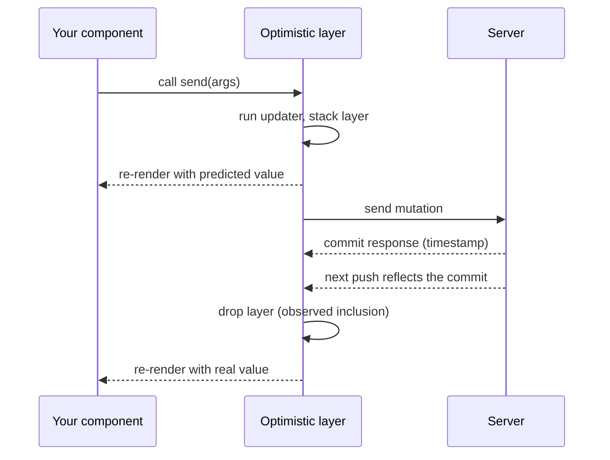

{/* diataxis: how-to */}

Every mutation makes a round trip. Your function runs on the server, commits, and the result comes
back over the WebSocket. That's usually just a handful of milliseconds, but it's enough to feel
sluggish on a chat send button or a todo checkbox.

`withOptimisticUpdate` lets you skip the wait. You render the predicted result the instant the user
clicks, in the same tick, then swap to the real committed value with no flicker: the frame where your
guess disappears is the same frame the real row appears.

This page covers the whole v1 surface: `useMutation(...).withOptimisticUpdate(...)`, the
`OptimisticLocalStore` your updater receives, and the reconciliation guarantee behind it. There's no
`defineLocalMutators` registry, no pending or failed-queue accessors, and no optimistic support for
actions (an action has no commit timestamp to gate a layer's removal on, see
[Actions](/docs/core-concepts/actions)).

## Chain `.withOptimisticUpdate` onto `useMutation`

```tsx title="examples/chat/web/main.tsx"
import { useMutation } from "@stackbase/client/react";
import type { OptimisticLocalStore } from "@stackbase/client";

function appendOptimistic(
  store: OptimisticLocalStore,
  args: { conversationId: Id<"conversations">; author: string; body: string },
): void {
  const list = store.getQuery(api.messages.list, { conversationId: args.conversationId });
  if (list === undefined) return; // nothing subscribed locally yet, nothing to patch
  store.setQuery(api.messages.list, { conversationId: args.conversationId }, [
    ...list,
    {
      _id: store.placeholderId("messages"), // deterministic across replays (see Purity rules below)
      _creationTime: store.now(),           // fixed at entry creation, stable across replays
      conversationId: args.conversationId,
      author: args.author,
      body: args.body,
    },
  ]);
}

const send = useMutation(api.messages.send).withOptimisticUpdate(appendOptimistic);
```

`useMutation(ref)` returns a callable. `.withOptimisticUpdate(fn)` returns a new callable with `fn`
bound to it. It doesn't touch the original, so `useMutation(ref)` on its own still works as a plain
call anywhere else you need one without the optimistic layer.

<Callout type="warn" title="Keep the updater reference stable">

Declare the updater as a stable, module-scoped function (or wrap it in `useCallback`), not an inline
closure. `.withOptimisticUpdate` caches the bound callable it returns, keyed by the updater's own
function reference, so it only returns the same bound callable across renders when your reference is
stable. A fresh inline arrow function on every render churns that cache and defeats it.

</Callout>

Calling `send(args)` still returns the same promise it always did. It now also runs your updater
synchronously before anything hits the wire, so any component reading the patched query re-renders
with the predicted value in the same tick as the click.

You can call the same pattern from the framework-agnostic core client too:

```ts
await client.mutation(api.messages.send, args, { optimisticUpdate: appendOptimistic });
```

## The `OptimisticLocalStore` your updater receives

```ts
interface OptimisticLocalStore {
  getQuery<Q>(ref: Q, args?: FunctionArgs<Q>): FunctionReturnType<Q> | undefined;
  setQuery<Q>(ref: Q, args: FunctionArgs<Q>, value: FunctionReturnType<Q> | undefined): void;
  getAllQueries<Q>(ref: Q): Array<{ args: FunctionArgs<Q>; value: FunctionReturnType<Q> | undefined }>;
  placeholderId(table: string): string; // deterministic per (entry, table, call-ordinal)
  now(): number;                        // entry-creation time, stable across replays
}
```

<TypeTable
  type={{
    getQuery: {
      description:
        "Reads one query's composed value: the server's last known value with any earlier-stacked optimistic layers already replayed on top. Matched by function reference plus args, the same identity useQuery uses (path plus JSON.stringify(args)). Returns undefined if nothing local is subscribed to that pair, so always check for that and return early rather than patch a query nobody is watching.",
      type: "(ref, args?) => value | undefined",
    },
    setQuery: {
      description:
        "Stacks a write for that query as part of this updater's layer. Doesn't touch the server or any other layer, only changes what components reading that query see for as long as this layer survives.",
      type: "(ref, args, value) => void",
    },
    getAllQueries: {
      description:
        "Returns every live (args, value) pair currently subscribed for that function, across all its argument variants. Useful for patching a paginated or per-id family of queries at once without knowing every args shape a caller used.",
      type: "(ref) => Array<{ args, value }>",
    },
    placeholderId: {
      description:
        "Deterministic across replays for the same table and call, distinct per call within one updater run, and distinct again from every other pending mutation.",
      type: "(table: string) => string",
    },
    now: {
      description: "The timestamp fixed when the mutation was created, stable across every replay.",
      type: "() => number",
    },
  }}
/>

`placeholderId`/`now` are covered in full detail in [Purity rules](#purity-rules) below.

The demo app's vote-count patch uses `getAllQueries` to bump every open `options.list` regardless of
which poll it's scoped to:

```tsx title="examples/optimistic-demo/web/main.tsx"
function bumpVotes(store: OptimisticLocalStore, id: Id<"options">, delta: number): void {
  for (const q of store.getAllQueries(api.options.list)) {
    if (q.value === undefined) continue;
    store.setQuery(
      api.options.list,
      q.args,
      q.value.map((o) => (o._id === id ? { ...o, votes: o.votes + delta } : o)),
    );
  }
}
```

## Typing the store: add a `returns` validator

`getQuery`, `setQuery`, and `getAllQueries` are typed from the function reference's declared return
type. That type comes from an explicit `returns` validator on the query, the same way `args` already
works:

```ts title="stackbase/messages.ts"
export const list = query({
  args: { conversationId: v.id("conversations") },
  returns: v.array(v.object({
    _id: v.id("messages"),
    _creationTime: v.number(),
    conversationId: v.id("conversations"),
    author: v.string(),
    body: v.string(),
  })),
  handler: (ctx, args) =>
    ctx.db.query("messages", "by_conversation").eq("conversationId", args.conversationId).collect(),
});
```

Add `returns` and `getQuery(api.messages.list, ...)` infers `Array<{_id: Id<"messages">, ...}> |
undefined` with no cast needed. A query with no `returns` validator still works: `getQuery` against
it just falls back to the untyped `Value` shape. And `returns` isn't a cost you pay only for
optimistic updates. It's also what gives the server itself return-value validation (see
[Argument validation](/docs/core-concepts/mutations#argument-validation)).

### The pending-row type-widening recipe

A row your updater inserts is missing every field a real commit fills in that your handler doesn't
set explicitly. Nothing server-computed exists yet. There's no first-class "this row is pending"
flag in v1, and planting a literal `pending: true` on the object won't typecheck against
`Doc<"messages">` once you've added a `returns` validator.

The recipe: widen the type at the call site of your updater, not in your schema.

```ts
type Message = Doc<"messages">;
type PendingMessage = Message | (Omit<Message, "_id"> & { _id: string; pending?: true });
```

Render an optimistically-inserted row (`pending === true`, or just: not yet found by a real `_id`
lookup) with whatever affordance you want, dimmed, a spinner, whatever fits. That's a decision for
your render site, never carried as schema data. The demo app follows this exact recipe for a pending
poll:

```tsx title="examples/optimistic-demo/web/main.tsx"
type PendingPoll = Doc<"polls"> | (Doc<"polls"> & { pending: true });

function createPollOptimistic(store: OptimisticLocalStore, args: { question: string; options: string[] }): void {
  const pollsQ = store.getQuery(api.polls.list, {});
  if (pollsQ === undefined) return;
  const row: PendingPoll = {
    _id: store.placeholderId("polls") as Id<"polls">, // rendering-only placeholder, never sent anywhere
    _creationTime: store.now(),
    question: args.question,
    closed: false,
    pending: true,
  };
  store.setQuery(api.polls.list, {}, [...pollsQ, row]);
}
```

A first-class pending-row metadata channel on the store itself is a named follow-on, not built.

## Purity rules

An updater can run more than once for the same mutation. Every server push that arrives while your
mutation is still pending rebuilds the whole composed view, replaying every surviving layer's
updater from scratch over the fresh base. Your updater has to be a pure, deterministic function of
`(store, args)`: same inputs, same writes, every time it replays.

- **`placeholderId(table)`** returns the same id every time this mutation's updater replays. Call it
  twice in one run and you get two distinct ids (it's ordinal-distinct per call within a run), and
  every other pending mutation gets different ids again, seeded from that entry's own entropy. Under
  the hood it's built as `` `${entryEntropy}:${table}:${callOrdinal}` ``. Treat the exact shape as an
  opaque, unspecified string and never parse it.
- **`now()`** returns the timestamp fixed when the mutation was created. It's stable across every
  replay, and stands in for `_creationTime` on a row you're inserting.

<Callout type="error" title="Never call crypto.randomUUID() or Date.now() inside an updater">

Use `store.placeholderId(table)` and `store.now()` instead, always. Either impure call mints a
fresh value on every replay. React, keying off it, sees a brand-new row instead of the same
optimistic row re-rendering: remounts, list-key churn, and lost input focus, on every unrelated
server push while your mutation is pending.

This is a documented anti-pattern precisely because it's what Convex's own docs example does. The
store's shape is designed so the deterministic path is also the easy path, not so the impure path is
blocked by a lint rule. There isn't one.

</Callout>

### `placeholderId()` is never a real id

`placeholderId()` is deterministic but non-decodable. It doesn't round-trip through the server's id
codec, and it isn't a real row. It exists only so your optimistically-inserted object has some stable
`_id` to key a React list on, until the real row arrives and replaces it in the same atomic swap the
reconciliation contract below describes.

<Callout type="error" title="Never pass a placeholderId() value as a mutation argument">

The server can't resolve it, and there's no mechanism to rewrite a placeholder reference into the
real id once the create it names has committed. There never will be.

If you need to create a row and immediately reference it in a second mutation call (say, create a
conversation, then send the first message into it), mint a real id instead with `mintId` from your
app's generated `_generated/ids.ts`. See
[Client-supplied ids](/docs/client/offline-sync#client-supplied-ids) in the offline guide.

Mint outside the updater, at args-construction time (minting consults randomness). Inside the
updater, read the id from `args` like any other field, never call `mintId` there. Awaiting the
server-returned id still works too, and is the simpler choice when you're online anyway and don't
need offline support for the pair.

</Callout>

## The dev-mode freeze is shallow

In development builds, every value `getQuery`/`getAllQueries` hands back goes through
`Object.freeze` before it reaches your updater. Mutate it in place (the documented "corrupts the
client's internal state" footgun) and you get an immediate throw instead of silently corrupted
reactive state.

<Callout type="warn" title="The freeze only goes one level deep">

`Object.freeze` only locks the top-level object or array you were handed. A nested object or array
one level down isn't frozen, and can still be mutated in place without throwing. Always
copy-and-replace (`[...list, newRow]`, `{...doc, field: x}`) at every level rather than mutate,
exactly what the freeze itself is trying to remind you to do. It's gated on
`process.env.NODE_ENV !== "production"`, so it costs nothing at runtime in a production build.

</Callout>

## The reconciliation contract: why it doesn't flicker

Every subscribed query has two layers under the hood. A `serverValue` holds only data actually
received from the server. A `composedValue` is what your components actually see: the server value
with any surviving optimistic layers replayed on top, in call order.

Internally these live in a small set of cooperating pieces: a `MutationLog` of pending entries, the
layered query store that holds `serverValue`/`composedValue` per subscription, one reconcile
chokepoint that every state change (mutation call, server push, success, failure, timeout, transport
close) flows through, and a small delivery policy governing what survives a disconnect. You never
touch any of this directly, but it's worth naming, because "instant, then settles cleanly" is a real
guarantee this machinery enforces, not a coincidence of timing.



Calling a mutation with `withOptimisticUpdate`:

1. Runs your updater against the current composed view and stacks its writes as a new layer. Every
   component reading a patched query re-renders immediately.
2. Sends the mutation. Once it commits, the server response carries the commit's timestamp.
3. Your layer is not removed the moment the response arrives. It's removed the moment a subsequent
   server push demonstrably reflects that commit ("drop on observed inclusion," never drop on ack).
   That's what makes it flicker-free: the guessed row and the real row are never both absent, and
   never rendered as two different frames in sequence.
4. If the mutation fails, or the connection drops before its outcome is known, your layer is dropped
   and every affected query is recomputed as if it had never run. Rollback means "stop replaying
   this layer," never an inverse operation, so there's nothing to get wrong.
5. Several optimistic mutations against overlapping queries stack: each layer replays over the
   previous layer's result, in call order. If an earlier one fails, later ones just replay over the
   corrected base. They're unaffected.
6. A layer that's confirmed but somehow never observes its own inclusion (a lost frame) gets dropped
   after 10 seconds with a console warning. No wrong guess and no dropped frame can wedge a stale row
   on screen indefinitely.

The demo app's rapid-fire vote button exercises stacking directly. Click it several times before any
response arrives, and each click's `+1` layers on the last, all rendering instantly. Closing a poll
and then voting against it exercises exact rollback: the server rejects the vote, and the count
snaps back to exactly what it was before, never an inverse `-1` applied on top of whatever it happens
to be now.

## The promise resolves at commit, not at the flicker-free gate

`await send(args)` resolves the moment the server's response for that mutation arrives: the mutation
has committed. It does not wait for the point where your optimistic layer is provably superseded by
an authoritative push. In practice this rarely matters. The composed view already shows your write
synchronously the moment you called `send`, and anything you read after `await` reflects the commit
regardless.

<Callout type="info" title="A deliberate departure from Convex">

Convex resolves the promise at that later gate instead. Gate-time resolution has sharp edges this
protocol doesn't want to inherit: a transport drop can turn a mutation that did commit into a promise
that rejects, and a lost gating frame with no follow-on traffic can leave a promise hanging forever.

If you're migrating code that relies on await-then-local-cache-read semantics, know that the
guarantee here is "committed," not "your optimistic guess has been definitively superseded." Those
are almost always indistinguishable in practice, but not quite always. See the two residuals below.

</Callout>

## Two documented residuals

These are known, inherent-to-the-design edge cases, not bugs.

- **Echo-snap on a wrong guess.** If your updater's predicted value differs from what the server
  actually computed (say the server derives a field your updater didn't predict, or applies business
  logic your guess didn't replicate), the swap from your guess to the real value is still a single
  atomic frame, never a flicker, but the content of that frame can visibly "snap" if the two differ.
  This is inherent to optimism over an arbitrary server-side mutation: the more of the server's logic
  your updater predicts, the smaller the snap. The demo app has a dedicated wrong-guess toggle that
  guesses `+2` while the server commits `+1`, so you can watch this snap happen on purpose.
- **`QueryFailed`-on-confirm.** If the very server push that would confirm your mutation instead
  carries a `QueryFailed` for the query your updater patched (the query itself started erroring),
  the gate still closes (the timestamp advanced) and your optimistic layer is dropped. But under
  this client's existing keep-last-value-on-error semantics, the base value stays whatever it was
  before your write. Your committed, optimistically-shown write becomes invisible until the query
  recovers. This is a corollary of keep-last-value-on-error, not a new failure mode this feature
  introduces.

## Going deeper

<Accordions type="single">

<Accordion title="Cross-shard writes: no-flicker holds by construction, not by luck">

If your deployment shards writes across multiple nodes, an optimistic write against one shard and a
subscription that reads across shards (say a cross-shard `listAll`-style query) still gets the same
no-flicker guarantee. This wasn't automatic. A real bug surfaced here during development and was
fixed at the source, not papered over client-side.

**What went wrong.** Under the default 8-shard configuration, a client committing its own write on
shard X could have that commit's confirming server push carry a re-run of the cross-shard query that
read a snapshot lagging shard X. That's because the write's commit timestamp was fanned out to every
other shard's query oracle only after the write's own transaction resolved, not before its fan-out
was published. The client, seeing its observed frontier advance to that commit's timestamp, correctly
dropped the now-`completed` optimistic layer, but the base it adopted didn't yet contain the write.
The result: a genuine flicker, the optimistic row vanishing for one frame before reappearing on a
later push (and, with no further writes to trigger that later push, in the worst case never
reappearing at all).

**The fix.** The transactor's write path gained an `onCommitted` hook, fired synchronously right
after a shard's own commit is published but before that commit's fan-out payload becomes observable
to any other shard's drain. It fans the new commit timestamp to every shard's query oracle at that
point, so by the time a cross-shard subscription's re-run is triggered, every oracle involved already
knows about the commit that triggered it, and the re-run reads a snapshot that includes it.

The fix is proven with a dedicated test that fires a client's own optimistic cross-shard write
concurrently with a separate client hammering a different shard, across 40 iterations, asserting the
write is never absent from any frame after it first appears, plus a solo-write regression test
confirming the fix also closes the "never reappears" case with zero concurrent traffic. If you shard
writes yourself on top of the engine's primitives, the same "fan commit visibility to every oracle
before publishing" rule is what you need to preserve.

</Accordion>

</Accordions>

## Reconnect

The WebSocket transport reconnects automatically by default (exponential backoff with jitter). Here's
what survives a drop:

- **Unsent mutations survive.** They're retained and flushed, in order, once the connection reopens.
- **In-flight mutations do not.** A sent mutation whose response never arrived has an unknowable
  outcome, so its promise rejects with `MutationUndeliveredError` and its optimistic layer is
  dropped. There's no automatic retry (a blind resend risks double-applying an already-committed
  write). Catch this error and decide whether your app should retry.
- **Already-completed mutations' layers do not carry across a reconnect.** A fresh connection starts
  a fresh session, and every live query re-subscribes against it. Replaying an old layer on top of a
  fresh session would replay it on top of its own echo.

For durability across a reload or crash, not just a brief reconnect, see
[Offline sync](/docs/client/offline-sync), which layers a durable outbox and cross-tab live
rendering on top of everything described here.
