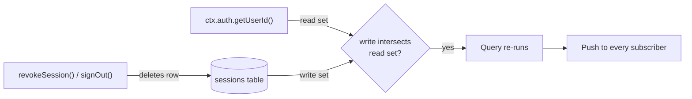
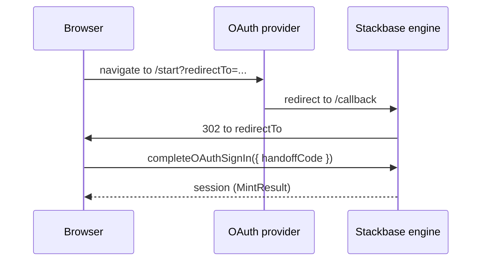
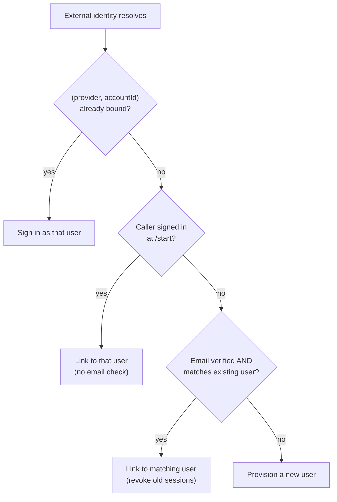

{/* diataxis: explanation */}

`@stackbase/auth` is a first-party, self-hosted authentication component. Out of the box it gives
you email and password accounts, anonymous sign-in with in-place upgrade, and a hardened session
model. Layer on top of that as much as you need: email verification, password reset, magic links,
one-time codes, social OAuth, third-party JWT/OIDC, TOTP two-factor, and passkeys.

However a user signs in, every flow ends the same way: a real session row in your own database.
That row is what `ctx.auth.getUserId()` reads inside the transaction, over `ctx.db`, exactly like
any other read. So it becomes part of the calling function's [read
set](/docs/get-started/how-it-works#read-sets-what-a-query-actually-records), and revoking a
session is just a write against that row. Every subscribed query gated on identity re-runs and
reflects the change immediately: no polling, no separate invalidation channel to wire up.

Everything past password sign-in is opt-in, each behind its own config block. `defineAuth()` with
no arguments gives you password and anonymous sign-in and nothing else. A deployment that never
configures `email`, `oauth`, `jwt`, `mfa`, or `passkeys` behaves exactly like an older version of
the component that never had them.

This is a long page. Jump to what you need:

- [Enabling it](#enabling-it), [`ctx.auth`](#ctxauth-identity-inside-a-function), and
  [`createAuthClient`](#the-client-createauthclient): the basics every app needs
- [Sessions](#sessions-sign-up-sign-in-sign-out): the token pair, rotation, expiry,
  [device management](#device-management), [anonymous auth](#anonymous-auth-and-in-place-upgrade)
- [Email flows](#email-flows): verification, password reset, magic links, OTP
- [OAuth (social sign-in)](#oauth-social-sign-in): adding Google/GitHub/etc. sign-in
- [Third-party JWT / OIDC](#third-party-jwt--oidc): Clerk, Auth0, Supabase Auth
- [MFA (TOTP)](#multi-factor-authentication-totp) and [Passkeys](#passkeys-webauthn)
- [Security invariants](#security-invariants),
  [notifications integration](#notifications-integration),
  [localStorage vs. cookies](#localstorage-vs-cookies)

## Enabling it

Compose `auth` in `stackbase.config.ts` like any other component:

```ts title="stackbase.config.ts"
import { defineConfig } from "@stackbase/component";
import { auth } from "@stackbase/auth";

export default defineConfig({ components: [auth] });
```

`auth` is `defineAuth()` called with defaults. To override any of the top-level session knobs
(everything else stays behind its own block), call `defineAuth` yourself:

```ts title="stackbase.config.ts"
import { defineAuth } from "@stackbase/auth";

export const auth = defineAuth({
  accessTtlMs: 60 * 60 * 1000,                 // access token lifetime (default 1h)
  refreshTtlMs: 30 * 24 * 60 * 60 * 1000,      // refresh token lifetime, slides on rotation (default 30d)
  refreshGraceMs: 30_000,                      // honest-race grace window (default 30s)
  sessionTotalTtlMs: 90 * 24 * 60 * 60 * 1000, // absolute ceiling, never slides (default 90d)
  anonymousSignInsPerMinute: 60,               // deployment-global anon throttle; 0 disables (default 60)
});
```

`defineAuth` registers a `sessions`/`accounts`/`users` schema, plus additively whatever tables the
blocks you configure need. It also registers a set of functions under the `auth:` module prefix,
and attaches `ctx.auth` as a context provider to every query, mutation, and action in your app.

## `ctx.auth`: identity inside a function

`ctx.auth.getUserId()` resolves the ambient session, the token carried by the connection's
`SetAuth`, or an HTTP request's bearer token, to a user id. It returns `null` if there's no
session, or if it expired:

```ts title="convex/documents.ts"
import { query } from "./_generated/server";

export const myDocuments = query({
  handler: async (ctx) => {
    const userId = await ctx.auth.getUserId();
    if (!userId) return [];
    return ctx.db.query("documents", "byOwner").eq("ownerId", userId).collect();
  },
});
```

This resolution reads the `sessions` row through `ctx.db`, not some out-of-band lookup, so the
read lands in the calling function's read set exactly like any other `ctx.db` call. Deleting that
row (a revoke, a sign-out, a reuse-detected theft response) is an ordinary write that intersects
that read set. Every subscribed query gated on `getUserId()` re-runs and reflects the new,
signed-out identity immediately. It's the same mechanism [How it
works](/docs/get-started/how-it-works) describes for every other kind of reactivity, applied to
identity itself.



## The client: `createAuthClient`

Sign-in flows are ordinary mutations and actions you call yourself. `createAuthClient` is what
turns the raw token pair they return into a managed session: persistence, applying the access
token to the connection, scheduling refresh, and coordinating across tabs.

```ts title="app.ts"
import { StackbaseClient, webSocketTransport, createAuthClient, anyApi } from "@stackbase/client";

const client = new StackbaseClient(webSocketTransport(url));
const auth = createAuthClient(client, { onSignedOut: () => location.reload() });

const result = await client.mutation(anyApi.auth.signUp, {
  email, password, deviceLabel: "Chrome on macOS",
});
auth.setSession(result);   // persists, applies the access token, schedules refresh

// later:
auth.getSessionInfo();     // { token, refreshToken, sessionId, userId, expiresAt } | null (a shallow copy)
auth.clearSession();       // sign out locally (also fires onSignedOut)
auth.close();              // stop the refresh timer + close the broadcast channel (e.g. on unmount)
```

What `createAuthClient(client, opts)` does under the hood:

- **Persistence.** `localStorageSession()` is the default `SessionStorage`. It reads and writes a
  `stackbase.session` JSON blob (the exported constant `SESSION_STORAGE_KEY`), and falls back
  transparently to an in-memory store (`memorySession()`) if `localStorage` throws or doesn't
  exist (private-mode Safari, SSR, a non-browser host). Pass your own `storage` (any
  `{ load(): SessionInfo | null; save(info): void; clear(): void }`) for Node/Electron/Tauri hosts.
- **Applying the token.** Every `setSession` call, and every successful refresh, calls
  `client.setAuth(token)` (wires the access token into `SetAuth`) and
  `client.setSessionFingerprint(sessionId)`. While a session is managed this way, the durable
  [offline outbox](/docs/client/offline-sync) fingerprints mutations by the stable `sessionId`
  rather than the rotating access token, so a routine rotation never orphans a queued offline
  mutation.
- **Refresh scheduling.** A timer fires at `refreshAtFraction` (default `0.8`) of the access
  token's remaining lifetime, computed from `expiresAt - now()`. That makes it exact right after a
  mint and conservative after a reload. `now` is injectable for tests.
- **Single-refresher across tabs.** The actual refresh call runs inside a `RefreshLock`: Web Locks
  (`navigator.locks`) in a browser, an in-process promise-chain serializer otherwise. That way two
  tabs racing to refresh the same session never both present the same refresh token at once.
  Before calling `auth:refresh`, the lock body re-reads storage. If a sibling tab already rotated,
  and its pair is strictly newer (a later `expiresAt` and a different `refreshToken`), this tab
  simply adopts that pair instead of refreshing again.
- **Cross-tab broadcast.** After a winning refresh, the new pair is posted over a
  `BroadcastChannel` (`stackbase:auth:pair`) so every other tab adopts it immediately rather than
  each independently hitting `auth:refresh`.
- **`REFRESH_STALE` handling.** If this tab's refresh loses an honest race (see [rotation and
  reuse detection](#rotation-and-reuse-detection) below), it waits ~250ms for the winner's
  broadcast, adopts the newer pair if it arrived, and otherwise just reschedules, with no forced
  sign-out.
- **Terminal failure.** `REFRESH_EXPIRED` or `REFRESH_REUSED` clears the session and calls
  `opts.onSignedOut?.()`. Any other refresh failure (a network blip, a server outage) backs off
  exponentially (1s, 2s, 4s, … capped at 60s) rather than spinning.
- **Injectable seams.** Three more options exist for unusual hosts: `refreshPath` (the refresh
  mutation's function path, default `"auth:refresh"`), `lock` (a custom `RefreshLock` replacing
  Web Locks), and `broadcast` (a custom `PairBroadcast` replacing `BroadcastChannel`).

<Callout type="warn" title="Two-process sharing isn't supported">

Two-process sharing of a single refresh token, as opposed to two-tab (for example two independent
Node processes both holding the same `SessionInfo`), is explicitly unsupported. There's no
cross-process lock or broadcast, only cross-tab (Web Locks plus `BroadcastChannel`, both
browser-scoped).

</Callout>

## Sessions: sign up, sign in, sign out

```ts
const result = await client.mutation(anyApi.auth.signUp, { email, password, deviceLabel: "Chrome on macOS" });
// { token, refreshToken, sessionId, userId, expiresAt }

const result2 = await client.mutation(anyApi.auth.signIn, { email, password, deviceLabel: "Firefox on Linux" });

await client.mutation(anyApi.auth.signOut, { token });

const userId = await client.query(anyApi.auth.getUserId, { token }); // string | null (a raw read, no ctx.auth needed)
```

Every sign-in path, `signUp`, `signIn`, and every flow layered on top below, returns the same
`MintResult` shape (`{ token, refreshToken, sessionId, userId, expiresAt }`). That means
`auth.setSession(...)` works identically no matter how the user actually authenticated.

Password sign-in has its own defense against guessing: five wrong attempts against one `accounts`
row lock it for 15 minutes (`lockedUntil`), checked before the password comparison so a locked
account's response time never depends on whether the guessed password was right. One honest
limit: account *existence* is still timing-distinguishable, since an unknown email is rejected
before any password-hashing work runs. The lockout gate hides password validity, not whether the
account exists. A successful sign-in resets the counter and, if the stored hash predates a
hashing-cost upgrade, transparently rehashes it in the same write.

### The token pair, hashed at rest

`signUp` and `signIn` mint a pair through one internal chokepoint (`mintSession`, not itself a
public function): a short-lived access token and a longer-lived refresh token. Both raw tokens go
back to the caller and are never stored. Only their one-way SHA-256 hashes land in the `sessions`
row (`tokenHash`, `refreshTokenHash`). That means a database leak on its own is not a session
hijack: an attacker with read access to the table has hashes, not usable tokens.

### Rotation and reuse detection

`auth:refresh({ refreshToken })` rotates both tokens in place (same `sessionId`) and remembers the
outgoing refresh token's hash as `prevRefreshTokenHash`:

- Presenting the **current** refresh token → normal rotation: a fresh access + refresh pair, the
  refresh window slides forward (`refreshExpiresAt = now + refreshTtlMs`).
- Presenting the **immediately-previous** refresh token *within* `refreshGraceMs` (default 30s) of
  the last rotation → a soft `REFRESH_STALE`. This is the honest case of two sibling tabs racing
  to refresh at once: one wins and rotates, the other's now-stale token isn't a theft signal, just
  a losing race. No revocation: the losing tab waits for the winner's broadcast (see above).
- Presenting the previous refresh token **outside** the grace window → `REFRESH_REUSED`. This *is*
  a theft signal (someone captured an old refresh token and is replaying it after the legitimate
  client already rotated past it): the entire session row is deleted, and the error still commits
  that deletion even though the call itself throws (`commitThenThrow`, the same "the write
  survives the throw" mechanism the password lockout counter and the OTP attempt counter use).
- Presenting a token that matches neither the current nor the previous hash → a plain
  invalid-token error, nothing written.

The previous-hash lookup is a single indexed equality read (`byPrevRefreshTokenHash`), never a
table scan, so a garbage refresh presentation costs O(1) and can't be used to widen a mutation's
OCC conflict range as a denial-of-service lever.

### Expiry: sliding refresh window vs. absolute ceiling

Two independent limits bound how long a session can live:

- **`refreshTtlMs`** (default 30 days) **slides** on every successful rotation: an actively-used
  session's refresh window keeps moving forward.
- **`sessionTotalTtlMs`** (default 90 days) is fixed at mint time and **never slides**. It's a hard
  ceiling on the session's total lifetime regardless of how often it refreshes. Both are checked on
  every `auth:refresh`. Either one being exceeded throws `REFRESH_EXPIRED`, and the client must
  sign in again.

<Accordions type="single">

<Accordion title="The session TTL knobs, at a glance">

<TypeTable
  type={{
    accessTtlMs: {
      description: 'How long a stolen access token stays usable',
      type: 'number',
      default: '1 hour',
    },
    refreshTtlMs: {
      description: 'Refresh window, sliding on each rotation',
      type: 'number',
      default: '30 days',
    },
    refreshGraceMs: {
      description: 'Grace window: a previous-refresh replay inside this is REFRESH_STALE, not REFRESH_REUSED',
      type: 'number',
      default: '30 s',
    },
    sessionTotalTtlMs: {
      description: 'Absolute ceiling, fixed at mint. Forces re-auth even for an actively-refreshing session',
      type: 'number',
      default: '90 days',
    },
    anonymousSignInsPerMinute: {
      description: 'Deployment-global cap on anonymous account creation. 0 disables',
      type: 'number',
      default: '60',
    },
  }}
/>

</Accordion>

</Accordions>

## Device management

Every session carries an optional `deviceLabel`: whatever string you pass at sign-in ("Chrome on
macOS", a push-token id, anything meaningful to your UI). A "manage your devices" screen is three
calls:

```ts
const sessions = await client.query(anyApi.auth.listSessions, {});
// [{ sessionId, deviceLabel, createdAt, lastRefreshAt, current }, ...] (reactive, never a token/hash)

await client.mutation(anyApi.auth.revokeSession, { sessionId }); // kill one device, ownership-checked
await client.mutation(anyApi.auth.revokeOtherSessions, {});      // keep this device, kill every other one
```

`listSessions` resolves the caller's own `userId` and reads only that user's `sessions` rows over
an index range, never a table scan. So a subscribed device list re-runs only when this user's own
sessions change, not on every sign-in across the whole deployment. `revokeSession` rejects a
`sessionId` that doesn't belong to the caller with the same generic "session not found" a
cross-user probe of any other resource gets: no leak of whether a foreign session id exists.
Revoking a session deletes its row. Any tab still authenticated with it flips to signed-out on the
very next reactive push, because `ctx.auth.getUserId()`'s read set is exactly that row.

## Anonymous auth and in-place upgrade

```ts
const anon = await client.mutation(anyApi.auth.signInAnonymously, { deviceLabel: "Safari" });
auth.setSession(anon);
// ... the user creates real rows, owned by their (anonymous) userId ...
const upgraded = await client.mutation(anyApi.auth.signUp, { email, password });
auth.setSession(upgraded);
```

An anonymous user is a real user row (`users.anonymous: true`, no email), not a placeholder.
`signInAnonymously` is rejected outright if the caller already resolves to any user, signed-in or
already anonymous. That prevents anon-session churn from an already-authenticated caller. It's
also capped by the deployment-global `anonymousSignInsPerMinute` throttle: a single rolling-window
counter row, and `AnonymousThrottledError` (code `ANONYMOUS_THROTTLED`) over the cap.

Calling `signUp` while holding an anonymous session is the upgrade. It attaches the new email and
password to the same `userId` (never mints a new one), clears the `anonymous` flag, and, being a
credential boundary, deletes every session on the account before minting the fresh one it returns.
Because the `userId` never changes, every row the anonymous user created survives the upgrade
untouched.

If `requireEmailVerification` is on, the old anonymous session's wipe is deferred until the new
email is actually verified. The user keeps working anonymously in the meantime; see [Email
flows](#email-flows) below.

## Email flows

Passing an `email` block turns on four sign-in and recovery flows: email verification, password
reset, magic-link sign-in, and one-time-code (OTP) sign-in. All four are built on one internal
mutation (`auth:_issueCode`, not client-callable) that generates a code, hashes it, and stores
only the hash.

```ts title="stackbase.config.ts"
import { defineAuth, consoleEmail } from "@stackbase/auth";

export const auth = defineAuth({
  email: {
    provider: consoleEmail(),                // zero-config dev default
    from: "no-reply@example.com",
    appName: "My App",                       // used in email subject lines (default "Stackbase app")
    baseUrl: "https://app.example.com",       // required to build clickable reset/magic/verify links
  },
});
```

### `EmailConfig`: every field

<TypeTable
  type={{
    provider: {
      description: 'An EmailProvider (see below)',
      type: 'EmailProvider',
      required: true,
    },
    from: {
      description: 'The from address every send uses',
      type: 'string',
      required: true,
    },
    appName: {
      description: 'Interpolated into the default subject lines and bodies',
      type: 'string',
      default: '"Stackbase app"',
    },
    baseUrl: {
      description: 'Base URL used to build clickable magic-link/verify links. Omit and only the raw code/token is sent',
      type: 'string',
    },
    otpAttempts: {
      description: 'Wrong OTP guesses before the code is deleted (locked out)',
      type: 'number',
      default: '5',
    },
    otpTtlMs: {
      description: 'OTP code lifetime',
      type: 'number',
      default: '10 minutes',
    },
    magicLinkTtlMs: {
      description: 'Magic-link token lifetime',
      type: 'number',
      default: '1 hour',
    },
    resetTtlMs: {
      description: 'Password-reset token lifetime',
      type: 'number',
      default: '1 hour',
    },
    verifyTtlMs: {
      description: 'Email-verification token lifetime',
      type: 'number',
      default: '24 hours',
    },
    requestCooldownMs: {
      description: 'Minimum gap between two request* calls for the same (email, flow)',
      type: 'number',
      default: '60 s',
    },
    emailSendsPerMinute: {
      description: 'Deployment-wide send throttle across every flow. 0 disables',
      type: 'number',
      default: '100',
    },
    requireEmailVerification: {
      description: 'Gate signUp/signIn on a verified email (see Policy flags below)',
      type: 'boolean',
      default: 'false',
    },
    createUsersOnEmailSignIn: {
      description: 'Whether magic-link/OTP sign-in for an unknown email provisions a user on the fly',
      type: 'boolean',
      default: 'true',
    },
    templates: {
      description: 'Per-flow { subject, text, html? } renderers. Override any subset',
      type: 'object',
      default: 'defaultTemplates',
    },
    notificationCategory: {
      description: 'The category passed to a composed @stackbase/notifications (see Notifications integration below)',
      type: 'string',
      default: '"auth"',
    },
  }}
/>

### The `EmailProvider` seam

```ts
export interface EmailMessage { to: string; from: string; subject: string; text: string; html?: string }
export interface EmailProvider { send(msg: EmailMessage): Promise<void> }
```

Two providers ship built-in:

- **`consoleEmail()`** is the zero-config dev default. It delivers nothing: it prints the whole
  rendered message (subject, body, and, deliberately, for dev convenience, the raw code or link) to
  the server's own console, meaning the terminal running `stackbase dev`/`serve`.
- **`resendEmail({ apiKey, baseUrl? })`** makes one `fetch` call to the Resend API per send. Zero
  extra dependencies, and it throws on a non-2xx response.

<Callout type="warn" title="Don't use consoleEmail() in production">

It prints every code and link to the server's console in plain text. Reach for `resendEmail(...)`
or a custom provider for anything real.

</Callout>

Anything else, SMTP included, is a custom adapter against that same one-method seam.

<Accordions type="single">

<Accordion title="Custom provider: SMTP over nodemailer">

SMTP has no built-in adapter. Here's the documented recipe over `nodemailer` (add it as your own
dependency):

```ts title="smtp-email.ts"
import nodemailer from "nodemailer";
import type { EmailProvider } from "@stackbase/auth";

export function smtpEmail(opts: { host: string; port: number; user: string; pass: string }): EmailProvider {
  const transport = nodemailer.createTransport({ host: opts.host, port: opts.port, auth: { user: opts.user, pass: opts.pass } });
  return {
    async send(msg) {
      await transport.sendMail({ to: msg.to, from: msg.from, subject: msg.subject, text: msg.text, html: msg.html });
    },
  };
}
```

</Accordion>

<Accordion title="Customizing templates">

`templates` accepts a partial override of `defaultTemplates`, one function per flow, receiving
`{ appName, email, code?, url?, ttlMs }` (`code` for OTP, `url` for the three token-based flows)
and returning `{ subject, text, html? }`:

```ts
import { defineAuth, consoleEmail, defaultTemplates } from "@stackbase/auth";

export const auth = defineAuth({
  email: {
    provider: consoleEmail(),
    from: "no-reply@example.com",
    templates: {
      otp: (a) => ({
        subject: `${a.appName}: your code is ${a.code}`,
        text: `Your sign-in code: ${a.code} (expires in ${Math.round(a.ttlMs / 60000)} min)`,
      }),
      // verify/reset/magic fall back to defaultTemplates
    },
  },
});
```

</Accordion>

</Accordions>

### Using the flows

Every `request*` function is an action, call it with `client.action`. Every redeem function is a
mutation (`client.mutation`) that returns `MintResult`. Hand that straight to
`auth.setSession(...)`.

**Email verification** is gated by `requireEmailVerification`. A gated `signUp`/`signIn` returns
`{ needsVerification: true }` in place of a session:

```ts
const outcome = await client.mutation(anyApi.auth.signUp, { email, password });
if ("needsVerification" in outcome) {
  await client.action(anyApi.auth.requestEmailVerification, { email });
  // user reads the code/link from their inbox (or the server console with consoleEmail())
  const session = await client.mutation(anyApi.auth.verifyEmail, { email, code });
  auth.setSession(session);
} else {
  auth.setSession(outcome);
}
```

**Password reset** revokes every session on the account before minting the fresh one it returns:

```ts
await client.action(anyApi.auth.requestPasswordReset, { email });
const session = await client.mutation(anyApi.auth.resetPassword, { email, code, newPassword });
auth.setSession(session);
```

**Magic-link sign-in:**

```ts
await client.action(anyApi.auth.requestMagicLink, { email });
const session = await client.mutation(anyApi.auth.signInWithMagicLink, { email, token });
auth.setSession(session);
```

**OTP sign-in:**

```ts
await client.action(anyApi.auth.requestOtp, { email });
const session = await client.mutation(anyApi.auth.signInWithOtp, { email, code });
auth.setSession(session);
```

Magic-link and OTP both adopt an existing user by email, or, if `createUsersOnEmailSignIn` is on
(the default), provision one on the fly, passwordless.

### Policy flags

- **`requireEmailVerification`** (default `false`) when on, `signUp`/`signIn` for an unverified
  account return `{ needsVerification: true }` instead of minting; the client must complete
  `requestEmailVerification` → `verifyEmail` first.
- **`createUsersOnEmailSignIn`** (default `true`) whether an unknown email hitting
  `signInWithMagicLink`/`signInWithOtp` provisions a user automatically. Set `false` for
  invite-only signup, where an account must already exist before passwordless sign-in works.

### Abuse defense

| Defense | Behavior |
|---|---|
| Per-code attempt counter (`otpAttempts`) | OTP only. Each wrong guess increments a counter; at the cap the code row is deleted (locked out) rather than staying guessable forever |
| Per-`(email, flow)` cooldown (`requestCooldownMs`) | A second `request*` for the same email+flow inside the cooldown throws `EMAIL_COOLDOWN`, checked before, and regardless of, account existence, so a known and an unknown email behave identically across two rapid requests |
| Global send throttle (`emailSendsPerMinute`) | A deployment-wide rolling counter across every flow; over the cap throws `EMAIL_THROTTLED` |
| Anti-enumeration on request | `request*` always returns `{ sent: true }`, whether or not the email has an account, never revealing existence |
| Anti-enumeration on redeem | Every redeem failure (wrong code, expired, already consumed, no such account) returns the identical generic "invalid code" |
| Uniform-cooldown sentinel rows | An unknown email still gets a cooldown-tracking row, stamped with an unmatchable sentinel hash (`codeHash: ""`, which a real 43-char SHA-256/base64url hash can never equal), so the cooldown itself can't be used as an existence oracle |
| First-mailbox-proof session revocation | Any flow that flips `emailVerified` from false to true (`verifyEmail`, `signInWithMagicLink`, `signInWithOtp` adopting an unverified user) revokes **every** existing session on the account before minting. That closes the "parked session" backdoor, where an attacker pre-registers an account and rides a live session until the true owner proves mailbox control. An already-verified user signing in from a new device has no flip and keeps their other sessions. `resetPassword` revokes all sessions unconditionally, every time. |
| No per-IP rate limiting | Deliberate: the sync transport carries no per-request IP/device identifier to key a limiter on. Abuse defense here is per-`(email, flow)` and per-deployment-per-minute. Front the deployment with your own reverse proxy for IP-level limiting. |

### Code shapes and TTLs

| Flow | Code shape | Default TTL | Config field |
|---|---|---|---|
| OTP | 8 numeric digits, zero-padded | 10 minutes | `otpTtlMs` |
| Magic link | 32-char base64url token, embedded in a URL | 1 hour | `magicLinkTtlMs` |
| Password reset | 32-char base64url token | 1 hour | `resetTtlMs` |
| Email verify | 32-char base64url token | 24 hours | `verifyTtlMs` |

Every code and token is generated with a CSPRNG and stored hashed at rest (SHA-256/base64url).
Only the raw value that goes out in the email ever exists outside the database. Only one active
code exists per `(email, flow)` at a time: a new `request*` overwrites the previous row instead of
accumulating them.

## OAuth (social sign-in)

An `oauth` block turns on social sign-in through six built-in providers, plus any custom
OIDC/OAuth2 provider. All of them resolve through the same account-linking core that email and
password sign-in uses. Stackbase's own sessions always stay DB rows: an external identity is
resolved to, or linked with, a local `userId`, and then a normal session is minted for it.

```ts title="stackbase.config.ts"
import {
  defineAuth, googleProvider, githubProvider,
  microsoftProvider, discordProvider, facebookProvider, appleProvider,
} from "@stackbase/auth";

export const auth = defineAuth({
  oauth: {
    providers: {
      google: googleProvider({ clientId: process.env.GOOGLE_CLIENT_ID!, clientSecret: process.env.GOOGLE_CLIENT_SECRET! }),
      github: githubProvider({ clientId: process.env.GITHUB_CLIENT_ID!, clientSecret: process.env.GITHUB_CLIENT_SECRET! }),
      microsoft: microsoftProvider({ clientId: process.env.MS_CLIENT_ID!, clientSecret: process.env.MS_CLIENT_SECRET! }),
      discord: discordProvider({ clientId: process.env.DISCORD_CLIENT_ID!, clientSecret: process.env.DISCORD_CLIENT_SECRET! }),
      facebook: facebookProvider({ clientId: process.env.FB_APP_ID!, clientSecret: process.env.FB_APP_SECRET! }),
      apple: appleProvider({
        clientId: process.env.APPLE_SERVICES_ID!,   // your Services ID, e.g. com.acme.web
        teamId: process.env.APPLE_TEAM_ID!,
        keyId: process.env.APPLE_KEY_ID!,
        privateKey: process.env.APPLE_PRIVATE_KEY!, // the .p8 PKCS#8 PEM contents
      }),
    },
    // REQUIRED: an open-redirect guard. Every `redirectTo` at /start must match one of these
    // origin+path-prefix entries, or /start 400s before any state is ever written.
    redirectAllowlist: ["https://app.example.com/auth/callback"],
    stateTtlMs: 10 * 60 * 1000,   // default 10 min: OAuth state row lifetime
    handoffTtlMs: 2 * 60 * 1000,  // default 2 min: post-callback handoff-code lifetime
  },
});
```

<Callout type="warn" title="redirectAllowlist is required">

`defineAuth` throws at config time if `oauth` is configured without a non-empty
`redirectAllowlist`. It's an open-redirect guard: every `redirectTo` at `/start` must match one of
these origin + path-prefix entries.

</Callout>

Any custom provider, including one you build yourself, goes through the public
`oauthProvider({ kind, ... })` seam the six built-ins are thin wrappers over:

```ts
import { oauthProvider } from "@stackbase/auth";

const acmeProvider = oauthProvider({
  kind: "oidc",                          // or "oauth2" for an explicit-endpoint provider (no discovery/id_token)
  issuer: "https://auth.acme.com",
  clientId: "...",
  clientSecret: "...",
});
```

### Built-in providers

All six share one flow. Register the engine's own callback URL
(`https://<deployment>/api/auth/oauth/<name>/callback`) with the provider, then send users to
`GET /api/auth/oauth/<name>/start?redirectTo=…`. The engine mounts both routes for you the moment
`oauth` is configured: no app code to write for them.

<Tabs items={['Google', 'GitHub', 'Microsoft', 'Discord', 'Facebook', 'Apple']}>

<Tab value="Google">

**`googleProvider({ clientId, clientSecret, scopes? })`** is OIDC. Identity comes from the
verified `id_token`.

</Tab>

<Tab value="GitHub">

**`githubProvider({ clientId, clientSecret, scopes? })`**. GitHub has no OIDC discovery or
id_token, so identity comes from `GET /user` plus `GET /user/emails`, fetched with the access
token.

</Tab>

<Tab value="Microsoft">

**`microsoftProvider({ clientId, clientSecret, tenant?, scopes? })`** is Microsoft Entra ID
(OIDC). `tenant` defaults to `"common"` (also `"organizations"`, `"consumers"`, or a tenant GUID /
`*.onmicrosoft.com`). For the three multi-tenant authorities, the id_token's issuer is
tenant-specific, so the provider relaxes the issuer string check while still verifying the token's
signature against Microsoft's own keys.

<Callout type="warn" title="Autolinking needs the xms_edov claim">

Entra emits no `email_verified`. Without `xms_edov` enabled in your app's Entra token
configuration, a Microsoft sign-in is treated as unverified and never auto-links to an existing
account.

</Callout>

</Tab>

<Tab value="Discord">

**`discordProvider({ clientId, clientSecret, scopes? })`** is OAuth2, reading `/users/@me`.
Default scopes are `identify email`. An email links only when Discord itself reports it verified.

</Tab>

<Tab value="Facebook">

**`facebookProvider({ clientId, clientSecret, scopes?, graphVersion? })`** uses the Meta Graph API
(`/me`), version pinned (`v25.0` by default, override with `graphVersion`). Facebook returns only
confirmed emails, and an app may get no email at all. An absent email means a separate account,
never a placeholder.

</Tab>

<Tab value="Apple">

**`appleProvider({ clientId, teamId, keyId, privateKey, scopes? })`** is Sign in with Apple (OIDC,
`form_post`). `clientId` is your Services ID (not the app bundle id); `teamId`, `keyId`, and
`privateKey` come from a Sign-in-with-Apple key (`.p8`, PKCS#8 PEM).

Apple issues no static client secret. `appleClientSecretMinter` mints a short-lived ES256 JWT from
your `.p8` per exchange (cached about five months, auto-refreshed 60 seconds early, capped at
Apple's six-month ceiling). The private key never leaves the server and is never stored.

Apple delivers the callback as an HTTP POST (`form_post`) and sends the user's name only on the
first authorization, in a `user` field of that POST body. That name is a cosmetic display name
only: identity (account id, email, email-verified) always comes from the signature-verified
`id_token`, never the POST body.

</Tab>

</Tabs>

<Callout type="warn" title="Every provider endpoint must be https:// in production">

A config-time guard (`assertProviderEndpointsSecure`) rejects a non-loopback `http://` issuer or
endpoint outright. `defineAuth` throws before the app ever boots. The `http://` exception exists
only for a loopback host (`127.0.0.1`/`localhost`/`::1`), for local dev and testing. There is no
flag anywhere in the public config surface to weaken this.

</Callout>

### The flow

Three hops: the browser kicks off sign-in, the provider redirects back through the engine, and the
page exchanges a one-time code for a session.



```ts
// 1. Kick off sign-in: a plain navigation (not fetch), so the browser follows the 302:
location.href = `${apiUrl}/api/auth/oauth/google/start?redirectTo=${encodeURIComponent("https://app.example.com/auth/callback")}`;

// 2. The provider redirects back through the engine's own /callback, which 302s to redirectTo
//    with a one-time code in the URL FRAGMENT (never the query: fragments are never sent to
//    servers or logged in a Referer):
//    https://app.example.com/auth/callback#code=<handoff>

// 3. On that page's load, read the fragment and exchange it:
const code = new URLSearchParams(location.hash.slice(1)).get("code");
if (code) {
  const session = await client.action(anyApi.auth.completeOAuthSignIn, { handoffCode: code });
  auth.setSession(session);
  history.replaceState(null, "", location.pathname); // drop the fragment from the visible URL
}
```

The handoff code is single-use (consume-before-validate: a second exchange rejects) and
short-lived (`handoffTtlMs`). It never carries a real session token. Only `completeOAuthSignIn`
trades it for one.

**Link-while-signed-in** ("connect your Google account" from a settings page): if the request
that hits `/start` carries the current session's access token as `Authorization: Bearer <token>`,
a successful callback links the external identity to *that* signed-in user instead of resolving by
email. A plain navigation can't attach a custom header, so this specific call needs
``fetch("/start?...", { headers: { authorization: `Bearer ${token}` } })`` rather than a bare
redirect.

### Account linking: the resolution order

Both OAuth and third-party JWT (below) funnel through one shared resolution core, so linking
behaves identically regardless of which one produced the identity:



1. **Returning identity.** If this exact `(provider, accountId)` pair is already bound to a user,
   sign in as that user.
2. **Link-while-signed-in.** If the caller proved an existing session at `/start`, the new
   external account attaches to that user. No email comparison at all.
3. **Verified-email autolink.** Only if the identity's email comes back verified (a hard boolean
   from the provider, for example Google/OIDC `email_verified`, or GitHub's per-address
   `verified`) and matches an existing user's email, the external account links to that user. This
   also revokes every existing session on the account if it wasn't already verified, the same
   first-mailbox-proof rule email flows use, closing the pre-registration-takeover hole.
4. **Unverified email never autolinks.** A missing or unverified email skips step 3 entirely,
   regardless of any match. A brand-new user is provisioned instead.
5. **No match at all.** Same outcome as step 4: a fresh user, bound to the external account.

### Security notes

| Concern | Mechanism |
|---|---|
| CSRF on the redirect | A random `state`, hashed before storage, single-use. Consumed (deleted) before it's ever validated, so a replayed callback with the same `state` 400s |
| Authorization-code injection | PKCE (S256) on every exchange, plus an OIDC `nonce` bound into the `id_token` |
| Open redirect | `redirectTo` must match `redirectAllowlist` (origin + segment-boundary-aware path prefix), checked at `/start` *and* re-checked at `/callback` before any write |
| id_token signature | Verified via the provider's own `jwks_uri`, for every OIDC provider: explicit, not left to a library default |
| Cookies | None, ever. State and the handoff are ephemeral DB rows keyed by a hash of a random token; the credential handoff is the URL fragment, read once and never sent to a server |
| Tokens in the URL | Never. Only a one-time handoff code transits (in the fragment); real tokens only ever return in an RPC response body |
| Consume-before-validate | Both the state row and the handoff row are deleted before their contents are checked, so a failure after a valid-looking row is found still burns it |
| No enumeration | Every OAuth/JWT failure surfaces as the same generic "authentication failed" |

## Third-party JWT / OIDC

For providers that hand your frontend a signed ID token directly (Clerk, Auth0, Supabase Auth, or
any issuer that publishes a JWKS), configure `jwt.issuers` and call `signInWithIdToken`:

```ts title="stackbase.config.ts"
export const auth = defineAuth({
  jwt: {
    issuers: [
      { issuer: "https://your-tenant.clerk.accounts.dev", audience: "your-audience" },
      // jwksUrl is optional. The default resolves ORIGIN-relative: new URL("/.well-known/jwks.json", issuer),
      // so an issuer with a path (https://host/tenant) loses that path. Set jwksUrl explicitly for a
      // path-bearing issuer, or when a provider publishes its JWKS somewhere else.
    ],
  },
});
```

```ts
const idToken = await clerk.session.getToken();
const session = await client.action(anyApi.auth.signInWithIdToken, { idToken });
auth.setSession(session);
```

`signInWithIdToken` verifies the token once: signature via a live JWKS fetch (`jose`), plus `iss`,
`aud`, `exp`/`nbf`, against the first matching configured issuer. Then it resolves, links, or
mints a Stackbase session through the exact same core the OAuth callback uses.

This is an exchange model, not per-request verification. That's a deliberate divergence from
Convex's design, where the third-party JWT itself is the ambient identity, re-verified on every
request. Stackbase verifies once and trades the token for a real DB-backed session, because:

- **Revocation stays reactive.** A DB-backed session can be listed (`listSessions`) and revoked
  (`revokeSession`) like any other. A bare third-party JWT can't be killed early: you'd have to
  wait out its `exp`.
- **`ctx.auth.getUserId()` resolves to a real local `userId`**, usable directly in your schema's
  foreign keys and ownership checks, rather than a foreign `sub` string your app would otherwise
  map on every request.
- **No per-request JWKS cost.** Verification happens once, at exchange time; every request after
  that is an ordinary session lookup, the same cost profile as password sign-in.

Both `issuer`/`jwksUrl` are subject to the identical production-`https://`-required guard OAuth
endpoints use.

## Multi-factor authentication (TOTP)

An `mfa` block adds RFC 6238 TOTP, the authenticator-app family (Google Authenticator, Authy,
1Password, and the rest), with one-time recovery codes as the backup factor. It gates every
first-factor sign-in path (password, magic-link, OTP, email verification, password reset, OAuth,
third-party JWT, and passkeys) behind a second factor, without ever bypassing the session-minting
chokepoint.

```ts title="stackbase.config.ts"
import { defineAuth } from "@stackbase/auth";

export const auth = defineAuth({
  mfa: {
    encryptionKey: process.env.STACKBASE_AUTH_MFA_KEY!, // a 32-byte key, base64 or hex
    issuer: "My App",                                   // otpauth:// issuer label (default "Stackbase")
  },
});
```

Generate a key once per deployment:

```bash
node -e "console.log(require('node:crypto').randomBytes(32).toString('base64'))"
```

<Callout type="warn" title="mfa fails fast at boot without a usable key">

`defineAuth` fails fast at boot if `mfa` is configured without a usable 32-byte key, the same
posture as `STACKBASE_ADMIN_KEY` for the admin and storage surfaces.

</Callout>

The TOTP secret is AES-256-GCM-encrypted at rest, with the additional-authenticated-data (AAD)
bound to the user id. It's encrypted, not hashed, because verification has to recompute the
expected code, unlike session tokens and email codes, which are only ever compared.

### `MfaConfig`: every field

<Accordions type="single">

<Accordion title="Every MfaConfig field">

<TypeTable
  type={{
    'encryptionKey / encryptionKeys': {
      description: 'A single 32-byte key, or an ordered keyring for rotation ([0] is primary)',
      type: 'string | Keyring',
      required: true,
    },
    issuer: {
      description: 'otpauth:// issuer label shown in the authenticator app',
      type: 'string',
      default: '"Stackbase"',
    },
    recoveryCodeCount: {
      description: 'Recovery codes minted per (re)enrollment',
      type: 'number',
      default: '10',
    },
    challengeTtlMs: {
      description: 'How long a post-first-factor pending challenge stays valid',
      type: 'number',
      default: '5 minutes',
    },
    mfaAttempts: {
      description: 'Wrong completeMfaSignIn guesses per challenge before it is destroyed',
      type: 'number',
      default: '5',
    },
    verifyAttemptsPerWindow: {
      description: 'Wrong guesses per user, across challenges, inside verifyWindowMs',
      type: 'number',
      default: '10',
    },
    verifyWindowMs: {
      description: 'The window verifyAttemptsPerWindow counts over',
      type: 'number',
      default: '15 minutes',
    },
    window: {
      description: 'TOTP step-drift tolerance (one period of slack on either side)',
      type: 'number',
      default: '1',
    },
    'algorithm / digits / period': {
      description: 'Fixed in v1, not app-configurable: the combination the authenticator ecosystem broadly supports',
      type: 'string',
      default: 'SHA1 / 6 / 30',
    },
  }}
/>

</Accordion>

</Accordions>

### Enroll, confirm, and complete

Enrollment is two-phase, so a botched setup can't lock a user out:

<Steps>

<Step>

### Enroll

While already signed in, request a secret and QR code. It's returned once, so render it right
away:

```ts
const enrollment = await client.mutation(anyApi.auth.startMfaEnrollment, {});
// { secret, otpauthUri, digits, period, algorithm }
showQrCode(enrollment.otpauthUri);
```

An [anonymous](#anonymous-auth-and-in-place-upgrade) user can't enroll: `startMfaEnrollment`
throws `MFA_ANONYMOUS_NOT_ALLOWED`, since there's no durable credential or verified mailbox to
bind a second factor to. This matters for the anonymous-passkey-bootstrap path below: upgrade the
account first, then enroll TOTP.

</Step>

<Step>

### Confirm

Confirm with the first live code the app shows. This is what actually turns MFA on, and mints the
one-time recovery-code set (also returned once):

```ts
const { recoveryCodes } = await client.mutation(anyApi.auth.confirmMfaEnrollment, { code: userEnteredCode });
showRecoveryCodesOnce(recoveryCodes);
```

</Step>

<Step>

### Sign in through the gate

From here on, every gated first-factor success returns
`{ mfaRequired: true, pendingToken, expiresAt }` instead of a session: no token, nothing an app
could mistake for being signed in.

```ts
const outcome = await client.mutation(anyApi.auth.signIn, { email, password });
if ("mfaRequired" in outcome) {
  const session = await client.mutation(anyApi.auth.completeMfaSignIn, {
    pendingToken: outcome.pendingToken,
    code: userEnteredCode,   // a live TOTP code OR a recovery code, one input box, either works
  });
  auth.setSession(session);
} else {
  auth.setSession(outcome);
}
```

</Step>

</Steps>

`pendingToken` authorizes only one second-factor attempt window for that user, within
`challengeTtlMs`. `ctx.auth.getUserId()` never resolves a pending challenge as a session. Every
first-factor success replaces any prior live challenge for that user (it never lets them stack),
which is what makes `verifyAttemptsPerWindow`, not just `mfaAttempts`, the thing that actually
bounds total guesses across a `signIn → wrong-guesses → signIn → …` loop. Exceeding that per-user
window throws `MFA_RATE_LIMITED`.

### Recovery codes

`confirmMfaEnrollment` mints `recoveryCodeCount` one-time codes, shown once. `completeMfaSignIn`
accepts a live TOTP code or a recovery code through the same `code` field. A recovery code is
deleted the instant it's used: it can never be replayed.

```ts
const status = await client.query(anyApi.auth.getMfaStatus, {});
// { enrolled: boolean, confirmed: boolean, recoveryCodesRemaining: number }

if (status.recoveryCodesRemaining < 3) {
  const { recoveryCodes } = await client.mutation(anyApi.auth.regenerateRecoveryCodes, { code: userEnteredTotpCode });
  showRecoveryCodesOnce(recoveryCodes); // replaces the WHOLE set, old codes stop working
}
```

`regenerateRecoveryCodes` requires a live TOTP code specifically. A recovery code can't mint a
fresh recovery-code batch: that would be self-referential, and it would burn one of the codes
being replaced.

### Disabling MFA

```ts
await client.mutation(anyApi.auth.disableMfa, { code: userEnteredCode }); // TOTP or recovery code
```

`disableMfa` (and `regenerateRecoveryCodes`) require a fresh, currently-valid second factor: proof
of possession, not just an active session. That means a stolen-but-still-live access token alone
can't strip a victim's second factor. Disabling deletes the enrollment and every recovery code;
the next sign-in mints directly, with no `mfaRequired` step.

### Losing the authenticator

There's no backdoor around losing both the authenticator app and the recovery codes. That's
deliberate: an unconditional bypass would defeat the point of a second factor. Two recoveries are
supported. One is a saved recovery code, the intended path (tell users to save them durably the
moment they're shown). The other is an admin or support-side reset your own app builds. Stackbase
ships no automatic "reset MFA" flow; deleting the user's `mfaEnrollments`/`mfaRecoveryCodes` rows
via the dashboard, behind your own out-of-band identity check, is the pattern. There is also no
"remember this device for 30 days" skip: every gated sign-in challenges, every time, on every
device.

### Key rotation

```ts
defineAuth({
  mfa: {
    encryptionKeys: [
      { id: "2", key: process.env.STACKBASE_AUTH_MFA_KEY_2! }, // NEW primary, encrypts going forward
      { id: "1", key: process.env.STACKBASE_AUTH_MFA_KEY_1! }, // retired, still decrypts old secrets
    ],
  },
});
```

`[0]` is always the primary, used for all new encryptions. Decryption dispatches on the `keyId`
embedded in each stored secret's own envelope, so existing enrollments keep working under a
retired key until they re-enroll. Only drop a retired key once no confirmed enrollment still
references its id: there is no server-side recovery of a secret whose only decrypting key is gone.

## Passkeys (WebAuthn)

A `passkeys` block adds WebAuthn (Face ID, Touch ID, Windows Hello, a hardware security key, or a
synced platform passkey) as a phishing-resistant, passwordless first factor. A passkey flows
through the same session-minting chokepoint as a password, so it honors any enrolled MFA and
participates in the same device-management surface as sessions.

```ts title="stackbase.config.ts"
export const auth = defineAuth({
  passkeys: {
    rpID: "example.com",              // your Relying Party ID (the registrable domain, no scheme/port)
    rpName: "My App",                 // human-readable label shown in the OS passkey prompt
    origins: ["https://example.com"], // every web origin the ceremony may run from (exact-match)
  },
});
```

<Callout type="warn" title="rpID, rpName, and origins are required">

There's no safe default for a security domain. `defineAuth` fails fast at boot if any is missing,
and validates every origin with the same loopback-or-`https://` rule OAuth endpoints use.

</Callout>

<Accordions type="single">

<Accordion title="The optional passkey config knobs">

<TypeTable
  type={{
    userVerification: {
      description: 'Whether the authenticator must verify the user (biometric/PIN). "required" forces it',
      type: 'string',
      default: '"preferred"',
    },
    residentKey: {
      description: 'Whether to create a discoverable credential (enables usernameless sign-in)',
      type: 'string',
      default: '"preferred"',
    },
    maxCredentialsPerUser: {
      description: 'Per-user credential cap. Past it, registration throws PASSKEY_LIMIT_REACHED',
      type: 'number',
      default: '20',
    },
    challengeTtlMs: {
      description: 'How long an issued registration/authentication challenge stays valid',
      type: 'number',
      default: '5 minutes',
    },
  }}
/>

</Accordion>

</Accordions>

All `@simplewebauthn/server` calls live inside actions (`beginPasskeyRegistration`,
`finishPasskeyRegistration`, `beginPasskeyAuthentication`, `finishPasskeyAuthentication`), never in
a query or mutation. The transactor itself stays crypto-free. The browser half uses
`@simplewebauthn/browser`:

```bash
npm install @simplewebauthn/browser
```

Register a passkey. The user must already be signed in, including
[anonymously](#anonymous-auth-and-in-place-upgrade), which is the passwordless-bootstrap path:
sign in anonymously, register a passkey, and the account is reachable from any device with no
password ever set.

```ts
import { startRegistration } from "@simplewebauthn/browser";

async function registerPasskey() {
  const options = await client.action(anyApi.auth.beginPasskeyRegistration, {});
  const response = await startRegistration({ optionsJSON: options });
  await client.action(anyApi.auth.finishPasskeyRegistration, { response, deviceName: "My iPhone" });
}
```

`finishPasskeyRegistration` accepts an optional `deviceName` label, persisted on the credential
row and shown by `listPasskeys` (renameable later with `renamePasskey`). Registering a credential
id that already exists throws `PASSKEY_ALREADY_REGISTERED`.

**Sign in with a passkey.** Two shapes share the same finish call:

```ts
import { startAuthentication } from "@simplewebauthn/browser";

async function signInWithPasskey(email?: string) {
  // Usernameless (omit email): a DISCOVERABLE credential. The OS shows the saved passkeys and no
  // account hint is sent. Passing an email scopes allowed credentials to that account; an unknown
  // email returns the SAME empty shape as a known one with zero passkeys, never an account oracle.
  const options = await client.action(anyApi.auth.beginPasskeyAuthentication, email ? { email } : {});
  const response = await startAuthentication({ optionsJSON: options });
  const outcome = await client.action(anyApi.auth.finishPasskeyAuthentication, { response });

  if ("mfaRequired" in outcome) {
    // A passkey is a first factor. It does NOT bypass an explicitly-enrolled second factor.
    const session = await client.mutation(anyApi.auth.completeMfaSignIn, {
      pendingToken: outcome.pendingToken, code: userEnteredCode,
    });
    auth.setSession(session);
  } else {
    auth.setSession(outcome); // a normal MintResult
  }
}
```

One deliberate asymmetry with password sign-in: a passkey sign-in bypasses
`requireEmailVerification` by construction. Possession of the registered credential is itself the
proof of account control, so no verified email is needed to sign in with one.

### Device management

```ts
const passkeys = await client.query(anyApi.auth.listPasskeys, {});
// [{ passkeyId, deviceName, transports, backedUp, createdAt, lastUsedAt }, ...] (display metadata only)

await client.mutation(anyApi.auth.renamePasskey, { passkeyId, deviceName: "My iPhone" });
await client.mutation(anyApi.auth.revokePasskey, { passkeyId });
```

`listPasskeys` is reactive: revoking on one device updates a live list on another. Rename and
revoke are ownership-checked; a foreign `passkeyId` gets the same generic "passkey not found"
every other cross-user probe gets. A revoked passkey is un-authenticatable immediately.

### Security guarantees

- **Challenge, origin, and RP-ID binding.** Every ceremony is bound to a fresh single-use
  challenge, consumed before validation, so a replay finds nothing, and verified against the
  configured `origins` and `rpID`. An assertion captured on a phishing origin doesn't verify.
- **Atomic clone detection.** Each credential carries a signature counter. An authentication whose
  presented counter regressed, or repeated a nonzero value, is rejected with no mint and no state
  change. The compare-and-set runs inside the same single-writer transaction as the mint, so
  there's no race window between checking the counter and committing it.
- **Anti-enumeration.** Every authentication failure (unknown credential, wrong owner, bad
  signature, stale challenge) collapses to one generic message. `begin` for an unknown email is
  byte-shaped identically to a known one with zero passkeys.
- **No key-material leak.** `listPasskeys` returns display metadata only; the COSE public key and
  signature counter never cross the wire.

<Callout type="info" title="Not built yet">

Passkey-as-MFA-step-up (a user-verified passkey satisfying an already-enrolled TOTP requirement
instead of prompting for it, reserved as a future refinement; today a passkey is strictly a first
factor), attestation-format/MDS verification (registration uses `"none"` attestation), a dedicated
passkey sign-up flow (registration always runs against an existing authed account), and
conditional-UI autofill.

</Callout>

## Security invariants

A few guarantees hold across every flow above, by construction:

- **`mintSession` is the sole minting chokepoint.** Every sign-in path (password, email flows,
  OAuth, third-party JWT, passkeys) either calls `mintSession` directly or goes through
  `finishSignIn`, which wraps it with the MFA gate. `finishSignIn` never replaces `mintSession`:
  it's an interposition point, not an alternate path. A static-source guard test fails CI if any
  gated call site is ever changed to mint directly, bypassing the gate.
- **A passkey cannot bypass an enrolled second factor.** Passkeys and MFA were designed
  concurrently. Passkey authentication routes through the identical `finishSignIn` gate as
  password, OAuth, or email sign-in, so a user enrolled in both never gets to skip TOTP via a
  passkey.
- **OAuth, third-party JWT, and passkeys are all first factors**, never a second factor and never
  a bypass of one. Every one of them can return `{ mfaRequired }` exactly like password sign-in
  when the resolved user has a confirmed MFA enrollment.

## Notifications integration

When `@stackbase/notifications` is composed alongside `auth`, every A2 email send (OTP,
magic-link, verification, and password-reset) routes through `ctx.notifications.send(...)`
instead of auth's own `EmailProvider.send`. It goes with `critical: true` (bypassing the
recipient's notification preferences, since a security-critical send can't be silently suppressed
by a user preference) and `category` set to `email.notificationCategory` (default `"auth"`).

That gets you [notifications](/docs/components/notifications)' retry, backoff, and dead-letter
delivery machinery, plus shared provider config, for free. Zero import from auth's side: the
integration is duck-typed against a small structural interface
(`{ send(args): Promise<{messageIds}> }>`), so auth has no dependency on the notifications package
at all.

Without notifications composed, the exact same sends fall back to auth's own configured
`EmailProvider`: byte-identical behavior to a deployment that has never heard of notifications.

## localStorage vs. cookies

Stackbase is WebSocket-first: identity flows over the `SetAuth` message, not request headers. So
the client holds the access token in JS (`localStorage` by default) rather than an httpOnly
cookie. The theft mitigation is the session model itself (a short access TTL, refresh rotation,
and reuse detection), not cookie isolation.

httpOnly-cookie mode plus CSRF is intentionally out of scope. If your threat model requires cookie
isolation, front Stackbase with your own auth-terminating proxy.

## Where to go next

- [Authorization](/docs/components/authorization): role, relationship, and row-level permissions
  layered on top of `ctx.auth`'s resolved identity.
- [Notifications](/docs/components/notifications): the shared delivery path auth's own
  transactional emails route through when composed.
- [How it works](/docs/get-started/how-it-works): the read-set/write-set mechanism that makes
  session revocation reactive.
- [Offline sync](/docs/client/offline-sync): why a managed session fingerprints the durable
  outbox by `sessionId` rather than the rotating access token.
