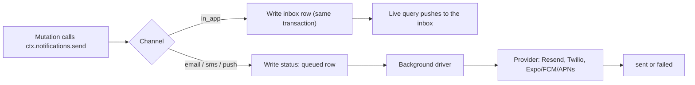

{/* diataxis: explanation */}

Think of a notification as just another row in a table. `@stackbase/notifications` is an opt-in
component that sends messages across four channels: **email**, **SMS/WhatsApp**, an in-app
**inbox**, and mobile/web **push**. Each channel goes through a swappable provider adapter, so
you're never locked into one vendor.

Its headline feature is a **reactive in-app inbox**. A notification is a row in a live-queried
table, so a user's inbox and unread count update in real time. No dedicated realtime service, no
polling, no separate push infrastructure to run.

Once you understand `email`, you already understand the rest. Every channel shares one send path,
one preference gate, one retry/backoff/dead-letter machine, and one topic fan-out mechanism.
There's no separate "push system" or "SMS system" to learn: the differences between channels are a
handful of branches inside otherwise shared code.

## The model: Channel × Provider

A **channel** is a medium: `"email" | "sms" | "in_app" | "push"`. A **provider** is a swappable
adapter that knows how to actually deliver on one channel: Resend for email, Twilio for SMS,
Expo/FCM/APNs for push. `in_app` has no provider at all. The engine just writes a row.

This seam (`NotificationProvider`, specialized as `EmailProvider` / `SmsProvider` / `PushProvider`)
follows the same philosophy as `DatabaseAdapter` or `BlobStore` elsewhere in the system. The
component never hard-codes a vendor, so you can write your own adapter against a documented
contract instead of waiting on a built-in one.

## Enabling it

Compose the component in `stackbase.config.ts`, like any other opt-in component:

```ts title="stackbase.config.ts"
import { defineConfig } from "@stackbase/component";
import { defineNotifications, consoleEmail, twilioSms } from "@stackbase/notifications";

export default defineConfig({
  components: [
    defineNotifications({
      channels: {
        email: {
          provider: consoleEmail(),          // zero-config dev provider: logs to the server console
          from: "no-reply@app.test",
          templates: {
            welcome: (d) => ({ subject: `Welcome ${d.name}`, text: `Hi ${d.name}!` }),
          },
        },
        sms: {
          provider: twilioSms({ accountSid: process.env.TWILIO_SID!, authToken: process.env.TWILIO_TOKEN! }),
          from: "+15550000000",
        },
        in_app: {
          enabled: true,
          templates: {
            welcome: (d) => ({ title: "Welcome", body: `Hi ${d.name}!` }),
          },
        },
      },
    }),
  ],
});
```

`defineNotifications(opts)` accepts:

| Option | Type | Default | What it controls |
|---|---|---|---|
| `channels` | `{ email?, sms?, in_app?, push? }` | required | Which channels are configured. A channel not listed here throws if you try to send on it. |
| `driverIntervalMs` | `number` | `5000` | Fallback wall-clock sweep cadence for the queued-send driver. The driver also wakes immediately on every commit, so this is only a backstop. |
| `retry` | `{ maxAttempts, initialBackoffMs, base }` | `{4, 250, 2}` | Retry policy for a failed email/SMS/push send. See [Delivery reliability](#delivery-reliability). |
| `reclaimLeaseMs` | `number` | `60000` | How long a message may sit claimed (`"sending"`) before a crash-recovery sweep reclaims it. |
| `defaultCategory` | `string` | `"default"` | The category a `send` uses when it names none. |
| `categories` | `Record<string, { critical?: boolean; digest?: "hourly"\|"daily"\|"weekly" }>` | `{}` | Per-category configuration: critical bypass and digest buffering. See [Preferences](#preferences-and-critical-categories) and [Email digest](#email-digest). |
| `digestTemplates` | `Record<string, (items: DigestItem[]) => EmailContent>` | `{}` | Per-category renderer for a combined digest email. Falls back to a built-in plain-text concatenation. |

Once composed, every mutation/query context gets a `ctx.notifications` facade (typed via the
component's `contextType`). Every action context gets a parallel `ctx.notifications` with a
slightly larger surface (`sendNow`, `sendToTopic`). See
[Mutation vs. action surface](#mutation-vs-action-surface) below.

## Sending

`ctx.notifications.send(args)` is available on every mutation context. It writes directly through
the **calling mutation's own transaction**: an enqueue rolls back if the mutation does, and it
fans out reactively to any live subscription (like the in-app inbox) the instant the mutation
commits:

```ts title="convex/users.ts"
import { mutation } from "./_generated/server";

export const welcome = mutation({
  handler: async (ctx, { userId, email, name }) => {
    await ctx.notifications.send({
      to: { userId, email },                 // channel-addressed recipient
      channels: ["in_app", "email"],         // which configured channels to deliver on
      template: "welcome",                   // a registered template key…
      data: { name },                        // …rendered with this payload
    });
  },
});
```

`send` returns:

```ts
{ messageIds: string[]; suppressed: Channel[]; deferred: Channel[] }
```

- **`messageIds`**: one id per channel that was actually enqueued or written.
- **`suppressed`**: channels skipped by the recipient's own preferences (see [Preferences](#preferences-and-critical-categories)).
- **`deferred`**: channels buffered into an email digest instead of sent immediately (see [Email digest](#email-digest)).

### `SendArgs`

```ts
interface SendArgs {
  to: { userId?: string; email?: string; phone?: string };
  channels: Array<"email" | "sms" | "in_app" | "push">;
  template: string | InlineTemplate;
  data?: Record<string, unknown>;
  idempotencyKey?: string;
  category?: string;
  critical?: boolean;
}
```

- **`to`** is addressed per channel and resolved per channel at send time: `email` requires
  `to.email`, `sms` requires `to.phone`, and `in_app`/`push` both require `to.userId` (they address
  a *recipient identity*, not a contact method). Sending `["email","push"]` to a `to` missing
  either field throws before anything is written. The recipient is always chosen by your server
  code, never forwarded straight from client input.
- **`template`** is either a **registered key** looked up in the channel's `templates` map (as in
  the example above), or an **inline content object** for one-off content with no config-time
  registration: `{ email: { subject, text, html? }, sms: "…", in_app: { title, body }, push: { title, body, data? } }`.
  Only the fields you actually use need to be present. Omit an optional field rather than setting
  it to `undefined`: a value that's explicitly `undefined` is rejected when the row is written.
- **`data`** is the payload handed to a registered template function (`(data) => Content`).
  Template rendering is pure and runs *inside* the transaction. There's no I/O, so it's safe to run
  before the transaction commits.
- **`idempotencyKey`**: see [At-most-once delivery](#at-most-once-delivery) below.
- **`category`**: see [Preferences](#preferences-and-critical-categories).
- **`critical`**: a server-authority bypass of the recipient's preferences for this one send. Never
  forward this from client-supplied arguments. Treat it like `to`, a trust-boundary field only your
  own server code sets.

<Callout type="warn" title="Trust boundary">

A handful of fields in this API are server-authority only: `to`, `critical`, and the `userId`
override on self-only calls like `subscribe` or `registerPushToken`. Set these only from your own
server code, never from client-supplied arguments. This pattern repeats through the rest of the
page, so it's worth keeping in mind as you read on.

</Callout>

### Per-channel delivery shape

- **`in_app` is instant.** The send writes the inbox row synchronously inside your transaction, so
  it's live to any subscription the moment the mutation commits. There's no queue, no send step,
  and nothing to retry.
- **`email`/`sms`/`push` are queued.** The send writes a `status: "queued"` row (with the rendered
  content already attached) in the same transaction, and a background driver delivers it via the
  configured provider *outside* the transaction. Network I/O never runs inside a mutation. The
  row's lifecycle is `queued → sending → sent` / `failed`.



### At-most-once delivery

Pass `idempotencyKey` to guarantee a message is never sent twice, even if the calling code is
replayed (an OCC conflict retry, a client retrying a timed-out call). This is the pattern that
makes an OTP or a receipt email safe:

```ts
await ctx.notifications.send({
  to: { email }, channels: ["email"], template: "otp", data: { code },
  idempotencyKey: `otp:${userId}:${code}`,
});
```

A replay with the same key short-circuits to the already-recorded result (`sendReceipts`, keyed by
`idempotencyKey`, written atomically with the message rows). No second send, no second row. When
the underlying provider supports a native idempotency header (Resend, and any custom adapter that
honors `EmailMessage.idempotencyKey`), the key passes through to it too, as defense in depth.

### Mutation vs. action surface

The mutation-context facade (`NotificationsContext`) has: `send`, `setPreference`, `subscribe`,
`unsubscribe`, `registerPushToken`, `unregisterPushToken`, `identity()`. The action-context facade
(`NotificationsActionContext`) adds two more that need to do work outside a transaction: `sendNow`
and `sendToTopic`. `ctx.notifications.identity()` returns the raw ambient caller token (the
fallback identity `callerId` uses when `@stackbase/auth` isn't composed). Most app code never
needs it directly.

#### `sendNow`: synchronous delivery from an action

```ts title="convex/blast.ts"
import { action } from "./_generated/server";

export const blast = action({
  handler: async (ctx, { email }) => {
    const { messageIds, results } = await ctx.notifications.sendNow({
      to: { email }, channels: ["email"], template: "welcome", data: { name: "Ada" },
    });
    return results; // [{ providerMessageId: "…" }]
  },
});
```

`sendNow` still durably enqueues first, exactly like `send`, then drains the just-written
email/SMS/push rows synchronously (network I/O is allowed from an action) through the **same**
claim-before-send guard (`_claimForSend`/`_markResult`) the background driver uses. That guard is
what makes this crash-safe and non-double-sending: because every row is durable `queued` state
before any delivery is attempted, a process crash mid-drain leaves the un-drained rows `queued`,
and the driver picks them up later. No channel is ever silently dropped, and whichever of
`sendNow`/the driver claims a row first is the one that delivers it (the other skips). Returns the
same `{messageIds, suppressed, deferred}` as `send`, plus `results: SendResult[]`, the provider's
return value for each channel actually delivered inline.

#### `sendToTopic`: action-only broadcast

Covered in full under [Topics](#topics) below.

## Channels and providers

<Tabs items={['Email', 'SMS', 'In-app']}>

<Tab value="Email">

| Provider | Notes |
|---|---|
| `consoleEmail()` | Zero-config dev default: logs the full email to the server console. |
| `resendEmail({ apiKey, baseUrl? })` | One `fetch` to the Resend API. Passes `idempotencyKey` through as Resend's native `Idempotency-Key` header. Non-2xx: 4xx (except 429) is classified non-retryable; 5xx/429 retryable. Implements the delivery webhook (Svix signature scheme, see [Delivery webhooks](#delivery-webhooks-and-normalized-status)). |

```ts
interface EmailChannelConfig {
  provider: EmailProvider;
  from: string;
  templates?: Record<string, (data: any) => { subject: string; text: string; html?: string }>;
  webhookSecret?: string;             // Resend's Svix whsec_… secret, for delivery-status webhooks
  fallbacks?: EmailProvider[];        // see Multi-provider fallback below
}
```

</Tab>

<Tab value="SMS">

| Provider | Notes |
|---|---|
| `consoleSms()` | Zero-config dev default: logs to the server console. |
| `twilioSms({ accountSid, authToken, baseUrl? })` | One `fetch` to the Twilio Messages API (Basic auth, form-encoded). `kind: "whatsapp"` on the rendered payload addresses both `To`/`From` with a `whatsapp:` prefix. WhatsApp is the same channel, not a separate one. Twilio has no native idempotency header, so dedup relies entirely on `sendReceipts`. Implements the delivery webhook (`X-Twilio-Signature` HMAC). |

```ts
interface SmsChannelConfig {
  provider: SmsProvider;
  from: string;
  templates?: Record<string, (data: any) => string>;
  fallbacks?: SmsProvider[];
}
```

</Tab>

<Tab value="In-app">

```ts
interface InAppChannelConfig {
  enabled: true;
  templates?: Record<string, (data: any) => { title: string; body: string; [key: string]: unknown }>;
}
```

No provider. `enabled: true` is the whole config. Extra fields returned by an `in_app` template
beyond `title`/`body` land on the inbox row's `data`.

</Tab>

</Tabs>

Covered in full under [Push](#push) below. It has enough of its own shape, multi-provider fan-out
and a device-token registry, to earn its own section.

### Writing your own provider

A provider is a small adapter with one method:

```ts
import type { EmailProvider, EmailMessage, SendResult } from "@stackbase/notifications";
import { NotificationSendError } from "@stackbase/notifications";

export function myEmail(opts: { apiKey: string }): EmailProvider {
  return {
    channel: "email",
    async send(m: EmailMessage): Promise<SendResult> {
      const res = await fetch("https://api.example.com/send", {
        method: "POST",
        headers: { authorization: `Bearer ${opts.apiKey}`, "content-type": "application/json" },
        body: JSON.stringify({ to: m.to, from: m.from, subject: m.subject, text: m.text, html: m.html }),
      });
      if (!res.ok) throw new NotificationSendError(`send failed (${res.status})`, { retryable: res.status >= 500 });
      const json = (await res.json()) as { id?: string };
      return { providerMessageId: json.id };
    },
  };
}
```

Credentials live in the provider's own closure, never in a message row. Throw a plain `Error` for
a failure you want retried; throw `NotificationSendError(msg, { retryable: false })` for a
permanent one (see [Retries](#retries)). `SmsProvider` is the same shape over `SmsMessage`
(`to`/`from`/`body`/`kind?`); `PushProvider` is covered in
[Writing your own push provider](#writing-your-own-push-provider).

## Multi-provider fallback

An email or SMS channel can list additional providers tried, in order, after the primary fails.
All of this happens within the **same** delivery attempt, with no extra retry/backoff round-trip:

```ts
defineNotifications({
  channels: {
    email: {
      provider: resendEmail({ apiKey: RESEND_KEY }),
      from: "no-reply@example.com",
      fallbacks: [sesEmail({ /* … */ })],   // tried only if resendEmail's send() throws
    },
  },
});
```

The effective ordered list is `[provider, ...fallbacks]`. On a delivery attempt, the dispatcher
(`deliverOutbound`) walks that list:

- It stops at the **first** provider whose `send` succeeds.
- A failure, **even a permanent, non-retryable one** (`NotificationSendError({ retryable: false })`,
  e.g. a 4xx bad-recipient response from the primary), does **not** stop the walk. A later provider
  is still tried: a 4xx from one provider doesn't mean another would also reject the same recipient.
- Only if **every** provider in the list fails does the attempt itself fail, re-entering the normal
  retry/backoff/dead-letter path exactly as a single-provider failure always has. That attempt's
  overall `retryable` verdict is the **OR** across every provider tried: retryable if *any* of them
  was, non-retryable only if *all* of them were.
- With no `fallbacks` configured, behavior is byte-identical to before this feature existed: a
  single-provider list re-throws the provider's own error verbatim, with no wrapping.

**Observability.** The `messages` row records which provider ultimately delivered it in
`providerName`, visible in the dashboard's data browser. A provider's label is its own `.name` if
it sets one, else a positional default (`"primary"`, `"fallback-1"`, `"fallback-2"`, …).

**Webhooks with multiple providers.** The delivery-webhook route is unchanged and still keyed by
*channel*, not provider (`POST /api/notifications/webhooks/email`). No vendor-dashboard callback
URL needs to change when you add a fallback.

When a channel has fallbacks, an inbound webhook call tries every configured provider's `verify()`
in order and applies the event using whichever one matches first. Only the *primary* (index 0)
receives the channel-level `webhookSecret` from config. A fallback provider is expected to carry
its own signing material inside its own factory args (the same way
`twilioSms({ accountSid, authToken })` already does), not share the primary's secret.

Because the route accepts an event as soon as *any* configured provider's `verify()` passes, its
trust surface is the union of every configured provider's verification. Configure only providers
whose `verify()` you trust on a shared channel.

**What this is not.** This is *same-channel* fallback only (email→email, SMS→SMS). *Cross-channel*
fallback (an email send failing over to SMS) and time-of-day/quiet-hours routing are different,
unbuilt features.

## Push

`push` is a fourth channel: mobile/web push via one or more of three built-in provider adapters,
reusing the exact same `send`/preferences/topics/retry machinery as every other channel.

### Setup

```ts title="stackbase.config.ts"
import { defineConfig } from "@stackbase/component";
import { defineNotifications, expoPush, fcmPush, apnsPush } from "@stackbase/notifications";

export default defineConfig({
  components: [
    defineNotifications({
      channels: {
        push: {
          providers: {
            expo: expoPush({ accessToken: process.env.EXPO_ACCESS_TOKEN }), // optional: anonymous sends work without one
            fcm: fcmPush({
              projectId: process.env.FCM_PROJECT_ID!,
              serviceAccount: JSON.parse(process.env.FCM_SERVICE_ACCOUNT_JSON!), // { client_email, private_key }
            }),
            apns: apnsPush({
              teamId: process.env.APNS_TEAM_ID!,
              keyId: process.env.APNS_KEY_ID!,
              privateKey: process.env.APNS_PRIVATE_KEY!,   // PKCS8 PEM
              bundleId: "com.yourcompany.yourapp",
              production: process.env.NODE_ENV === "production",
            }),
          },
          templates: {
            welcome: (d) => ({ title: "Welcome", body: `Hi ${d.name}!` }),
          },
        },
      },
    }),
  ],
});
```

At least one of `expo`/`fcm`/`apns` must be set. `defineNotifications` **throws at construction**
if `channels.push` is present with an empty `providers` map.

| Provider | How it authenticates | Notes |
|---|---|---|
| `expoPush({ accessToken?, baseUrl? })` | Optional bearer token | Simplest adapter: one HTTP endpoint, works anonymously. Auto-chunks a large token batch into ≤100-message requests (Expo's documented cap), invisible to the caller. A per-token `DeviceNotRegistered` ticket maps to a prunable invalid token. |
| `fcmPush({ projectId, serviceAccount: { client_email, private_key }, baseUrl? })` | Service-account OAuth2 | Exchanges a signed JWT for a cached Bearer access token (refreshed ~5 min before its ~1hr expiry; one adapter instance, one cache). One HTTP request per token internally (FCM v1 has no batch-send endpoint), hidden inside the adapter's own loop. `UNREGISTERED`/`NOT_FOUND` maps to a prunable invalid token. |
| `apnsPush({ teamId, keyId, privateKey, bundleId, production?, baseUrl? })` | Self-signed ES256 JWT (`kid`=Key ID, `iss`=Team ID) | Uses `node:http2` directly: Apple's provider API is HTTP/2-only, and `fetch` doesn't negotiate ALPN h2 to arbitrary hosts. The JWT is re-signed locally (not re-fetched over the network) roughly every 50 minutes, comfortably under Apple's ~1hr guidance. A `410` status or `Unregistered`/`BadDeviceToken` reason maps to a prunable invalid token. |

### Registering device tokens

Routing a token happens by the token's **own recorded provider**, never by OS platform. An iOS
device using a native APNs SDK registers `provider: "apns"`. An iOS device using Expo's managed
push service registers `provider: "expo"`. There is no platform-sniffing: `platform` is optional
metadata only.

```ts
import { registerForPush, unregisterForPush } from "@stackbase/client/react";

// After acquiring the OS token yourself (Expo getExpoPushTokenAsync(), a native FCM/APNs SDK, or a
// web PushManager.subscribe()): acquiring the token is your app's responsibility, not the SDK's.
await registerForPush(client, { token: expoToken, provider: "expo", platform: "ios" });

// On sign-out / permission revoke:
await unregisterForPush(client, { token: expoToken });
```

These wrap the client-callable `notifications:registerPushToken`/`notifications:unregisterPushToken`
modules, which are **strictly self-only**. The subject is always the resolved caller, and neither
accepts a `userId` argument: the same IDOR guard `subscribe`/`unsubscribe` and `markRead` use, so a
client can act on its own tokens and never name a victim user directly. The server-controlled
`ctx.notifications.registerPushToken({ token, provider, platform?, userId })` override, for a
server-side flow that registers on a user's behalf, lives only on the facade. It's reachable from
your own mutation code, never from a client argument.

Registration is an **upsert by token**, not by `(userId, token)`. A device token identifies one
physical installation, so re-registering the same token under a different caller reassigns it (the
previous owner stops receiving pushes to that device). That's correct when a device is shared, or
when a user signs out and a different one signs in on the same phone.

<Callout type="warn">

Possession of a device token is authority over its routing. Treat a device token as a
device-local secret, not something safe to log or expose.

</Callout>

### Sending

Push participates in `send`/`sendNow`/`sendToTopic` exactly like any other channel, addressed by
`to.userId` (never an email/phone: push has no such concept):

```ts
await ctx.notifications.send({
  to: { userId },
  channels: ["push"],
  template: "welcome",
  data: { name: "Ada" },
});
```

At send time, `recordSend` snapshots the recipient's *currently registered* device tokens onto the
`messages` row. A token registered or revoked after this commit doesn't retroactively change what
this logical send fans out to. At delivery time, the driver groups the snapshotted tokens by their
recorded provider and fans out to each configured adapter in turn. One logical send can deliver to
a user's iPhone (APNs), Android phone (FCM), and an Expo-managed dev client all at once,
transparently.

- **Zero registered devices is not an error.** If a recipient has no tokens, the row is still
  written and marked `sent`. No provider is ever called, nothing to retry or fail. Silence is
  correct for "hasn't installed the app yet" or "revoked all push permissions."
- **Partial multi-provider failure is still success.** If some provider groups fail and others
  succeed, the overall attempt is `sent`. A partial success is a success.
- **A retryable failure across every configured group re-queues the whole message** with backoff,
  same as any other channel. See [Retries](#retries). This differs from email/SMS fallback: push
  provider groups are *disjoint* sets of devices, not ordered alternates for the same recipient. A
  success in one group never substitutes for another group's failure. The whole send re-attempts,
  and providers that support it dedup the resend via the `msg:<id>` idempotency key.
- **Invalid-token pruning is automatic.** When a provider reports a token as permanently
  unregistered/invalid (Expo `DeviceNotRegistered`, FCM `UNREGISTERED`/`NOT_FOUND`, APNs
  `410`/`Unregistered`), the driver (and `sendNow`'s inline drain) removes that row from the token
  registry. No manual cleanup: a stale token is never retried again.
- **Preferences and topics apply for free.** A `channel: "push"` row in the preference table
  behaves identically to email/sms/in_app (the gate is channel-generic); a critical category still
  bypasses it. `sendToTopic({ channels: ["push"] })` fans out to every subscriber's registered
  devices, preference-aware, same as `["in_app"]`.

### Writing your own push provider

Same small `send`-only shape, fanned out per **provider group** (not per token). The component
calls `send` once per configured provider with every token routed to it in that call's `to` array:

```ts
import type { PushProvider, PushMessage, PushSendResult } from "@stackbase/notifications";

export function myPush(opts: { apiKey: string }): PushProvider {
  return {
    channel: "push",
    async send(m: PushMessage): Promise<PushSendResult> {
      const res = await fetch("https://api.example.com/push/send", {
        method: "POST",
        headers: { authorization: `Bearer ${opts.apiKey}`, "content-type": "application/json" },
        body: JSON.stringify({ to: m.to, title: m.title, body: m.body, data: m.data }),
      });
      if (!res.ok) throw new Error(`send failed (${res.status})`);
      const json = (await res.json()) as { id?: string; invalid?: string[] };
      return { providerMessageId: json.id, invalidTokens: json.invalid };
    },
  };
}
```

### Push non-goals

- **No rich payload.** Title/body/data only. No images, action buttons, sounds, badges, or
  platform-specific payload extensions.
- **No delivery/engagement receipts.** Unlike email/SMS's webhook-driven `deliveryStatus`, push has
  no equivalent axis-2 signal. A `sent` row means "handed to the provider (or no devices to hand
  to)," not "the device confirmed receipt."
- **No web push** (`PushManager`/VAPID). Only native mobile push ships. A web-push adapter is a
  plausible future `PushProvider` implementation, just not built.
- **No per-device delivery result.** A send's result is per logical send, not per device.

## The reactive in-app inbox

The in-app inbox is a live query. Subscribe and it updates itself, no polling. From a React app:

```tsx
import { useNotifications } from "@stackbase/client/react";

function InboxBell() {
  const { notifications, unreadCount, markRead, markAllRead } = useNotifications();
  return (
    <div>
      <button onClick={markAllRead}>Mark all read ({unreadCount})</button>
      <ul>
        {notifications.map((n) => (
          <li key={n._id} onClick={() => markRead(n._id)} style={{ fontWeight: n.read ? "normal" : "bold" }}>
            <strong>{n.title}</strong>: {n.body}
          </li>
        ))}
      </ul>
    </div>
  );
}
```

`useNotifications(opts?: { limit?: number })` returns:

```ts
interface UseNotificationsResult {
  notifications: InboxNotification[];   // most-recent first, default limit 50
  unreadCount: number;
  markRead: (id: string) => Promise<void>;
  markAllRead: () => Promise<void>;
}
```

Both `notifications` and `unreadCount` are reactive. A new send or a `markRead` from any tab
updates every subscribed component with no manual refetch. `undefined` first-frame results
coalesce to `[]`/`0`, so you never need to branch on a loading sentinel.

For custom markup, `<Inbox>` is a headless render-prop wrapper over the same hook:

```tsx
<Inbox limit={20}>
  {({ notifications, unreadCount, markRead }) => (
    /* your own markup */
  )}
</Inbox>
```

### Ownership and identity

`markRead`/`markAllRead` are ownership-checked **server-side**: the caller's user id is resolved
from the server-verified identity, never taken as a client argument, so no caller can name another
user's inbox. A `markRead` on a foreign or missing row rejects as not-found rather than leaking
whether it exists.

<Callout type="warn" title="Per-user isolation requires a verified identity">

With `@stackbase/auth` composed (or an upstream token-verifying proxy), the resolved id is
trustworthy and isolation is enforced. Without either, the identity falls back to the raw
`setAuth(...)` bearer token, which an unauthenticated client can set to any value it likes.
Compose [Auth](/docs/components/auth) (or verify the token upstream) before relying on inbox
isolation in production.

</Callout>

## Preferences and critical categories

Every `send` carries a **category**: a free-form string you choose (`"marketing"`, `"security"`,
`"comments"`, and so on). A send that names none uses `defaultCategory` (`"default"` unless
configured otherwise). A user can opt a `(category, channel)` pair out. A suppressed send is
skipped **before** it ever writes a queued row or reaches a provider.

**Default-allow.** With no preference row at all, every category/channel is enabled. Preferences
are opt-*out*, not opt-*in*. Resolution is most-specific-wins: a channel-specific row for a
category overrides a category-wide row (channel omitted) for the same category, which overrides
the allow-by-default fallback. This all happens at a single chokepoint (`recordSend`), so there's
no second gate anywhere else to keep in sync.

```ts
const { messageIds, suppressed } = await ctx.notifications.send({
  to: { userId, email }, channels: ["in_app", "email"], template: "digest",
  category: "marketing",
});
// suppressed: e.g. ["email"] if the recipient opted email out for "marketing"
```

### Critical categories

Mark a category `critical` in config to make it bypass preferences entirely. The archetypal case
is account-security mail that must always reach the user:

```ts
defineNotifications({
  channels: { /* … */ },
  categories: {
    security: { critical: true },
  },
});
```

`setPreference` **throws** if you try to disable a critical category rather than silently
no-opping.

A single send can also bypass preferences without a config-level category, via the per-send
`critical: true` flag:

```ts
await ctx.notifications.send({
  to: { userId, email }, channels: ["email"], template: "passwordReset",
  category: "security", critical: true,
});
```

`critical` is a **server-authority** flag. Set it only from your own server code (a mutation/action
you write, or a composed component like `@stackbase/auth`, see
[Auth unification](#auth-unification)). Never forward it straight from client input: it's exactly
the same trust boundary as `to`.

### Reading and setting preferences

```ts
// ctx.notifications.setPreference: mutation-only, upserts the CALLER's own row:
await ctx.notifications.setPreference({ category: "marketing", channel: "email", enabled: false });
// channel omitted → a category-wide row (applies to every channel not overridden more specifically)
await ctx.notifications.setPreference({ category: "marketing", enabled: false });
```

`setPreference` is also a registered, client-callable module (`notifications:setPreference`),
self-only, with identity resolved server-side. `notifications:getPreferences` is a live query
returning the caller's own `{ category, channel?, enabled }[]` rows. It's reactive, so a
`setPreference` from any tab is reflected everywhere immediately.

From React, `useNotificationPreferences()` wraps both:

```tsx
import { useNotificationPreferences } from "@stackbase/client/react";

function PreferencesPanel() {
  const { preferences, setPreference } = useNotificationPreferences();
  return (
    <label>
      <input
        type="checkbox"
        checked={!preferences.some((p) => p.category === "marketing" && p.enabled === false)}
        onChange={(e) => setPreference({ category: "marketing", channel: "email", enabled: e.target.checked })}
      />
      Marketing email
    </label>
  );
}
```

## Topics

A **topic** is a named subscriber list (`"news"`, `"team:42:updates"`, and so on) you fan a single
send out to. Broadcasts, per-resource watchers, and group notifications, all without looping over
recipients yourself.

### Subscribing (self-only)

```ts
// From the client (or any plain mutation): subscribes the CALLER's own identity.
await ctx.notifications.subscribe({ topic: "news" });
await ctx.notifications.unsubscribe({ topic: "news" });
```

`notifications:subscribe`/`notifications:unsubscribe` are registered, client-callable modules and
are **strictly self-only**: there's no way for a client to pass a `userId` and subscribe a
different user (that would be an IDOR). Both are idempotent. Subscribing twice, or unsubscribing
when not subscribed, is a no-op.

To subscribe a **different** user, for example auto-subscribing every member of a team to that
team's topic, call the facade with an explicit `userId` from your own server-side mutation. This
override is only reachable from app code, never from a client argument:

```ts
export const joinTeam = mutation({
  handler: async (ctx, { teamId, userId }) => {
    // … add userId to the team …
    await ctx.notifications.subscribe({ topic: `team:${teamId}`, userId });
  },
});
```

### Sending to a topic (action-only)

`ctx.notifications.sendToTopic(args)` fans a send out to every current subscriber of a topic. It's
**action-only** (paging through an arbitrarily large subscriber list is bulk work, same reasoning
as any other bulk read from an action):

```ts
export const announce = action({
  handler: async (ctx, { message }) => {
    return ctx.notifications.sendToTopic({
      topic: "news", channels: ["in_app"], template: "announcement",
      data: { message }, category: "marketing",
    });
  },
});
```

It returns a count summary, not per-recipient message ids (a broadcast can be arbitrarily large):

```ts
{ recipientCount: number; sentCount: number; suppressedCount: number }
```

- **`in_app`/`push` only.** A topic subscription stores just a subscriber's `userId`, not their
  email or phone, so `sendToTopic` supports only `"in_app"` and `"push"`. An email/SMS channel is
  rejected immediately (before any partial send), since there's no address to resolve. Send
  email/SMS to a group by addressing each recipient directly with `send`/`sendNow`.
- **Preference-aware for free.** Each subscriber's send routes through the same `recordSend` gate
  a direct `send` uses. An opted-out subscriber is silently skipped and counted in
  `suppressedCount`, with no second preference check to keep in sync.
- **Per-subscriber idempotency.** Pass `idempotencyKey` to make a re-run of the same broadcast a
  no-op. Internally it's namespaced per subscriber (length-prefixed to avoid collisions across
  broadcasts), so retrying a `sendToTopic` call never double-sends to anyone. A keyed retry's
  returned counts reflect the recorded no-op, not fresh work.
- **Paginated internally.** An arbitrarily large subscriber list is processed in bounded pages
  under the hood (100 subscribers per transaction). You never page it yourself. Because pages are
  separate transactions, a subscribe/unsubscribe landing mid-broadcast may include or skip that one
  subscriber. A keyed broadcast stays safe against a double either way.

## Delivery reliability

Email/SMS/push sends are automatically retried on a transient failure, and a crashed in-flight
send is recovered. Once you wire a provider's delivery webhook, the message row also picks up a
second, independent status axis as the provider reports what happened after the send. **This
section applies only to `email`/`sms`/`push`.** `in_app` has no queue or send step (it's written
`sent` synchronously in your transaction), so there's nothing to retry, reclaim, or hear back
about.

### Retries

A queued send that throws is retried with jittered (50-100%) exponential backoff rather than
immediately failing:

```ts
defineNotifications({
  channels: { /* … */ },
  retry: {
    maxAttempts: 4,          // total delivery attempts (first send + retries) before dead-lettering
    initialBackoffMs: 250,   // first retry's base delay
    base: 2,                 // exponential multiplier
  },
});
```

Whether a failure is retried depends on how the provider's `send` throws:

- A **plain `Error`** (or any throw that isn't a `NotificationSendError`) is treated as
  **retryable**: a transient 5xx/network blip. The row goes back to `queued` with a backed-off
  `nextAttemptAt` and its `attempts` count incremented.
- `new NotificationSendError(message, { retryable: false })` (for example, a 4xx bad-recipient
  response) is a **permanent** failure: the driver dead-letters the message to `status: "failed"`
  immediately, no retry. The shipped `resendEmail`/`twilioSms` adapters already classify their own
  errors this way (4xx-except-429 → non-retryable, 5xx/429 → retryable).

Once a row's `attempts` reaches `maxAttempts`, it dead-letters to `failed` regardless of
retryability.

### Reclaim (crash recovery)

If the server crashes between claiming a message (`queued → sending`) and recording the send's
outcome, the row would otherwise be stuck `sending` forever. A background reclaim sweep recovers
any `sending` row older than `reclaimLeaseMs` (default `60000`) back to `queued`, counting an
attempt as it does, so a row that keeps crashing still eventually dead-letters instead of looping
forever:

```ts
defineNotifications({
  channels: { /* … */ },
  reclaimLeaseMs: 60_000,
});
```

This is a **single-node** reclaim (a wall-clock lease, one writer). A multi-node/fleet driver
reclaim is out of scope.

### Delivery webhooks and normalized status

Point your provider's delivery webhook (Resend, Twilio) at your deployment and Stackbase verifies
its signature, then reactively updates the message row with a normalized `deliveryStatus` as the
provider reports what happened after the send: bounces, opens, clicks, complaints.

**Endpoint.** `POST /api/notifications/webhooks/:channel` (`:channel` is `email` or `sms`, matching
`WEBHOOK_PREFIX`, e.g. `https://your-host/api/notifications/webhooks/email` for Resend). This route
is registered only if the configured channel's primary provider declares a `webhook` (so a project
using only `consoleEmail()` never exposes it). Configure it in the provider's own dashboard
(Resend: Webhooks; Twilio: the number's Messaging status callback URL).

**Signing.** Set `webhookSecret` on the email channel (Resend's `whsec_…` Svix secret). Twilio's
webhook is verified with the SMS provider's own `authToken`. No separate secret needed:

```ts
defineNotifications({
  channels: {
    email: {
      provider: resendEmail({ apiKey: process.env.RESEND_KEY! }),
      from: "no-reply@app.test",
      webhookSecret: process.env.RESEND_WEBHOOK_SECRET,
    },
    sms: {
      provider: twilioSms({ accountSid: process.env.TWILIO_SID!, authToken: process.env.TWILIO_TOKEN! }),
      from: "+15550000000",
    },
  },
});
```

**Fail-closed, before any write.** The route reads the raw body, tries every configured provider's
`verify()` in order (a channel with fallbacks tries each in turn, first match wins), and **rejects
with `401` before reading or writing anything** if none verify. A provider whose `verify()` throws
(rather than returning `false`) is treated as "did not verify," and the loop moves to the next
candidate. A misbehaving custom provider can't 500 the endpoint, and a throwing primary can't
swallow a legitimately-signed fallback's callback. A verified-but-malformed payload answers `400`.
A verified, well-formed batch is applied event-by-event via an internal mutation, and the route
answers `200` so the provider stops retrying.

**Reverse-proxy URL reconstruction (Twilio).** Twilio's signature is computed over the exact public
`https://…` URL configured in its console, but Stackbase serves plain HTTP behind your
TLS-terminating reverse proxy. The route reconstructs the public URL from `X-Forwarded-Proto`/
`X-Forwarded-Host` (the common proxy default) before verifying, falling back to the raw request URL
if neither header is set (direct exposure or local dev). Forging these headers can never make
verification *pass* (the HMAC still needs the real secret). It can only make an attacker's own
forged callback fail. Resend/Svix signs the request body, not the URL, so it's unaffected either
way.

**The status itself:**

```
"delivered" | "bounced" | "complained" | "opened" | "clicked" | "dropped" | "failed_permanent"
```

`deliveryStatus` is a **second, independent axis** from the send-lifecycle `status`
(`queued`/`sending`/`sent`/`failed`). A message can be `status: "sent"` and later pick up
`deliveryStatus: "delivered"`, then `"opened"`, then `"clicked"` as webhooks arrive. It's written
**monotonically** by lifecycle rank (`dropped` < `bounced`/`complained`/`failed_permanent` <
`delivered` < `opened` < `clicked`), so a redelivered or out-of-order webhook event is a no-op
rather than regressing a later status back to an earlier one. Because it's an ordinary field on
the `messages` row, subscribing to a query over it sees the update reactively, with no polling.

**Spam complaints** are recorded on a separate, orthogonal `complainedAt` timestamp, not folded
into `deliveryStatus`. A complaint always arrives *after* `delivered`, so applying the monotonic
rank would drop it as lower-rank. Instead it's captured unconditionally (idempotent: a redelivered
complaint is a no-op).

## Email digest

A category can be configured to **digest**: instead of sending each `email` immediately, matching
sends are buffered and combined into one periodic email per recipient: a "daily updates" or
"weekly summary" email that doesn't spam a user once per event.

```ts
defineNotifications({
  channels: { /* … */ },
  categories: {
    updates: { digest: "daily" },   // "hourly" | "daily" | "weekly"
  },
  digestTemplates: {
    updates: (items) => ({
      subject: `You have ${items.length} update${items.length === 1 ? "" : "s"}`,
      text: items.map((i) => `• ${i.subject}\n${i.text}`).join("\n\n"),
    }),
  },
});
```

- **Email-only.** `in_app` is never digested. The inbox is already the live, immediate view, so
  batching it would just add lag. A **`critical` send is never digested** either (config-critical
  category or the per-send `critical` flag): a transactional email always goes out immediately.
- **Rolling window, per recipient.** A buffered item's own age (not a fixed wall-clock boundary)
  determines when a recipient's group is due: the driver flushes a `(recipient, category)` group
  once its *oldest* buffered item has waited out the window (`"hourly"` = 1h, `"daily"` = 24h,
  `"weekly"` = 7d). The same recurring driver that delivers queued sends and reclaims stuck ones
  also flushes due digests on every pass.
- **Per-group transaction isolation.** Each `(recipient, category)` group's flush runs in its
  **own** transaction. If your `digestTemplate` throws for one recipient's item shape, only that
  recipient's flush fails (caught and logged). It can never abort the whole driver pass and wedge
  delivery of every *other* queued notification (including critical auth OTPs) on the node. A
  failed flush's items stay un-flushed and retry on the next pass, never claimed-but-dropped.
- **Preferences are re-checked at flush**, not at buffer time. An opt-out recorded anytime before
  the flush suppresses the whole combined digest for that recipient/category, through the same
  `recordSend` gate every other send uses.
- **`deferred` tells you it was buffered.** A `send` on a digest-configured category returns
  `deferred: Channel[]` alongside `messageIds`/`suppressed`:

  ```ts
  const { messageIds, suppressed, deferred } = await ctx.notifications.send({
    to: { userId, email }, channels: ["email"], template: "weeklyDigest", category: "updates",
  });
  // deferred: ["email"], buffered into the digest; nothing sent yet, nothing suppressed
  ```

- **No template configured** for a digest category falls back to `defaultDigestTemplate` (also
  exported, for reuse or wrapping): a built-in plain-text concatenation of the buffered items.

## Auth unification

Compose **both** `@stackbase/auth` and `@stackbase/notifications` in the same
`stackbase.config.ts`, and auth's own transactional emails (verification, password reset, magic
link, OTP) automatically route through the notifications delivery path instead of auth's
standalone email provider. There's no extra wiring:

```ts
export default defineConfig({
  components: [
    defineNotifications({ channels: { email: { provider: resendEmail({ apiKey: RESEND_KEY }), from: "no-reply@app.test" } } }),
    defineAuth({ /* … */ }),   // auth's OTP/reset/magic-link emails now flow through notifications
  ],
});
```

- **What you get.** Auth's emails inherit the retry-with-backoff and stuck-send reclaim above,
  share whichever provider you've wired notifications to (one adapter serves both auth and your
  own app sends), and use a single unified `from` address across every outbound email your app
  sends.
- **Always delivered.** Every auth email is sent with `critical: true`, the same server-authority
  preference-bypass covered in [Critical categories](#critical-categories), so a password-reset or
  OTP email can never be silently dropped by a recipient's preferences. Only auth's own
  server-side code sets this. A client can never trigger it.
- **Category.** Auth's emails use the `"auth"` category by default, configurable per email channel
  via `defineAuth({ email: { notificationCategory: "security" } })`.
- **Graceful fallback.** `@stackbase/auth` does not depend on `@stackbase/notifications` as a
  package. It duck-types a minimal `ctx.notifications` shape at runtime. If notifications isn't
  composed in your project, auth silently falls back to its own standalone `EmailProvider`,
  byte-identical to how it behaved before this feature existed. Composing (or later removing)
  notifications is purely additive.

## How delivery actually runs (the driver)

`notificationsDriver` is the recurring background process, built on the same driver seam as
[Scheduling](/docs/components/scheduling), that turns a `queued` row into `sent`/`failed`. It
wakes on two triggers: the commit fan-out (any write under the component's own namespace) and a
wall-clock timer (`driverIntervalMs`, or sooner if a backed-off row's `nextAttemptAt` is closer).
Each pass:

1. **Reclaims** any row stuck `sending` past its lease.
2. **Flushes due digest groups**, if any category configures `digest`, each group isolated in its
   own transaction (see [Email digest](#email-digest)).
3. **Drains queued rows** (bounded to 64 per pass): claim (`queued → sending`), deliver via the
   configured provider (walking fallbacks if configured), then finalize (`sent`,
   retry-with-backoff, or dead-letter).

Delivery is **at-most-once per attempt**: the exact `status === "queued"` claim check under
single-writer OCC is the authoritative once-only guard, and the provider-facing `Idempotency-Key`
(`msg:<row id>`) is defense in depth for a retry of the same row. This is the same claim guard
`sendNow` drains through: driver-vs-inline delivery of any one row is mutually exclusive.

## Schema reference

All tables live under the `notifications/` namespace when composed and are entirely additive. A
project without `defineNotifications` has none of them.

| Table | Purpose | Key indexes |
|---|---|---|
| `messages` | One row per channel per logical send: `status` (`queued`/`sending`/`sent`/`failed`), rendered `payload` (transient, cleared once terminal), `attempts`/`nextAttemptAt`/`claimedAt` (retry bookkeeping), `deliveryStatus`/`deliveryDetail`/`complainedAt` (webhook axis), `providerName` (fallback observability), `tokens` (push device-token snapshot). | `byStatus`, `byIdempotencyKey`, `byProviderMessageId` |
| `notifications` | The in-app inbox: `userId`, `title`, `body`, `data?`, `read`, `readAt?`. | `byUser`, `byUserUnread` |
| `sendReceipts` | Idempotency-key → message ids, for at-most-once dedup. | `byKey` |
| `notificationPreferences` | `(userId, category, channel?)` → `enabled`; `channel` absent = category-wide. | `byUser`, `byUserCategory` |
| `topicSubscriptions` | `(topic, userId)` subscriber rows. | `byTopic`, `byUserTopic` |
| `digestBuffer` | Buffered digest items awaiting flush: `recipientKey`, `category`, rendered content, `flushedAt?`. | `byUnflushed`, `byRecipientCategory` |
| `pushTokens` | One row per registered device token, upserted by token: `userId`, `token`, `provider`, `platform?`. | `byUser`, `byToken` |

## What's not built

- **Cross-channel fallback** (an email send failing over to SMS) and **time-of-day/quiet-hours-aware
  routing**: different from the same-channel provider fallback that has shipped.
- **Digest scope**: SMS/in_app digest (email-only today), per-user digest frequency (a fixed
  per-category config, not user-selectable), threshold-based batching ("digest after N items"
  rather than purely time-windowed), and a crash-orphan digest reaper (a
  `flushedAt`-claimed-but-never-delivered row isn't yet automatically recovered, unlike the
  queued-message reclaim above).
- **A markup/visual template registry** (Liquid/MJML-style). Inline typed template functions are
  the v1 authoring model.
- **Push rich payloads, engagement receipts, web push, and per-device results**: see
  [Push non-goals](#push-non-goals).
