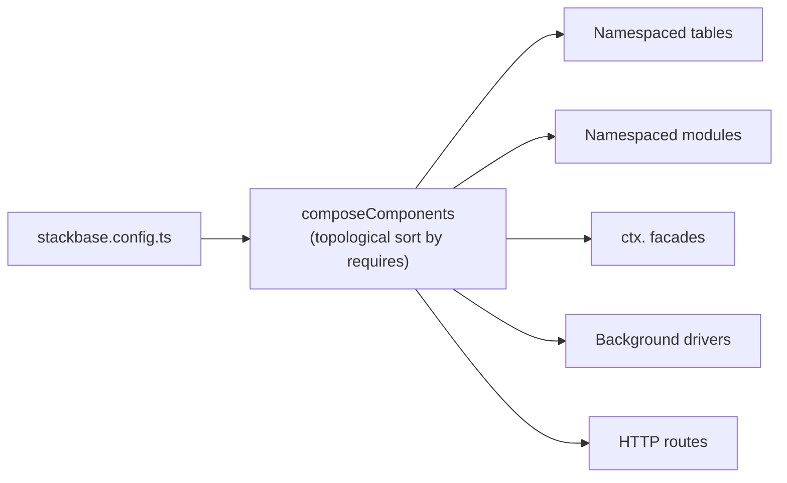

{/* diataxis: explanation */}

The core engine (schema, queries, mutations, actions, reactivity) doesn't know what auth,
notifications, or workflows are, and it doesn't need to. Those capabilities are components:
self-contained packages that plug into the engine through one seam, `ComponentDefinition`. Each one
contributes whatever mix of tables, a `ctx.<name>` facade, background behavior, and HTTP routes it
needs.

A project composes exactly the components it wants in `stackbase.config.ts`. Nothing is installed
for you, and nothing runs that you didn't list.

This page explains the component model itself: how you compose components, what's built in today,
and how composition works (ordering, namespacing, the driver seam). For each capability's own API,
see its page: [Auth](/docs/components/auth), [Authorization](/docs/components/authorization),
[Scheduling](/docs/components/scheduling), [Workflows](/docs/components/workflows),
[Triggers](/docs/components/triggers), [Notifications](/docs/components/notifications).



## Composing components

You declare which components are active in a single `stackbase.config.ts` at your project root,
exporting the result of `defineConfig({ components: [...] })`:

```ts title="stackbase.config.ts"
import { defineConfig } from "@stackbase/component";
import { defineAuth, consoleEmail, googleProvider, githubProvider } from "@stackbase/auth";
import { defineScheduler } from "@stackbase/scheduler";
import { defineWorkflow, workflow } from "@stackbase/workflow";

const auth = defineAuth({
  email: {
    provider: consoleEmail(),
    from: "no-reply@demo.test",
    baseUrl: "http://localhost:5173",
  },
  oauth: {
    providers: {
      google: googleProvider({
        clientId: process.env.GOOGLE_CLIENT_ID ?? "",
        clientSecret: process.env.GOOGLE_CLIENT_SECRET ?? "",
      }),
      github: githubProvider({
        clientId: process.env.GITHUB_CLIENT_ID ?? "",
        clientSecret: process.env.GITHUB_CLIENT_SECRET ?? "",
      }),
    },
    redirectAllowlist: ["http://localhost:5173"],
  },
});

// `workflow.define({...})` builds a workflow definition; it's registered under a key you choose
// (here "workflows:sample") and referenced by that string path from `ctx.workflow.start(...)`.
const sample = workflow.define({
  handler: async (step) => step.runQuery("whoami:get", {}),
});

export default defineConfig({
  components: [
    auth,
    defineScheduler(),
    defineWorkflow({ workflows: { "workflows:sample": sample } }),
  ],
});
```

(Adapted from `examples/auth-demo/stackbase.config.ts`, the reference pattern real projects copy
from. `examples/chat/stackbase.config.ts` shows the smallest possible case: a single
`defineTriggers({ messages: { handler: "audit:_onChange" } })` for a table audit log.)

That's the entire surface. There is no separate CLI command that "installs" a component into a
project. `packages/cli/src/load-config.ts` just imports `stackbase.config.ts` (or
`stackbase.config.js`, whichever exists) and reads `.components` off the default export. If neither
file is present, the project composes zero components (`{ components: [] }`) and behaves as pure
core engine.

Add an entry to the array, and every table, facade, module, boot step, driver, and HTTP route it
contributes appears with it. Remove the entry, and all of it disappears. There's no partial or
leftover state to clean up, because none of it was ever installed anywhere outside this one array.

Besides `components`, `defineConfig` accepts one more optional field: `deploy`, the per-target
configuration `stackbase deploy` reads (see [Deploy & build](/docs/deploy/deploy-and-build)).
`@stackbase/component` also exports an `env(name, fallback?)` helper for referencing environment
variables in that deploy config; it returns `""` rather than throwing when a variable is unset, so
the config still loads without a `.env` file present.

## The six built-in components

| Component | Package | `requires` | Facade | Driver | HTTP routes |
|---|---|---|---|---|---|
| Auth | `@stackbase/auth` | (none) | `ctx.auth` | (none) | `/api/auth/oauth/` (if `oauth` configured) |
| Authorization | `@stackbase/authz` | `auth` | `ctx.authz` | (none) | (none) |
| Scheduling | `@stackbase/scheduler` | (none) | `ctx.scheduler` | dispatch loop | (none) |
| Workflows | `@stackbase/workflow` | `scheduler` | `ctx.workflow` | (via scheduler) | (none) |
| Triggers | `@stackbase/triggers` | (none) | (none) | log-cursor loop | (none) |
| Notifications | `@stackbase/notifications` | (none) | `ctx.notifications` | delivery sweep | `/api/notifications/webhooks/` (if a webhook provider is configured) |

- **[Auth](/docs/components/auth)** (`defineAuth`): password and hardened session authentication.
  Rotation and reuse detection, device management, anonymous sessions with in-place upgrade, email
  verification/reset/magic-link/OTP flows, and OAuth/OIDC social plus third-party-JWT sign-in
  (Google, GitHub, Microsoft, Discord, Facebook, Apple built in). `ctx.auth.getUserId()` resolves the
  caller's session inside the transaction, participating in the read set like any other read, so a
  revoked session reactively invalidates whatever it was gating.
- **[Authorization](/docs/components/authorization)** (`defineAuthz`, `requires: ["auth"]`): RBAC/
  ReBAC row policies declared once and enforced on every read and write to the tables they cover,
  with `ctx.authz` for explicit checks in handler code. It depends on `auth` because policy
  evaluation needs to resolve the caller's identity.
- **[Scheduling](/docs/components/scheduling)** (`defineScheduler`): `ctx.scheduler.runAfter`/
  `runAt`/`cancel` for one-off scheduled jobs, plus `cronJobs()`-declared recurring schedules with
  catch-up policies, retries/backoff, and cascading cancel. Its `driver` is the dispatch loop that
  makes scheduled work fire without a client ever calling in.
- **[Workflows](/docs/components/workflows)** (`defineWorkflow`, `requires: ["scheduler"]`): durable
  multi-step orchestration via deterministic replay over a durable journal.
  `step.runMutation`/`runQuery`/`runAction`/`sleep`/`sleepUntil`, `ctx.workflow.start`/`cancel`, a
  live `workflow:status` query, fan-out/fan-in parallelism, `step.waitForEvent`/
  `ctx.workflow.sendEvent` for durable external signals, and per-step saga/compensation. It has no
  driver of its own. Its steps dispatch through the scheduler's job queue, which is exactly why it
  `requires: ["scheduler"]`.
- **[Triggers](/docs/components/triggers)** (`defineTriggers`): react to committed changes on a table
  via a durable cursor over the MVCC log, not a queue, so a missed change is impossible by
  construction. Delivery is at-least-once and in-order per document, with stable `changeId`s for
  dedup on redelivery. Its `driver` is the cursor loop. It has no facade of its own for the common
  case, since you register a handler function rather than call something through `ctx`.
- **[Notifications](/docs/components/notifications)** (`defineNotifications`): a `Channel × Provider`
  seam (email, SMS, in-app, push) with at-most-once send, a queued-send driver for reliability
  (retries, backoff, dead-letter, stuck-sending reclaim), delivery-provider webhooks (Resend/Twilio)
  mounted via `httpRoutes`, and a reactive in-app inbox (`useNotifications`/`<Inbox>`) on the client.
  `ctx.notifications.send(...)` is the single chokepoint every send routes through, including auth's
  own verification/reset/magic-link emails when both are composed.

## What a component contributes

A component is not a plugin class or a magic import. It's a plain data object, a
`ComponentDefinition`, built by a `define*` factory function (`defineAuth()`, `defineScheduler()`,
and so on). Nothing executes until `composeComponents` reads these objects once, at boot, and wires
them into the running engine.

Every field on the object is a seam. `schema` contributes tables, namespaced under the component's
name so they can never collide with yours (component schemas may not declare `.global()` tables;
that's app-schema-only). `modules` contributes the component's own registered functions, namespaced
the same way. `context` builds the `ctx.<name>` facade your handlers call, and `buildAction` builds
its action-mode twin; a facade that writes its own tables during a mutation sets `contextWrite:
true`, as `@stackbase/scheduler`, `@stackbase/workflow`, and `@stackbase/notifications` do. `boot`
runs one-time startup work, `driver` runs a recurring background loop, `httpRoutes` mounts
reserved-path endpoints, and `policies` attaches row-level authorization rules. A component uses
whichever subset it needs: `@stackbase/authz` composes tables, a facade, policies, and a boot step;
`@stackbase/scheduler` adds a driver, an action-mode facade, and a codegen re-export on top.

For the full field-by-field walkthrough of every seam, with a worked example, see
[Build a custom component](/docs/contributing/extending/custom-component).

## Dependency ordering

When one component `requires` another, composition needs to run the required one first. Its tables
need table numbers before the dependent's tables are allocated, and (more importantly) both land in
the *same* topologically-consistent order across every internal structure that iterates
`components`: table numbering, context provider list, boot steps, drivers. `composeComponents`
handles this with `topoSortByRequires`, a stable Kahn's-algorithm topological sort:

- Every component ends up after every component it `requires`.
- Components with no dependency relationship between them keep their original relative order from
  the `components` array you wrote. The sort only reorders when a `requires` edge forces it.
- Composing a component that `requires` a name not present in the array is a compose-time error:
  `component "workflow" requires "scheduler", which is not enabled`. That's caught before boot, not
  as a confusing runtime failure the first time `ctx.workflow` is touched.
- A `requires` cycle (`A requires B`, `B requires A`) is also a compose-time error: `component
  requires form a cycle (unresolvable order): ...`.

In practice, this means you can list `defineWorkflow({...})` before or after `defineScheduler()` in
your `components` array. `workflow`'s declared `requires: ["scheduler"]` is what actually decides the
order, not array position. The example above happens to list `defineScheduler()` before
`defineWorkflow(...)`, which is the readable convention, but it isn't load-bearing.

## Names are reserved

A component's `name` becomes its table-namespace prefix (`scheduler/jobs`), its module-namespace
prefix (`scheduler:_claim`), and its `ctx[name]` key (`ctx.scheduler`), all three at once. That's
why names are validated strictly. `defineComponent` (called by every `define*` factory) enforces:

- Non-empty, and matching `^[a-zA-Z][a-zA-Z0-9_]*$`. No `/` or `:` in a component name, since those
  characters are the namespace separators themselves.
- Not `"app"` and not starting with `_`. Both are reserved: `"app"` is the implicit name for your own
  bare-namespace code, and `_`-prefixed is the convention for internal, non-user-callable paths.

At compose time, `composeModules` additionally rejects two composed components sharing the same
`name` (`duplicate component name: ...`), and rejects a component name that collides with one of your
app's own top-level module prefixes (`component name "X" collides with an app module`). Both are
compose-time errors, never a silent override of one component's contribution by another's.

## The component set is fixed at boot

<Callout type="warn" title="The component set doesn't hot-swap">

`stackbase deploy` (see [Deploy & build](/docs/deploy/deploy-and-build)) can push a new version of
your app's own functions and an additive schema change onto an already-running `stackbase serve`,
atomically, with no restart. But the *set* of composed components is decided once, at process boot,
from `stackbase.config.ts`, and baked into the running deployment's table numbers, module map,
context providers, and drivers.

Adding `defineNotifications(...)` to your config, or removing `defineTriggers(...)`, requires
restarting the process (`stackbase serve` again, or a redeploy of a `stackbase build` binary).
There's no live "activate this component" admin call.

</Callout>

This mirrors the same boundary `stackbase deploy`'s additive-schema gate draws for your own
`schema.ts`: structure that other running state depends on (table numbers, namespaces, which drivers
are alive) is a boot-time decision. The data and function bodies riding on top of that structure can
still change live.

## The driver seam

A `driver` is how a component does background work that isn't triggered by any single client
request: the scheduler's job-dispatch loop, `@stackbase/triggers`' cursor over the MVCC log,
`@stackbase/notifications`' delivery sweep and retry/backoff loop.

It's a recurring runtime event loop, started once after boot, woken by two things. The commit
fan-out makes it react to writes immediately, not on a poll interval. A wall-clock timer makes
time-based work (a `runAt` schedule, a cron tick) fire even with no writes at all.

```ts title="packages/component/src/define-component.ts"
interface Driver {
  name: string;
  start(ctx: DriverContext): void | Promise<void>;
  stop?(): void | Promise<void>;
}
```

`DriverContext` is the capability set a driver gets to act outside a request:

- **`runFunction(path, args)`**: runs a registered function privileged and namespaced, outside any
  client request. This is how a driver actually dispatches a scheduled job or a trigger handler.
- **`onCommit(cb)`**: taps the commit fan-out across the whole runtime (`{ tables, ranges, commitTs }`
  per commit) and returns an unsubscribe.
- **`setTimer(atMs, cb)` / `clearTimer(handle)`**: arms a wake at an *absolute* wall-clock instant,
  never a relative delay. Absolute-only is deliberate: a delay forces reconciling two clocks that can
  disagree (a process that just resumed from hibernation), and it would silently restart the
  countdown on every cold boot. Every driver's timers are multiplexed down to a single pending wake
  by the runtime, so a host only ever needs to implement one alarm, which is all a Durable Object
  gives you, for example.
- **`now()`**: the driver's clock.
- **`backstopMs(defaultMs)`**: the cadence for a *pure backstop* poll, as opposed to a real next-work
  wake. Calling this is how a driver declares "this particular timer is a fallback, not scheduled
  work." A long-lived host returns `defaultMs` unchanged, while a host where every wake costs a cold
  start can stretch it.
- **`readLog({ afterTs, tables?, limit? })`**: reads committed changes from the MVCC log after a
  timestamp, in ascending order. This is the durable change-feed seam `@stackbase/triggers` is built
  on. `limit` bounds scanned revisions, not matched ones, so a cursor makes progress even over a quiet
  watched table on a busy log. The returned `maxScannedTs` (not the last change's own `ts`) is what a
  cursor should advance to, so scanned-but-unmatched ranges are never rescanned. `limit: 0` peeks the
  current stable bound at O(1) cost with no scan at all: how a brand-new trigger seeds its cursor at
  "now" without paying for a scan just to discover where that is.
- **`functionKind?(path)`** *(optional)*: resolves a registered path's real kind
  (`query`/`mutation`/`action`/`httpAction`), so a driver can validate a config-supplied function path
  at start time (`@stackbase/triggers`' `handler` option) and fail with an instructive "unknown path"
  or "wrong kind" error before ever calling it, rather than crashing on the first commit.

`Driver.start` is called once, after boot. `Driver.stop`, if present, is called on graceful shutdown.
A driver's `name` is informational (surfaced in logs), not a namespace. A component's `name` field is
what does the namespacing work.

## Reserved HTTP routes

`ComponentHttpRoute` (`{ method, pathPrefix, handler }`) lets a component mount a route at the
engine's reserved path space instead of your app's `http.ts` router. `handler` names a bare
`httpAction` in the component's own `modules` (namespaced at compose time to `<component>:<handler>`
for `runtime.runHttpAction` to resolve). Three rules are enforced, both when `defineComponent` builds
the definition and again, defense-in-depth, when `composeComponents` composes it:

1. Must live under a reserved namespace. `pathPrefix` must start with `/api/` or `/_`. Your app's own
   `http.ts` mounts everywhere else, so a component route can never collide with an app route.
2. Must have at least two path segments. `/api/auth/` is fine; `/api/` or `/_` alone is rejected.
   That structurally rules out a component route that could shadow an entire reserved namespace,
   even if the explicit block list below were ever incomplete.
3. Must not collide with a built-in engine prefix, checked in both directions against
   `RESERVED_ENGINE_PREFIXES` (`/api/run`, `/api/health`, `/api/sync`, `/api/storage/`, `/_admin/`,
   `/_fleet/`, `/_dashboard`). A component prefix can't equal, nest under, or be an ancestor of one
   of these.

At compose time, two different components' routes for the same HTTP method are also rejected if
their prefixes overlap at all (equal, or one a prefix of the other). Dispatch is first-match by
declaration order, so an ambiguous overlap is a compose-time error rather than silently
order-dependent behavior.

`@stackbase/auth` mounts `GET`/`POST /api/auth/oauth/` (GET for query-mode OAuth callbacks, POST for
Apple's `form_post` callback: same handler, two methods, no overlap since they're keyed per method).
`@stackbase/notifications` mounts `POST /api/notifications/webhooks/` when a webhook-capable provider
is configured.

## Always-on providers vs. opt-in components

Not everything that adds a `ctx.<name>` facade is a component you compose.

<Callout type="info" title="File storage is always on, not a component">

`ctx.storage` is wired directly into every project's boot core. `packages/cli/src/boot.ts` splices
`storageContextProvider(...)` into the runtime's context providers ahead of whatever your
`stackbase.config.ts` composes. Every deployment gets
`ctx.storage.generateUploadUrl`/`getUrl`/`getMetadata`/`delete`/`store`/`get`, with no entry in
`stackbase.config.ts` and no way to opt out.

It behaves like a component under the hood (its own reserved `_storage` system table, its own
serve-side HTTP routes, its own background reaper driver), but it is not a `ComponentDefinition`.
There's no `defineStorage()` to add or remove. See
[File storage](/docs/core-concepts/file-storage) for its API.

</Callout>

Everything else described on this page (auth, authz, scheduler, workflow, triggers, notifications) is
opt-in. Each is composed by name in `stackbase.config.ts`, absent from a deployment that doesn't list
it, with zero tables, zero facades, and zero background drivers running for a capability you never
composed.

## Where to go next

- [Auth](/docs/components/auth): sessions, email flows, OAuth/JWT, MFA, passkeys.
- [Authorization](/docs/components/authorization): RBAC, ReBAC, row policies.
- [Scheduling](/docs/components/scheduling): `runAfter`/`runAt`/cron jobs.
- [Workflows](/docs/components/workflows): durable multi-step orchestration with saga compensation.
- [Triggers](/docs/components/triggers): react to committed table changes.
- [Notifications](/docs/components/notifications): email/SMS/in-app/push, the reactive inbox.
- [Build a custom component](/docs/contributing/extending/custom-component): every
  `ComponentDefinition` seam, field by field, with a worked example.
- [Deploy & build](/docs/deploy/deploy-and-build): what hot-swaps live (functions, additive schema)
  versus what needs a restart (the composed component set).
