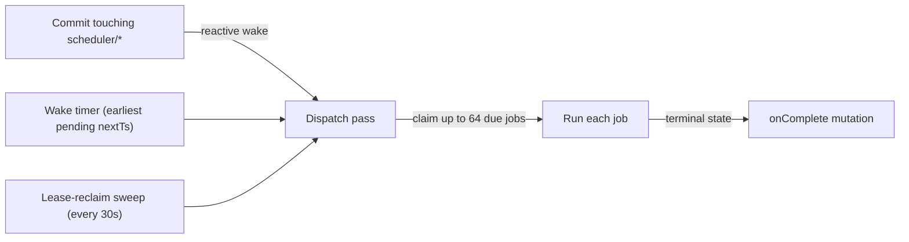

{/* diataxis: explanation */}

Think of `@stackbase/scheduler` as cron built into your database, not bolted on beside it. A
scheduled job is a row in a `jobs` table. Running it later, once, at an exact time, or on a
recurring cadence, works the same as any other write in stackbase: durably, with nothing polling in
the background.

A background driver dispatches the work. It wakes reactively on every commit, plus a wall-clock
timer armed to the earliest pending job, so nothing is lost to a crash between claiming a job and
finishing it.

It's the foundation two other components build on. [`@stackbase/workflow`](/docs/components/workflows)
dispatches every step through the scheduler's own job queue, and both `@stackbase/triggers` and
`@stackbase/notifications` reuse the same recurring-driver seam for their own background loops.

## Enabling it

```ts title="stackbase.config.ts"
import { defineConfig } from "@stackbase/component";
import { defineScheduler } from "@stackbase/scheduler";

export default defineConfig({ components: [defineScheduler()] });
```

`defineScheduler()` takes no required configuration, and it declares no dependency on any other
component. It's the base layer. Once composed, `ctx.scheduler` is available in every mutation, and
in every action too, via a delegating action-mode facade, so a function scheduling work is portable
between the two. More on that in [Scheduling from an action](#scheduling-from-an-action).

Composing it adds three namespaced tables to your deployment: `scheduler/jobs`, `scheduler/job_args`,
and `scheduler/crons`. You can browse them like any other table in the
[dashboard](/docs/deploy/local-dev)'s data browser.

`jobs` and `job_args` are split on purpose. `jobs` is the small, hot row the driver scans every pass
(id, state, `nextTs`, attempt count). `job_args` holds the arguments and `context` payload, which can
be large, so scanning for due work never has to page through it.

## Scheduling work

```ts
export const notifyLater = mutation({
  handler: async (ctx, { userId }) => {
    const jobId = await ctx.scheduler.runAfter(60_000, "reminders:_send", { userId }); // in 60s
    // or: await ctx.scheduler.runAt(new Date("2026-08-01T09:00:00Z"), "reminders:_send", { userId });
    return jobId;
  },
});
```

- `ctx.scheduler.runAfter(delayMs, fnRef, args)` schedules `fnRef` to run `delayMs` milliseconds
  from now. It returns the new job's id (a `string`).
- `ctx.scheduler.runAt(ts, fnRef, args)` schedules it for an absolute time. `ts` is either a
  `number` (epoch milliseconds) or a `Date`.
- `ctx.scheduler.cancel(id)` cancels a still-`pending` job by id. See
  [Canceling and cascading cancel](#canceling-and-cascading-cancel).

Both `runAfter` and `runAt` insert the job row in the calling mutation's own transaction. The
schedule commits, or rolls back, atomically with the rest of your write. In a mutation, delay is
clamped to non-negative (`Math.max(0, delayMs)`), so `runAfter(-100, ...)` just means "as soon as
possible," not an error. (The action-mode facade skips the clamp and computes an absolute time
instead, so a negative delay there resolves to a moment already past, which also dispatches as soon
as possible.)

`fnRef` is a bare function-path string (`"reminders:_send"`) or a codegen'd `api`/`internal`
reference. Both resolve to the same string path. The target can be a mutation or an action: the
scheduler resolves which at enqueue time (via the runtime's function registry) and dispatches
accordingly. This matters because the two have different delivery guarantees, covered in
[Delivery guarantees](#delivery-guarantees).

## The lower-level `enqueue` method

`runAfter`/`runAt` are the common case, and they only accept a delay or a timestamp. The facade also
carries a lower-level `enqueue(fnRef, args, opts)` method for the rest of the options. The code
marks it internal: it exists as the primitive component authors build on (it's how
`@stackbase/workflow` schedules every step), and its option surface is narrower than the type
suggests.

<Callout type="info" title="runAt wins over runAfter">

You can delay an enqueue call either way: an absolute `runAt` timestamp or a relative `runAfter`
delay. If you pass both, `runAt` wins. A negative `runAfter` clamps to "as soon as possible", the
same as the top-level `ctx.scheduler.runAfter` method.

</Callout>

```ts
await ctx.scheduler.enqueue(
  "billing:_charge",
  { invoiceId },
  {
    runAt: Date.now() + 5 * 60_000,
    idempotencyKey: `charge:${invoiceId}`,
    onComplete: "billing:_onChargeResult",
    context: { invoiceId },
    retry: { maxFailures: 8 },
    name: "charge-invoice",
  },
);
```

`EnqueueOpts`:

<TypeTable
  type={{
    runAfter: {
      type: 'number',
      description: 'Relative delay in ms from the enqueueing call. Ignored when runAt is also set.',
    },
    runAt: {
      type: 'number',
      description: 'Absolute epoch-ms fire time. Wins over runAfter. Omitting both means run as soon as possible.',
    },
    idempotencyKey: {
      type: 'string',
      description: 'Idempotent insert-or-noop. If a job with this key already exists, its id is returned unchanged and nothing new is inserted, so no duplicate job even if enqueue is called twice with the same key. This is what makes the cron cadence safe to re-trigger for the same occurrence, see Catch-up policy below.',
    },
    onComplete: {
      type: 'string (a mutation path)',
      description: "A callback fired with the job's terminal outcome. See The onComplete/context round-trip below.",
    },
    context: {
      type: 'JSONValue',
      description: 'An opaque value round-tripped back to the onComplete callback verbatim. The scheduler never inspects it.',
    },
    retry: {
      type: '{ maxFailures: number }',
      description: 'Overrides the default retry ceiling for this job (4 for mutations, 1 for actions). For an action target this is your explicit opt-in that it is safe to re-run on a clean failure.',
    },
    name: {
      type: 'string',
      description: "A human-readable label stored on the row, useful for identifying jobs in the dashboard's data browser. Purely observational: not used for dispatch or dedup.",
    },
  }}
/>

This is also the primitive other components build on. `@stackbase/workflow` schedules every step
through this same `enqueue` path, using `onComplete`/`context` to learn when a step finished and
what it returned.

## Scheduled targets: mutations vs. actions

A job's target can be either kind, and the scheduler resolves which it actually is (via the
runtime's function registry) rather than trusting the caller. The two have different delivery
guarantees, because only mutations are safely retryable:

- **Mutations** are deterministic and transactional, so a retry after a crash just re-runs the same
  write. That's safe by construction. Scheduled mutations get retried on failure (with backoff, see
  [Retries and backoff](#retries-and-backoff)) and on an infra kill (see
  [Delivery guarantees](#delivery-guarantees)).
- **Actions** have arbitrary external side effects (an HTTP call, a charge), so re-running one that
  may have already partially executed risks doing it twice. Scheduled actions are at most once by
  default: whether the process died mid-flight (an infra kill) or the action's own code threw after
  doing external work, the job dead-letters (`state: "failed"`) instead of being re-dispatched.

Retries for an action are opt-in. Passing `retry: { maxFailures }` on the lower-level `enqueue`
path (which is how `@stackbase/workflow` threads a step's declared `maxAttempts` through) is your
statement that the target is safe to re-run, and a cleanly-failed action then retries with backoff
exactly like a mutation. An infra kill still dead-letters even with the opt-in, because an expired
lease can't tell the scheduler whether the side effects already ran. Make any action you opt into
retries for idempotent.

## Job states

Every job row moves through one of five states, tracked as `JobState`:

| State | Meaning |
|---|---|
| `pending` | Waiting for `nextTs` to arrive; eligible for the driver to claim. |
| `inProgress` | Claimed by the driver and currently running, with a lease. |
| `success` | Ran and returned normally. Terminal. |
| `failed` | Dead-lettered: either it exhausted its retries, hit a non-retryable error, or (for an action) crashed mid-flight. Terminal. |
| `canceled` | Canceled before it ran, either directly or via cascade. Terminal. |

## Canceling and cascading cancel

```ts
await ctx.scheduler.cancel(jobId);
```

`cancel(id)`:

1. If the job is still `pending`, it transitions to `canceled` and fires its `onComplete` (if any)
   with `{ kind: "canceled" }`.
2. It cascades: walks the job's descendants via a `by_parent` index (an iterative breadth-first
   walk, not recursion, so a deep chain can't blow the stack) and cancels any of them still
   `pending` too, firing each canceled descendant's own `onComplete`, if set.
3. This walk runs regardless of whether the job itself was cancelable in step 1. Canceling doesn't
   preempt a job already `inProgress`, but its not-yet-dispatched children still shouldn't run just
   because their parent already moved on.

A job scheduled while its parent is already `canceled` is born canceled: it never gets a chance to
run at all. One honest note on scope, though: nothing in production sets `parentId` today. The
schema field, the `by_parent` cascade walk, and the born-canceled check all exist and work, but
`@stackbase/workflow` cancels its step jobs directly via `scheduler.cancel` rather than chaining
them, and a plain `ctx.scheduler.runAfter` call made from inside another job's own handler is a
top-level job, not a child. The mechanism is wired for a future slice that threads a real "current
job id" through the driver; until then, the cascade only reaches jobs whose `parentId` was set
explicitly.

## The `onComplete`/`context` round-trip

```ts
await ctx.scheduler.enqueue("reports:_build", { reportId }, {
  onComplete: "reports:_onBuildComplete",
  context: { reportId, requestedBy: userId },
});

export const _onBuildComplete = mutation({
  handler: async (ctx, { jobId, context, result }) => {
    // result: { kind: "success", value } | { kind: "failed", error } | { kind: "canceled" }
    // context: { reportId, requestedBy } - round-tripped verbatim
  },
});
```

If a job's `onComplete` is set, the scheduler enqueues that mutation (immediately, as soon as the
current commit lands) with `{ jobId, context, result }` on every terminal transition:

- `success`: the job returned normally; `result.value` is its return value.
- `failed`: the job was dead-lettered (retries exhausted, a non-retryable error, or an action that
  crashed mid-flight); `result.error` is the stringified error.
- `canceled`: the job (or an ancestor) was canceled before it ran.

<Callout type="info">

`onComplete` doesn't fire on the back-to-`pending` retry transition. The job isn't actually done yet.

</Callout>

`context` is never interpreted by the scheduler. It's stored alongside the job's args and handed
back byte-for-byte. This pair, a callback plus an opaque payload, is exactly what
[`@stackbase/workflow`](/docs/components/workflows) is built on: every step dispatch is a scheduled
job whose `onComplete` advances the workflow's own journal.

## Recurring jobs: `cronJobs()`

An app's `crons.ts` declares recurring work with a Convex-parity surface:

```ts title="stackbase/crons.ts"
import { cronJobs } from "./_generated/server";

const crons = cronJobs();

crons.interval("cleanup", { minutes: 5 }, internal.maintenance.purge, {});
crons.cron("nightly", "0 3 * * *", internal.reports.build, {}, { tz: "America/New_York" });
crons.daily("digest", { hourUTC: 8, minuteUTC: 0 }, internal.email.digest, {});
crons.hourly("heartbeat", { minuteUTC: 0 }, internal.health.ping, {});
crons.weekly("payout", { dayOfWeek: "friday", hourUTC: 17, minuteUTC: 0 }, internal.billing.payout, {});
crons.monthly("invoice", { day: 1, hourUTC: 6, minuteUTC: 0 }, internal.billing.invoice, {});

export default crons;
```

```ts title="stackbase.config.ts"
import { defineConfig } from "@stackbase/component";
import { defineScheduler } from "@stackbase/scheduler";
import crons from "./stackbase/crons";

export default defineConfig({ components: [defineScheduler({ crons })] });
```

`cronJobs()` itself just collects entries in memory. Nothing is scheduled until it's passed to
`defineScheduler({ crons })`, whose boot step reconciles the registry into the `crons` table
(matched by `name`). That reconciliation is idempotent and diff-aware: adding, removing, or editing
a cron between restarts converges to the new schedule on the next boot without double-firing, and
an unchanged registry restarting doesn't restart the cadence's phase.

The six registration methods:

<TypeTable
  type={{
    interval: {
      type: '(name, period, fnRef, args, opts?)',
      description: 'period: { seconds?, minutes?, hours? }. Plain arithmetic, fires every period (summed to milliseconds) after the last fire. Must resolve to a positive duration.',
    },
    cron: {
      type: '(name, expr, fnRef, args, opts?)',
      description: 'expr: a cron expression string, parsed via cron-parser. Accepts an optional IANA tz in opts (default "UTC").',
    },
    daily: {
      type: '(name, at, fnRef, args, opts?)',
      description: 'at: { hourUTC, minuteUTC }. A convenience wrapper over .cron(), always UTC-anchored.',
    },
    hourly: {
      type: '(name, at, fnRef, args, opts?)',
      description: 'at: { minuteUTC }. Same convenience wrapper as daily, UTC-anchored.',
    },
    weekly: {
      type: '(name, at, fnRef, args, opts?)',
      description: 'at: { dayOfWeek, hourUTC, minuteUTC }. dayOfWeek is a name ("sunday" through "saturday"), not a number.',
    },
    monthly: {
      type: '(name, at, fnRef, args, opts?)',
      description: 'at: { day, hourUTC, minuteUTC }. day is the day of month.',
    },
  }}
/>

`.cron()`'s `opts` is `{ tz?: string; catchUp?: CatchUpPolicy }`. The four UTC-anchored convenience
methods (`.daily`/`.hourly`/`.weekly`/`.monthly`) only accept `{ catchUp? }`. They don't take a
`tz`, since it'd be ambiguous which of their named fields it applies to: their hour/minute/day
fields are UTC by construction. A cron `name` must be unique within one `crons.ts`: registering the
same name twice throws at registration time.

### Clock-anchored, not `now()`-anchored

Every fire is computed from the cron's own last-fired timestamp, never from whatever instant the
driver happens to run at. A late dispatch (a busy driver, a slow prior tick) never shifts the phase
of later occurrences. A `"0 3 * * *"` cron that actually fires at 03:04 one day still computes its
next occurrence as the following day's 03:00, not 03:04 plus the interval. This is why restarting a
deployment with an unchanged schedule never double-fires or drifts.

### Catch-up policy

If a deployment is down when one or more occurrences would have fired, `catchUp` (per-cron, default
`"skip"`) decides what happens to the backlog on restart:

| Policy | Behavior |
|---|---|
| `"skip"` (default) | Discard the missed backlog entirely; resume on the normal cadence. |
| `"fireOnce"` | Fire exactly one job, for the single most recent missed occurrence. |
| `"fireAll"` | Fire one job per missed occurrence, oldest first, hard-capped at 1000 (`CATCHUP_CAP`) per tick. Anything beyond the cap is discarded and logged, never deferred to a later tick. |

Every policy re-anchors the cadence past the entire true backlog on the same tick, regardless of how
much of it was actually fired, so a cron's future phase never drifts. Only the discarded or skipped
occurrences are lost for good. Each fired occurrence is enqueued with
`idempotencyKey: "<cronName>:<fireTs>"`, so even if the same occurrence were ever computed twice, it
collapses into one work job rather than running twice.

For `"fireAll"` on an interval spec, the occurrence count is computed in O(1) arithmetic, never by
stepping through the backlog one at a time, so even a fast interval down for months materializes its
capped backlog cheaply. For a cron-expression spec, `"skip"` and `"fireOnce"` are each answered by a
bounded handful of `cron-parser` calls (at most four), regardless of backlog length. Only
`"fireAll"`'s materialization loop actually steps through occurrences, and that loop is what the
1000 cap bounds.

## Retries and backoff

A failed job is retried with jittered exponential backoff, up to `retry.maxFailures`, then
dead-lettered to `state: "failed"`. The default ceiling is 4 for mutations and 1 for actions, so a
cleanly-failed action dead-letters on its first failure unless you opt into retries explicitly (see
[Scheduled targets](#scheduled-targets-mutations-vs-actions)). A non-retryable, deterministic error
(for example a schema-violating write) skips straight to dead-lettering instead of burning through
every remaining attempt.

The jitter's randomness comes from the mutation's own seeded PRNG (`ctx.random`), not raw
`Math.random()`. That's what makes a retry's delay itself replay-deterministic under the engine's
OCC-conflict replay model, and what makes tests computable rather than flaky.

<Accordions type="single">

<Accordion title="The backoff formula and schedule">

The formula (`computeBackoff`):

```
raw = initialBackoffMs * base ** (attempts + 1)
delay = raw * (0.5 to 1.0 jitter)
```

with defaults `initialBackoffMs: 250`, `base: 2` (`DEFAULT_BACKOFF_OPTIONS`). `attempts` is the
failure count after this failure is recorded, so with the defaults:

| Failure # (`attempts`) | Raw backoff | Jittered range |
|---|---|---|
| 1 | 1,000ms | 500ms to 1,000ms |
| 2 | 2,000ms | 1,000ms to 2,000ms |
| 3 | 4,000ms | 2,000ms to 4,000ms |
| 4 | n/a | dead-lettered (`attempts >= maxFailures`), no further retry |

</Accordion>

</Accordions>

## Delivery guarantees

Normal (non-crash) failures behave exactly as described above for both kinds. The distinction
between mutations and actions matters specifically for infra kills: the process dies while a job is
`inProgress`, between being claimed and finishing.

- A claim holds a lease (`LEASE_MS`, 30 seconds). A background sweep (see [The driver](#the-driver)
  below) reclaims any job still `inProgress` past its lease deadline.
- **Mutation** jobs are reclaimed back to `pending` with `nextTs: now()` (immediate, no backoff,
  since an infra kill isn't the job's own fault) and their attempt count incremented. Because a
  mutation is deterministic and transactional, replaying it is safe. The reclaim spends the same
  `maxFailures` budget the normal failure path does, so a mutation that reliably crashes the whole
  process (rather than throwing, which the normal path would catch) dead-letters once the budget is
  spent instead of being re-dispatched forever.
- **Action** jobs are reclaimed straight to `state: "failed"` instead, even if they opted into
  retries. An expired lease means there's no way to know whether the action's side effects already
  ran, so retrying could double-run them. `onComplete`, if set, fires with `{ kind: "failed" }`, so
  a caller relying on the callback (like a workflow step) still observes the terminal outcome
  rather than hanging forever.

Put another way: scheduled mutations are effectively at-least-once at the granularity of the whole
job (bounded by `maxFailures`), since a crash-recovered retry always eventually lands the same
deterministic write. Scheduled actions are at most once unless you explicitly opt into retries, and
at most once for the crash case no matter what.

## The driver

The scheduler's dispatch loop (`schedulerDriver`) has exactly one periodic timer. Everything else is
event-driven:



- **Reactive wake**: subscribes to the runtime's commit fan-out (`DriverContext.onCommit`) and
  re-runs its dispatch pass whenever a commit touches any `scheduler/*` table (an enqueue, cancel,
  or completion). A freshly-enqueued due job is picked up with effectively zero latency: no polling
  interval to wait out.
- **Wake timer**: after every pass, re-arms a single wall-clock timer to the earliest still-pending
  job's `nextTs`, so a job scheduled for the future still fires exactly when its time arrives,
  without scanning in between.
- **Lease-reclaim sweep**: a genuinely periodic timer (`SWEEP_MS`, 30 seconds by default) that's the
  only polling in the whole driver, and exists purely as the infra-kill backstop described above.
  The driver declares it as a backstop (via the driver seam's `backstopMs`), so a host where every
  wake costs a cold start can stretch the cadence.

Each dispatch pass pulls up to `BATCH_CAP` (64) due jobs at a time via a snapshot-read query, then
claims and runs each one. Claiming is the authoritative double-run guard: a claim only succeeds if
the job is still observed exactly `pending` at claim time, and the single-writer transactor
serializes concurrent claims, so even if two wake sources somehow raced, at most one ever
successfully claims a given job. A job that throws is caught per-job, never allowed to escape the
loop and wedge the whole batch. A wake that lands mid-pass (say, an app mutation enqueuing a due-now
job between two awaits) is coalesced into one more pass before the loop exits, rather than silently
stranding the new job until some unrelated future wake.

## Scheduling from an action

`ctx.scheduler` works the same way from an action as from a mutation: `runAfter`, `runAt`, and
`cancel`, with identical signatures. Code that schedules work doesn't need to know which kind of
function it's running in.

The mechanism differs because an action has no `ctx.db`. Instead of writing a `jobs` row directly,
each method delegates to an internal mutation (`scheduler:_enqueue` / `scheduler:_cancel`) via
`ctx.runMutation`, which runs the identical enqueue/cancel logic inside its own fresh top-level
transaction. The action-mode facade doesn't expose the general `enqueue(fnRef, args, opts)` method,
only `runAfter`/`runAt`/`cancel`, so `idempotencyKey`/`onComplete`/`context` scheduling from inside
an action means calling a mutation that does the `enqueue` call instead.

## Cloudflare Containers: scheduled functions do not fire

<Callout type="warn" title="Scheduled functions do not fire on Cloudflare Containers">

If you're deploying to [Cloudflare](/docs/deploy/cloudflare) via the Containers path, scheduled
functions and crons do not fire. The container stops shortly after its last request, and nothing
wakes it back up at an arbitrary future timestamp. A cron set for 03:00 only actually runs if
traffic happens to arrive around 03:00.

The Durable-Object-native Cloudflare host doesn't have this gap. The DO's own alarm wakes scheduled
work through idle and hibernation, so `ctx.scheduler`/`cronJobs()` behave the same as on any other
deployment target. If your app depends on this component, prefer the DO-native path, or a deployment
target that keeps a process running continuously ([self-hosting](/docs/deploy/self-hosting), the
[standalone binary](/docs/deploy/deploy-and-build)).

</Callout>

## Related

- [Workflows](/docs/components/workflows): durable multi-step orchestration built on this same job
  dispatch (`defineWorkflow`, `requires: ["scheduler"]`).
- [Triggers](/docs/components/triggers) and [Notifications](/docs/components/notifications): two
  other components with their own recurring drivers on the same seam.
- [Components overview](/docs/components/overview): what a component can contribute in general, and
  how composition works.
