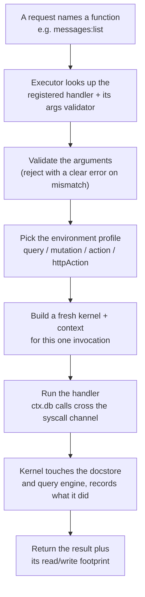
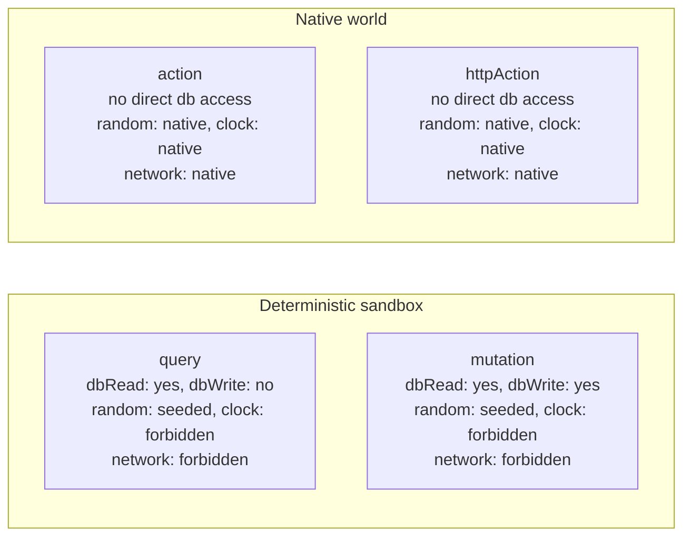

{/* diataxis: explanation */}

## The one-sentence version

A **UDF** ("user-defined function") is the query, mutation, action, or `httpAction` you write in TypeScript, the code that lives in your `convex/` (or `stackbase/`) folder. The executor is the pipeline that takes a request naming one of those functions and turns it into a running handler that reaches the database only through a narrow, controlled doorway, then hands back a result plus a record of exactly what it read and wrote.

Everything on this page traces that pipeline. If you're new to the codebase, the package to have open while you read is `packages/executor` (`src/executor.ts`, `src/kernel.ts`, `src/guest.ts`, `src/profile.ts`).

## The path from a request to a result

Think of the executor as a small, disciplined pipeline. Every call, whether it arrives over the client WebSocket, an HTTP request, or one function calling another, goes through the same steps:



The important step is E: a fresh, single-use kernel per call. Nothing about function B's invocation is visible to function A's, even if they run back-to-back. That isolation, plus the fact that the handler never gets a direct reference to the database (only a narrow messaging channel), is what the rest of this page explains.

This whole pipeline lives behind one method: `InlineUdfExecutor.run(fn, args, options)` (see `packages/executor/src/executor.ts`). "Inline" means the handler runs as plain JavaScript in the same process as the engine today. There's more on what that does and doesn't buy you further down.

## Four profiles, one small policy table

Every function is one of four types, and the executor treats the type as a **capability profile**, not just a label. The profile says what the function is and isn't allowed to touch:



The exact same information as a table, straight from `packages/executor/src/profile.ts`:

| | `dbRead` | `dbWrite` | `random` | `clock` | `network` |
|---|---|---|---|---|---|
| **query** | yes | no | seeded | forbidden | forbidden |
| **mutation** | yes | yes | seeded | forbidden | forbidden |
| **action** | no (only via `runQuery`/`runMutation`) | no | native | native | native |
| **httpAction** | no (only via `runQuery`/`runMutation`) | no | native | native | native |

This one table is the single place that answers "can a query call `fetch`?" (no) or "can a mutation write to the database?" (yes, but only inside a transaction). Four frozen profile objects, `QUERY_PROFILE`, `MUTATION_PROFILE`, `ACTION_PROFILE`, `HTTP_ACTION_PROFILE`, are the literal source of truth. `profileFor(type)` picks one per invocation.

**Why the split exists.** Queries and mutations must be *deterministic*: re-runnable, producing the same answer every time. The engine relies on that. A mutation retries automatically on a write conflict (see [Transactions & consistency](/docs/contributing/architecture/transactions)), and a subscribed query is silently re-run whenever a write touches something it read (see [Reactivity](/docs/contributing/architecture/reactivity)). If those functions could call `fetch()` or read the real clock, two runs could produce two different answers, and both mechanisms would break.

Actions and `httpAction`s don't need that guarantee. They're for side effects, like sending an email or calling a webhook, so they get the real world instead: real randomness, real time, real network, but no direct database access. An action that needs data calls `ctx.runQuery`/`ctx.runMutation`, each its own fresh, independent invocation of this whole pipeline.

## Determinism is the host's job

Rather than trust a function's code to *avoid* randomness and the clock, the executor gives deterministic functions their own versions of those things:

- `ctx.random()` returns a number from a seeded pseudo-random generator (a `mulberry32` PRNG, see `packages/executor/src/seeded-random.ts`), seeded per invocation. Re-run the same call with the same seed and you get the exact same sequence of "random" numbers.
- `ctx.now()` returns a wall-clock timestamp captured once, at the start of the invocation, and held fixed for the rest of the run (including across a mutation's retry attempts).

This is why a query or mutation handler should call `ctx.random()`/`ctx.now()` rather than the global `Math.random()`/`Date.now()`. The seeded versions are what makes replay and reactive re-execution safe.

<Callout type="warn" title="Isolate-ready, not isolate-isolated">

It would be easy to assume "forbidden" in the table above means the platform actively blocks a query from calling the real `Math.random()`, `Date.now()`, or `fetch()`. Today, it doesn't. The shipped `InlineUdfExecutor` runs a function's handler as ordinary JavaScript in the engine's own process, and nothing rebinds or removes the global `Math`, `Date`, or `fetch` objects.

Determinism today comes from convention plus the seeded helpers, not from hard sandboxing. `ctx.random()`/`ctx.now()` are seeded and safe to use, but a handler that reaches for the raw globals directly can still do so.

The syscall boundary described below is deliberately built so that a future V8-isolate executor (each invocation gets its own JavaScript globals, with no ambient access to the host's `Math`/`Date`/`fetch`) can be dropped in behind the same interface without changing how user code is written. That's the "isolate-ready" part. It just hasn't been built yet, so don't describe the current engine as sandboxing untrusted code from real non-determinism.

</Callout>

## The syscall boundary: how `ctx.db` actually reaches the database

This is the core isolation idea, and it's simpler than it sounds. The function's handler never holds a live reference to the database, the transaction, or the query engine. Every time it calls something like `ctx.db.get(id)` or `ctx.db.insert(table, value)`, that call is serialized into a plain string message and sent across a narrow channel to a **kernel**: a per-invocation, trusted object that runs in the engine and has the actual access.

```
guest handler                         kernel (trusted host)
─────────────────                     ──────────────────────
ctx.db.insert(table, value)
  │  JSON.stringify(...)
  ▼
channel.call("db.insert", argJson) ──▶ SyscallRouter.dispatch(...)
                                          │  resolves the table, validates the
                                          │  document against its schema,
                                          │  writes into the transaction,
                                          │  records the read/write it made
                                          ▼
                                       returns a JSON string back
```

The two sides of this (`packages/executor/src/guest.ts` for the guest, `packages/executor/src/kernel.ts` for the host) only ever exchange plain strings: `channel.call(op, argJson): Promise<string>`. Nothing but JSON crosses the line. That's a deliberate design choice. Because the boundary is "a string goes in, a string comes back," it doesn't matter whether the guest is plain JS in the same process (as it is today) or, eventually, code running inside a fully separate V8 isolate. The contract is identical either way.

**What actually crosses this boundary today.** The router (`createKernelRouter()`) registers a small, concrete set of operations:

| Op | What it does |
|---|---|
| `db.get` | Fetch one document by id |
| `db.insert` | Insert a new document (validated against the table's schema) |
| `db.replace` | Replace an existing document (validated against the schema) |
| `db.delete` | Delete a document |
| `db.query` | Run an index-range scan and collect the matching documents (backs `ctx.db.query(...).collect()`) |
| `db.paginate` | Same scan, but one page at a time with a cursor (backs `ctx.db.query(...).paginate()`) |
| `console.log` | Buffer a log line so it can be returned with the result |

Every one of these is guarded on the way in:

- A write is rejected outright if the current profile's `dbWrite` capability is `false`, so a query handler that somehow tries to insert a document gets a clear error, not a silent no-op.
- A read or write outside the calling function's own table namespace is rejected.
- Where composed, row-level read/write policies from the authorization component are checked before data leaves the kernel.

**Why this doubles as the reactivity ledger.** As the kernel services each `db.*` call, it records exactly which index ranges were read and which were written into the current transaction. That ledger is not an afterthought. It's the mechanism that makes the rest of the reactive engine work: the accumulated read ranges become the query's subscription footprint (what has to change before this query is re-run, see [Reactivity](/docs/contributing/architecture/reactivity)), and the write ranges become what a mutation's optimistic-concurrency check validates against on commit (see [Transactions & consistency](/docs/contributing/architecture/transactions)). Because the kernel, not the guest, is the one keeping this ledger, a function's code can't under-report what it touched even if it tried.

Scheduling a job, calling another function, or reaching a composed component's own facade (like `ctx.scheduler` or `ctx.auth`) doesn't go through this same `db.*` op table as a new, dedicated op. They're built as ordinary JavaScript closures the executor constructs fresh for each invocation (more in the next section). But they follow the same underlying rule: the handler is only ever handed narrow, single-purpose functions, never a live handle to engine internals.

Most of them, in fact, still come back around to the same `db.*` ops underneath. `ctx.scheduler.runAfter`/`runAt`/`cancel` (`components/scheduler/src/facade.ts`) is the clearest example. There's no `scheduler.enqueue` syscall: a mutation's `ctx.scheduler.runAfter(...)` call just runs `db.insert` on a `jobs` row (plus a `job_args` row) through the exact same `GuestDatabaseWriter` the handler's own `ctx.db` uses, and `cancel(id)` is a `db.get` followed by a `db.replace`.

That's why scheduling doesn't need its own syscall. Enqueuing or canceling a job is nothing more than writing a row, so it commits (or rolls back) with the rest of the calling mutation's transaction and fans out reactively like any other write the moment it commits. There's no separate job system underneath, just rows the kernel already knows how to track.

## Validation: catching mistakes before they run

Two different validation checks happen around every call, both using the same validator system (`@stackbase/values`, the same `v.string()`/`v.object()`/etc. helpers app code uses in `schema.ts`):

1. **Arguments, on the way in.** A function declared with an `args` validator (`query({ args: { ... }, handler })`) has that validator checked against the actual call arguments *before* the handler ever runs. A mismatch throws an `ArgumentValidationError` whose message names the offending field and why it failed. `httpAction`s skip this step: their input is a raw `Request`, not structured args.
2. **Documents, on write.** `ctx.db.insert` and `ctx.db.replace` validate the value being written against the target table's schema (if the table declares one in `schema.ts`). A mismatch throws a `DocumentValidationError`, again naming the field.

A function can also declare a `returns` validator. Today that's used purely for typing: it flows into codegen so the generated, typed client `api` object knows what a call returns. The actual return value isn't checked against it at runtime yet. Don't describe return validation as enforced; only argument and document validation are.

## How `ctx` gets built for each function type

The object a handler receives as its first argument (conventionally called `ctx`) isn't one fixed shape. The executor assembles a different one depending on the function type, right before calling the handler:

- **Query.** `ctx.db` is a read-only `GuestDatabaseReader` (`get`, `query(...).collect()`/`.paginate()`), plus `ctx.random()`, `ctx.now()`, and a read-only facade for each composed component (`ctx.auth`, `ctx.scheduler`, and so on, whatever the deployment has composed via `stackbase.config.ts`).
- **Mutation.** Same as a query, but `ctx.db` is a `GuestDatabaseWriter` (adds `insert`, `replace`, `delete`), and any composed component that opted in to writing gets a writable facade too. For example, the scheduler needs to write a job row as part of the calling mutation's own transaction, so its writes roll back together with everything else if the mutation fails.
- **Action / httpAction.** There is **no `ctx.db`**, structurally absent, not just empty, because actions run outside any transaction and have no read/write set to track. Instead `ctx` carries `ctx.runQuery`, `ctx.runMutation`, and `ctx.runAction`, each of which starts a brand-new, independent top-level invocation of this whole pipeline (its own transaction, for a query or mutation).

  Concretely, each of these calls `resolveRef` on the function reference and hands it to a runtime-supplied `invoke(path, args, opts)`, which re-enters the *same* executor pipeline this whole page describes: a fresh kernel, a fresh syscall channel, the profile for whatever that target function actually is. So an action orchestrating three `runMutation` calls is really three completely independent trips across the syscall boundary, not one shared transaction.

  Composed components that support being called from an action expose a matching facade built the same way. For example, `ctx.scheduler.runAfter` from inside an action delegates to `runMutation("scheduler:_enqueue", ...)` rather than writing a `jobs` row directly, since an action has no `db` to write through. See [Actions](/docs/core-concepts/actions) for the app-facing view of this.

Each of these `ctx.<component>` facades is built by the component's own `ContextProvider` (`build` for query/mutation, `buildAction` for actions). See [Building a custom component](/docs/contributing/extending/custom-component) for how a component author writes one. The facade doesn't get a resolved caller identity, just the same ambient bearer token the invocation carried in as `options.identity` (a plain string, or `null`), threaded through as `cctx.identity`/`identity` on whatever `ComponentContext`/`ActionApi` the provider receives.

Resolving it into an actual user is entirely the component's job, done with ordinary reads. `@stackbase/auth`'s `ctx.auth.getUserId()` (`components/auth/src/context.ts`) looks up the session row for that token via a normal `db.get`-backed query inside the calling transaction. So an expired or revoked session is just a row that's missing or stale, and the lookup enters the read set like any other read (a session revocation reactively invalidates every query that called `getUserId()`, the same as any other write intersecting a read range). There's no separate "identity" syscall op and no dedicated read-tracking for it. Identity resolution is ordinary `db.*` traffic that happens to be looking at a sessions table.

## The executor as a swappable seam

Everything above (the profiles, the syscall channel, the validators, the way `ctx` is built) is designed around one contract: give the executor a function, its arguments, and some options, and get back a result plus its footprint. `InlineUdfExecutor` is the only implementation that ships today. It runs the handler as plain JavaScript in the same process as the rest of the engine: the fastest option, and entirely appropriate for a trusted single-tenant deployment, which is what Stackbase is today.

Here's why that matters if you're contributing. Because the boundary the handler talks through is always just strings in, strings out (as described above), nothing about how `ctx.db` is used from inside a handler needs to change if that handler later runs somewhere more isolated, like a real V8 isolate with no ambient access to the host's globals.

That's a documented direction (see the internal design notes this page is drawn from), not something shipped yet. There is no isolate executor in the repository today, only the one inline implementation. If you're contributing to the executor, the discipline to preserve is exactly this: never let a handler reach engine internals except through `ctx.db`/`ctx.<component>`/`ctx.runQuery` and friends, so that discipline keeps paying off if a stricter executor ever replaces the inline one.

## Where to go next

- [Transactions & consistency](/docs/contributing/architecture/transactions): what happens after a mutation's handler returns (the commit, conflict detection, and retry).
- [Reactivity](/docs/contributing/architecture/reactivity): how the read ranges this page describes turn into "this subscribed query needs to re-run."
- [Query engine](/docs/contributing/architecture/query-engine): what actually powers `db.query`/`db.paginate` under the hood.
- [Building a custom component](/docs/contributing/extending/custom-component): how a component supplies its own `ctx.<name>` facade.
- [Queries](/docs/core-concepts/queries), [Mutations](/docs/core-concepts/mutations), [Actions](/docs/core-concepts/actions): the app-developer-facing docs for writing these functions.
