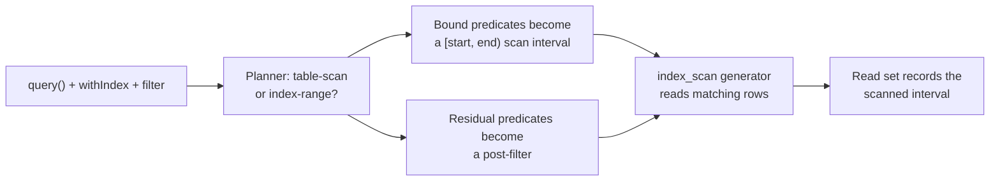
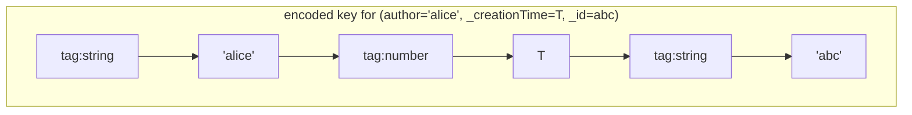
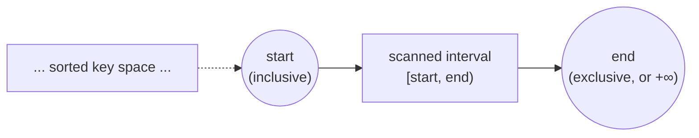
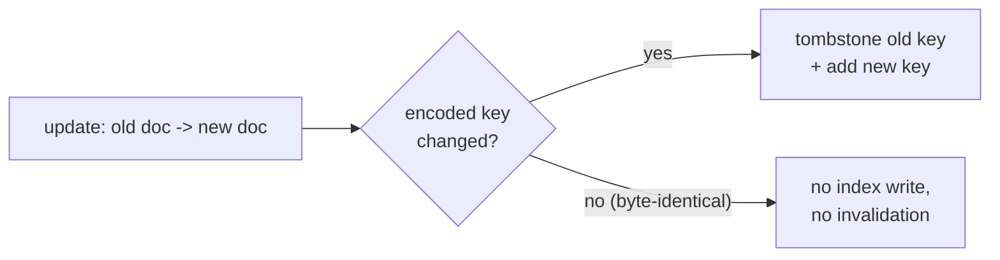

{/* diataxis: explanation */}

## The one-sentence version

You write a declarative query, something like
`db.query("messages").withIndex("by_author", (q) => q.eq("author", "alice")).order("desc").paginate(...)`.
The query engine turns that into two things at once: an actual storage scan,
and the exact key ranges that scan depended on.

That second part is what makes [reactivity](/docs/contributing/architecture/reactivity)
precise. When a later write lands inside a range you depended on, your
subscription re-runs. When it doesn't, it's left alone.

Everything in this page serves that read-set precision. Get it right, and a
chat app with ten rows and one with ten billion rows run the exact same code
path. Neither one re-runs subscriptions it doesn't need to.

This page walks through, in order: how an index encodes rows into sortable
bytes, how a query becomes a scan interval, how the runtime executes that scan
and records what it touched, how writes keep indexes in sync, and how cursors
make pagination stable. If you're looking for the *user-facing* docs on
writing queries, see [Queries](/docs/core-concepts/queries) and
[Reading data](/docs/core-concepts/queries) instead. This page is about how
the engine underneath them works.

## What a query actually goes through

Here's the whole pipeline at a glance, before we go through each stage:



Two things happen in parallel here, and keeping them straight is the key to
understanding this whole component:

- Anything you expressed through `.withIndex(...)` (an equality or a range
  bound on an indexed field) gets compiled into a **scan interval**: a
  contiguous slice of the index the storage layer can jump straight to. Rows
  outside that slice are never even read.
- Anything else (a `.filter(...)` call, an `or`, arithmetic) becomes a
  **post-filter**: a check run on each row *after* it's already been read out
  of the scan interval.

This distinction matters because only the scan interval determines what gets
recorded as "read." A post-filter that rejects 999 out of 1000 rows in the
interval doesn't shrink what's recorded. The engine still touched all 1000
rows to make that decision, so a write to any of them still needs to
invalidate the query. We'll come back to this in
["What actually gets recorded"](#what-actually-gets-recorded).

## The foundation: an order-preserving key encoding

Before we can talk about "scan intervals," we need a concrete idea of what an
index actually *is* on disk. An index is just a sorted list of keys, where
each key is built from one document's field values. The trick that makes
everything else in this page work is that those keys are encoded as bytes in
a way that **preserves the logical sort order**: comparing two keys as raw
bytes gives the same answer as comparing the original values.

This lives in the `@stackbase/index-key-codec` package
(`packages/index-key-codec/src/encode.ts`), and it is the single most
load-bearing piece of code in the query engine. Every other guarantee in this
document (correct scan ranges, stable cursors, correct reactivity, correct
optimistic-concurrency conflict checks) sits on top of this one property
being exactly right.

Here's the idea. Say an index is defined on `(author, _creationTime, _id)`.
We'll explain the trailing `_creationTime, _id` part in the next section.
Each value in that tuple gets a one-byte **type tag** first, so that values of
different types sort in a fixed, predictable order:

```
null  <  false  <  true  <  number  <  bigint  <  string  <  bytes
```

Then the tag is followed by a payload that's *itself* order-preserving:
numbers get a sign-bit flip so negative and positive floats compare
correctly as raw bytes, bigints get a similar big-endian transform, and
strings/bytes are just their raw content (with a small escape so they're
self-delimiting). Concatenate the tagged segments for every field in the
tuple, and you get one composite key:



Because each segment is self-delimiting (strings are terminated, numbers are
fixed-width), comparing two of these composite keys byte-by-byte gives exactly
the same answer as comparing the original tuples field-by-field. That single
fact, **byte order equals value order**, is what lets the storage layer keep
indexes as a plain sorted byte index and still get correct range scans,
correct sort order, and correct pagination for free.

A query that constrains a *prefix* of an index's fields (say, "author equals
alice, and creationTime is greater than some timestamp") becomes one
contiguous `[start, end)` byte range on that number line:



Everything downstream (the planner, the scan, the read set, the cursor) is
just arithmetic on these byte ranges.

<Callout type="warn" title="Never compare decoded values with native operators">

No part of the query engine ever compares two decoded values with
JavaScript's native `<`/`>`. Native comparison disagrees with the codec on
edge cases like `-0` vs `+0`, `NaN`, and bigint-vs-number, so every ordering
decision (sort, cursor position, range membership) goes through the codec's
own `compareKeyBytes`/`compareValues` instead.

</Callout>

## Every index has a hidden tiebreaker

An `IndexSpec` (`packages/query-engine/src/index-manager.ts`) is nothing more
than a table, a name, and an ordered list of field paths: for example,
`{ table: "messages", index: "by_author", fields: ["author"] }`. But when the
engine actually builds a key for a document, it silently appends two more
fields to whatever you declared:

```
your fields  +  _creationTime  +  _id
```

Why append both? Two different documents can easily share the same value for
`author`: lots of messages from "alice." Without a tiebreaker, the engine
couldn't tell them apart inside the index, and couldn't answer "give me the
row right after this one" unambiguously. Appending `_id` (which is unique
per document) guarantees every encoded key is globally unique. Appending
`_creationTime` first gives a stable, meaningful default ordering (newest or
oldest first) before falling back to the id.

This is also exactly what makes pagination cursors stable. See
["Cursors: pagination that survives concurrent writes"](#cursors-pagination-that-survives-concurrent-writes)
below.

## Turning a query into a scan interval

The planner's job (`packages/query-engine/src/plan.ts`, function
`buildIndexInterval`) is to walk the index's field list in order and fold your
`.withIndex(...)` constraints into a single `[start, end)` interval:

1. Consume leading **equality** constraints one field at a time. Each one
   fixes that position in the key, narrowing the range.
2. At the first field that isn't pinned by an equality, allow **one bound in
   each direction**: a lower bound (`gt`/`gte`) and an upper bound
   (`lt`/`lte`) on that same field.
3. Stop. Fields after that aren't used to narrow the scan at all. If your
   query still references them, that part becomes a post-filter instead.

A few worked examples, for an index on `(conversationId, _creationTime, _id)`:

| You wrote | Scan interval |
|---|---|
| `q.eq("conversationId", c1)` | `[key(c1), key(c1)+1]` (everything with that conversation id) |
| `q.eq("conversationId", c1).gt("_creationTime", T)` | starts just after `(c1, T)`, ends at the end of `c1`'s range |
| `q.eq("conversationId", c1).gte("_creationTime", A).lt("_creationTime", B)` | `[key(c1,A), key(c1,B))` (a time window within one conversation) |
| no `.withIndex(...)` at all | the whole table, in creation order (a **table scan**) |

The important asymmetry to notice: `gt`/`lt` are *exclusive*, so the engine
computes a bound that's the very next possible key after (or before) the
given value, using the same `indexKeyRangeEnd`/`indexKeyRangeStart` helpers
that build the prefix range in the first place. `gte`/`lte` are *inclusive*,
so they use the value's own encoded key directly. This is exactly the
`[start, end)` number line pictured above: `start` is always inclusive, `end`
is always exclusive, and `end: null` means "no upper bound, scan to the end
of the index."

There's no full search or vector-index planner shipped today. This page only
covers the ordered index-range/table-scan path that ships. See
[Storage & the MVCC log](/docs/contributing/architecture/storage) for how the
underlying document log itself is structured.

## Executing the plan and recording what was read

`QueryRuntime` (`packages/query-engine/src/query-runtime.ts`) is what actually
runs a plan. Conceptually it does one of two things:

- **`collect(query, ...)`**: scan the whole computed interval and return every
  matching row.
- **`paginate(query, ..., { cursor, pageSize })`**: scan just enough of the
  interval to fill one page, starting from wherever the cursor left off.

Both drive the storage layer's `index_scan` generator, which walks the index
in sorted-key order and yields `[key, document]` pairs one at a time. As each
row comes back, the post-filter (from `filter.ts`) is applied. Anything that
didn't fit into the scan interval gets checked here, against the actual
document.

### What actually gets recorded

This part is easy to get backwards, so it's worth stating plainly: **the read
set records the interval that was scanned, not the rows that survived the
filter.**

Concretely:

- If the scan ran to completion (it reached the end of the interval without
  hitting a page-size or scan limit), the *entire* interval is recorded, up
  to and including "no upper bound" (`end: null`) if the query was unbounded
  above. That's deliberate: a query that says "give me everything" genuinely
  does depend on nothing new ever showing up at the tail, so a later insert
  there must invalidate it.
- If the scan stopped early (a page filled up, or a scan cap kicked in), only
  the span actually consumed is recorded: from the interval's start up to
  (and including) the last key the scan looked at.

So imagine a query with a post-filter that rejects 900 of the 1,000 rows in
its interval, returning only 100. The read set still covers all 1,000 rows'
worth of keyspace. A write that changes row #501 (rejected by the filter,
never returned) could flip it to pass the filter on the next run, and the
query needs to know to re-run and check. Recording only the 100 surviving
rows would silently miss that.

This same "did a write land inside a recorded range" test also does double
duty as the transaction layer's conflict check. See
[Transactions & OCC](/docs/contributing/architecture/transactions) for how a
mutation validates its own reads against what committed in the meantime.

## Keeping indexes in sync on every write

Every document write (insert, update, or delete) has to keep every index on
that table consistent. `computeIndexUpdates`
(`packages/query-engine/src/index-manager.ts`) handles this by comparing the
document's *old* encoded key against its *new* one, per index:

- **Insert** (no old document): add the new key.
- **Delete** (no new document): tombstone the old key.
- **Update**, and the key **changed**: tombstone the old key, add the new one.
- **Update**, and the key is **byte-identical** to before: do nothing at all.



That last case is a deliberate optimization, and it matters more than it
looks. If you update a message's `text` field but the index is only on
`author`, the author-index key hasn't moved, so no index write happens, and
critically, **no subscription watching that index range gets invalidated**
either. Without this check, editing any field on any row would look
indistinguishable from moving it in every index that doesn't even reference
that field. That's a lot of unnecessary write amplification and unnecessary
reactive churn.

## Cursors: pagination that survives concurrent writes

A pagination cursor is just an encoded position in the index: literally the
last key the previous page stopped at. Resuming a scan means asking storage
for "everything strictly after this key" (or before, for descending order).

Because every index key ends in the document's unique `_id`, this position is
always exact, even when many documents share the same leading field values,
like the same `author` or the same `_creationTime` down to the millisecond.
Ties happen. Two consequences fall out of this for free:

- **Pagination is stable under concurrent inserts.** If someone inserts a new
  row while you're scrolling through pages, it lands at a well-defined
  position relative to your cursor, either strictly before or strictly after
  it, so you never see a duplicate or a skipped row because of a race.
- **A page's recorded read range is bounded by the cursor, not the whole
  index.** Page 3 of a paginated feed only depends on the small slice of
  keyspace it actually scanned to produce page 3; new data elsewhere in the
  index doesn't touch it.

This is also the mechanism that lets pagination scale from a hundred-row dev
table to a huge one without any change to app code. See
["Reactivity & sync"](/docs/contributing/architecture/reactivity) for how the
sync tier turns these recorded ranges into precise subscription invalidation,
and [Pagination](/docs/core-concepts/queries) for the developer-facing API.

## Filters and ordering, briefly

Anything that didn't make it into the scan interval (an `.filter(...)` call,
an `or`, arithmetic on a field) is represented as a small expression tree
(`FilterExpr` in `filter.ts`): comparisons, `and`/`or`/`not`, and dotted field
paths like `"author.name"`. It's evaluated per document, after the row comes
back from the scan.

One rule ties this back to everything above: filter comparisons use the same
canonical value comparison the codec's ordering is built on
(`compareValues`, from `@stackbase/values`), never JavaScript's native
operators. That way a sort order, a cursor position, and a filter's `gt`
check can never quietly disagree with each other about which of two values is
"bigger."

## Summary

- The index-key codec turns tuples of values into order-preserving bytes.
  Everything else depends on this being exactly right.
- Every index secretly ends in `(_creationTime, _id)` so every key is unique
  and totally ordered.
- A query's `.withIndex(...)` bounds become one `[start, end)` scan interval;
  everything else becomes a post-filter applied per row.
- The read set records the scanned interval, not the surviving rows. That's
  what makes reactive invalidation both correct and precise.
- Writes keep indexes in sync, skipping the update entirely when a document's
  key in that index didn't actually move.
- Cursors pin an exact `(key, _id)` position, so pagination is gapless and
  stable even while other writes are happening concurrently.
