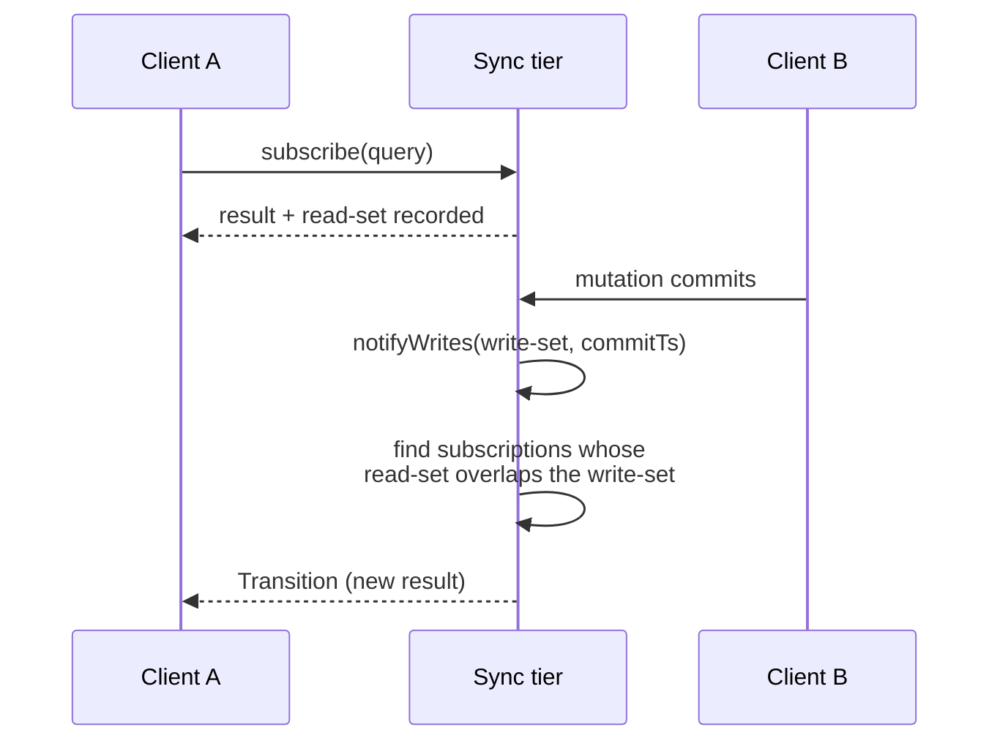
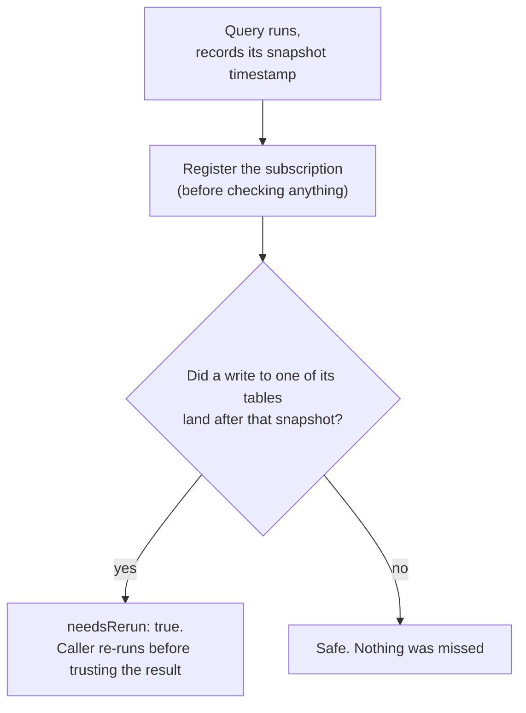
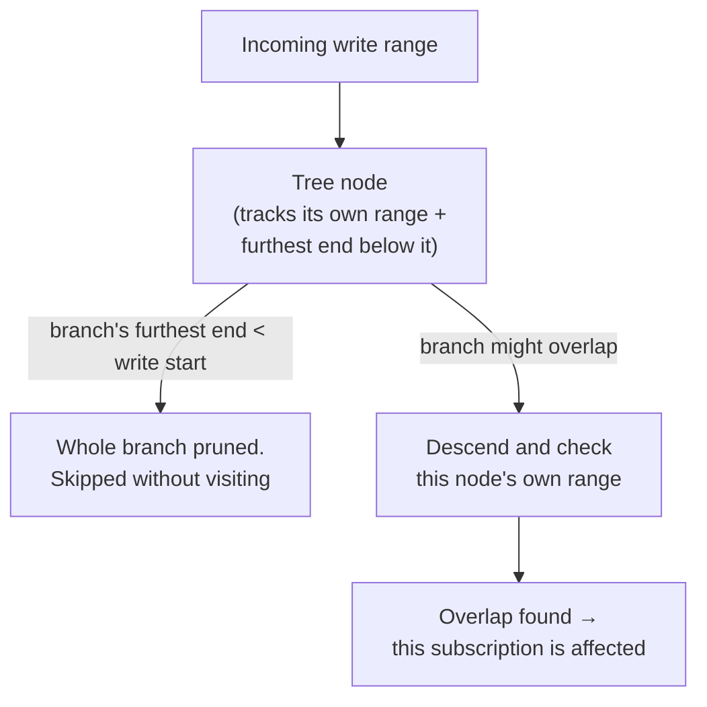
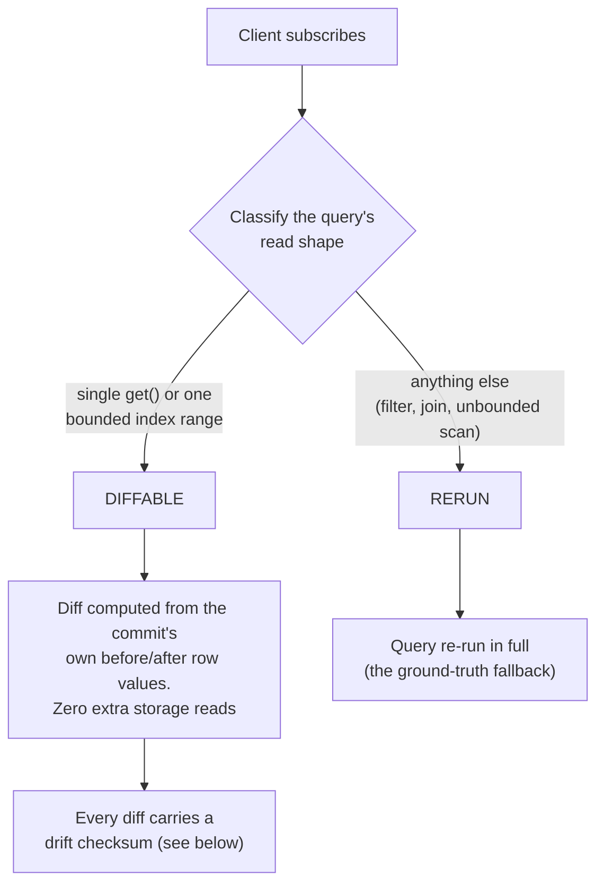
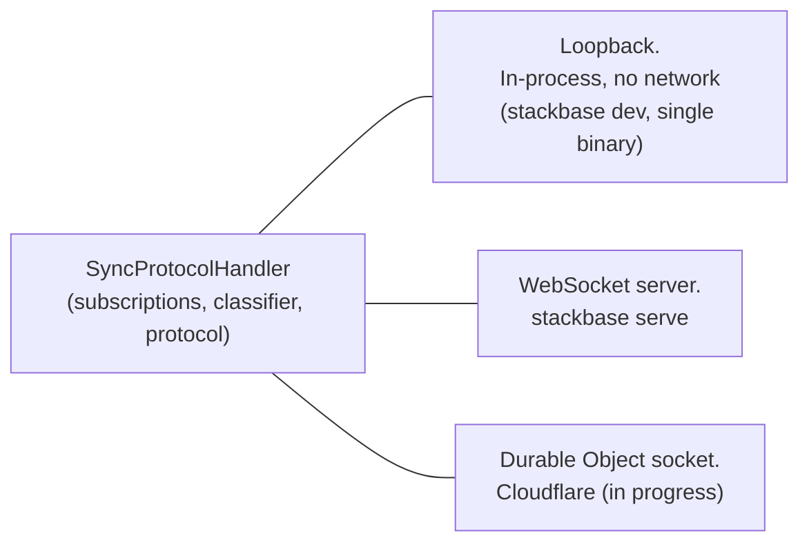

{/* diataxis: explanation */}

## The one-sentence version

A **subscription** is just a query plus a receipt of exactly which data it
touched. When a mutation commits, the sync tier compares what it just wrote
against every subscription's receipt. Anything that overlaps gets re-run and
pushed to the client watching it. Nothing else moves.

That's the whole reactivity model. Everything else on this page (the
content-addressed subscription registry, the interval tree, the row-diffing
fast path, the wire protocol) exists to make that one sentence fast and
correct at scale. The code lives mostly in `packages/sync`.

If you're looking for the user-facing explanation of how to write a live
query, see [Reactivity](/docs/core-concepts/reactivity) instead. This page is
about the machinery underneath it.

## Start here: a subscription is a query plus a read-set

When a client calls a query function, the engine doesn't just run it and hand
back a value. It also records the **read set**: the exact rows and index
ranges the query touched while it ran. (How that recording happens is covered
in [The query engine](/docs/contributing/architecture/query-engine); this
page picks up right after.)

The sync tier holds onto that read set for as long as the client stays
subscribed. Later, when a mutation commits, it produces a **write set**: the
rows and ranges it actually changed. The sync tier's whole job, on every
commit, is:

> Does this write set overlap that read set? If yes, re-run the query and
> push the new result. If no, do nothing.

Client A never polls. Client B's commit is the only thing that triggers any
work, and only for the subscriptions it actually affects. A million idle
subscriptions to unrelated data cost nothing when this write lands.

## The subscription manager: one query, many sockets

If ten browser tabs all run the exact same query with the exact same
arguments and the same signed-in user, re-running it ten times, and
re-checking "does this write affect it" ten times, would be wasteful. So
every query gets a **content-addressed identity**: a hash of
`(function path, arguments, auth subject, component path)`.

Ten identical subscriptions collapse into one shared entry with ten sockets
listening to it. Each client still keeps its own small local `queryId` (its
own bookkeeping handle for "add this" / "remove this"), which the server maps
back to the one shared hash. A re-run on a write happens once, and the result
fans out to every listener from there, not once per socket.

Given a commit, the subscription manager's job is to answer, precisely,
which `(client, query)` pairs need that re-run. That answer, not the
WebSocket plumbing, is the part worth understanding, and it's what the next
few sections are about.

## The race nobody can skip: register-then-check

There's an awkward gap hiding in the sequence above. A query reads its data
at some snapshot in time, but registering its subscription, so it starts
listening for future writes, happens a moment later, once the result comes
back. If a write lands in that narrow gap, it's easy to lose it silently: the
query already ran and missed it, and the subscription wasn't registered yet
to catch it either.

The fix is a small, deliberate handshake: **register the subscription
first**, then check whether a write already beat it there.

<Callout type="info" title="Why register first">

The subscription manager keeps a "latest write timestamp" per table for
exactly this check. Registering before checking is what guarantees a write
that happens *during* the check can never slip through uncounted. Worst
case, the caller just re-runs a query it didn't strictly need to.

</Callout>

## Finding affected subscriptions without scanning everything

Now the harder problem: given a write set, which of potentially thousands of
live subscriptions does it overlap? Comparing the write against every
subscription one by one is correct but doesn't scale. Measured, that linear
scan cost about 0.3ms at 100 subscriptions and grew to about 9ms at 10,000,
even when only one subscription actually matched.

The fix (shipped, this is the "range-precise invalidation" the rest of the
docs refer to) is an **interval tree**: a search structure built for exactly
this question, "which of these stored ranges overlap this incoming range?"
answered in roughly `O(log n + k)` time instead of `O(n)`, where `k` is the
number of actual matches.

Picture each subscription's read range as a horizontal bar on a number line
(the "number line" here is really a table's byte-encoded key space). The
tree is built so that every node knows the furthest-right endpoint anywhere
in the branch below it. When an incoming write range arrives, the search can
skip, or prune, an entire branch the instant it sees that branch's furthest
endpoint doesn't even reach the write's start. No bar in that branch can
possibly overlap, so there's no need to look at any of them individually.

A couple of implementation notes worth knowing if you're reading
`packages/sync/src/subscription-manager.ts`: ranges are bucketed by
**keyspace** first (a write to one table's index can never overlap a read
range in a different table), so each lookup only searches the one tree that
could possibly contain a match. And a subscription that didn't record any
precise range at all (a broad table scan, say) still gets a correct, if
coarser, table-level fallback match. The interval tree is a refinement of
table-level matching, never a replacement that could under-report and
silently miss a write.

## The classifier: reuse the write instead of re-reading it

Finding *which* subscriptions are affected is only half the cost. The other
half is what happens next: by default, an affected query is **re-run from
scratch**. Read the data fresh, recompute the whole result, serialize it,
send it. For a query watching one document, or a page of a hundred rows,
that whole-result re-send is a lot of repeated work to communicate a change
of maybe one row.

Here's the trick: when a mutation commits, the transaction engine already
has each changed row's before-and-after value sitting in memory, from
building the commit in the first place. For a specific, provably safe shape
of subscription, the sync tier can compute exactly what changed in the
*result* directly from those in-hand values. No re-reading storage, no
re-running the query handler at all.

That safe shape is decided once, right when a client subscribes, by looking
at what the query actually read:

- **Diffable**: the query did exactly one of two things: read a single
  document by its id (`db.get(id)`), or scanned one bounded index range
  (a `.collect()` or `.paginate()` over a `withIndex(...)` call). For these,
  the sync tier can look at the changed row and immediately tell whether it
  should be added to the result, removed from it, or updated in place, using
  only the write's own before/after values.
- **Rerun**: anything else. A `.filter()` with arbitrary JS logic, a query
  that reads other documents inside its own handler, an unbounded scan, or a
  sort where the change might cross a "top N" boundary. These fall back to
  the ordinary re-run path, always correct, just not the fast path.

Every query starts life classified into one of these two buckets, and a
Diffable query still has a re-run path available as its safety net (see next
section). This is a pure speed optimization layered on top of a mechanism
that already works.

The pieces of this pipeline live in a handful of small, purpose-built files
in `packages/sync/src`: `classify.ts` does the classification above,
`commit-differ.ts` derives the actual `Change[]` a commit implies for a
diffable subscription straight from its before/after values, and `change.ts`
holds the shared `Change` vocabulary and the one `applyChanges` function used
on both the server and the client so the two sides can't drift on what a diff
means. The interval-tree search itself (from the previous section) lives
alongside the key-range encoding it operates over, in
`index-key-codec/interval-index.ts`.

## The safety net: a checksum on every diff

Computing a diff instead of re-running a query is a place a subtle bug could
quietly produce a *wrong* answer instead of an obviously broken one, the
scariest kind of bug in a reactive system. So every diffed update carries a
small, cheap **drift checksum**: an XOR fold over each row's id and last-write
timestamp in the result, computed the same way independently on the server
and the client.

If the client's checksum (after applying the diff) doesn't match the one the
server sent, something has drifted. The response is never to guess or crash:
it's to fall back to the ground truth, throw away the diffed state for just
that one query, and resync it, fully, from a real re-run. One stale
subscription pays a small extra cost. Nothing else is affected, and no wrong
data is ever shown for longer than a beat.

This is deliberately the same posture as the classifier itself: prove what
you can prove, and always have a working fallback for what you can't.

## Reconnecting without re-downloading everything

A client that goes offline and comes back (a laptop closing its lid, a phone
losing signal) doesn't want to re-download every subscribed query's full
result just to find out most of them didn't change. Each pushed result
already carries a small content **fingerprint**. On reconnect, the client
sends back the last fingerprint it saw for each query it's resubscribing to.
If the server recomputes the same fingerprint, it replies with a tiny
"unchanged" marker instead of the value itself.

In the common case, you were offline for a minute and nothing in your view
changed, this cuts reconnect bandwidth by roughly 99% in the measured
benchmark case, and it's automatic: an older server that doesn't know about
fingerprints simply never receives one echoed back, and falls back to
sending the full result, exactly as it always did.

<Callout type="info">

Skipping the *computation* of an unchanged query entirely, rather than just
skipping the bytes over the wire, is a further optimization that hasn't
shipped yet. See the note at the end of this page.

</Callout>

## The wire protocol: versions, not just messages

Messages between client and server are small, typed JSON packets. A few are
worth knowing by name because you'll see them in logs and tests:

**Client to server:**
- `Connect`: opens or resumes a session.
- `ModifyQuerySet`: adds or removes subscriptions. Critically, this is a
  **diff**, not a full resend: a client with a thousand active subscriptions
  that adds one more sends one small message, not its whole list.
- `Mutation` / `Action`: a write request, or a side-effecting action call.
- `SetAuth`: updates the session's identity.

**Server to client:**
- `Transition`: the actual reactive push. "Here are the query updates that
  resulted from a commit." Carries one or more of `QueryUpdated` (full new
  value), `QueryDiff` (an incremental row diff, from the classifier above),
  `QueryUnchanged` (the fingerprint-matched case above), or `QueryRemoved`.
- `MutationResponse` / `ActionResponse`: the direct reply to a write,
  correlated by a request id.

What makes this more than just convenient is that every
`Transition` is **version-bracketed**: it says "you're at version X, this
moves you to version Y." A client tracks its own current version, and a
`Transition` that doesn't start where the client currently is means a frame
was missed (for example, dropped under backpressure, see below). The fix is
never to patch around a gap: the client just resyncs from scratch. A slow or
flaky connection degrades to an occasional full refresh, never to silently
wrong data.

One more detail worth knowing: a reactive **paginated** query's server-side
cursor position is remembered across re-runs (in an opaque `journal` value
the client stores and echoes back), so a live paginated list doesn't skip or
duplicate rows as the underlying data shifts around it.

A subtlety on who receives the push: the client that *made* the mutation
gets its own `MutationResponse` immediately, and by default it also receives
the resulting `Transition` like everyone else. The two are carefully ordered
so the response always arrives first. That ordering is what lets an
[optimistic update](/docs/client/optimistic-updates) on the client swap its
predicted state for the real one on exactly the right frame, with no flicker
in between.

## Session guardrails: one bad client can't take down the rest

A live connection is state the server has to hold open, and the sync tier
runs a handful of per-session controllers to keep any single client from
becoming everyone else's problem:

- **Heartbeat**: a periodic ping so a dead socket (one whose TCP connection
  silently vanished) gets cleaned up instead of leaking forever.
- **Backpressure**: if a client can't keep up with pushes (a slow phone, a
  bad connection), messages queue up to a bound, and beyond that bound
  they're *dropped* rather than exhausting server memory. This is safe
  precisely because of the version brackets above: a dropped message just
  becomes a detected gap, which the client resyncs from.
- **Rate limiting** and a **subscription cap**: bound how many messages and
  how many live subscriptions one session can have, so one runaway or
  misbehaving client can't monopolize the server.
- A **per-session lock serializing a session's operations**: subscribing,
  unsubscribing, and reacting to a commit all run one at a time, in order,
  for a given session, so a subscribe can't interleave with an in-flight
  notify and see (or miss) a half-applied version bump.

## The transport seam: the same brain, three sockets

Everything above (the subscription manager, the classifier, the protocol)
never talks to a real network socket directly. It talks to a small abstract
interface (`send`, `close`, `readyState`, roughly), and something else
adapts that interface to an actual transport. That's what lets the identical
reactive logic run in more than one place:

- **Loopback** is a same-process, no-network transport: `send` is just a
  function call. This is what powers `stackbase dev` and the single-binary
  build, full reactivity with zero sockets, which is also why local
  development feels instant.
- **A real WebSocket server** is what `stackbase serve` runs for a standalone
  deployment.
- **A Cloudflare Durable Object** socket is the newest of the three, part of
  the ongoing Cloudflare-native hosting work: the same handler, wired into a
  DO's own WebSocket handling instead.

Because the reactive brain only ever sees the abstract interface, none of the
logic above had to change to add that third transport.

## Where the design is still moving

<Callout type="warn" title="Two things worth flagging honestly">

- The classifier and drift-checksum system described above (internally
  called **Differential Log-Tail Reactivity**, or DLR) has already shipped
  in stages: the interval tree, the classifier, and reconnect fingerprinting
  are all live. What hasn't shipped yet is the *compute-saving* half of
  reconnect resume. Today an unchanged query still gets fully re-executed on
  the server before the fingerprint proves nothing changed, so a reconnect
  saves bandwidth but not server-side work. That's the next planned step.
- Durable Object sync hosting (the third transport above) is active,
  in-progress work, not a finished production path the way the loopback and
  WebSocket-server transports are.

</Callout>

## Related pages

- [Reactivity](/docs/core-concepts/reactivity): the user-facing guide to
  writing live queries.
- [The query engine](/docs/contributing/architecture/query-engine): how read
  sets get recorded in the first place.
- [Transactions & consistency](/docs/contributing/architecture/transactions):
  where write sets and commit timestamps come from.
- [Optimistic updates](/docs/client/optimistic-updates) and
  [Offline sync](/docs/client/offline-sync): client-side features built on
  top of the protocol described here.
