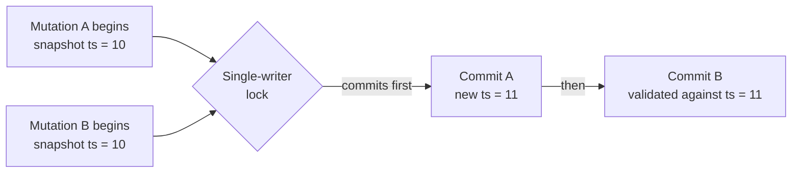
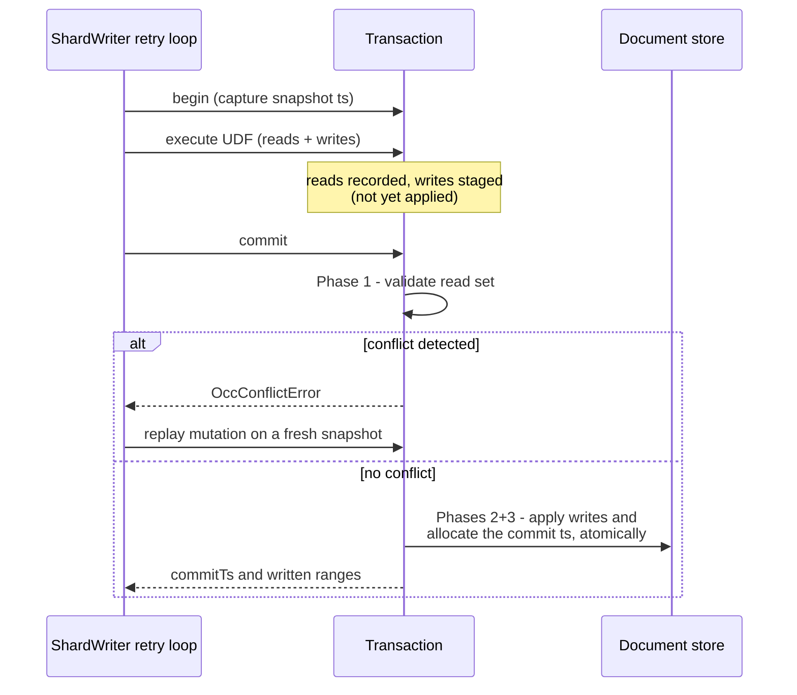
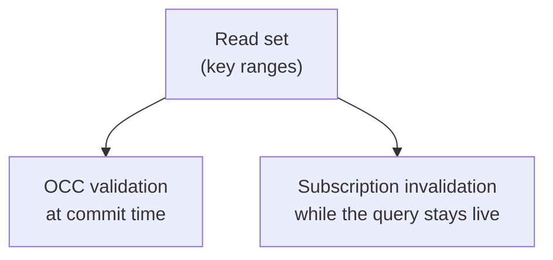
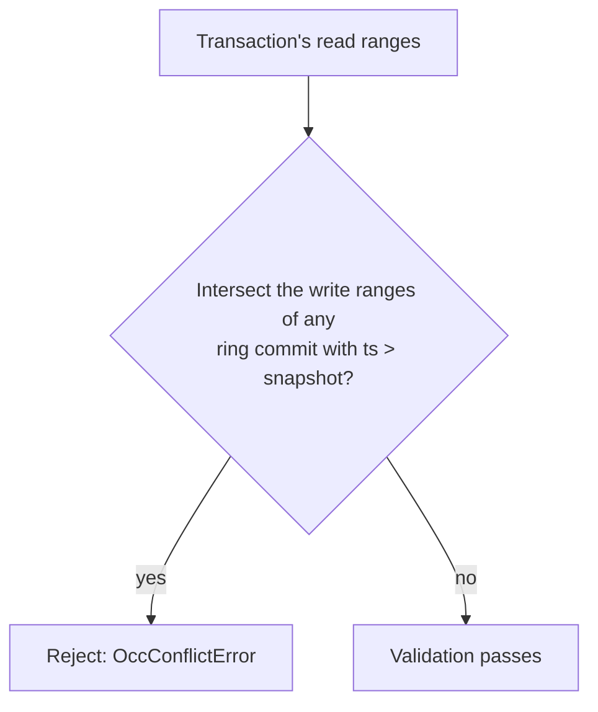

{/* diataxis: explanation */}

Picture a small shop with one register. Any number of customers can wander the aisles and fill their carts at the same time, but only one person checks out at a time. That's the whole trick behind how Stackbase keeps every mutation safe without making every read stand in line.

Every mutation you write runs inside a transaction: a `ctx.db.insert(...)`, a `ctx.db.replace(...)`, all of it. This page explains how that transaction stays safe (no two mutations can silently step on each other) and cheap (no locks while reading, no waiting) at the same time. It also explains how the same bookkeeping that makes this safe gets reused to power live queries.

If you haven't read `/docs/core-concepts/mutations` yet, start there for the developer-facing view. This page is the "how it works under the hood" companion, useful once you're reading engine source, writing a component, or just curious.

## The one trick: only one writer at a time, per shard

Stackbase's engine is organized into **shards**. In the default single-binary setup there's exactly one shard, so for now just think of it as "the database." (Sharding is how Stackbase scales writes horizontally at Tier 2, see `/docs/contributing/architecture/runtimes`. Everything on this page applies per shard either way.)

The class that fans a commit out across multiple shards is `ShardedTransactor` (`packages/transactor/src/sharded-transactor.ts`). It holds N independent `ShardWriter`s behind the same single `Transactor` interface that `SingleWriterTransactor` implements, so callers don't need to know whether they're talking to one shard or many.

Inside one shard, Stackbase makes a deliberate simplifying choice: only one transaction is allowed to commit at a time. A per-shard lock (`AsyncMutex`, in `packages/transactor/src/shard-writer.ts`) makes commits happen one after another, never in parallel.

Alongside that lock sits a monotonic clock: an oracle that only ever hands out increasing numbers, or "timestamps." Every committed transaction gets a timestamp strictly greater than every timestamp committed before it on that shard.

Why does this combination matter? It turns a normally hard problem, "did someone else change the data I depended on?", into a cheap one. With commits serialized and timestamps strictly increasing, a transaction only has to ask one question at commit time: has anything I read changed since I started?

There's no other writer to coordinate a lock with, no deadlock detection, no distributed consensus needed. This technique is called **optimistic concurrency control (OCC)**: assume no conflict, do the work, and check for a conflict only right before committing.



Both `A` and `B` read concurrently, lock-free: reads never wait on anything. Only the brief commit step is serialized, and it's deliberately short: validate, stamp a timestamp, write. Nothing else happens while the lock is held.

## The lifecycle of a mutation

Every transaction goes through the same four steps. Keep this shape in mind: it's the mental model for the rest of this page. The class that implements it is `SingleWriterTransactor` (`packages/transactor/src/single-writer-transactor.ts`), which delegates the actual mechanics to a per-shard `ShardWriter`.



1. **Begin.** The transaction captures a snapshot timestamp: the last timestamp that was fully committed on this shard. Every read this transaction makes is answered "as of" that moment, no matter how long the transaction takes to run.
2. **Execute.** Your mutation's code runs. Reads go to the document store at the snapshot timestamp, but first they check whether this same transaction already wrote that document (more on that below, it's called read-your-own-writes). Every read is recorded. Every write is staged, held in memory, not yet written to the store.
3. **Commit.** A three-phase process, covered in detail in the next section, that either succeeds and applies everything atomically, or fails with a conflict.
4. **Rollback.** If anything goes wrong, or a conflict is detected, the staged writes and recorded reads are simply discarded. Nothing was ever visible to anyone else, so there's nothing to undo.

A transaction that only reads (a `query` function, or a mutation that happens to write nothing) skips straight past the commit machinery. There's nothing to validate or apply, so it never touches the single-writer lock at all.

## Read set and write set: the same shape, two jobs

As a mutation runs, the transaction keeps track of two things:

- The **read set**: every document, index range, or table scan the mutation looked at.
- The **write set**: every document the mutation is about to change.

Both are recorded using the exact same representation: a **key range**. A key range just means "this table (or index), from this byte-encoded key to that byte-encoded key." A single document read is a range that starts and ends at the same key, a "point" range. A `.collect()` over an index is a range spanning many keys. A full table scan is the widest possible range for that table. Keys are byte-encoded so comparing two ranges for overlap is a cheap, ordinary comparison. No per-type logic needed.

That shared representation isn't just a shortcut. It's the core of the whole system, because the same read set gets used for two completely different jobs at two completely different times:



- **At commit time**, the read set (together with the snapshot timestamp it was read at) is what Phase 1 validation checks against: did anything in here change since my snapshot?
- **While a query is subscribed**, that same read set is handed to the sync tier. When a later commit's write set arrives, the sync tier intersects it against every live subscription's read set. Any overlap means this query might now return something different, so it re-runs and pushes the update. See `/docs/contributing/architecture/reactivity` for that half of the story.

One recorded read set, two consumers. Get this representation right and both correctness (OCC) and reactivity fall out of it almost for free.

## The three-phase commit

Commit is where the interesting work happens. It's intentionally short, so the single-writer lock is held for as little time as possible.

**Phase 1: Validate.** Has any commit since this transaction's snapshot written something it read? The read set (as key ranges) is intersected against the write sets of recent commits.

- If anything intersects, the whole transaction is rejected with an `OccConflictError`. Nothing is applied.
- The transaction's own staged writes are excluded from this check. Reading back something you just wrote in the same transaction is expected, not a conflict.

**Phases 2 and 3: Apply and allocate, atomically, inside the store.** If validation passes, every staged document and index update is handed to the document store's `commitWrite` with a placeholder timestamp, and the store allocates the real commit timestamp *inside its own atomicity domain*, stamps every row with it, and lands them all in one atomic operation. Allocating the timestamp any earlier, outside the store, would open a window where a timestamp had been promised but nothing was written yet; doing both in one step means that window simply doesn't exist. (See [Storage & the MVCC log](/docs/contributing/architecture/storage) for the store's side of this.)

Only after that atomic step succeeds does the transaction publish the returned timestamp as the shard's new last-committed clock and return its result: the commit timestamp, plus the write set (the "written ranges") that becomes the input to reactive invalidation.

A transaction that staged no writes at all (a pure read) short-circuits before Phase 1. There's nothing to validate and nothing to apply, so it never takes the lock and never burns a timestamp.

## How a conflict is actually detected

The mechanism is one check, applied uniformly: **a range-set intersection against recent commits**. Each `ShardWriter` keeps an in-memory ring of recent commits, each remembered as `(ts, write ranges)`. Validation walks that ring and asks, for every commit newer than this transaction's snapshot: do its write ranges intersect my validated read ranges? One intersection anywhere is a conflict (`packages/transactor/src/shard-writer.ts`).



Because reads of every shape are recorded as key ranges (the previous section), this one check covers all the cases you'd otherwise need special logic for:

- **Point read of one document.** A point range. A newer commit that wrote that document intersects it.
- **Range scan or table scan.** The scanned interval. A newer commit that changed any row in it intersects, and so does a brand-new "phantom" row inserted into it, since an insert's write range lands inside the scanned interval just like an update's does. A scan that missed a new matching row would silently produce a wrong answer, so phantoms have to be caught, and the range representation catches them for free.
- **Read of absence.** Checking "does this document exist?" and finding nothing still records the range that was probed. A commit that has since created a matching document writes into that range, and conflicts.

In every case, the transaction's own writes are excluded. You never conflict with yourself.

Note what validation does *not* do: it never walks a document's `prev_ts` history chain, and it never re-reads the store at all. The ring is in memory, and pure range arithmetic decides the answer. (Under group commit, the same intersection is also checked against any staged-but-unlanded batches, so a write that hasn't reached the ring yet still can't be missed. The ring is pruned only past the oldest snapshot any active transaction still holds.)

## Deterministic replay: how a conflict gets resolved

<Callout type="info" title="The failed attempt is discarded, not patched">

When Phase 1 throws an `OccConflictError`, nothing from that attempt survives. The retry loop lives right inside `ShardWriter.runInTransaction` (`packages/transactor/src/shard-writer.ts`): it catches the conflict and loops, up to a default ceiling of 8 attempts. There's no outer "function runner" doing the retrying.

</Callout>

On each retry, the writer discards everything from the failed attempt, takes a brand new snapshot, and runs your entire mutation function again from the top: same arguments, fresh reads, fresh writes.

This is safe, and not as wasteful as it sounds, for one reason: mutations are required to be deterministic functions of the database and their arguments. No `Math.random()`, no `Date.now()`, no network calls. Given the same inputs and the same database state, a mutation always produces the same writes. Replaying it on a fresh snapshot after a conflict isn't a guess or a workaround. It's simply re-deriving the correct answer against up-to-date data.

This replay is bounded (a default retry ceiling), so a mutation that keeps colliding under heavy contention eventually surfaces the conflict to the caller instead of retrying forever. It's also exactly why queries and mutations can't touch the clock, randomness, or the network directly. That non-determinism has to live in [actions](/docs/core-concepts/actions) instead, which run outside a transaction and are never replayed this way.

## Read-your-own-writes

Within a single mutation, this needs to work:

```ts
const user = await ctx.db.get(userId);
await ctx.db.replace(userId, { ...user, credits: 10 });
const updated = await ctx.db.get(userId);
// updated.credits is 10, even though nothing has been committed yet
```

The write to `userId` is only staged at this point. It hasn't reached the document store yet. But the very next read has to see it anyway, or the mutation's own logic would be reading stale data mid-execution. Stackbase handles this by checking the transaction's own staged writes before falling through to the document store: a `get()` call first asks "did this transaction already write this document?" and only asks the store if the answer is no.

The same idea applies to scans. A `.collect()` over an index merges the transaction's pending writes over the persisted results, so a document you just inserted shows up in a scan you run afterward, in the right sorted position, and a document you just deleted disappears from one, all before anything is actually committed. This keeps a mutation's view of the database internally consistent from its own perspective, even though nothing it has written is visible to anyone else yet.

## From write set to reactivity

When Phase 3 finishes, the commit produces exactly the payload the rest of the system needs: the assigned commit timestamp, plus the write set, the key ranges that were just written, described the same way read sets are. That pair is handed off (Stackbase calls it an "oplog delta") to the sync tier, whose job is to intersect it against every live subscription's stored read set and decide who needs a fresh push. That intersection logic, not the WebSocket plumbing around it, is the actual reactivity engine. It's covered in `/docs/contributing/architecture/reactivity`.

The important thing to take away here: reactivity isn't a notification system bolted onto the database. It falls directly out of the same read-set/write-set bookkeeping that OCC already needed for correctness. There's only one source of truth about what changed and what each query depended on, and both correctness and liveness are computed from it.

## Limits: protecting the one writer you have

Because every mutation on a shard funnels through a single lock and a single retry loop, a single runaway mutation could, in principle, monopolize it: scanning millions of rows, staging an unbounded number of writes, or retrying forever. Stackbase bounds this with a per-transaction resource budget, called headroom.

<Accordions type="single">

<Accordion title="How the HeadroomTracker works">

Each transaction carries a `HeadroomTracker` (`packages/transactor/src/headroom.ts`) with two caps: a maximum number of documents read and a maximum number of documents written. Both default to the same value, 4,096 (`DEFAULT_HEADROOM`), and callers can override either per run.

Exceeding a limit aborts the mutation immediately with a `HeadroomExceededError`. This is deliberately not treated as a conflict and is never retried, since retrying a mutation that's simply too big would just fail the same way again.

The limits do two jobs at once. They keep one mutation from starving the single-writer shard for everyone else, and they put a ceiling under the OCC retry loop above: a transaction whose read set keeps growing without bound would otherwise be increasingly likely to conflict with something, retry, grow further, and never converge.

</Accordion>

</Accordions>

## What this page didn't cover

Two things are deliberately out of scope here, each covered elsewhere:

- **How the write set turns into pushed updates to subscribed clients.** That's the sync tier's job, described in `/docs/contributing/architecture/reactivity`.
- **How index-range scans, filters, and pagination decide exactly which key ranges to record.** That's the query engine's job, described in `/docs/contributing/architecture/query-engine`.

Both build directly on the read-set/write-set machinery this page describes. Neither changes how commits themselves work.
