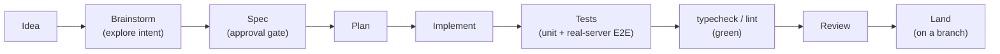
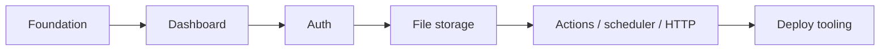
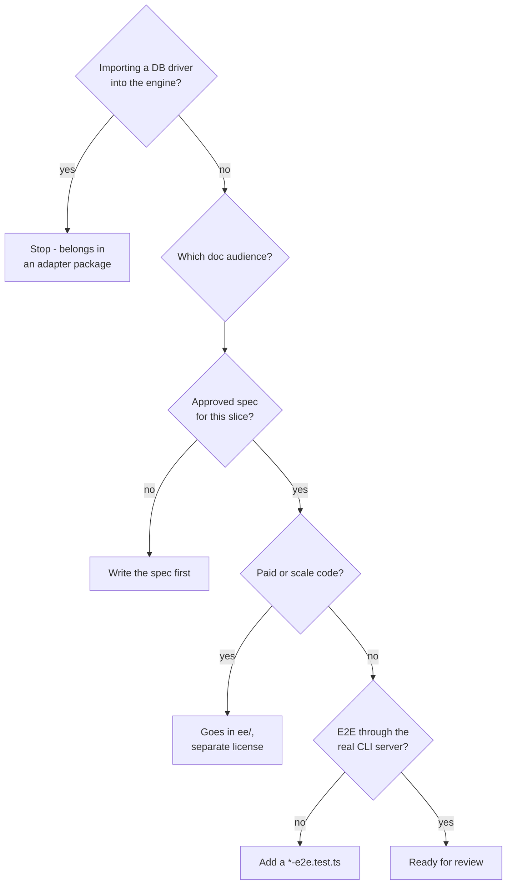

{/* diataxis: how-to */}

This page is the process guide: how an idea becomes a shipped change in stackbase. If you're
looking for *what the codebase looks like*, see [The codebase](/docs/contributing/codebase/monorepo)
instead. This page is about the workflow around the code, not the code's layout.

The short version: stackbase treats "how we build" as seriously as "what we build." Every
non-trivial change goes through **brainstorm -> spec -> plan -> implement**, in that order,
before any code lands. That might sound heavyweight for an open-source project, but it's what
lets a small team ship a system this size (session auth, durable workflows, a Postgres adapter,
a distributed fleet) without the architecture drifting into chaos. This guide explains the
discipline, the conventions your change will be judged against, and the legal basics.

## The pipeline: idea to landed change

Every feature-sized change moves through the same stages. Skipping straight from "idea" to
"code" is the one thing you're not allowed to do here.



Walking through it:

<Steps>

<Step>

### Brainstorm

Before anything is designed, you talk through the goal and the constraints: what problem this
actually solves, who it's for, and what it deliberately does *not* do. This catches "wrong
problem" mistakes before they cost a design doc.

</Step>

<Step>

### Spec: the approval gate

Every build-order slice (see below) gets a written design spec under `docs/superpowers/specs/`
**before any code is written**. A spec lays out the problem, the design, and the trade-offs. It
needs to be **approved by the maintainer** (your human partner on the change) before you move on,
not just written down and assumed good. This is the one hard gate in the whole pipeline: no spec,
no code.

</Step>

<Step>

### Plan

The approved spec becomes a concrete implementation plan: the ordered steps a contributor (human
or agent) will actually execute.

</Step>

<Step>

### Implement

Write the code against the plan.

</Step>

<Step>

### Tests

Unit tests cover the mechanism, and an end-to-end test proves it through the real server. More on
why that second part is non-negotiable below.

</Step>

<Step>

### `typecheck` and `lint`, green

No exceptions.

</Step>

<Step>

### Review

At minimum a normal code review. For anything touching more than one package, add a
**whole-branch review** before it lands. See [Review discipline](#review-discipline).

</Step>

<Step>

### Land

For an external contribution, the intended path is a PR from your branch, merged after review.

</Step>

</Steps>

If your change is a small, obvious fix (a typo, a one-line bug fix with an existing test), you
don't need a full spec. Use your judgment. But anything that adds a capability, changes a public
API, or touches more than one package should have a spec first.

## Where does my change fit? The build-order rule

Stackbase isn't built feature-by-feature in a random order. It's built in **slices**, each one a
complete, working vertical: foundation (the reactive engine) first, then the dashboard, then auth,
then file storage, then actions/scheduler/HTTP, then production deploy tooling, and so on.
Distributed multi-node scale-out is deliberately last.



The rule that keeps this honest: **you don't start a later slice before the earlier one runs
end-to-end.** A half-working foundation with a half-working auth layer bolted on top is worse
than a fully-working foundation and no auth yet. If your contribution is a genuinely new
capability (not a fix or extension to something that already ships), the first question is:
*which slice does this belong to, and has that slice's predecessor actually shipped?* Check
`CLAUDE.md`'s "Build order" section and the "What works" status list before proposing something
that assumes a later-slice capability that doesn't exist yet (for example: building on top of
distributed Tier 2 scale-out, which is still deferred).

## Conventions your change is judged against

These aren't style nitpicks. They're the things a reviewer checks before anything else.

### DX is the feature

The CLI's error messages, the quality of type inference in the client SDK, and how fast
`stackbase dev` starts up aren't polish on top of the "real" product. They are the product. A
change that adds a capability but produces a confusing error message, degrades type inference, or
slows down dev startup isn't done yet. Weigh every change against this before calling it
finished.

### The storage seam must stay pure

The reactive engine (`packages/transactor`, `packages/query-engine`, `packages/executor`,
`packages/sync`, and friends) must never import a database driver, a network socket, or any
host-specific API directly. All persistence goes through the narrow `DocStore` interface in
`packages/docstore`; concrete databases live behind it in `packages/docstore-sqlite` and
`packages/docstore-postgres`. If you find yourself importing `pg` or `bun:sqlite` anywhere outside
an adapter package, that's a design bug, not a shortcut. See
[Architecture: storage](/docs/contributing/architecture/storage) for the full contract.

### Two doc audiences, never mixed

`docs/enduser/` (and this fumadocs site) is the public, product-facing documentation: how someone
*uses* stackbase. `docs/dev/` and `docs/superpowers/` are internal engineering material:
architecture notes, specs, plans. If you're documenting a change, write it into the audience it
belongs to, not both at once.

### Canonical imports are `@stackbase/*`

Even though stackbase's runtime is Convex-shaped and a `stackbase migrate` on-ramp exists for
Convex users, `@stackbase/*` is the one documented, canonical import surface. `convex/*`
compatibility is a migration convenience, never something you write new code or new docs against.

Here's roughly what a reviewer checks, in order:



## Testing expectations before you land

Unit tests that exercise a mechanism in isolation are necessary but **not sufficient**. The
cardinal rule for anything that crosses package boundaries: **prove it end-to-end through the
real `stackbase dev` or `stackbase serve` server**, not just an isolated mechanism test. These
live in `packages/cli/test/*-e2e.test.ts`. There are dozens of these already (auth flows,
workflows, triggers, deploy, storage, and more), and they catch the bugs an isolated unit test
structurally can't see: two components wiring together wrong, or a feature working against a
mock but failing against the real transport.

<Callout type="warn" title="Two easy-to-miss gotchas">

- **Tests run under Node, via vitest**, even though the primary runtime is Bun. Don't write a test
  that only works with Bun-specific globals. The suite will silently not catch what you think it
  catches.
- **Cross-package tests resolve dependencies via each package's built `dist/`, not its `src/`.**
  If you edit a dependency's source and don't rebuild it, a test that imports that dependency
  keeps testing the old code, a very confusing failure mode. Run `bun run build` (or the
  package's own build) before trusting a cross-package test result.

</Callout>

Before you consider a change landable, all of these should be green:

```bash
bun run test        # unit + mechanism tests (vitest, under Node)
bun run test:e2e     # end-to-end tests through the real CLI server
bun run typecheck    # tsc --noEmit across every package
bun run lint
```

## Review discipline

Beyond a normal code review, stackbase uses staged reviews at each pipeline step: a plan review,
an engineering review, a design review where relevant, and, importantly, a **whole-branch final
review** before a multi-slice or multi-package change lands. This isn't ceremony: across many
shipped slices, the whole-branch review has caught real blocker-class bugs that the smaller,
per-task reviews missed (a security gap only visible once two components were composed together,
for instance). If your change touches more than one package, run a whole-branch review before
asking for it to be merged. It has a track record of finding things worth finding.

## Licensing: a CLA or DCO is required

Stackbase's core is licensed under **FSL-1.1-Apache-2.0** (free to use, modify, and self-host,
including commercially, but you may not offer stackbase itself as a competing hosted service;
each release converts to Apache 2.0 two years after it ships). Full detail on why, and on the
free-forever guarantees, lives on the [Licensing page](/docs/contributing/licensing).

<Callout type="warn" title="A CLA or DCO will be required">

The project's policy is that a CLA or DCO is required on every contribution, from the start. This
exists to preserve the project's ability to relicense or dual-license code later (for example, to
keep the `ee/` split clean). It's impossible to add retroactively: it has to be in place before a
contribution lands, not requested after. The signing tooling itself is still being set up in the
repository, so until it lands, expect a maintainer to ask for a DCO-style sign-off on your PR.

</Callout>

Related to this: any future paid, scale-tier code lives under a reserved `ee/` directory, under
its own **separate commercial license**, never under the FSL core. The reverse direction matters
too: existing FSL-licensed files are never retroactively relicensed. If you're not sure whether
something you're building belongs in the open core or in `ee/`, ask before writing code against
the wrong license. See the decision tree above.

## Practical hygiene

A few basics that keep the history clean and the project easy to pick back up:

- **Branch off `main` and open a PR from your branch.** That's the intended process for external
  contributions; don't expect a direct push to `main` to be an option.
- **Keep the spec (and any relevant internal notes) updated with what actually shipped.** A spec
  that describes a design that was later changed during implementation is worse than no spec at
  all. Update it so it stays the source of truth.
- **Follow the project's commit and PR conventions**: a clear commit message, a co-author trailer
  when a change was produced with AI assistance, and a PR body that states what changed and why
  (not just which files moved).

## Where to go next

- [The codebase](/docs/contributing/codebase/monorepo): how the monorepo is laid out and how to
  build/run it locally.
- [Architecture: system design](/docs/contributing/architecture/system-design): the reactive
  engine's design, for anyone about to touch it.
- [Extending stackbase](/docs/contributing/extending/custom-component): building a new component,
  storage adapter, or provider.
- [Licensing](/docs/contributing/licensing): the full FSL-1.1-Apache-2.0 and `ee/` story.
