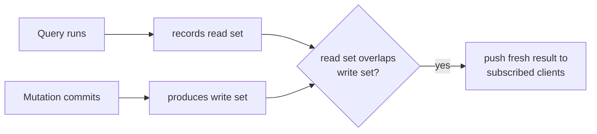
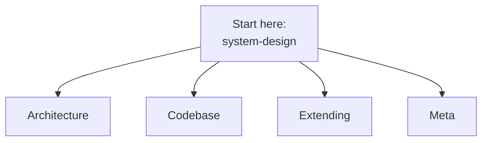

{/* diataxis: explanation */}

This section is for a different reader than the rest of the docs. It's for people who want to work *on* stackbase itself: reading the engine source, fixing a bug, adding a storage adapter, or writing a new component. If you just want to use stackbase in your app, go to [Get Started](/docs/get-started/what-is-stackbase) or [Core Concepts](/docs/core-concepts/schema-and-tables) instead.

## stackbase in one breath

stackbase is an open-source, self-hostable, reactive backend. You write ordinary TypeScript functions: queries, mutations, and actions. They run on the server inside a transaction.

Every client subscribed to the data those functions touch gets pushed a fresh result over a WebSocket the instant it changes. You never write polling code, manual refetch calls, or cache-invalidation logic.

It aims for a best-in-class developer experience with no vendor lock-in. Run it on your own laptop, your own server, or your own cloud account.

## The one idea everything else serves

Before anything else clicks, get this one primitive:

- A **query** is a read-only function. While it runs, the engine quietly notes exactly what it read: which tables, which rows, which ranges. This is the **read set**.
- A **mutation** is the only kind of function allowed to write. When it commits, the engine notes exactly what it wrote: the **write set**.
- Every live subscription is just a query plus its read set, sitting around waiting. Whenever a mutation commits, the engine checks whether that write set overlaps any subscription's read set. If it does, that query re-runs and the new result gets pushed to whichever clients are subscribed to it. If it doesn't, the subscription is left alone. It costs nothing.

That's it. There's no polling loop, no manually declared cache keys, no pub/sub topics you have to wire up by hand. "Did what I just wrote touch what you're watching?" is the entire reactivity model.

Nearly every architecture page in this section is really just an answer to one question: how do we make this one idea correct and fast? How the read/write sets get recorded is the [query engine](/docs/contributing/architecture/query-engine). How commits stay safe under concurrency is the [transactor](/docs/contributing/architecture/transactions). How the overlap check is actually implemented and pushed to clients is the [reactivity](/docs/contributing/architecture/reactivity) page, the one page in this section worth reading most carefully. Where the bytes physically live is the [storage](/docs/contributing/architecture/storage) page.

If you want the user-facing version of this same idea first, that's [Core Concepts: Reactivity](/docs/core-concepts/reactivity).

## The shape of the system, in three sentences

1. **One language, end to end.** The CLI, the server engine, and the client SDK are all TypeScript. There's no Rust core, no second language to context-switch into when you go from writing a query to debugging the engine that runs it.
2. **Storage is hidden behind one narrow seam.** The engine never imports a database driver directly. It talks to an abstract `DocStore`/`DatabaseAdapter` interface, and the exact same engine logic runs unmodified on embedded SQLite (the zero-config default) or Postgres (for networked, durable self-hosting).
3. **The same app code scales up without a rewrite.** Today that means a single self-contained binary or container (what this project calls Tier 0/1) that runs happily on a $5 VPS. A distributed, multi-node fleet (Tier 2) is designed for, and partly built in, the `ee/` tree, but isn't yet a shipped, general-purpose product surface. See the status note below.

## Where this architecture came from

stackbase is loosely inspired by [Convex](https://github.com/get-convex/convex-backend) and by a project called concave. To be precise about what that means for a contributor: the internal architecture notes under `docs/dev/` were written by *studying* Convex's and concave's published, documented behavior as reference material, never by copying their source. Both are source-available under a non-compete license (FSL), so this codebase treats them the way you'd treat a spec: read for ideas, reimplement from scratch.

Two practical consequences worth knowing before you dive into the deeper architecture pages:

- Those internal notes are dense, expert-written, and occasionally describe *intent* rather than *what shipped*: a design that was proposed, then later built differently, deferred, or superseded.
- The familiar *authoring style* (how you write a query or a schema) is not a promise to be a drop-in replacement for anything. stackbase's canonical imports are its own (`@stackbase/*`), and it has already grown capabilities its prior art doesn't have: durable workflows with saga/compensation, a Postgres adapter, a single-binary build. Compatibility with an existing project shows up as a migration on-ramp (`stackbase migrate`), not the product's identity.

<Callout type="info">
  This Contributing section is the reconciled, ships-are-real view. Where the internal `docs/dev/` notes and the shipped code disagree, the shipped code wins.
</Callout>

## A map of this section

The Contributing tab has four groups of pages. Skim this before you go looking for something specific.

- **[Architecture](/docs/contributing/architecture/system-design)**: how the engine actually works, from the 30,000-foot view down to specific subsystems.
  - [System design](/docs/contributing/architecture/system-design): the north star. Read this first.
  - [Storage](/docs/contributing/architecture/storage): the append-only log and the storage seam.
  - [Transactions](/docs/contributing/architecture/transactions): the single-writer commit protocol.
  - [Reactivity](/docs/contributing/architecture/reactivity): the read-set/write-set overlap, in full. The concept most worth getting right.
  - [Query engine](/docs/contributing/architecture/query-engine): how a query becomes an index scan and a recorded read set.
  - [Execution](/docs/contributing/architecture/execution): how your function code actually runs, and the determinism boundary.
  - [Runtimes](/docs/contributing/architecture/runtimes): embedded, fleet, and edge hosts for the same engine.
- **[Codebase](/docs/contributing/codebase/monorepo)**: the practical tour.
  - [The monorepo](/docs/contributing/codebase/monorepo): what lives where and why.
  - [Development setup](/docs/contributing/codebase/development): clone, install, build, test, the dev loop.
- **[Extending](/docs/contributing/extending/custom-component)**: the seams you can build against without touching the engine core.
  - [A custom component](/docs/contributing/extending/custom-component): like `@stackbase/auth` or `@stackbase/scheduler`.
  - [A custom storage adapter](/docs/contributing/extending/storage-adapter): a new database backend.
  - [Custom providers](/docs/contributing/extending/providers): email, OAuth, or blob-store backends for existing components.
- **Meta**: the [contributing guide](/docs/contributing/contributing-guide) (how a change actually gets proposed and landed) and [licensing](/docs/contributing/licensing) (the FSL license and the `ee/` split).

## Where to start reading

If you're new here, read in this order:

1. **[System design](/docs/contributing/architecture/system-design)** first. It's the one-page synthesis of the whole architecture, and every other page assumes you've read it.
2. **[Reactivity](/docs/contributing/architecture/reactivity)** next. Of everything in the system, this is the piece most likely to be misunderstood, and it's the one idea the whole product is built to protect.
3. Then dive into whichever subsystem page matches what you're actually touching. You don't need to read all of Architecture front to back.
4. Get the repo running via [development setup](/docs/contributing/codebase/development) so you can poke at things as you read.
5. Before writing code for anything nontrivial, read the [contributing guide](/docs/contributing/contributing-guide). This project works spec-first (brainstorm, then a written plan, then implementation), and skipping straight to code for a real feature is the one workflow mistake that reliably costs the most time later.

## How mature is this, honestly

Shipped and covered by end-to-end tests against the real running server, not just unit tests of internal mechanisms:

- The reactive core.
- Single-node/single-binary production tooling: `stackbase serve`, Docker self-host, live hot-deploy, a compiled standalone binary.
- The Postgres adapter and file storage.
- The six built-in components: auth, authz, scheduler, workflow, triggers, notifications.

Not there yet, so you calibrate correctly before relying on it:

- Distributed Tier 2 multi-node write scale-out is designed and partly built under the source-available `ee/` tree. It isn't a finished, general product surface.
- Full-text and vector search aren't built.
- The function executor's internal syscall interface was designed from day one to be safe to send across a real V8 isolate boundary, but that isolation isn't wired up yet. Today's executor runs your functions in-process, trusting them, rather than sandboxing them.

None of these gaps affect the correctness of what has shipped. They're scope not yet reached.
