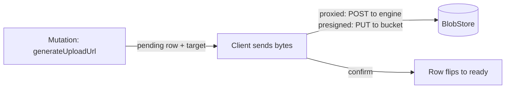

{/* diataxis: explanation */}

Think of a file the way stackbase thinks of any other row: something you can reference, query, and
react to. The bytes themselves just happen to live somewhere else.

File storage is always on. There's nothing to opt into in `stackbase.config.ts`. The moment you run
`stackbase dev`, every project has a reserved `_storage` system table and a `ctx.storage` facade
available in every query, mutation, and action.

The actual bytes live in a separate `BlobStore` backend: the local filesystem by default, an
S3-compatible bucket (AWS S3, MinIO, Cloudflare R2) when you point the server at one, or an R2
binding on the Cloudflare Durable Object host. Your function code stays identical across all three.

## The `_storage` table and `Id<"_storage">`

`_storage` is a built-in system table. It holds metadata for every uploaded file: `status`, `key`,
`size`, `contentType`, `sha256`, `visibility`, and `expiresAt`, each keyed by its own document id.

Unlike a component's internal tables, `_storage` lives in the app root, not some namespaced corner
of the schema. That's what makes `Id<"_storage">` usable as a first-class field type in your own
schema, exactly like `v.id("photos")`:

```ts title="convex/schema.ts"
import { v, defineSchema, defineTable } from "@stackbase/values";

export default defineSchema({
  photos: defineTable({
    caption: v.string(),
    image: v.id("_storage"),
  }),
});
```

That field participates in reactivity like any other reference. A query that reads a `photos`
document holding a stored file id re-runs when that row changes, the same read-set/write-set
intersection every other table gets (see [How it works](/docs/get-started/how-it-works)). There's
no special-casing for storage ids on the reactivity path. `_storage` is just another table, one
that happens to be reserved and app-rooted instead of user-defined.

## Why uploads happen in two phases

A mutation can't do byte I/O. Writing an actual file is non-deterministic in the same way `fetch`
is: it touches the outside world, and a mutation's whole job is to be a deterministic, replayable
transaction (see [Mutations](/docs/core-concepts/mutations)).

But *minting the record* of an upload, a pending `_storage` row plus a place to send the bytes, is a
perfectly ordinary transactional write. So an upload splits into two phases:

1. A **mutation** reserves the upload. It inserts a `pending` `_storage` row and returns a target
   describing where the bytes should go.
2. The **byte transfer** happens outside any transaction, either through the engine's own HTTP
   endpoint or straight to a bucket, and finishes by confirming, which flips the row to `ready`.



The row only becomes `ready` once the transfer is confirmed. An upload that's reserved and never
finished (the client abandoned it, the tab closed, the network dropped) leaves a stale `pending`
row with an expiry on it.

A background reaper (covered below) reclaims that row and its bytes on its own. Nothing leaks
storage forever, and you never have to write code for the abandoned case.

## `ctx.storage` in queries and mutations

Inside a query or mutation, `ctx.storage` is a small facade with four methods:

```ts title="convex/files.ts"
import { mutation, query } from "./_generated/server";
import { v } from "@stackbase/values";

export const createUpload = mutation({
  args: { contentType: v.optional(v.string()) },
  handler: (ctx, { contentType }) => ctx.storage.generateUploadUrl({ contentType }),
});

export const photoUrl = query({
  args: { id: v.id("_storage") },
  handler: (ctx, { id }) => ctx.storage.getUrl(id),
});

export const photoMeta = query({
  args: { id: v.id("_storage") },
  handler: (ctx, { id }) => ctx.storage.getMetadata(id),
});

export const removePhoto = mutation({
  args: { id: v.id("_storage") },
  handler: (ctx, { id }) => ctx.storage.delete(id),
});
```

<TypeTable
  type={{
    'generateUploadUrl(opts?)': {
      type: 'mutation-only',
      description: 'Inserts a pending _storage row and returns { storageId, target }. visibility defaults to private (see Access control below).',
    },
    'getUrl(id)': {
      type: 'query or mutation',
      description: 'Returns a URL the client can fetch or render, or null if the id does not exist or names an upload that was abandoned and has since expired.',
    },
    'getMetadata(id)': {
      type: 'query or mutation',
      description: 'Returns { size, contentType, sha256 } or null (a BlobMetadata), with the same null semantics as getUrl.',
    },
    'delete(id)': {
      type: 'mutation',
      description: 'Tombstones the row. It writes, so it only runs in a mutation.',
    },
  }}
/>

`getUrl`, `getMetadata`, and `delete` are metadata-only. They never touch actual bytes, which is
why they work from a query as well as a mutation. Each one reads or writes the `_storage` row
through the calling function's own transaction, so `delete` is transactional and reactive exactly
like any other write. The tombstone lands, and is visible, in the same commit as everything else
the mutation did.

### `generateUploadUrl`'s two return shapes

What `target` looks like depends on the backend you're running, not on anything you wrote:

```ts
{
  storageId: string; // the new, still-`pending` Id<"_storage">
  target:
    | { kind: "proxied"; url: string; method: "POST"; headers?: Record<string, string> }
    | {
        kind: "presigned";
        url: string; // a direct PUT straight to the bucket
        method: "PUT";
        headers?: Record<string, string>;
        confirmUrl: string; // POST here after the PUT to finalize the row
      };
}
```

<Tabs items={['proxied', 'presigned']}>

<Tab value="proxied">

Used by the filesystem backend, and the Cloudflare R2-binding backend. The client `POST`s bytes to
the engine's own `/api/storage/upload` endpoint, which stores them and flips the row to `ready` in
the same request.

</Tab>

<Tab value="presigned">

Used by the S3-compatible backend. The client `PUT`s bytes straight to the bucket, bypassing the
server entirely, then separately `POST`s the returned `confirmUrl` to flip the row to `ready`.

</Tab>

</Tabs>

A client that handles both shapes works against every backend without knowing which one is
deployed:

```ts title="client upload helper"
async function uploadFile(client, baseUrl: string, file: Blob, contentType: string) {
  const { storageId, target } = await client.mutation(api.files.createUpload, { contentType });

  if (target.kind === "proxied") {
    await fetch(new URL(target.url, baseUrl), {
      method: target.method,
      headers: { "content-type": contentType, ...target.headers },
      body: file,
    });
  } else {
    await fetch(target.url, {
      method: target.method,
      headers: { "content-type": contentType, ...target.headers },
      body: file,
    });
    await fetch(new URL(target.confirmUrl, baseUrl), { method: "POST" });
  }

  return storageId; // an Id<"_storage">, store this in your own document
}
```

Either branch ends the same way: a `ready` `_storage` row, whose id you then persist into your own
document (`ctx.db.insert("photos", { caption, image: storageId })`).

### Why `generateUploadUrl` is safe inside a mutation

Minting an upload target inside a mutation looks like it should be non-deterministic. URLs usually
embed a timestamp or a random token. But every input it derives from is transaction-local:

- The blob **key** is the new row's own storage id (`key === storageId`). Ids are minted the same
  deterministic way every other insert's id is. A replay on an OCC conflict simply commits whichever
  attempt wins, with its own internally consistent id, expiry, and token.
- **`expiresAt`** and the capability token's expiry both derive from `cctx.now`, the transaction's
  fixed timestamp, never `Date.now()`.
- The capability token itself is an HMAC over `(scope, id, exp)` with the deployment's signing key.
  That's a pure function of stable inputs, so it's reproducible on replay.

That's also why `getUrl` is safe to call from a *query*. It needs to mint a fresh capability token
for a private file on every call (see below), and it does so off `cctx.now`, never wall-clock. So
two calls to the same query at the same logical read still see a consistent, replay-safe result.

## `ctx.storage` in actions

Reading or writing the actual file *contents* is real I/O, the same kind of non-determinism as
`fetch`. So it belongs in an [action](/docs/core-concepts/actions), never a query or mutation. The
action-mode `ctx.storage` facade adds two byte-level methods and keeps the two read-only ones:

```ts title="convex/files.ts"
import { action } from "./_generated/server";
import { v } from "@stackbase/values";

export const resizeAndStore = action({
  args: { id: v.id("_storage") },
  handler: async (ctx, { id }) => {
    const stream = await ctx.storage.get(id); // ReadableStream<Uint8Array> | null
    if (stream === null) return null;
    const processedBytes = await resize(stream); // your own processing
    return await ctx.storage.store(processedBytes, { contentType: "image/png" });
  },
});
```

<TypeTable
  type={{
    'store(bytes | ReadableStream, opts?)': {
      type: 'action-only',
      description: 'Takes a Uint8Array or ReadableStream<Uint8Array> and returns an already-ready Id<"_storage"> in one call. There is no separate confirm step, since the action already holds the whole blob.',
    },
    'get(id)': {
      type: 'action-only',
      description: 'Returns a ReadableStream<Uint8Array> or null, under the same reclaimable-row rules as getUrl and getMetadata.',
    },
    'getUrl(id) / getMetadata(id)': {
      type: 'query, mutation, or action',
      description: 'Same signatures and null semantics as the query/mutation facade, so a function body that only calls these two is portable between a mutation and an action.',
    },
  }}
/>

Internally, `store` still follows the two-phase shape for crash-safety: it registers a reapable
`pending` row *before* writing any bytes, then flips it to `ready` only after the write succeeds.
A crash mid-write leaves a row the reaper can still find and reclaim by key, rather than an
orphaned blob nothing points to.

The action facade has no `ctx.db` of its own to write through. It delegates every metadata read and
write to the internal `_storage:*` functions, and does native byte I/O against the `BlobStore`
directly. Its notion of "now" is wall-clock `Date.now()`, not a transaction timestamp. That's fine,
because actions are already non-deterministic by design.

## Access control: private by default

Every file has a `visibility`, set at upload time (`generateUploadUrl({ visibility: "public" })` or
`store(bytes, { visibility: "public" })`) and defaulting to `"private"`.

<Tabs items={['public', 'private (default)']}>

<Tab value="public">

Served at a stable URL. Anyone holding it can fetch the bytes, no token required. On the S3 backend
this resolves to a CDN or bucket public URL (when `STACKBASE_STORAGE_PUBLIC_URL` is configured). On
the filesystem backend, or without a public base URL configured, it resolves to the engine's own
serve endpoint with no token appended, streaming the bytes with no access check. Use `"public"` for
content meant to be world-readable: a marketing asset, a public avatar.

</Tab>

<Tab value="private (default)">

Never served on a bare URL. `getUrl()` instead returns a URL carrying a signed, expiring
capability token: an HMAC over the file id, an expiry, and a *scope*, signed with the deployment's
own admin key. Anyone holding that URL can fetch the bytes until it expires. There's no per-user or
per-role check layered on top today (see
[What isn't built](#what-isnt-built-per-user-authorization) below).

</Tab>

</Tabs>

<Callout type="warn" title="Handle private links like secrets">

Treat a private file's `getUrl` like a signed download link. It's safe to hand to the user it's
meant for, but not safe to log publicly or embed anywhere anyone can view it. It can leak into
logs, browser history, or a `Referer` header.

</Callout>

A GET-capability token defaults to **one hour of validity** from the moment `getUrl` mints it (a
fresh token is minted on every call, not cached on the row). That's long enough for a client to
read the url out of a query result and actually fetch the bytes, and short enough to bound how long
a leaked link stays live.

### Token scopes aren't interchangeable

The capability token embeds a **scope**, either `"upload"` or `"get"`, as part of what it HMACs. A
token minted for one purpose can't be replayed for the other, even for the same file id and expiry:

- An **upload-scoped** token (minted by `generateUploadUrl` and appended to the proxied upload URL,
  or to the presigned target's `confirmUrl`) authorizes writing or finalizing that one pending row.
  It can't be used to read a private file's bytes.
- A **get-scoped** token (minted by `getUrl` for a private file) authorizes reading that one file's
  bytes. It can't be replayed against the upload or confirm endpoints to overwrite the file. That
  matters precisely because a `getUrl` link is the one meant to be handed out and embedded in
  pages, and is therefore the one most likely to leak.

The upload endpoints layer a second check on top of the token. Even a validly scoped, unexpired
upload token is refused unless the row is *currently* a live pending upload (not already `ready`,
not tombstoned, not expired). So a captured but still-unexpired upload token can't be replayed
later to resurrect a deleted file or clobber an already-finalized one.

## The orphan reaper

Two situations leave a `_storage` row that no longer names a servable file:

- An upload was reserved (`generateUploadUrl`) but never confirmed. The client abandoned it, or a
  direct-to-bucket PUT never got its follow-up confirm call. The row stays `pending` past its
  `expiresAt`.
- `ctx.storage.delete(id)` ran. Deleting is a transactional tombstone, not a byte-level delete. The
  mutation flips the row back to `pending` with an *already-expired* `expiresAt`, because the
  actual blob delete is real I/O and can't run inside the transaction. The row briefly still
  carries its `key` so the reaper can find the blob by it.

A background driver, `storageReaper`, built on the same recurring-driver seam the scheduler uses,
sweeps for exactly these rows: any `pending` row whose `expiresAt` has passed. It deletes the row
and the underlying blob together. The sweep runs on a wall-clock timer (60 seconds by default) and
immediately whenever a commit touches `_storage`. So a short-TTL abandoned upload, or a `delete()`
tombstone, doesn't have to wait out a full sweep interval. It's typically reclaimed within moments
of becoming reapable, not up to a minute later.

This is why `getUrl`/`getMetadata` return `null`, not stale data, for a deleted file the instant
the delete commits. The *metadata* tombstone is immediate and transactional. Only the *bytes*
trail behind, reclaimed asynchronously the next time the reaper sweeps.

## Range requests

The serve endpoint (`GET /api/storage/:id`) supports `Range: bytes=start-end` and open-ended
`bytes=start-` requests, returning `206 Partial Content` with `Content-Range`/`Accept-Ranges`
headers. That's useful for streaming video or audio playback, or a resumable-download UI that
seeks into a large file.

Multi-range requests (`bytes=0-1,5-6`) aren't supported and fall back to a full `200` response. A
range whose start is past the end of the file returns `416 Range Not Satisfiable`. An end past the
file's actual size is clamped down to the last valid byte rather than rejected.

On backends that redirect to a signed bucket URL instead of streaming through the engine (S3 with
a private file, or a public file with a CDN base URL configured), the range request is honored by
whichever HTTP server actually serves the bytes. The engine's own redirect doesn't need to parse
`Range` itself in that case, since it never streams the body.

## Backend configuration

Bytes are stored through a small, pluggable `BlobStore` seam. The engine never imports a
byte-backend driver directly, the same storage-seam story as `DocStore` for SQLite and Postgres.
Three adapters ship:

<Tabs items={['@stackbase/blobstore-fs', '@stackbase/blobstore-s3', '@stackbase/blobstore-r2']}>

<Tab value="@stackbase/blobstore-fs">

The zero-config default. Files land under `<data-dir>/storage`, next to your SQLite (or
Postgres-adjacent) data. Nothing needs to be set to use it, and uploads use the `proxied` shape.
`signGetUrl`/`publicUrl` both return `null` here, so private-file downloads always go through the
engine's own token-gated serve endpoint, and public files stream through it too, with no token
appended.

</Tab>

<Tab value="@stackbase/blobstore-s3">

Any S3-compatible bucket: AWS S3, MinIO, or Cloudflare R2 accessed via its S3-compatible API.
Uploads use the `presigned` shape, a direct PUT to the bucket that bypasses the server. Reads
either redirect to a short-lived presigned GET (private files) or to a configured public/CDN base
URL (public files with `STACKBASE_STORAGE_PUBLIC_URL` set).

</Tab>

<Tab value="@stackbase/blobstore-r2">

A Workers-safe adapter for the Cloudflare Durable Object host. It uses an injected R2 bucket
binding (`env.R2`) instead of the AWS SDK, so it carries no `node:fs`, `node:stream`, or
`node:crypto` dependency and runs inside a Worker. Because an R2 *binding* has no presigned-PUT
surface, uploads on this adapter always use the `proxied` shape, streamed through the Durable
Object's own `fetch` handler. This adapter is wired up by the Cloudflare runtime host, not by
`stackbase dev`/`serve`'s env and flag selection below.

</Tab>

</Tabs>

For `stackbase dev`/`serve`, the byte backend is picked automatically at boot based on whether an
S3 bucket is configured. Unset means filesystem, set means S3:

```bash
stackbase serve --storage-bucket my-app-uploads --storage-endpoint https://s3.us-east-1.amazonaws.com
# or, equivalently:
STACKBASE_STORAGE_BUCKET=my-app-uploads stackbase serve
```

<Accordions type="single">

<Accordion title="Flags and environment variables reference">

| Flag | Env var | Notes |
|---|---|---|
| `--storage-bucket` | `STACKBASE_STORAGE_BUCKET` | The single switch: set means the S3 backend, unset means the filesystem default. |
| `--storage-endpoint` | `STACKBASE_STORAGE_ENDPOINT` | S3-compatible endpoint URL (MinIO, R2, a non-default AWS region endpoint). Omit for plain AWS S3 with a standard region. |
| (none) | `STACKBASE_STORAGE_REGION` | Bucket region. No CLI flag, env-only. |
| (none) | `STACKBASE_STORAGE_PUBLIC_URL` | Base URL for `"public"` files (e.g. a CDN domain in front of the bucket). Omit to let `getUrl` fall back to signed bucket URLs for private files, and the bucket's own presigned GET for public ones without a CDN. No CLI flag, env-only. |
| (none) | `AWS_ACCESS_KEY_ID` / `AWS_SECRET_ACCESS_KEY` | Standard AWS-style credentials, used for MinIO/R2 too. |

</Accordion>

</Accordions>

Flags win over environment variables when both are set, the same convention as
`--database-url`/`STACKBASE_DATABASE_URL` (see [Self-hosting](/docs/deploy/self-hosting)).

The bucket is the *only* switch between the two backends. If `STACKBASE_STORAGE_ENDPOINT`,
`_REGION`, or `_PUBLIC_URL` are set but `STACKBASE_STORAGE_BUCKET` isn't, the server refuses to
boot with an actionable error rather than silently falling back to the filesystem. Those settings
only make sense for S3, so their presence without a bucket is an unambiguous misconfiguration.
Silently writing uploads to local disk when you meant to point at durable object storage is a
data-durability footgun: uploads would vanish on the next container recreate. The standard AWS
credential env vars are *not* treated as S3 intent on their own. They commonly exist for unrelated
reasons even on filesystem-backend deployments.

<Callout type="info">

On the filesystem backend, `stackbase dev`/`serve` also fails fast at boot if the storage
directory can't be created or written to. A read-only mount or wrong ownership surfaces
immediately as a clear boot error, not as a mysterious failure on the first upload.

</Callout>

## What isn't built: per-user authorization

Reading a private file today is a bearer-token model. Whoever holds a valid `getUrl` link can read
the bytes until it expires, with no notion of "only the uploader" or "only this user's team."

The serve endpoint has an internal `checkRead(identity, id)` authz seam reserved for exactly this,
but it's intentionally unwired. There's no per-`(table, id, identity)` read-permission primitive in
the engine today to plug into it, and wiring it to something half-built would mean guessing at a
permission convention rather than shipping one.

Until that seam is wired, if your app needs finer-grained rules than "anyone with the link, until
it expires," add your own check in the function that hands out the file's id or url. For example,
verify the caller owns the parent document before returning `ctx.storage.getUrl(id)` from a query.

## Related

- [Mutations](/docs/core-concepts/mutations) and [Actions](/docs/core-concepts/actions): why the
  upload flow splits where it does, and why byte I/O can only happen in an action.
- [How it works](/docs/get-started/how-it-works): the read-set/write-set intersection that makes a
  `photos` row holding an `Id<"_storage">` reactive like any other field.
- [Self-hosting](/docs/deploy/self-hosting): pointing the storage backend at an S3-compatible
  bucket instead of the local filesystem default, alongside the equivalent `--database-url` story
  for Postgres.
