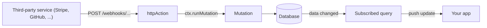

{/* diataxis: how-to */}

A webhook doesn't know or care about your sync protocol. Stripe, GitHub, and your email provider all
want the same thing: `POST` some JSON at a URL and get a response back.

`httpAction` and a conventional `http.ts` router give you exactly that: a plain HTTP endpoint, wired
into the same reactive engine as the rest of your app. This page walks through building one.



<Steps>

<Step>

### Write the handler with httpAction

`httpAction` is an [action](/docs/core-concepts/actions) that speaks raw HTTP instead of typed
arguments. Its input is a Web `Request`, its output is a `Response`, but everything else about it is
a regular action:

- `ctx.runQuery(ref, args)`, `ctx.runMutation(ref, args)`, `ctx.runAction(ref, args)`, each a fresh,
  independent top-level run, exactly as in an action.
- Native `fetch`, `Date.now()`, `Math.random()`, timers all work normally.

<Callout type="warn" title="No ctx.db">
  An `httpAction` isn't part of any transaction, so the only way it touches data is by calling a
  query, mutation, or action through the three methods above.
</Callout>

```ts title="convex/http.ts"
import { httpAction, httpRouter } from "./_generated/server";

export const receiveWebhook = httpAction(async (ctx, request) => {
  const body = (await request.json()) as { author: string; body: string };
  await ctx.runMutation("messages:send", { author: body.author, body: body.body });
  return new Response(JSON.stringify({ ok: true }), {
    status: 200,
    headers: { "content-type": "application/json" },
  });
});
```

`httpAction` takes either a bare handler function or `{ handler }`. There's no `args`/`returns`
validator option the way `query`/`mutation`/`action` have one, because the input is a `Request`, not a
validated argument object. Parse and validate the body yourself, the same as you would in any HTTP
framework.

Because the handler has no `ctx.db`, its actual write goes through `ctx.runMutation`. That mutation is
what produces a write set and fans out to any subscription reading the `messages` table (see
[Reactivity](/docs/core-concepts/reactivity)). This is the shape every webhook in stackbase takes:
HTTP in, mutation for the write, reactive fan-out for free.

</Step>

<Step>

### Register it in http.ts

A conventional `convex/http.ts` default-exports an `httpRouter()` populated with `route()` calls. This
is how the engine discovers your endpoints at load time:

```ts title="convex/http.ts"
import { httpRouter } from "./_generated/server";
import { receiveWebhook } from "./webhooks";

const http = httpRouter();

http.route({ path: "/webhooks/messages", method: "POST", handler: receiveWebhook });

export default http;
```

Each `route()` call takes exactly one of `path` or `pathPrefix`, plus a `method`:

- **`{ path, method, handler }`**: an exact match. The request's path must equal `path` character for
  character.
- **`{ pathPrefix, method, handler }`**: a prefix match. The request's path must start with
  `pathPrefix` (so `pathPrefix: "/webhooks/"` matches `/webhooks/messages` and
  `/webhooks/anything`).

Passing both, or neither, throws at registration time: ``http.route requires exactly one of `path`
or `pathPrefix` ``.

The `handler` must be a named export of an app module, something `httpAction(...)` produced.
Registering an inline arrow function or an unresolvable reference fails project loading with:

```
http.route handler for "/webhooks/messages" must be an exported httpAction
(declare it as a named export of an app module)
```

</Step>

<Step>

### Understand match precedence

When a request could match more than one registered route, resolution is deterministic:

1. Method must always match. A route registered for `POST` never matches a `GET` request to the same
   path, regardless of exact or prefix.
2. An exact `path` match wins outright over every `pathPrefix` route, no matter how specific the
   prefix. This is checked first and returns immediately.
3. Among `pathPrefix` routes, the longest matching prefix wins. `pathPrefix: "/webhooks/stripe/"`
   beats `pathPrefix: "/webhooks/"` for a request to `/webhooks/stripe/invoice`.

```ts title="convex/http.ts"
http.route({ path: "/webhooks/stripe/health", method: "GET", handler: healthCheck });
http.route({ pathPrefix: "/webhooks/stripe/", method: "POST", handler: stripeHook });
http.route({ pathPrefix: "/webhooks/", method: "POST", handler: genericHook });
```

A `POST /webhooks/stripe/invoice` matches `stripeHook` (longer prefix beats shorter), not
`genericHook`. A `GET /webhooks/stripe/health` matches `healthCheck`, the exact match, even though it
also satisfies no `pathPrefix` route (different method anyway).

There's no support for named path parameters (`/webhooks/:id`). A route only ever knows the exact
path or a prefix it starts with, so a handler that needs the rest of the path reads it itself, from
`new URL(request.url).pathname`.

An unmatched `{method, path}` combination, whether there's no exact match, no prefix match, or one of
the reserved built-ins below already claimed it, falls through to a plain `404`.

</Step>

<Step>

### Know the reserved paths

`/api/*` and any path whose first segment starts with `_` (for example `/_dashboard`,
`/_admin/anything`) belong to the engine: the sync WebSocket, `/api/run`, `/api/health`, file
storage's `/api/storage/*`, the admin API, and the dashboard all live there.

`route()` rejects a conflicting registration at registration time, before your `http.ts` can ever
shadow a built-in:

```ts
http.route({ path: "/api/foo", method: "GET", handler: whatever });
// throws: http.route path "/api/foo" is reserved (/api/* and /_* belong to the engine)
```

A malformed `http.ts` fails loudly and immediately this way, rather than silently never firing or,
worse, intercepting traffic meant for the engine. The reservation is a single predicate: the path is
`/api`, starts with `/api/`, or matches `/^\/_/`. So `/apix` is fine (it doesn't start with `/api/`),
but `/api`, `/api/`, and anything under `/api/...` are all rejected.

</Step>

<Step>

### Call it

The endpoint is just HTTP. No client SDK required:

```bash
curl -X POST https://your-deployment/webhooks/messages \
  -H "content-type: application/json" \
  -d '{"author": "webhook", "body": "hello from the webhook"}'
```

Any client already subscribed to a query over the `messages` table, a `useQuery(api.messages.list)`
in a running app, for example, receives the update the moment this request's inner mutation commits.
No polling, no extra wiring on the client side. This is the same reactive fan-out any mutation gets,
whether it's called from the client SDK, another function, the scheduler, or, as here, a webhook.

</Step>

</Steps>

## Reading the caller's identity

<Callout type="warn" title="No built-in verification">
  If the request carries an `Authorization: Bearer <token>` header, that raw token is passed straight
  through to the handler's context as its identity. stackbase does not decode, validate, or look up
  the token for you. It's handed to your handler exactly as the caller sent it.
</Callout>

If you need to check a webhook's authenticity (an HMAC signature, a shared secret, a provider's own
signing scheme like Stripe's `Stripe-Signature` header or GitHub's `X-Hub-Signature-256`), verify it
yourself inside the handler, reading whatever header the provider actually signs with, before calling
`ctx.runMutation`. This is exactly what you'd do in any other HTTP framework. `httpAction` doesn't add
or remove anything here.

## Hot reload

`stackbase dev`'s watch loop re-resolves `http.ts` on every save, exactly like it reloads your
queries, mutations, and actions. The dev server exposes a `setRoutes(routes)` method that the reload
path calls with the freshly-resolved route table, and the very next request sees the new routes.
Nothing in the running WebSocket sync connections, active subscriptions, or in-flight mutations is
disturbed. Only the HTTP route table itself is swapped in place.

You can add, remove, or repoint a `http.route()` call and see it live within one reload cycle, with no
server restart. Same DX as editing a query or mutation.

## Going deeper

<Accordions type="single">

<Accordion title="Components can contribute reserved routes too">

You never write this yourself unless you're authoring a component, but it's worth knowing it exists.

An opt-in composed component (declared via `stackbase.config.ts`) can register its own reserved
routes, for example an OAuth provider's callback endpoint, or a notification provider's delivery
webhook, through a `httpRoutes` entry on its component definition:

```ts
interface ComponentHttpRoute {
  method: string;
  pathPrefix: string;
  /** A bare httpAction module name within this component's own modules. */
  handler: string;
}
```

These are mounted by the boot core, not by your app's `http.ts`. Your app cannot declare a route
under a reserved prefix, and a component cannot declare one outside a reserved prefix. The rules,
enforced both when the component is defined and again when it's composed into a project:

- The `pathPrefix` must live under `/api/` or `/_`, the same reserved namespace your own routes are
  barred from, inverted: a component route may only live there.
- The `pathPrefix` must have at least two path segments (for example `/api/mycomponent/`, never bare
  `/api/` or `/_`). This structural floor makes a component accidentally shadowing the entire
  reserved namespace impossible by construction, even if the engine's own reserved-prefix list is
  ever incomplete.
- It must not collide, in either direction, with a built-in engine prefix (`/api/run`, `/api/health`,
  `/api/sync`, `/api/storage/`, `/_admin/`, `/_fleet/`, `/_dashboard`). A component can't register
  something more specific or more general than any of these.
- Two composed components' route prefixes may not overlap either, one being a prefix of the other for
  the same method, so that's rejected when components are composed together. First-match-by-
  declaration-order is never ambiguous.

Component routes are matched by prefix, in declaration order, ahead of your app's own `http.ts`
routes. A component handler parses any sub-path itself (for example `<provider>/<phase>`), since
routes here carry no named parameters, matching how your own routes work.

For an ordinary app, this is invisible: composing a component that ships one just works, without
anything in your own `http.ts`. File storage's own `/api/storage/*` endpoints (upload, confirm, serve)
are the always-on, built-in-rather-than-composed example of the same mechanism. See
[File storage](/docs/core-concepts/file-storage).

</Accordion>

</Accordions>

## What's not here

A few things a general-purpose HTTP framework offers are deliberately not part of `httpAction` and
`http.ts`, and aren't planned:

- **Streaming request or response bodies.** A handler reads the whole request body and returns a
  whole `Response` body. There's no chunked or streaming I/O in either direction.
- **Automatic CORS.** If a browser needs to call your endpoint cross-origin, set the
  `Access-Control-*` headers yourself in the `Response` you return (and handle `OPTIONS` yourself if
  you need a preflight).
- **Named path parameters** (`/webhooks/:id`). Routes match on an exact path or a prefix only. Read
  anything beyond the matched prefix from the request's own URL inside the handler.
- **Per-route middleware.** There's no chain of route-scoped `use()` handlers. Cross-cutting concerns
  like auth checks, logging, or rate limiting go inside the handler itself, or as a shared helper
  function each handler calls.

If you need any of these, build it inside the handler body. The primitives (`Request`, `Response`,
`ctx.runQuery`/`runMutation`/`runAction`) are the same ones a hand-rolled Node or Bun HTTP server would
give you.

## Related

- [Actions](/docs/core-concepts/actions): the non-deterministic execution model `httpAction` shares,
  including `ctx.runQuery`/`runMutation`/`runAction` semantics.
- [Mutations](/docs/core-concepts/mutations): the only way a webhook's data actually gets written.
- [Reactivity](/docs/core-concepts/reactivity): why a write from a webhook shows up in a live query
  with no extra code.
- [File storage](/docs/core-concepts/file-storage): `_storage`'s own reserved `/api/storage/*` routes
  are an example of the same reserved-route mechanism, built into the engine rather than a component.
