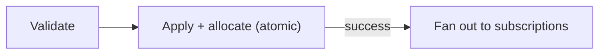

{/* diataxis: explanation */}

A mutation is a function that writes data. It's the only place in stackbase allowed to write:
queries can only read, and actions don't get a `ctx.db` at all.

Every write in a stackbase app happens inside a mutation, no matter what triggered it: a client call,
a scheduled job, a webhook, a trigger.

## Defining a mutation

A mutation takes a context (`ctx`) and, optionally, arguments, and returns a value:

```ts title="stackbase/messages.ts"
import { v } from "@stackbase/values";
import { mutation } from "./_generated/server";

export const send = mutation({
  args: { author: v.string(), body: v.string() },
  returns: v.id("messages"),
  handler: (ctx, args) => ctx.db.insert("messages", { author: args.author, body: args.body }),
});
```

- **`args`** is a validator (a record of `v.*` fields). Declaring it is opt-in but strongly
  recommended: a mismatch (wrong type, a missing required field, or an extra field) is rejected
  with a typed `ArgumentValidationError` (code `ARGUMENT_VALIDATION`, HTTP 400) **before the
  handler ever runs**. A mutation with no `args` accepts anything, unchanged from a function with
  no validator at all.
- **`returns`** is also optional, and also a validator. It doesn't coerce or check anything at
  runtime by itself. What it buys you is **codegen**: the generated `api` types the mutation's
  resolved value exactly, which is what lets a typed
  [optimistic update](/docs/client/optimistic-updates) know the shape of the row it's rendering
  ahead of the real commit.
- **`handler`** does the writing through `ctx.db`, the one thing a query's handler can't do.

## Argument validation is one chokepoint

Validation is enforced in exactly one place: the top of `InlineUdfExecutor.run()`, before any
transaction opens and before the handler is invoked. Every entry point funnels through it: a
client's WebSocket mutation call, `POST /api/run`, an action's inner `ctx.runMutation`, the
scheduler/cron driver calling a job's target, boot steps. None of them reach a handler with
unvalidated arguments.

```ts title="stackbase/messages.ts"
export const send = mutation({
  args: { conversationId: v.id("conversations"), body: v.string() },
  handler: (ctx, args) => ctx.db.insert("messages", { conversationId: args.conversationId, body: args.body }),
});
```

Calling `send` with a missing `body`, an extra `foo` field, or a `conversationId` that isn't an id
string all reject with the same shape of error. The caller never reaches `ctx.db.insert` at all:

```
ArgumentValidationError: arguments to "messages:send" do not match validator: body: missing required field
```

Use `v.optional(...)` for arguments that may be omitted. `httpAction` is the one exception: it
takes a raw `Request`, not JSON args, so it has no `args` validator to enforce.

## Writing data

`ctx.db` in a mutation is a writer: everything a query's reader can do (`get`,
`query(table, index).collect()`, `.paginate()`, all covered in
[Queries](/docs/core-concepts/queries)), plus three write methods:

```ts
ctx.db.insert(table, value): Promise<Id<table>>
ctx.db.replace(id, value): Promise<void>
ctx.db.delete(id): Promise<void>
```

<TypeTable
  type={{
    insert: {
      type: '(table, value) => Promise<Id<table>>',
      description: (
        <>
          Inserts a new document and returns its <code>_id</code>. <code>_id</code> and{' '}
          <code>_creationTime</code> are assigned automatically (see below). Never pass them in{' '}
          <code>value</code> yourself, unless you're deliberately supplying a client-minted{' '}
          <code>_id</code>, covered later on this page.
        </>
      ),
    },
    replace: {
      type: '(id, value) => Promise<void>',
      description: (
        <>
          Replaces a document's fields entirely, given its <code>_id</code>. Throws{' '}
          <code>DocumentNotFoundError</code> if the document doesn't exist.
        </>
      ),
    },
    delete: {
      type: '(id) => Promise<void>',
      description: (
        <>
          Removes a document by its <code>_id</code>. Deleting an already-missing id is a no-op,
          not an error.
        </>
      ),
    },
  }}
/>

<Callout type="warn" title="There is no ctx.db.patch()">

Only `insert`, `replace`, and `delete` exist. `replace` takes the *whole* document, not a partial
update. To change one field, read the document first and write back every field, changed or not.

</Callout>

```ts title="stackbase/items.ts"
export const toggle = mutation({
  args: { id: v.id("items"), done: v.boolean() },
  handler: async (ctx, { id, done }) => {
    const doc = await ctx.db.get(id);
    if (doc === null) return;
    await ctx.db.replace(id, { listId: doc.listId, label: doc.label, done });
  },
});
```

## Write validation

If the target table has a schema (declared with `defineTable({...})` in `schema.ts`), every
`insert` and `replace` is checked against it before the write is staged. A value with a
wrong-typed field, a missing required field, or an extra field the schema doesn't declare is
rejected with a `DocumentValidationError` (code `DOCUMENT_VALIDATION`). The whole handler's
transaction rolls back, exactly as if it had thrown for any other reason. This check runs
independently of argument validation: `args` validates what the *caller* sent; write validation
checks what the *handler* is about to persist, which can differ (a handler can compute or default
fields the caller never passed).

A table declared with no validator at all (an untyped/legacy table) skips this check. Write
validation is inert unless the table has a schema, so it never breaks an existing table that
predates it.

## One serializable transaction

A mutation's entire handler runs as a single **serializable transaction**. Every read it does sees
a consistent snapshot at the transaction's `snapshotTs`. Every write it makes is staged in an
in-memory buffer, invisible to everyone else, until the handler returns successfully. (`ctx.db.get`
inside the same handler *does* see your own staged writes: this is read-your-own-writes.) Then all
of it commits together, or, if the handler throws, none of it does. There is no partial write: a
mutation that inserts three rows and then throws leaves zero rows behind.

This is also what gives the engine a single, well-defined moment to hook reactivity into: the
commit. There's no ambiguity about "when did this write happen," because a mutation either fully
happened at its commit or didn't happen at all.

### The commit pipeline

Under the hood, committing a mutation's staged writes runs under the shard's single-writer mutex
in two steps: validate, then the store atomically allocates the timestamp and lands the writes in
one step.

1. **Validate**: has any commit since this transaction's snapshot written something this
   transaction read? The engine checks the transaction's *validated* read set (everything read via
   `ctx.db.get`/an index scan) against every commit's write set since the snapshot. If any
   intersect, the commit is aborted with an `OccConflictError` (code `OCC_CONFLICT`, HTTP 409,
   retryable). This is optimistic concurrency control (OCC): the engine doesn't lock rows up
   front, it detects a genuine conflict at commit time.
2. **Apply and allocate, atomically**: the store allocates the commit timestamp inside its own
   atomicity domain and appends every staged insert/replace/delete to the document log at that
   timestamp, in one atomic step, chaining each row's `prev_ts` to its latest *committed* revision
   (the single-writer lock makes this race-free). There is no window where a timestamp is
   allocated but its writes aren't yet landed.



Only after both steps succeed does the engine compute the write set and fan it out to
subscriptions. [How it works](/docs/get-started/how-it-works) is the canonical deep explanation of
this pipeline; see also [Reactivity](/docs/core-concepts/reactivity) for the fan-out side.

### OCC conflicts replay your handler, deterministically

When validation detects a conflict, the engine doesn't fail the mutation. It **replays the
handler**: runs it again from scratch, against a fresh snapshot, up to 8 retries after the initial
attempt by default (so up to 9 executions in all). This is invisible to the caller in the common
case; they see one mutation call that eventually committed (or, past the retry budget, an
`OccConflictError` that propagates).

Replay only works because mutations are **deterministic**, covered next. If replaying the same
handler against the same (now newer) data could produce a *different* sequence of writes than the
first attempt, OCC retry would be unsound. This is why the purity rule below isn't a style
preference; it's load-bearing for the commit pipeline.

## Mutations are deterministic, like queries

A mutation runs under the same purity rule as a query: no `fetch`, no `Date.now()`, no
`Math.random()`, no `crypto.randomUUID()`. The engine needs the same code, given the same
arguments and the same data, to do the exact same writes every time it runs. That's needed both
for the OCC replay above, and because a mutation is itself deterministic-replayable machinery the
rest of the system leans on.

When a mutation genuinely needs the current time or a random value, use `ctx.now()` and
`ctx.random()` instead of the global `Date.now()`/`Math.random()`. Both are fixed for the life of
that transaction (and any replay of it), rather than drifting between attempts. Anything that
can't be made deterministic this way (a network call, a real UUID, a non-replayable clock read)
belongs in an [action](/docs/core-concepts/actions) instead.

## The commit produces the write-set

When a mutation commits, the engine records exactly which rows it inserted, replaced, or deleted:
its **write-set**. That write-set is then intersected against every subscribed query's recorded
read-set: a query refreshes only if a mutation actually touched data it read. This intersection is
the entire reactive engine. See [How it works](/docs/get-started/how-it-works) and
[Reactivity](/docs/core-concepts/reactivity) for the full mechanism.

## `_id` and `_creationTime`

Every document gets two system fields the engine assigns, not you:

- **`_id`**: a unique id, minted fresh on insert (or, for `replace`, unchanged from the existing
  document, since `_id` can never be reassigned by a replace).
- **`_creationTime`**: the transaction's snapshot timestamp at the moment of insert, carried
  forward unchanged by any later `replace` of the same document.

You never set these directly in the `value` you pass to `insert`/`replace`. On a `replace`, both
system fields are ignored in favor of the document's real ones. On an `insert`, a `_creationTime`
is rejected, and a `_id` is never ignored: it's always treated as a client-supplied id and
validated as such, covered below.

<Callout type="warn" title="Same-transaction inserts share one _creationTime">

A `_creationTime` comes from the transaction's single `snapshotTs`, not a per-row clock read. So
multiple documents inserted by *the same mutation call* all get the identical `_creationTime`. If
you insert several rows in one handler and later need to distinguish their relative order,
`_creationTime` alone won't do it (the default `by_creation` index tiebreaks equal timestamps on
the row's random `_id`, which is not a meaningful order). Add an explicit ordinal or sequence field
yourself if you need a deterministic order among documents created in the same transaction:

</Callout>

```ts title="stackbase/steps.ts"
export const createSteps = mutation({
  args: { workflowId: v.id("workflows"), labels: v.array(v.string()) },
  handler: async (ctx, { workflowId, labels }) => {
    // All three rows below share one _creationTime. `order` is what actually orders them.
    for (let i = 0; i < labels.length; i++) {
      await ctx.db.insert("steps", { workflowId, label: labels[i], order: i });
    }
  },
});
```

## Sharding: `shardBy`

A table can declare a **shard key** in its schema with `.shardKey("fieldName")`. That routes every
document in the table to one of the deployment's shards, keyed by the value of that field. That's
the mechanism Tier-2 (multi-node) scale-out is built on. A table with no `.shardKey()` is
**unsharded**: every document lives on the single **default ring**, which is also where every
mutation runs unless it opts into sharding.

A mutation that writes a sharded table must declare which shard it's routing to, with `shardBy`:

```ts title="stackbase/schema.ts"
export default defineSchema({
  conversations: defineTable({ title: v.string() }),
  messages: defineTable({
    conversationId: v.id("conversations"),
    author: v.string(),
    body: v.string(),
  })
    .index("by_conversation", ["conversationId"])
    .shardKey("conversationId"),
});
```

```ts title="stackbase/messages.ts"
export const send = mutation({
  args: { conversationId: v.id("conversations"), author: v.string(), body: v.string() },
  returns: v.id("messages"),
  shardBy: "conversationId",
  handler: (ctx, args) =>
    ctx.db.insert("messages", { conversationId: args.conversationId, author: args.author, body: args.body }),
});
```

The three-line summary: `shardBy` is a field name from `args` (or a function `(args) => value`),
resolved and hashed to a shard **before** the transaction opens. Codegen cross-checks a string
`shardBy` against the table's `.shardKey()` at build time, and the engine enforces shard ownership
at runtime on every tier, single-node included. If your table has no `.shardKey()`, none of this
applies and every mutation runs exactly as unsharded as before this feature existed.

The exact ownership rules and their rejection messages are under **Shard ownership rules** in
Going deeper below.

## Client-supplied ids

By default, `ctx.db.insert` mints a random `_id`. A mutation can instead accept a
**client-minted** id and pass it straight through as `_id` in the insert value. The engine
validates and accepts it in place of minting its own:

```ts title="stackbase/conversations.ts"
export const create = mutation({
  args: { _id: v.optional(v.string()), name: v.string() },
  handler: (ctx, args) => ctx.db.insert("conversations", args),
});
```

The client side mints a real id (same format and 128-bit entropy as an engine-minted one, just
generated locally) via the typed `mintId` that `stackbase codegen` (and `stackbase dev`'s
regeneration on every push) emits to `_generated/ids.ts`:

```ts
import { mintId } from "../stackbase/_generated/ids";

const conversationId = mintId("conversations");                                   // a real Id<"conversations">, minted now
await client.mutation(api.conversations.create, { _id: conversationId, name });   // can enqueue offline
await client.mutation(api.messages.send, { conversationId, body });               // references it, also offline
```

The three-line summary: this is the pattern for an **offline create-then-reference chain**. Mint
the id before either mutation is sent, hand it to both, and both can enqueue into the durable
[offline outbox](/docs/client/offline-sync); on drain the create runs first (the outbox is FIFO),
so the reference resolves against a real row. `mintId` only knows your **app's own tables**:
component and system tables are excluded by construction, so `mintId("_storage")` compiles but
throws at runtime.

The exact validation order the engine runs at insert, the v1 restriction to unsharded tables on
the default ring, and the purity rule for pairing a client-supplied id with an optimistic update
are all in **Going deeper** below.

## Calling component facades from a mutation

When a project composes a component in `stackbase.config.ts`, its facade is attached to `ctx`
under that component's name. For components that opt into writing, it's usable from inside a
mutation's own transaction, so its writes commit and roll back with the rest of the handler:

```ts title="stackbase/reminders.ts"
export const remind = mutation({
  args: { taskId: v.id("tasks"), delayMs: v.number() },
  handler: async (ctx, { taskId, delayMs }) => {
    await ctx.db.replace(taskId, { ...(await ctx.db.get(taskId))!, reminded: true });
    // Scheduling a job is a write into the scheduler's own tables. It's staged in THIS
    // transaction, so it rolls back with everything else above if the handler later throws.
    await ctx.scheduler.runAfter(delayMs, api.reminders.fire, { taskId });
  },
});
```

`ctx.auth` (identity/session), `ctx.authz` (permission checks), `ctx.storage` (file metadata:
`getUrl`/`getMetadata`/`delete`, not the byte I/O methods, which are action-only), `ctx.workflow`,
and `ctx.notifications` are the other composable facades a mutation can reach, each namespaced to
its own component's tables and read-only unless the component specifically opts a mutation-mode
facade into writing. See each component's own page. [File storage](/docs/core-concepts/file-storage)
and the client docs cover the ones with the richest mutation-side surface.

## Calling a mutation from a client

On the client, `useMutation` returns a callback bound to a typed function reference:

```tsx
import { useMutation } from "@stackbase/client/react";
import { api } from "../stackbase/_generated/server";

function Composer({ author }: { author: string }) {
  const send = useMutation(api.messages.send);

  return (
    <button onClick={() => void send({ author, body: "hello" })}>
      Send
    </button>
  );
}
```

Calling it sends the mutation over the sync connection and resolves once it commits. The write's
effects show up wherever a live query's read-set overlaps it, including in the very same
component, if it's subscribed with `useQuery`. The full client surface, including
`withOptimisticUpdate` for instant local feedback and the durable offline outbox, is in
[Client SDK](/docs/client/client-sdk), [Optimistic updates](/docs/client/optimistic-updates), and
[Offline sync](/docs/client/offline-sync).

## Going deeper

<Accordions type="single">

<Accordion title="Shard ownership rules">

The engine enforces shard ownership at every tier, with rejections if you get it wrong:

- Writing a sharded table from a mutation with no `shardBy` is rejected: "this mutation does not
  declare a shard, so it runs on the 'default' shard and may not write sharded tables."
- Writing a sharded table's document whose shard-key value doesn't hash to *this* mutation's
  declared shard is rejected: the document belongs to a different shard than the one this mutation
  is routed to.
- The shard-key field is **immutable after insert**: a `replace` that changes it is rejected
  ("it is immutable after insert... delete the document and insert a new one to move it between
  shards").
- An unsharded table is always owned by the default ring: `insert` into it is allowed from any
  shard (a fresh insert can never fork a concurrent write), but `replace`/`delete` of an existing
  row must run from a mutation with no `shardBy` (i.e. on the default ring). A cross-ring
  read-modify-write would silently lose updates otherwise.

</Accordion>

<Accordion title="Client-supplied id validation, in order">

The engine never trusts a supplied `_id` at face value. It's checked, in order, at
`ctx.db.insert`:

1. Not a well-formed document id string → `InvalidClientIdError` (code `INVALID_CLIENT_ID`).
2. Decodes to a *different* table than the one being inserted into → `InvalidClientIdError`
   ("`_id` belongs to table \"messages\", not \"conversations\"").
3. The target table is sharded, or this mutation isn't running on the default ring →
   `InvalidClientIdError` (see the v1 restriction below).
4. A document already exists under that id (either committed, or inserted earlier in the *same*
   transaction) → `IdAlreadyInUseError` (code `ID_ALREADY_IN_USE`).

There is no upsert path: a collision is always a rejection, never a silent overwrite.

</Accordion>

<Accordion title="v1 restriction: unsharded tables, default ring only">

A client-supplied `_id` is accepted **only** for a table with no `.shardKey()`, inserted from a
mutation running on the **default** shard (i.e. no `shardBy`). Both are checked before the
existence lookup even runs.

The reason is concurrency safety, not an arbitrary limitation: the existence check is a snapshot
read scoped to *this transaction's own shard*. On a sharded deployment, each shard is an
independently-mutexed OCC domain with its own snapshot and recent-commits ring. So two concurrent
inserts of the *same* client-supplied id on *different* shards would each see "not found" locally
and both commit, producing a silent duplicate identity. Pinning the id path to one ring (the
default one) makes the existence check globally sound for that table.

Concretely: **don't shard-route a mutation that inserts with a client-supplied `_id`.** Doing so
doesn't fail outright. It succeeds only when the shard key happens to hash onto the default ring
(roughly 1-in-*N* on an *N*-shard deployment) and rejects the rest of the time. Treat it as
unsupported, not flaky. Sharded-table support for client-supplied ids (binding the id to its row's
shard-key value) is a deferred follow-on, not built.

</Accordion>

<Accordion title="Purity rule for optimistic updates">

If you're pairing a client-supplied id with an
[optimistic update](/docs/client/optimistic-updates), mint it **outside** the updater (at
args-construction time, once) and have the updater read the id **from args**, never mint one
itself. Minting consults randomness; an updater must stay pure and safely re-runnable on every
ingest, exactly like `store.placeholderId()`/`store.now()`:

```ts
const conversationId = mintId("conversations"); // minted OUTSIDE the updater, once

const create = useMutation(api.conversations.create).withOptimisticUpdate((store, args) => {
  // inside the updater: read the id FROM args; never call mintId() here
  const list = store.getQuery(api.conversations.list, {});
  if (list === undefined) return;
  store.setQuery(api.conversations.list, {}, [...list, { _id: args._id, name: args.name }]);
});

await create({ _id: conversationId, name });
```

</Accordion>

</Accordions>
