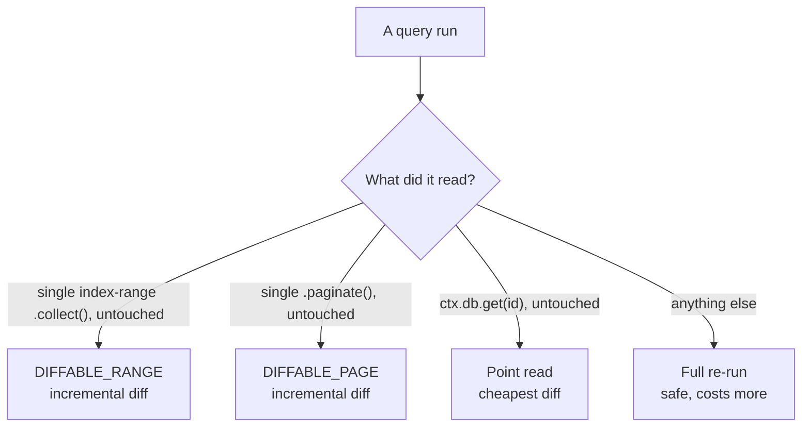

{/* diataxis: explanation */}

A query is a function that reads data. It's also the function type your app subscribes to, so how
well you understand queries is how well you understand why a stackbase app stays live.

This page walks through the whole surface: the query builder, `ctx.db.get`, pagination and cursors,
`scanCapped`, and exactly which query shapes get the cheap incremental reactivity path versus a full
re-run.

## Defining a query

`query({ args, returns, handler })` takes a validated argument object and a handler. The handler
receives a `QueryCtx` whose only capability is `ctx.db`, a **read-only** database handle:

```ts title="stackbase/messages.ts"
import { v } from "@stackbase/values";
import { query } from "./_generated/server";

export const list = query({
  args: { conversationId: v.id("conversations") },
  handler: (ctx, args) =>
    ctx.db
      .query("messages", "by_conversation")
      .eq("conversationId", args.conversationId)
      .order("desc")
      .collect(),
});
```

- **`args`** validates the query's arguments before the handler runs. It's optional (a query with
  no `args` accepts anything), but declaring it gets you a runtime-enforced shape: wrong type,
  missing, or extra fields get rejected before your handler ever sees them. You also get precise
  argument types on the generated client `api`.
- **`handler`** does the reading through `ctx.db`. It can be sync or `async`; either return shape
  works, since a query never awaits anything nondeterministic (see
  [Determinism](#determinism-why-queries-cant-touch-the-outside-world) below).
- **`returns`** is an optional validator describing the result shape. It has no runtime enforcement
  on the return value today: it's a typing and codegen input, not a check. But it's what lets the
  generated client `api` type a query's result exactly, and what a typed
  [optimistic update](/docs/client/optimistic-updates)'s `OptimisticLocalStore.setQuery` uses to know
  the shape it's setting.

A query can't write. There's no `ctx.db.insert`/`replace`/`delete` on a `QueryCtx`. Those exist only
on a mutation's writer (see [Mutations](/docs/core-concepts/mutations)). If you need a query's
result on the way to a write, read it from inside the mutation itself. Queries and mutations don't
call each other directly; that's what `ctx.runQuery` from an [action](/docs/core-concepts/actions)
is for.

## The query builder

`ctx.db.query(table, indexName)` opens a builder over one named index of one table. Every table
gets a built-in `by_creation` index (creation order) for free, in addition to any index you declare
in `schema.ts` (see [Schema & tables](/docs/core-concepts/schema-and-tables)):

```ts
ctx.db.query("messages", "by_creation").collect();          // whole table, oldest first
ctx.db.query("messages", "by_conversation").eq("conversationId", id).collect();
```

The builder's methods:

| Method | What it does |
|---|---|
| `.eq(field, value)` | Narrow to an exact key. Chaining `.eq` on successive index fields builds a compound-key prefix. |
| `.gt(field, value)` / `.gte(field, value)` | A lower bound on the next (non-equality) index field. `.gt` is exclusive, `.gte` is inclusive. |
| `.lt(field, value)` / `.lte(field, value)` | An upper bound on that same field. `.lt` is exclusive, `.lte` is inclusive. |
| `.order("asc" \| "desc")` | Scan direction. Default is `"asc"` (oldest/lowest first). |
| `.where(op, field, value)` | A **post-filter**: evaluated after the index narrows the scan, not part of the index range itself. `op` is one of `eq`, `neq`, `lt`, `lte`, `gt`, `gte`. Multiple `.where()` calls AND together. |
| `.take(n)` | Cap the number of documents `.collect()` returns. |
| `.collect()` | Run the scan; returns the matching documents as an array. |
| `.paginate({ cursor, pageSize, maxScan? })` | Run the scan as one page; see [Pagination](#pagination) below. |

There's no `.first()`. To get one document, either `.take(1)` and read index 0, or (if you have its
id) use `ctx.db.get` instead. It's simpler, and it gets the cheaper by-id reactivity path (see
[Reactivity classification](#reactivity-classification) below).

<Callout type="info" title="Coming from Convex?">

There's no `.withIndex(name, (q) => q.eq(...))`, Convex's builder shape. Stackbase's index name is
the second argument to `.query()` itself, and the range methods (`.eq`/`.gt`/`.gte`/`.lt`/`.lte`)
chain directly off the builder:

```ts
// Convex:    ctx.db.query("messages").withIndex("by_conversation", q => q.eq("conversationId", id))
// stackbase: ctx.db.query("messages", "by_conversation").eq("conversationId", id)
```

</Callout>

### Index range scans

An index's fields form a compound key. `.eq()` on each field in order builds a key **prefix**.
After the last equality, at most one field may additionally take a bound (`.gt`/`.gte` and/or
`.lt`/`.lte`) to narrow a range within that prefix. For example, with an index on
`["conversationId", "priority"]`:

```ts
ctx.db.query("messages", "by_conversation_priority")
  .eq("conversationId", id)
  .gte("priority", 2)
  .lte("priority", 5)
  .collect();
```

This resolves to one contiguous byte interval in the index's keyspace, `` `conversationId == id` ``
and `` `2 <= priority <= 5` ``, which the engine scans directly instead of filtering row by row. A
constraint on a field that isn't next in the index's field order (or a second bounded field) can't
be expressed as part of the range. Use `.where(...)` for those instead. It still runs, just as a
post-filter over the (possibly wider) range the index alone can express.

Every index key also implicitly ends in `_creationTime` then `_id` (see [Schema &
tables](/docs/core-concepts/schema-and-tables)), which is what makes keys unique and pagination
cursors stable even with duplicate field values.

### `ctx.db.get`

`ctx.db.get(id)` looks up a single document by its `_id`, returning it or `null` if it doesn't
exist (or was deleted):

```ts
export const getMessage = query({
  args: { id: v.id("messages") },
  handler: (ctx, args) => ctx.db.get(args.id),
});
```

This is a point read, the narrowest possible read set (see below). It's the cheapest, most
reactive way to read a single document once you already have its id.

## Determinism: why queries can't touch the outside world

A query must be **deterministic**: given the same underlying data, running it twice must produce
the same result. Concretely, a query's handler must not call `fetch`, `Date.now()`,
`Math.random()`, `crypto.randomUUID()`, or `setTimeout`. `ctx` never grants any of these
capabilities, but functions run in-process today, so the globals are still physically reachable.
There's no runtime guard that catches a call; it just silently breaks the reactivity guarantees
below, so treat the rule as hard. (A planned V8-isolate executor will block the globals at the
engine level.) If your handler genuinely needs the current time or a random value, `ctx.now()` and
`ctx.random()` are the deterministic substitutes: both are fixed for the life of the call (and any
replay of it), so re-running the same query against the same data always produces the same answer.

This isn't a restriction for its own sake. It's the property that makes the whole reactive model
trustworthy. The engine's entire subscription mechanism rests on being able to re-run a query's
handler and treat the result as authoritative. If a query could return a different answer for
identical data, say because it hit the network or read the wall clock, the engine would have no way
to tell "the data actually changed" apart from "the query just happened to answer differently this
time." Anything genuinely nondeterministic (a real network call, true randomness, a timer) belongs
in an [action](/docs/core-concepts/actions), which runs outside the transaction and outside any
subscription.

## The read set: what a subscription is made of

While a query runs, the engine records exactly which index ranges it touched (or, for `ctx.db.get`,
which single point). That's its **read set**. This isn't "the query touched the `messages` table."
It's as precise as "rows of the `by_conversation` index between these two byte keys." That read set
*is* the subscription. When a later mutation commits a write, the engine intersects the write with
every live query's read set and re-runs only the queries the write actually overlaps (see [How it
works](/docs/get-started/how-it-works) and [Reactivity](/docs/core-concepts/reactivity) for the
full matching mechanism).

Two consequences follow directly from how the query builder works:

- **A collect with no limit records the whole scanned interval**, including the space past the
  last matching row. That means an insert anywhere in that range (even one that would sort after
  everything currently returned) still wakes the subscription.
- **A collect with `.take(n)` records only the interval actually consumed**: from the start of the
  range up to (and including) the last row returned. A row that would sort beyond the taken window
  doesn't wake this subscription, because the query never read that far. That's correct behavior
  for a top-N query, but it means `.take()` and "get notified about anything appended later" don't
  mix. If you need that, don't limit, or re-query.

Even an unbounded scan records a range. An unfiltered whole-table `by_creation` scan records the
full index interval, so any write to the table lands inside it. That's precise in mechanism but
maximally wide in effect. A separate table-level fallback exists for the rare query run that
records no ranges at all: a subscription with zero recorded ranges is matched by table instead.
Either way, narrowing with `.eq`/`.gt`/`.gte`/`.lt`/`.lte` is what keeps a subscription's range,
and therefore its wake-ups, small. See
[Reactivity](/docs/core-concepts/reactivity#table-level-fallback) for the mechanics of how that
matching actually happens at commit time.

## Pagination

`.paginate({ cursor, pageSize, maxScan? })` returns one page instead of the whole matching set:

```ts title="stackbase/messages.ts"
export const page = query({
  args: { conversationId: v.id("conversations"), cursor: v.union(v.string(), v.null()), pageSize: v.number() },
  handler: (ctx, args) =>
    ctx.db
      .query("messages", "by_conversation")
      .eq("conversationId", args.conversationId)
      .paginate({ cursor: args.cursor, pageSize: args.pageSize }),
});
```

The result is a `PaginationResult`:

<TypeTable
  type={{
    page: {
      type: 'DocumentValue[]',
      description: "This page's documents.",
    },
    nextCursor: {
      type: 'string | null',
      description: 'Opaque cursor; pass it back in to get the next page. null on the last page.',
    },
    hasMore: {
      type: 'boolean',
      description: 'false on (and only on) the last page.',
    },
    scanCapped: {
      type: 'boolean',
      description: 'true only when maxScan stopped the scan before pageSize was filled.',
    },
  }}
/>

<Callout type="info" title="Coming from Convex?">

The field names differ. `hasMore` is `!isDone`, and `nextCursor` is Convex's `continueCursor`.
There's no `numItems` option either. Pass `pageSize` directly, along with an explicit `cursor`
(Convex bundles both into a `paginationOpts` object; stackbase takes them as plain fields).

</Callout>

### Cursors

A cursor is an opaque string: a base64-encoded index key. Pass `cursor: null` (or omit it) for the
first page, then feed the previous page's `nextCursor` back in for the next one. Because index keys
are unique (every key ends in `_creationTime` then `_id`), a cursor pins an exact position in the
keyspace. The next page resumes at "the key strictly after this one" (ascending) or "strictly
before this one" (descending), regardless of what else has been inserted, updated, or deleted
since.

This is what makes pages **contiguous under live edits**. Querying page 1, then page 2, of a table
that's being written to concurrently still gives you a partition of the keyspace with no gap and no
overlap between the two pages. An insert that lands between two pages' boundary keys shows up in
whichever page now owns that span: not duplicated, not skipped. It's not a snapshot frozen at
first-page time. It's a stable walk through the live keyspace.

There's no client-side pagination hook (no `usePaginatedQuery`). Pagination is a query like any
other. Drive it by holding the cursor as component state and calling `useQuery` with it as an
argument, advancing the cursor when you want the next page.

### `maxScan` and `scanCapped`

`maxScan` bounds how many index entries a single `.paginate()` call examines, independent of
`pageSize` (how many it returns). It's useful when a `.where()` post-filter is sparse. Without a
cap, a page could scan arbitrarily far into the index looking for `pageSize` matches. Omit it and
the scan runs until the page fills or the range is exhausted, with no examine-count limit.

When the scan stops because it hit `maxScan` before filling `pageSize`, `scanCapped` is `true`, and
`nextCursor` resumes from wherever the scan actually stopped, not from the last document it
matched. That way paging again continues the scan rather than silently skipping the unscanned tail.
`hasMore` is also `true` in this case, since there may well be more matching rows past the cap.

The dashboard's data browser uses exactly this: `maxScan: 1000` on its table-browsing query. When a
page comes back `scanCapped`, it shows a banner reading "Scan limit reached, narrow the filter to
see all results," instead of silently returning a partial page with no indication anything was cut
off. Any UI paginating over a heavily-filtered range should consider the same signal.

## Reactivity classification

The plain-language version first: some query shapes get cheap incremental updates, and anything
fancier gets a safe full re-run. Both are equally correct; only the cost differs.

More precisely, the engine classifies each query run by how "clean" a passthrough it is, and that
classification decides whether a later write can be **diffed** into the existing result (cheap) or
forces a **full re-run** (safe, but pays the cost of re-executing the whole handler and re-sending
the whole result).



- **A plain single-index-range `.collect()`, returned untouched** (no `.take()`, no post-processing
  of the array, nothing else read alongside it) is `DIFFABLE_RANGE`. A write that lands in its
  range produces an incremental add/edit/remove/move diff instead of a full re-run.

  This is checked by identity, not by content. The array `.collect()` hands back is invisibly
  tagged. Any `.slice()`, `.filter()`, `.map()`, or `[...spread]` produces a fresh, untagged array
  that falls back to a full re-run, even if the copy happens to look identical to the original on
  the current data. (A content-based check would be unsound: a filter that's a no-op today could
  later silently exclude a row a diff would otherwise have caught.)

- **A single `.paginate()` call, returned untouched**, is `DIFFABLE_PAGE`, the same passthrough
  rule as above, applied to the whole `PaginationResult` object instead of an array. The page's
  `[start, end)` key interval is pinned at first load and diffed the same way a range is. Only
  `.page` itself is re-derived from writes: `nextCursor`, `hasMore`, and `scanCapped` stay fixed to
  what the initial load returned. A page whose row count changes under live edits (grows on
  insert, shrinks on delete within its bounds) is correct, expected behavior, not a bug.

- **`ctx.db.get(id)`, returned untouched**, gets its own by-id fast path. A single point read diffs
  to "this one document changed or didn't", the cheapest classification there is.

- **Anything else falls back to a full re-run**: a `.take(n)`-limited collect, a handler that reads
  more than one thing (a `.get` alongside a `.collect()`, or two separate queries), a result the
  handler transforms after reading it, or a query composed with a dynamic authz read policy. A
  `scanCapped` page also declines the diff path. A capped scan leaves an "un-owned" gap between
  where matching stopped and where scanning stopped that a diff can't safely reason about, so it's
  re-run in full instead.

None of this changes what a query returns; it's purely about how efficiently a later write's
effect on the subscription gets computed and sent. Staying in the diffable shapes (a single
index-range `.collect()` or `.paginate()`, returned as-is) keeps your subscriptions cheap under
load, the same way narrowing the index range in the first place keeps them precise.

## Using a query from a client

On the client, you subscribe with the `useQuery` hook and the generated, typed `api`:

```tsx
import { useQuery } from "@stackbase/client/react";
import { api } from "../stackbase/_generated/server";

function Messages({ conversationId }: { conversationId: string }) {
  const messages = useQuery(api.messages.list, { conversationId });
  if (messages === undefined) return <p>Loading…</p>;
  return <ul>{messages.map((m) => <li key={m._id}>{m.author}: {m.body}</li>)}</ul>;
}
```

The component re-renders on its own whenever the query's result changes. That's the payoff of
everything above. The full client surface is in [Client SDK](/docs/client/client-sdk).

<Callout type="info" title="Bundling for the browser?">

The runtime `api` value lives in `_generated/server` (`_generated/api.d.ts` is types-only). In a
browser bundle you usually don't want the server-side code that file re-exports, so cast the
client's `anyApi` proxy instead: `const api = anyApi as Api`. The
[tutorial](/docs/get-started/tutorial#build-the-web-ui) shows the pattern and explains why.

</Callout>
