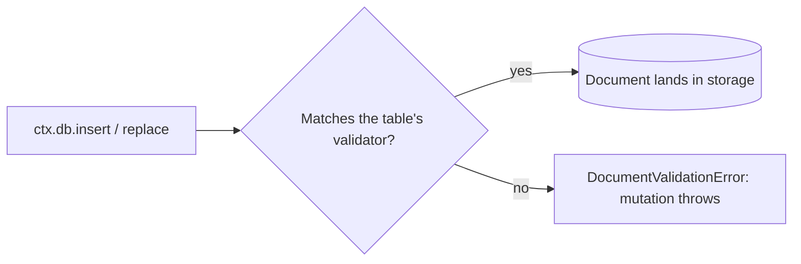

{/* diataxis: explanation */}

Think of your schema as a bouncer at the door of your database. It checks the shape of every
document before letting it in, and turns away anything that doesn't fit.

A stackbase schema is a single TypeScript file. It lists every table in your database and the
shape of the documents each one holds. Your editor and the compiler understand it, and stackbase
enforces it at write time: a document that doesn't match its table's shape is rejected before it
ever reaches storage.

There's no separate migration language and no DDL. The schema you write is the schema the engine
checks against, and nothing else.



## Defining a schema

Your `stackbase/schema.ts` file default-exports a `defineSchema` call. It maps table names to
`defineTable` definitions:

```ts title="stackbase/schema.ts"
import { defineSchema, defineTable, v } from "@stackbase/values";

export default defineSchema({
  conversations: defineTable({
    title: v.string(),
  }),
  messages: defineTable({
    conversationId: v.id("conversations"),
    author: v.string(),
    body: v.string(),
  }).index("by_conversation", ["conversationId"]),
});
```

`defineTable(fields)` takes an object of field name to **validator**, and returns a
`TableDefinition` you can chain `.index(...)` and `.shardKey(...)` calls onto. Both are covered
below.

`defineSchema(tables, options?)` takes the map of tables. Its second, optional argument is
`{ schemaValidation?: boolean }`, `true` by default. Setting it to `false` turns off write-time
document validation for the whole schema: every table becomes unchecked, the same as giving every
table `v.any()` for its shape. There's no per-table override, only a schema-wide switch, and
you'd reach for it only to relax validation temporarily, not as a normal way to run.

## Documents and system fields

A row is called a **document**. Every document, on every table (including tables you didn't
define yourself, see [System tables](#system-tables) below), automatically carries two system
fields you never set:

- **`_id`**: a globally unique, typed id. For a `messages` document this is `Id<"messages">`,
  exactly what `v.id("messages")` checks for. At runtime an id is just a string. The
  `Id<TableName>` type is a compile-time brand (a phantom generic parameter), so `Id<"messages">`
  and `Id<"users">` are different types even though both are strings underneath. Passing a user id
  where a message id is expected is a type error, not a runtime surprise.
- **`_creationTime`**: the time the document was inserted, as a number. It comes from the
  mutation's own transaction snapshot time, not `Date.now()`. That keeps it deterministic, like
  everything else a mutation touches.

stackbase assigns both on insert. Every table also gets a built-in `by_creation` index (creation
order) for free. That's why `ctx.db.query("messages", "by_creation").collect()` works with no
index declared in the schema at all.

## The `v.*` validator catalog

Every field in `defineTable` is described by a validator built from the `v` namespace, imported
from `@stackbase/values`.

A validator does two jobs. It checks a value at runtime, which is what makes write enforcement
possible. And it carries the TypeScript type that flows into `Doc<"table">`, function
`args`/`returns`, and the client's generated types, via `Infer<typeof validator>`.

The ones you'll reach for daily:

<TypeTable
  type={{
    "v.string()": {
      description: "A string.",
      type: "string",
    },
    "v.number()": {
      description: "64-bit float. Alias: v.float64().",
      type: "number",
    },
    "v.boolean()": {
      description: "A boolean.",
      type: "boolean",
    },
    "v.id(table)": {
      description:
        "A typed reference to another table's document, or the same table for self-references.",
      type: 'Id<"table">',
    },
    "v.optional(inner)": {
      description: "Marks a field as allowed to be absent. See optional fields below.",
      type: "Infer<inner> | undefined",
    },
    "v.object({ ...fields })": {
      description: "A nested object. See object semantics below.",
      type: "{ ...fields }",
    },
    "v.array(element)": {
      description: "A homogeneous array. Every element is checked against element.",
      type: "Array<Infer<element>>",
    },
  }}
/>

The rest of the catalog (`v.int64()`/`v.bigint()`, `v.null()`, `v.bytes()`, `v.literal(value)`,
`v.union(...members)`, `v.record(keys, values)`, `v.any()`) lives in the
[configuration reference](/docs/reference/configuration), the canonical quick-lookup copy.
`v.literal`, `v.union`, and `v.record` also get worked examples below.

A table's own document shape (the object you pass to `defineTable`) is itself implicitly
`v.object(fields)` under the hood. `defineTable` builds that validator for you.

### Object semantics

`v.object({...})` (and therefore every table) enforces **exact shape**, not "at least these
fields":

- A property whose validator is not wrapped in `v.optional(...)` is **required**. A document
  missing it is rejected with `missing required field`.
- Any property present on the value that **isn't** in the validator's field list is rejected too,
  with `unexpected extra field`. Objects are closed, not open. You can't smuggle extra data onto a
  row by simply including it.

Both checks walk recursively. A nested `v.object({...})` field enforces the same rules one level
down, and array elements are checked positionally (`tags[0]`, `tags[1]`, and so on).

### Optional fields

`v.optional(inner)` is the only way to make a field allowed to be absent. It wraps any other
validator:

```ts
defineTable({
  title: v.string(),
  assigneeId: v.optional(v.id("users")), // may be omitted, or present as an Id<"users">
})
```

A field wrapped in `v.optional` counts as present only when the property both exists on the object
**and** is not `undefined`. `{ }` and `{ assigneeId: undefined }` both count as "absent" for
validation purposes. When present, the value is checked against the inner validator as normal.

`v.optional` is a *field* modifier, not a general "maybe undefined" wrapper. It's only meaningful
as a value in the object passed to `defineTable`/`v.object`. To express "this value itself may be
null," as opposed to "this key may be absent," reach for `v.union(v.string(), v.null())` (or
similar) instead.

### Unions and literals together

`v.literal` and `v.union` combine to give you the common "enum" pattern:

```ts
defineTable({
  status: v.union(v.literal("open"), v.literal("closed"), v.literal("archived")),
})
```

`v.union` tries each member's `check` in order and accepts the value if any one of them passes.
Overlapping members, like `v.union(v.string(), v.any())`, are legal. Just redundant.

### `v.record` vs `v.object`

Reach for `v.object` when you know the field names ahead of time. That's the normal case for most
tables.

Reach for `v.record(keys, values)` when a field is a map with an open-ended, data-driven key set.
Per-locale strings keyed by a locale code you don't want to enumerate are a good example:

```ts
defineTable({
  translations: v.record(v.string(), v.string()), // { en: "Hello", fr: "Bonjour", ... }
})
```

Every key is checked against `keys` and every value against `values`. Unlike `v.object`, there's
no fixed field list to violate.

## Document validation at write time

Validation isn't just a type-level convenience. The engine actually runs each table's validator
against every value passed to `ctx.db.insert`/`ctx.db.replace`,
inside the mutation's transaction, before the write lands. A value that fails is rejected with a
`DocumentValidationError`, and the mutation throws. Nothing partial commits.

The failure detail is built from a list of `ValidationFailure`s, each shaped as:

```ts
interface ValidationFailure {
  path: string;    // a dotted path to the offending node, e.g. "messages.body" or "tags[0]"
  message: string; // e.g. "expected string", "missing required field", "unexpected extra field"
}
```

The engine surfaces up to the first three failures, joined into one message. A single bad write
tells you everything wrong with it at once, instead of making you fix and retry field by field:

```
document in "messages" does not match schema: body: expected string; author: missing required field
```

<Accordions type="single">

<Accordion title="Why validation works the same everywhere">

A table's document validator isn't hand-written twice, once for the runtime check and once for
the type. It's derived once.

`defineTable`'s fields build a live `Validator` via `v.object(fields)`. That validator's
`.toJSON()` is what actually gets stored as the table's schema, a serializable `ValidatorJSON`.
`validatorFromJson` then reconstructs a live, checkable `Validator` from that JSON, using the exact
same `v.*` builders.

So the validator that runs inside a transaction on a real server is never a reimplementation of
the one in your `schema.ts`. It's the same concrete class, rehydrated. This is also what lets
`stackbase deploy` reason about schema compatibility purely from JSON (see
[Schema evolution](#schema-evolution) below), without re-executing your TypeScript.

</Accordion>

</Accordions>

## Indexes

An index lets a query find documents efficiently instead of scanning the whole table. Declare one
with `.index(name, [fields])`, chained off `defineTable`:

```ts title="stackbase/schema.ts"
messages: defineTable({
  conversationId: v.id("conversations"),
  author: v.string(),
  body: v.string(),
}).index("by_conversation", ["conversationId"]),
```

A query can then ask for exactly the messages in one conversation by that index name, instead of
reading (and re-running on every write to) the whole table:

```ts
ctx.db.query("messages", "by_conversation").eq("conversationId", args.conversationId).collect()
```

Every table, including one with no `.index(...)` calls at all, also gets a built-in `by_creation`
index (creation order). That's why `ctx.db.query("table", "by_creation").collect()` always works.
It's also the index the dashboard's data browser uses to list rows.

### Unique indexes

`.index(name, fields, { unique: true })` declares the index unique. Today this is enforced as a
real unique constraint (a `CREATE UNIQUE INDEX`, with a duplicate insert rejected) only on the
Cloudflare D1 adapter that backs [`.global()` tables](#global-tables-cloudflare). On the default
SQLite and Postgres adapters the flag is recorded in your schema but not enforced as a write-time
constraint, so don't rely on it there: enforce uniqueness in your mutation (read first, then
insert) instead.

Indexes matter for more than query planning. They're what make reactivity precise. A
subscription's read set is expressed in terms of the index range it actually touched, so a write
only refreshes the subscriptions whose recorded range it falls inside. A query narrowed to one
`conversationId` never refreshes for writes to a different conversation.

See [How it works](/docs/get-started/how-it-works) for the read-set/write-set model this depends
on, and [Queries](/docs/core-concepts/queries) for how a query actually uses an index at read
time.

## Sharding: `.shardKey(field)`

`.shardKey(field)` marks one field on a table as its **shard key**. It's the reserved seam that
lets a table's writes fan out across multiple independent single-writer shards instead of
funneling through one, at Tier 2 scale:

```ts title="stackbase/schema.ts"
messages: defineTable({
  conversationId: v.id("conversations"),
  author: v.string(),
  body: v.string(),
})
  .index("by_conversation", ["conversationId"])
  .shardKey("conversationId"),
```

At Tier 0/1 (the default: a single `stackbase dev`/`serve` process), `.shardKey` is metadata only.
There's exactly one shard, `"default"`, and the app behaves byte-identically to an app that never
declared it.

The field becomes load-bearing once a mutation that writes the table also declares `shardBy`
(routing to a shard by that field's value) and the deployment actually runs multiple shards. Every
write for the same shard-key value is then guaranteed to land on the same single-writer shard for
its whole life, which is what makes cross-shard write parallelism safe. See
[Scaling](/docs/deploy/scaling) for the full write-sharding story, including the fleet and
Cloudflare multi-shard routers built on this seam.

<Callout type="warn" title="Client-supplied ids and sharding">

A `.shardKey`'d table doesn't support client-supplied `_id`s (see
[Client-supplied ids](#client-supplied-ids) below). A supplied id can't bind the shard-key value
up front, so let the server mint ids for sharded tables.

</Callout>

## Global tables (Cloudflare): `.global()`

`defineTable(...).global()` marks a table as **global data** on the Cloudflare deployment target:
its rows live in a single D1 database shared across every shard, instead of being owned by one
shard, which is what makes cross-shard reads and globally unique indexes possible there. It's
mutually exclusive with `.shardKey()` (global data is, by definition, not sharded), and it's
Cloudflare-specific: on a deployment with no D1 binding, any read or write of a `.global()` table
fails fast with a clear error rather than silently landing in the local store. See
[Cloudflare](/docs/deploy/cloudflare) for the full global-tables story.

## System tables

Some tables are built into stackbase itself, rather than declared in your `schema.ts`. The current
one is `_storage`, the file-storage feature's metadata table. Every project gets it automatically,
whether or not you use file storage.

System tables are **first-class**. `Id<"_storage">` and `v.id("_storage")` type-check in your own
schema exactly like a reference to any table you defined yourself. Codegen merges the system
tables into your `DataModel` ahead of your own tables, so the types are always available.

```ts title="stackbase/schema.ts"
export default defineSchema({
  photos: defineTable({
    caption: v.string(),
    image: v.id("_storage"), // a reference to a built-in system table, just like any other v.id()
  }),
});
```

See [File storage](/docs/core-concepts/file-storage) for the `_storage` row shape and
`ctx.storage` API this table backs.

## `Id<T>` as a typed reference

`v.id("otherTable")` is how you model a relationship, a foreign key in relational terms.
`Id<"otherTable">` is its TypeScript type. Because the brand is table-specific, using the wrong
table's id where another is expected is a compile error:

```ts
defineTable({
  conversationId: v.id("conversations"), // must be an Id<"conversations">, not any other table's id
})
```

At runtime, `check` only verifies the value is a string. Ids are opaque, encoded strings, not
validated against the referenced table's actual contents at write time. A dangling reference that
points at a deleted document is possible, and it's your app's concern, same as a foreign key with
no `ON DELETE` action.

The type safety and the "which table" bookkeeping are what `v.id` gives you. Enforcing
referential integrity, if you want it, is application logic. Typically that means checking the
referenced document exists, or delete-cascading in the same mutation.

## Client-supplied ids

Normally the server mints every `_id` at insert. Offline-first apps sometimes need to reference a
row before its creating mutation has even run: create a conversation offline, then immediately
queue a message into it, without waiting for the create to round-trip. For that, the client can
mint a real id up front and pass it explicitly:

```ts title="stackbase/conversations.ts"
export const create = mutation({
  args: { _id: v.optional(v.id("conversations")), title: v.string() },
  handler: (ctx, { _id, title }) => ctx.db.insert("conversations", { _id, title }),
});
```

The engine validates a client-supplied `_id` before it's used, with two dedicated error codes:

- **`INVALID_CLIENT_ID`**: the value isn't a string, doesn't decode as a document id at all, or
  decodes to a different table than the one being inserted into (an `Id<"users">` passed to an
  insert into `conversations`, for example).
- **`ID_ALREADY_IN_USE`**: a document with that `_id` already exists, either committed earlier or
  inserted earlier in the *same* transaction. Both are checked, via the same read the insert path
  always does.

Client-supplied ids are **restricted to unsharded tables, inserted from a mutation running on the
default shard**. The existence check that guards against a duplicate id is only globally sound on
the one ring every such insert lands on. A sharded table's per-shard snapshots can't see across
rings, so two concurrent inserts of the same id on different shards could otherwise both succeed.
Both restrictions are enforced with the same `INVALID_CLIENT_ID` code and an error message that
names the fix.

In practice you won't hand-decode ids yourself. `stackbase codegen` emits a typed `mintId` in
`_generated/ids.ts` for exactly this:

```ts
import { mintId } from "../stackbase/_generated/ids";

const conversationId = mintId("conversations"); // a real Id<"conversations">, minted client-side now
```

See [Offline sync](/docs/client/offline-sync) for the full create-then-reference pattern this
exists for.

## Schema evolution

Your schema changes as your app does. stackbase's live deploy (`stackbase deploy`) enforces an
**additive-only** rule, so a schema change can never leave a running deployment holding data its
own schema now rejects. A deploy diffs your new schema against the one currently running, table by
table and field by field.

<Tabs items={['Accepted', 'Rejected']}>

<Tab value="Accepted">

Additive changes deploy live, with no migration step:

- A brand-new table.
- A brand-new field on an existing table, as long as it's optional (`v.optional(...)`). A
  required field would reject every row that predates it.

</Tab>

<Tab value="Rejected">

Destructive changes refuse the deploy, and the running server stays on its current schema:

- Removing or renaming a table. From the diff's point of view, a rename *is* a remove-plus-add:
  the old name disappears.
- Changing a table's internal table number. This can only happen by removing and re-adding a
  table; ordinary edits never touch it.
- Removing a field that existing rows may still carry.
- Changing a field's type, including changes that look like they should be safe widenings (for
  example `v.string()` to a union that includes strings, or `v.any()` to `v.string()`). The diff
  can't prove a "widening" won't invalidate an existing row it can't fully inspect, so it rejects
  any type change rather than risk being wrong in the unsafe direction. Over-rejecting only fails
  a deploy. It never corrupts data.
- Turning a previously-optional field required. Existing rows that omit it would immediately
  become invalid.

</Tab>

</Tabs>

<Callout type="info" title="No migration step">

"Destructive" means the deploy is rejected outright, not run through a converter. If you need a
genuinely destructive change (renaming a field, tightening a type), handle it explicitly in your
own data: add the new shape as an additive change, migrate data with your own mutation, then
remove the old field in a later deploy once nothing depends on it.

</Callout>

See [Deploy and build](/docs/deploy/deploy-and-build) for how a live deploy applies this gate end
to end, including what a rejected deploy leaves running.

## Physically schemaless storage

Underneath `schema.ts`, stackbase's storage is **schemaless**. On both the SQLite and Postgres
adapters, your app's tables and fields are *data*, not DDL.

There's a small, fixed set of internal storage tables shared by every app: an append-only log of
`{id, value, ...}` entries. Your `conversations`/`messages`/whatever-you-declared exist only as
rows inside them, distinguished by a table number.

Adding a field to `schema.ts` doesn't `ALTER TABLE` anything, because there's no per-app table to
alter. The field simply starts appearing, and being validated, in newly-written documents.

This is the mechanism that makes the additive-only rule above a matter of *validation*, not of
running a migration against physical storage. Nothing has to catch up with a schema change,
because the storage layer never had app-shaped columns to begin with.

## Where to go next

- [Queries](/docs/core-concepts/queries): reading through an index, and why the read set it
  records is the unit of reactivity.
- [Mutations](/docs/core-concepts/mutations): the only place `ctx.db.insert`/`replace`/`delete`
  run, and where document validation is enforced.
- [Deploy and build](/docs/deploy/deploy-and-build): how the additive-schema gate applies to a
  live `stackbase deploy`.
- [Scaling](/docs/deploy/scaling): what `.shardKey` actually buys you once you're running more
  than one shard.
- [Configuration reference](/docs/reference/configuration): the same `v.*` catalog in quick
  lookup form, alongside `stackbase.config.ts` and environment variables.
