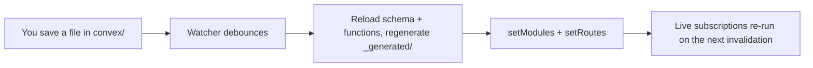

{/* diataxis: how-to */}

Think of `stackbase dev` as your app's dev server, except the backend behind it is the real one, not
a mock. One command loads your project, generates types, boots the actual reactive engine, and
serves it all on one port, with hot reload on every save.

This page is the full recipe: how to start it, every flag it takes, and what the built-in dashboard
does.

## Start the dev server

From your app's root (where `convex/` lives):

```bash
npx stackbase dev
```

Under the hood, one command does five things, in order:

1. **Loads your project.** It resolves `stackbase.config.ts` (component composition), then reads
   `convex/schema.ts` and every function file under `convex/`.
2. **Generates `convex/_generated/`**: the typed `api`/`Doc`/`Id` helpers your functions and client
   import.
3. **Boots the embedded engine** against a local SQLite database, or Postgres if you pass
   [`--database-url`](#flag-reference) (see below).
4. **Serves everything on one port**: the sync WebSocket (`/api/sync`), the `/api/*` HTTP surface,
   your `httpAction` routes, the `/_admin/*` admin API, and the dashboard at `/_dashboard`.
5. **Starts watching `convex/`** for changes and hot-reloads your functions on every save (see
   [Hot reload](#hot-reload) below).

On startup it prints the server URL, the dashboard URL, and the admin key:

```
stackbase dev → http://127.0.0.1:3000  (dashboard: http://127.0.0.1:3000/_dashboard)
admin key → 7f3a9c2e1b8d4f6a...
```

If you passed `--web <dir>`, it also prints a web UI URL (`web UI → http://127.0.0.1:3000/`). If the
dashboard package hasn't been built, the server still runs but prints a note instead of a dashboard
URL:

```
(dashboard SPA not built: run `bun run --filter @stackbase/dashboard build`)
```

The process runs until you kill it with `Ctrl-C`. There's no separate stop step.

## Flag reference

Here's every flag `stackbase dev` accepts:

| Flag | Default | What it does |
|---|---|---|
| `--port <n>` | `3000` | HTTP/WebSocket port. |
| `--ip <addr>` | `127.0.0.1` | Bind address. `127.0.0.1`, `::1`, and `localhost` all count as loopback (see [Admin key](#admin-key) below); anything else exposes the server on your network. |
| `--dir <path>` | `convex` | Where your schema and functions live. |
| `--data <path>` | `.stackbase/data.db` | SQLite database file path. Ignored when `--database-url` is set. |
| `--web <dir>` | unset | Serve a static web UI (a built frontend, for example) alongside the API. `GET` requests that don't match `/api/*`, `/_admin/*`, or `/_dashboard` fall through to files in this directory. |
| `--database-url <url>` | unset | A `postgres://` or `postgresql://` connection string. When set, stackbase uses Postgres instead of SQLite; see [Postgres](/docs/deploy/postgres). Also readable from `STACKBASE_DATABASE_URL`, though the flag wins. |
| `--storage-bucket <name>` | unset | Select the S3-compatible file storage backend (bucket name). Unset means local filesystem storage under `<data dir>/storage`. Also readable from `STACKBASE_STORAGE_BUCKET`. |
| `--storage-endpoint <url>` | unset | S3-compatible endpoint (MinIO, R2, and so on), only meaningful alongside `--storage-bucket`. Also readable from `STACKBASE_STORAGE_ENDPOINT`. |

A CLI flag always wins over its environment-variable equivalent when both are set.

<Callout type="warn" title="File storage is always on">

Every project gets a `_storage` system table and `ctx.storage`. There's no opt-in flag for it:
`--storage-bucket`/`--storage-endpoint` only choose which byte backend serves it.

Setting `STACKBASE_STORAGE_ENDPOINT`/`REGION`/`PUBLIC_URL` without a bucket is a misconfiguration,
and `stackbase dev` refuses to boot from it. Otherwise it would silently write uploads to local disk
when you meant to configure S3. Set the bucket too, or drop the other settings.

See [File storage](/docs/data/file-storage) for the full byte-storage story.

</Callout>

The dev server isn't reachable from your LAN by default. Pass `--ip 0.0.0.0` to expose it, useful for
testing from a phone on the same network, for example.

### Runtime selection

The runtime is auto-detected: Bun if you invoke the CLI under Bun, Node otherwise. There's no
`--bun`/`--node` flag. Run it with the runtime you want:

<Tabs items={['Bun', 'Node']}>

```bash tab="Bun"
bun stackbase dev
```

```bash tab="Node"
node stackbase dev
```

</Tabs>

Bun is the primary runtime here. Node is fully supported too.

The Node path uses the built-in `node:sqlite` module and requires **Node.js 22.5 or newer**. If you
see `Cannot find module 'node:sqlite'`, check your Node version.

## Admin key

Every admin-gated surface (the `/_admin/*` API the dashboard runs on, `/_admin/deploy`, `/_admin/wake`)
is protected by a single bearer token: the **admin key**.

- If `STACKBASE_ADMIN_KEY` is set in your environment, `stackbase dev` uses it as is.
- If it's unset, `stackbase dev` generates a fresh ephemeral key on every run and prints it to
  stdout. Nothing persists it. Restart the server and you get a new one.
- If `STACKBASE_ADMIN_KEY` is set but blank or whitespace, `stackbase dev` treats it as unset (a
  blank key would authenticate everything) and prints a warning before falling back to an ephemeral
  key.

<Callout type="warn" title="The key is only baked in on a loopback bind">

The ephemeral key is only ever embedded in the dashboard's served HTML when the bind is loopback:
`--ip 127.0.0.1` (the default), `::1`, or `localhost`.

On any other bind (`--ip 0.0.0.0`, a real network interface), the dashboard is served without the
key baked in, even if the key itself is ephemeral. The SPA prompts you for it instead, and the key
you type is kept in `sessionStorage`.

This is deliberate: an admin key baked into unauthenticated HTML is only safe when the only thing
that can reach that HTML is the same machine.

A persistent `STACKBASE_ADMIN_KEY` is never embedded in the HTML, loopback or not.

</Callout>

## Hot reload

`stackbase dev` watches `convex/` (recursively) via a filesystem watch, ignoring anything under
`convex/_generated/` so codegen's own writes don't re-trigger themselves. On every change, after a
short debounce, this is the loop:



In detail, it:

1. Re-loads and re-pushes your project (schema, functions, and composed components), catching load
   errors. A bad `schema.ts` or a syntax error prints `✗ reload failed: <message>` and leaves the
   previous, working set of functions running rather than crashing the server.
2. Re-writes `convex/_generated/` with the freshly generated types.
3. Calls `runtime.setModules(...)` with the new function map. This replaces the module map
   wholesale, so `stackbase dev` re-applies the always-on `_storage:*` built-in functions on every
   reload. They aren't part of your `convex/` source, so they'd otherwise vanish on the first save.
4. Calls `server.setRoutes(...)` with the freshly resolved `http.ts` routes, so `httpAction` changes
   take effect immediately too.

On success it prints `↻ pushed (<n> functions)`. Live subscriptions aren't dropped across a reload.
A client watching a query stays connected and gets re-run against the new function code the next
time something invalidates it.

## Generate types without starting a server

```bash
stackbase codegen
stackbase codegen --dir convex   # if your functions aren't in ./convex
```

This regenerates `convex/_generated/` and exits: no server, no watch loop. `stackbase dev` does this
automatically on every change. You need the explicit command before
[`stackbase serve`](/docs/deploy/self-hosting), which never runs codegen itself (it fails fast at
boot if `_generated/` is missing).

## Call a function without the dashboard

There's no `stackbase run` command. Either use the dashboard's [function runner](#function-runner),
or hit the HTTP API directly:

```bash
curl -X POST http://localhost:3000/api/run \
  -H 'content-type: application/json' \
  -d '{"path": "messages:list", "args": {"limit": 5}}'
```

The response is `{"value": …, "committed": …, "commitTs": "…"}`. `value` is the function's return
value (JSON-encoded), `committed` is whether a mutation's write actually landed, and `commitTs` is
the commit timestamp as a string, since timestamps don't fit in a JSON number. An `Authorization:
Bearer <token>` header, if present, is passed through as the call's identity unchanged. `/api/run`
does no token verification of its own.

There's also a plain health check, no auth required:

```bash
curl http://localhost:3000/api/health
# {"status":"ok","functions":12,"tables":4}
```

## The dashboard

Open the URL `stackbase dev` prints: `http://localhost:<port>/_dashboard`. In dev mode, on a loopback
bind, the admin key is embedded in the served HTML, so it opens straight into the app with no login
prompt (see [Admin key](#admin-key) above for when that's not true).

The dashboard has three views, reachable from the left sidebar: a **data browser** per table, a
**function runner**, and a **logs viewer**.

### Data browser

Select a table from the sidebar to open a live view of its documents:

- **Live via a real subscription.** The data browser opens a WebSocket admin session and subscribes
  to `_admin:browseTable`, an ordinary reactive query, the same mechanism any client uses. When a
  mutation commits a write that overlaps what's on screen, the table updates on its own. There's no
  manual refresh button and no polling.
- **Cursor pagination.** Prev/Next walk the table page by page using the same opaque-cursor contract
  every paginated query uses (see [Pagination](/docs/core-concepts/queries#pagination)). Pages stay
  contiguous even while the table is being written to concurrently.
- **Structured filters.** Add one or more `field / operator / value` conditions (`eq`, `ne`, `lt`,
  `lte`, `gt`, `gte`) and apply them to narrow the page. The filter re-issues the subscription with
  the new conditions rather than filtering client-side.
- **A `scanCapped` banner.** The underlying query caps its scan at 1,000 examined index entries per
  page. If a heavily-filtered query hits that cap before filling the page, the browser shows "Scan
  limit reached: narrow the filter to see all results" instead of silently returning a partial,
  possibly misleading page.
- **Row actions.** Click **Edit** to open a document's non-system fields in a JSON editor and save.
  This issues a real `PATCH` through the admin HTTP API (`/_admin/tables/<table>/docs/<id>`): an
  actual mutation against your database, not a preview. **+ New** creates a document the same way
  (`POST`), and **Del** removes one (`DELETE`). None of the three call `invalidateQueries`. The live
  subscription is what reflects the write, exactly like any other client watching that data would
  see it happen.
- **The table list itself** (the sidebar) loads once over plain HTTP (`GET /_admin/tables`) and only
  refreshes when you click its refresh icon. It is not a live subscription, so a table created or
  dropped by a schema change won't appear until you refresh it manually. Document counts and
  per-table contents inside a selected table, by contrast, are fully live.

### Function runner

Pick any query, mutation, or action from a dropdown (populated from `GET /_admin/functions`), edit
its arguments as JSON, and click **Run**. The result, or a thrown error's message, is shown as
formatted JSON below.

This calls the same `/_admin/run` admin endpoint under the hood as the `/api/run` HTTP call
described [above](#call-a-function-without-the-dashboard), just with a UI around it. No
`Authorization` header is needed since the admin key is already attached to every admin call.

### Logs

A table of recent function executions: path, kind (`query`/`mutation`/`action`), status, and
duration in milliseconds, refreshed every 2 seconds via `GET /_admin/logs`. A failed invocation
shows its error message inline next to the `error` status badge. This is a polling view, not a
subscription. It's meant for quick "did my last write actually run" debugging, not a durable log
store.

<Callout type="warn" title="Security note">

The dashboard has no authentication of its own beyond the admin key, and the admin key grants
unrestricted read/write access to your whole database, plus the ability to run any function.

That's the right tradeoff for local development, and it's why `stackbase dev` hands you the key with
zero friction on a loopback bind. But never expose an unprotected admin key over the network.

[`stackbase serve`](/docs/deploy/self-hosting) serves the same dashboard build in production, but
key-less by default (no key embedded in the HTML at all: it prompts you), and requires you to set a
real `STACKBASE_ADMIN_KEY` before it will even start.

</Callout>

## Related

- [Quickstart](/docs/get-started/quickstart): install stackbase and see the whole loop end to end.
- [Self-hosting with Docker](/docs/deploy/self-hosting): `stackbase serve`, the production
  counterpart of `stackbase dev` (no codegen, required admin key, binds `0.0.0.0`, dashboard served
  key-less).
- [Deploying without a restart](/docs/deploy/deploying): `stackbase deploy`, for pushing a schema
  and function change to an already-running `serve` without hot-reload's dev-only watch loop.
- [Queries](/docs/core-concepts/queries): the `.paginate()`/`scanCapped` contract the data browser
  itself relies on.
