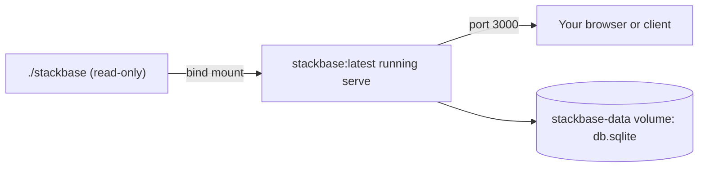

{/* diataxis: how-to */}

Think of `docker compose up` as the one command that starts your whole backend: the sync engine,
the HTTP API, any `httpAction` webhooks, and the dashboard, all in one container.

This is the baseline way to self-host stackbase. A generic `stackbase:latest` image runs
`stackbase serve`, your app's `stackbase/` folder is mounted in, and its SQLite database sits on a
named volume so data survives restarts.

This page covers `serve` itself (what it hardens versus `dev`, and every flag and environment
variable it reads), the shipped Docker setup and why its two non-obvious fixes exist, the
immutable-image alternative, and what's deliberately left to a reverse proxy.

## `stackbase serve`: the production entrypoint

`stackbase serve` is `stackbase dev` minus the file watcher and codegen-write, plus production
hardening.

Both share one boot core, `bootProject()` (`packages/cli/src/boot.ts`). It loads the project,
composes components, opens the store, and builds the `EmbeddedRuntime` and `AdminApi` with
byte-identical options either way: routes, drivers, boot steps, context providers, table numbers.

Nothing about how your functions run (schedulers, workflows, actions, `httpAction`s, triggers) is
`dev`-only or `serve`-only. Only the process-level behavior around that shared core differs:

| | `stackbase dev` | `stackbase serve` |
|---|---|---|
| Codegen | Runs on every change, writes `_generated/` | **Never runs**, fails fast if `_generated/` is missing |
| Bind address | Loopback (`127.0.0.1`) | `0.0.0.0` by default |
| Admin key | Ephemeral, auto-generated, embedded in the dashboard HTML | **Required** (`STACKBASE_ADMIN_KEY`), never embedded |
| File watching | Watches `stackbase/` and hot-reloads | None, restart (or `stackbase deploy`) to pick up changes |
| Shutdown | Ctrl-C exits immediately | `SIGTERM`/`SIGINT` trigger a graceful drain |

### Fail-fast checks, before anything binds

`serveCommand` validates two things up front, before opening the store or binding a port, and exits
`1` with a one-line, actionable message on either:

1. **`STACKBASE_ADMIN_KEY` must be set and non-blank.** There is no default and no fallback. A
   trimmed-empty value is treated as unset.

   ```text
   ✗ STACKBASE_ADMIN_KEY is required for `serve`: set it to a strong secret.
   ```

2. **`<dir>/_generated/server.ts` must already exist.** `serve` never runs codegen. That step
   belongs in your build/CI pipeline, not on every production boot. Generate it and commit it
   before deploying:

   ```bash
   stackbase codegen --dir stackbase
   ```

   ```text
   ✗ stackbase/_generated not found: run `stackbase codegen --dir stackbase` and commit _generated/ before deploying.
   ```

### Binding and graceful shutdown

`serve` binds `0.0.0.0` by default, versus `dev`'s loopback-only bind. It's meant to be reached from
outside the container or host, and a reverse proxy or the Docker port mapping is what actually
exposes it publicly.

`SIGTERM` and `SIGINT` both trigger the same idempotent shutdown sequence. It's safe to receive
twice: a second signal while shutting down is a no-op.

1. Stop the fleet node, if running one (`--fleet`).
2. `server.close()`: stops every registered driver (scheduler, triggers, reapers, wake heartbeats)
   and closes listening sockets.
3. Release any object-storage lease (`--object-store`), best-effort, bounded to 2 seconds so an
   unreachable bucket can't hang shutdown past a container's grace period.
4. `store.close()`: closes the database connection or file handle.
5. `process.exit(0)`.

This is what makes `docker compose down` / `docker stop` (which send `SIGTERM`, then `SIGKILL` after
a grace period) a clean stop rather than a killed process. The store is closed before exit, not left
in a torn state.

### What it serves

One process answers everything on one origin: the sync WebSocket, `/api/run` and `/api/action` HTTP
endpoints, `httpAction` routes from your app's `http.ts`, the always-on `/api/storage/*` file-serving
routes, any component-contributed routes (for example `@stackbase/auth`'s OAuth callbacks), and,
unless disabled, the dashboard SPA at `/_dashboard`.

### The dashboard is served key-less

Unlike `dev`, which embeds its ephemeral admin key directly into the dashboard's HTML (safe, because
that key only ever exists on loopback), `serve` calls `loadDashboard(undefined)`. The admin key is
**never** baked into the HTML the browser receives.

Instead, the dashboard SPA prompts you for the key on load. You paste in whatever you set
`STACKBASE_ADMIN_KEY` to, and it's used from then on to authenticate `/_admin` calls.

This matters because a `0.0.0.0`-bound `serve` is reachable by anyone who can reach the port.
Embedding a persistent secret in served HTML would leak it to any visitor, not just the operator.

## Flags and environment variables

Every `serve` option can be set as a CLI flag or an environment variable. Where both exist, **the
flag wins**.

`serve` reads env vars once at startup. There's no live reconfiguration, so restart to change any of
these.

| Flag | Env var | Default | What it does |
|---|---|---|---|
| `--dir <path>` | | `stackbase` | The app directory to load (schema, functions, `stackbase.config.ts`, `_generated/`). |
| `--data <path>` | `STACKBASE_DATA_DIR` (sets `<dir>/db.sqlite`) | `./data/db.sqlite` | SQLite database file path. Ignored when `--database-url` selects Postgres. |
| `--ip <address>` | | `0.0.0.0` | Bind address. |
| `--port <n>` | `PORT` | `3000` | Bind port. |
| `--no-dashboard` | `STACKBASE_DASHBOARD=off` | dashboard on | Disable the dashboard SPA entirely (not just hide it, the route isn't served). |
| `--allow-deploy` | `STACKBASE_ALLOW_DEPLOY=1` | off | Enable `POST /_admin/deploy`, the target of `stackbase deploy`'s live hot-swap. See [Deploy and build](/docs/deploy/deploy-and-build). |
| `--database-url <url>` | `STACKBASE_DATABASE_URL` | unset (SQLite) | Point at a Postgres database instead of the SQLite file. See [Postgres](/docs/deploy/postgres). |
| `--storage-bucket <name>` | `STACKBASE_STORAGE_BUCKET` | unset (local FS) | Selects the S3-compatible file-storage backend; presence of a bucket is what switches `ctx.storage` from local disk to S3/MinIO/R2. |
| `--storage-endpoint <url>` | `STACKBASE_STORAGE_ENDPOINT` | AWS default | Custom S3 endpoint (MinIO, R2, etc.), only meaningful alongside a bucket. |
| `--web <dir>` | `STACKBASE_WEB_DIR` | unset | Serve a static frontend (`index.html` + assets) at the site root, same origin as the sync WebSocket. |

`STACKBASE_ADMIN_KEY` is required and has no flag equivalent. That's deliberate: a secret belongs in
the environment, not in a process argument list visible via `ps`.

## Docker: the baseline self-host path

<Callout title="Before you start">

You need a `stackbase/` directory with **committed `_generated/`**. `serve` fails fast without it, as
covered above. Generate it before building the image:

```bash
stackbase codegen --dir stackbase
```

You also need Docker and Docker Compose.

</Callout>

<Steps>

<Step>

### Set a strong admin key

Put it in a `.env` file next to `docker-compose.yml`. Compose loads `.env` automatically:

```bash title=".env"
STACKBASE_ADMIN_KEY=$(openssl rand -hex 32)
```

The shipped `docker-compose.yml` requires this at the environment-variable level
(`STACKBASE_ADMIN_KEY: ${STACKBASE_ADMIN_KEY:?set STACKBASE_ADMIN_KEY in a .env file}`). Compose
itself refuses to start the container if the variable is unset, before `serve`'s own check ever
runs.

</Step>

<Step>

### Run `docker compose up`

```bash
docker compose up
```

The shipped `docker-compose.yml`:

```yaml title="docker-compose.yml"
services:
  stackbase:
    build:
      context: .
      target: runner
    image: stackbase:latest
    ports:
      - "3000:3000"
    environment:
      STACKBASE_ADMIN_KEY: ${STACKBASE_ADMIN_KEY:?set STACKBASE_ADMIN_KEY in a .env file}
      STACKBASE_DATA_DIR: /data
    volumes:
      - ./stackbase:/app/stackbase:ro
      - stackbase-data:/data
    command: ["serve", "--dir", "/app/stackbase", "--data", "/data/db.sqlite"]
    restart: unless-stopped

volumes:
  stackbase-data:
```

This builds the `runner` stage of the repo `Dockerfile`, binds the container to `0.0.0.0:3000`,
bind-mounts `./stackbase` **read-only** into `/app/stackbase`, and persists SQLite on the named
`stackbase-data` volume at `/data/db.sqlite`. The container's command is exactly
`serve --dir /app/stackbase --data /data/db.sqlite`.



</Step>

<Step>

### Open the dashboard

`http://localhost:3000/_dashboard`. Paste the admin key from `.env` when prompted (see "The
dashboard is served key-less" above for why it prompts instead of just working). The API itself is
reachable at `http://localhost:3000`: sync WebSocket, `/api/*` HTTP, `httpAction` routes, all on the
same origin.

</Step>

<Step>

### Confirm data survives a restart

The SQLite database lives on the `stackbase-data` Docker volume, not inside the container's
writable layer. `docker compose down && docker compose up` does not lose data. Only
`docker compose down -v` (which explicitly deletes volumes) does.

</Step>

<Step>

### Verify it end to end

```bash
# 1) Bring it up
docker compose up -d

# 2) Health check
curl -f localhost:3000/api/health
# {"status":"ok","functions":N,"tables":N}

# 3) Open the dashboard, paste the admin key from .env
open http://localhost:3000/_dashboard

# 4) Write some data via the dashboard or a mutation, then restart
docker compose down
docker compose up -d

# 5) Confirm the data written in step 4 is still there
```

</Step>

</Steps>

## Going deeper

<Accordions type="single">

<Accordion title="Why the image works: two non-obvious fixes">

The `Dockerfile`'s `runner` stage looks like a standard Turborepo/Bun slim-runner build (prune,
install, build, non-root copy). But two fixes exist specifically because of how a **bind-mounted**
app directory resolves modules and how a **fresh named volume** is owned. Both were caught only by
running a real container, not by any host-based test.

**1. Workspace packages are symlinked into the root `node_modules`**

`turbo prune --docker` (used in the `prepare` stage) plus Bun's install keep workspace
`@stackbase/*` package links **nested per-package**, for example
`/app/packages/cli/node_modules/@stackbase/executor`, never at `/app/node_modules`.

That's fine for code living inside a workspace package. But your bind-mounted `/app/stackbase` is not
under any package. Its bare `import "@stackbase/values"` (every `schema.ts`) and the
`_generated/server` module's re-export of `@stackbase/executor` resolve by walking **up** to
`/app/node_modules`, and find nothing there.

This broke the default bind-mount self-host path for every app until the `runner` stage was given
an explicit fixup:

```dockerfile title="Dockerfile"
RUN <<'EOF'
bun -e '
  const fs = require("fs");
  fs.mkdirSync("node_modules/@stackbase", { recursive: true });
  for (const base of ["packages", "components"]) {
    if (!fs.existsSync(base)) continue;
    for (const d of fs.readdirSync(base)) {
      const pj = base + "/" + d + "/package.json";
      if (!fs.existsSync(pj)) continue;
      const name = JSON.parse(fs.readFileSync(pj, "utf8")).name;
      if (!name || !name.startsWith("@stackbase/")) continue;
      try { fs.symlinkSync("/app/" + base + "/" + d, "node_modules/" + name); } catch {}
    }
  }
'
EOF
```

This walks every `packages/*` and `components/*` package's `package.json` and symlinks its
`@stackbase/*` name straight into `/app/node_modules/`, so a mounted (or baked-in) `stackbase/`
resolves its imports exactly the way it would in a normal workspace checkout.

**2. `/data` is chowned to the non-root `bun` user before dropping privileges**

The `runner` stage runs as the image's built-in non-root `bun` user (uid 1000), and `/data` is a
`VOLUME`. A **fresh** named volume inherits the ownership of the directory it's mounted over at
image build time: `root:root`, since the `COPY --chown=bun:bun` earlier in the stage only chowns
the copied application files, not directories created afterward.

Without an explicit fix, uid-1000 `bun` can't create `/data/db.sqlite` (`EACCES`), and the container
crash-loops on the **very first** `docker compose up` under `restart: unless-stopped`. The fix runs
while still root, before `USER bun`:

```dockerfile title="Dockerfile"
RUN mkdir -p /data /app/.stackbase-deploy && chown bun:bun /data /app /app/.stackbase-deploy
USER bun
```

(The same `RUN` also creates and chowns `/app/.stackbase-deploy`, the scratch directory
`stackbase deploy`'s push target writes to. It's the same class of bug: `/app`'s directory node
itself is still root-owned after the earlier `COPY` chowned only its *contents*.)

Both fixes are guarded against regression by a text-assertion test
(`packages/cli/test/docker-config.test.ts`) that checks for the symlink script and the `chown`
line. But the underlying bugs were only found by actually running `docker compose up` against a
real fixture app, not by any test that runs on the host.

**Both container deploy paths, the bind-mount path and the immutable-image path, have been
smoke-verified end to end against a real container**: build, boot as non-root, `/api/health`, a
committing mutation via `POST /api/run`, read-back, data surviving a container recreate on the
volume, and the dashboard served key-less.

</Accordion>

<Accordion title="Bake the app into an immutable image">

The default compose file bind-mounts `stackbase/` at run time. That's convenient for local
self-hosting, but the image alone isn't a deployable artifact: it's empty without the mount.

For an immutable image, one you can push to a registry and deploy elsewhere without carrying a
separate `stackbase/` directory around, build a small wrapper `Dockerfile` on top of
`stackbase:latest` that copies your app in instead of mounting it:

```dockerfile title="Dockerfile"
FROM stackbase:latest
COPY ./stackbase /app/stackbase
# ENTRYPOINT/CMD are inherited from stackbase:latest:
#   serve --dir /app/stackbase --data /data/db.sqlite
```

```bash
docker build -t myapp:latest .
docker run -p 3000:3000 -e STACKBASE_ADMIN_KEY=... -v stackbase-data:/data myapp:latest
```

Because the root-`node_modules` symlink fixup above is part of the base `stackbase:latest` image
(baked into the `runner` stage, not something the bind-mount does at run time), a `COPY`ed
`stackbase/` resolves its `@stackbase/*` imports exactly the same way a mounted one does. No extra
step is needed in the wrapper `Dockerfile`.

</Accordion>

<Accordion title="Multi-node and object-storage flags (advanced)">

`serve` also accepts `--fleet`/`STACKBASE_FLEET`, `--advertise-url`, `--object-store`,
`--replica`, `--shards`, and related knobs. These select the multi-node write-scaling story
(`ee/`-licensed) or the object-storage substrate. Both are their own tier above the single-node
baseline this page covers. See [Scaling](/docs/deploy/scaling) and
[Cloudflare](/docs/deploy/cloudflare) for those.

`--fleet` and `--object-store` are mutually exclusive; neither is needed to self-host a single node
with `docker compose up`.

</Accordion>

</Accordions>

## Using Postgres

SQLite is the zero-config default. Point `serve` at Postgres instead with `--database-url` or
`STACKBASE_DATABASE_URL`. No other change to the compose file's shape is required beyond swapping
the SQLite volume for the connection string.

Postgres is a **single-node durability** upgrade (a managed database instead of a SQLite file on a
volume) via a `pg_advisory_lock` single-writer guard, not multi-node scale-out. It needs no
app-schema migrations as `schema.ts` evolves. See [Postgres](/docs/deploy/postgres) for the full
compose example, the single-writer constraint, and its known limitations.

## Other platforms (Railway, Fly.io)

Any platform that can run a long-lived process with WebSocket support and a persistent disk can
host `stackbase serve`; Docker is the baseline, not a requirement. The checklist is always the
same: set `STACKBASE_ADMIN_KEY` as a platform secret (never in a config file), mount a persistent
volume for the data directory, and point health checks at `GET /api/health`.

<Tabs items={['Railway', 'Fly.io']}>

<Tab value="Railway">

```toml title="railway.toml"
[build]
builder = "nixpacks"

[deploy]
startCommand = "stackbase serve --dir ./stackbase --data /app/data/db.sqlite"
healthcheckPath = "/api/health"
healthcheckTimeout = 30

[[mounts]]
source = "data"
destination = "/app/data"
```

Set `STACKBASE_ADMIN_KEY` in the service's Railway variables. Railway terminates TLS for you.

</Tab>

<Tab value="Fly.io">

```toml title="fly.toml"
app = "my-stackbase-app"
primary_region = "iad"

[mounts]
source = "data"
destination = "/app/data"

[http_service]
internal_port = 3000
force_https = true

[[http_service.checks]]
interval = "10s"
timeout = "2s"
path = "/api/health"
```

Set the secret with `fly secrets set STACKBASE_ADMIN_KEY=...`, and start the process as
`stackbase serve --dir ./stackbase --data /app/data/db.sqlite`. Fly terminates TLS at its edge.

</Tab>

</Tabs>

A managed Postgres on either platform works through the same `STACKBASE_DATABASE_URL` as anywhere
else. Both platforms also have an automated push path: `stackbase deploy --target railway` and
`--target fly` shell out to the platform's own CLI (`railway up`, `fly deploy`) after refreshing
codegen. See [Deploy and build](/docs/deploy/deploy-and-build#the-six-deploy-targets).

## Reverse proxy / TLS

<Callout type="warn" title="No built-in TLS">

stackbase serves plain HTTP. `serve` has no TLS termination built in. Put a reverse proxy (nginx,
Caddy, or Traefik) in front of the container to terminate TLS and forward to `stackbase:3000`.

The sync WebSocket and `httpAction` routes both proxy transparently over standard HTTP upgrade. No
special configuration is needed beyond normal WebSocket passthrough in your proxy of choice.

</Callout>

## Related

- [Postgres](/docs/deploy/postgres): swap the SQLite volume for a Postgres database, still
  single-node.
- [Deploy and build](/docs/deploy/deploy-and-build): `stackbase deploy` for live hot-swap onto a
  running `serve` (no restart, `--allow-deploy` opt-in), and `stackbase build` for a single
  self-contained binary instead of a runtime-based image.
- [Scaling](/docs/deploy/scaling): when one `serve` process isn't enough, the multi-node fleet
  story (`--fleet`) built on the same Postgres backend.
- [Cloudflare](/docs/deploy/cloudflare): an alternative host if you specifically want Cloudflare's
  edge/scale-to-zero economics.
