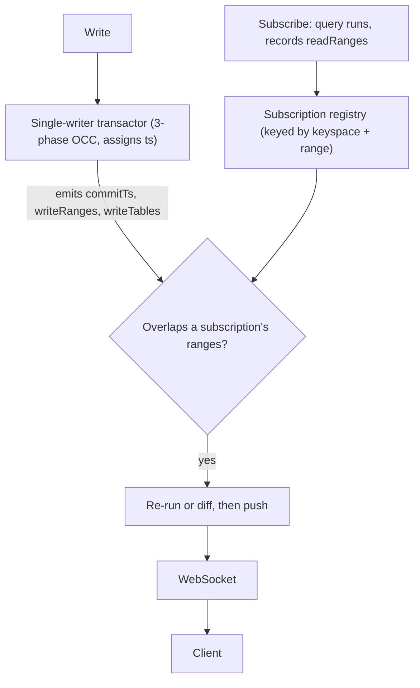

{/* diataxis: explanation */}

Reactivity in stackbase is not magic, and it is not polling. It comes from one idea: **the engine
records what each query reads, records what each mutation writes, and refreshes a query only when
the two overlap.**

Everything else on this page (the data model, the commit protocol, the matcher that finds affected
subscriptions without scanning every live one, and the determinism rule) follows from getting that
one idea right.

## Read sets: what a query actually records

When a query runs, the engine watches every read it makes and remembers it as a **read set**. Not
"the `messages` table," but the exact keyspace (table and index) and **key range** the scan covered.

```ts title="convex/messages.ts"
export const list = query({
  args: { conversationId: v.id("conversations") },
  handler: (ctx, args) =>
    ctx.db
      .query("messages", "by_conversation")
      .eq("conversationId", args.conversationId)
      .collect(),
});
```

This handler's read set is not "reads `messages`." It's the single narrow span of the
`by_conversation` index belonging to *this* `conversationId`. `.gt`/`.gte`/`.lt`/`.lte` narrow it to
a bound instead of a single key. `ctx.db.get(id)` records a range that is a single point.
`ctx.db.query(table, index).collect()` with no `.eq`/bound at all records the whole index interval:
a read set as wide as the index itself.

Not every read can be expressed as a bounded range. A query whose predicate the planner can't turn
into a key range still gets a read set, but it degrades to **table-level**: any write to that table
invalidates it. This isn't a mode you opt into. It's simply what happens when a read can't be bounded
to a range. The narrower your query, the narrower its read set, and the fewer writes can ever touch
it.

## Write sets: mutations are the only writers

Every write goes through a mutation, and a mutation's entire handler runs as one **serializable
transaction**: every read inside it sees a consistent snapshot, every write it makes is invisible to
everyone else until the handler returns, and then it all lands together or none of it does. On
commit, the engine computes the mutation's **write set**: exactly which rows (as key ranges) it
inserted, replaced, or deleted.

```ts title="convex/messages.ts"
export const send = mutation({
  args: { conversationId: v.id("conversations"), author: v.string(), body: v.string() },
  handler: (ctx, args) => ctx.db.insert("messages", args),
});
```

This mutation's write set is the one row it inserted, in the `by_conversation` range for that
`conversationId`. That's the same keyspace shape a read set is expressed in, and the symmetry is what
makes intersection possible: a read set and a write set are the same kind of object (keyspace and
range), so comparing them is a range-overlap check, not a semantic guess about what a query "means."

Commits are serialized through a single logical writer per shard (see [The single-writer
ceiling](#the-single-writer-ceiling-and-how-it-scales) below) under **3-phase optimistic concurrency
control**:

1. **Validate**: has any commit landed since this mutation's snapshot that wrote something this
   mutation *read*? The check runs against the mutation's own validated read set (built from every
   `ctx.db.get`/`.collect()`/`.paginate()` call the handler made), not a lock taken up front. The
   handler runs optimistically, without blocking other commits.
2. **Allocate**: if validation passes, the store allocates one commit timestamp, atomically, inside
   its own atomicity domain, so there's never a window where a timestamp is allocated but not yet
   landed.
3. **Apply**: every staged row lands at that timestamp in one atomic batch, and the write set is
   emitted for the reactive fan-out.

If validation fails (a conflicting write landed first), the engine throws a conflict error and the
caller **replays the mutation's handler from scratch** against the new snapshot. This is only safe
*because* mutations are deterministic (see [The determinism contract](#the-determinism-contract)
below): replaying the same deterministic code against fresh data is guaranteed to reproduce a correct
result, not a guess.

## The data model: an append-only MVCC log

Underneath both read sets and write sets is one data structure: an append-only, timestamp-ordered log
of document revisions. Every write is a new log entry, never an in-place mutation of an old one:

```
{ ts, id, value, prev_ts }
```

- **`ts`**: the commit timestamp this revision was written at.
- **`id`**: the document's internal id.
- **`value`**: the document's full contents at this revision, or `null` for a tombstone (delete).
- **`prev_ts`**: the timestamp of this document's previous revision, forming a backward chain per
  document.

A snapshot read at timestamp `T` is "the newest revision of this document with `ts <= T`." This is
what makes a mutation's snapshot isolation cheap: reading "as of `T`" is a property of the log, not a
lock. The OCC validation phase above walks exactly this `prev_ts` chain to detect a conflicting write.

This log-shaped model is why stackbase is **physically schemaless** on both of its storage adapters.
`schema.ts` describes what your app *expects* to find in a table. It is not a `CREATE TABLE` statement
the engine executes. App tables and fields are data rows in this one log, not DDL objects in the
underlying database, so there is no migration step as `schema.ts` evolves, whether you're running on
SQLite or on Postgres.

One SQLite database (a small fixed set of physical tables backing the document log, the index log,
and a globals store) or one Postgres database (the same shape) can hold every logical table your
schema declares, discriminated by table/id columns and versioned by `ts`. The engine never generates
or runs DDL for your tables, and it never leaks which store it's talking to. That's the point of the
storage adapter seam: anything that can do an ordered, point-in-time range scan qualifies as a
backend.

## Reactivity is the intersection

This is the heart of the system. A subscription is a query plus the read set it recorded when it
last ran. When a mutation commits with write set `W`, the engine finds every live subscription whose
read set **intersects** `W`, re-runs (or diffs, see [Beyond
re-run](#beyond-re-run-differential-log-tail-reactivity) below) exactly those, and pushes the new
result.

Every other subscription (including ten thousand others on the same table but a different key range)
is untouched: not re-run, not even inspected individually.

There is no polling loop, no manual cache invalidation, and no pub/sub topic to wire up by hand. The
intersection *is* the notification.



Send a message to conversation A: the subscription watching conversation A refreshes. The thousand
subscriptions watching other conversations never run. Their read sets don't overlap the write.

## The determinism contract

This model only works if re-running a query (or replaying a mutation) is trustworthy. If a handler
could return a different answer for the same data (because it read the clock, generated a random
value, or made a network call), the engine couldn't reason about whether its result really changed. A
subscription could show stale or wrong data. A replayed mutation could double-charge a card it
already charged once.

So queries and mutations run under a frozen capability profile that makes non-determinism
unreachable, not just discouraged:

| Capability | Query / Mutation | Action |
|---|---|---|
| `ctx.db` reads | yes | no (`ctx.runQuery` only) |
| `ctx.db` writes | mutation only | no (`ctx.runMutation` only) |
| Randomness | **seeded**: `ctx.random()`, a deterministic PRNG fixed for the transaction's lifetime | native `Math.random()`/`crypto` |
| Clock | **forbidden**: no `Date.now()`; use `ctx.now()`, fixed for the transaction's lifetime | native `Date.now()` |
| Network | **forbidden**: no `fetch` | native `fetch` |

`ctx.now()` and `ctx.random()` exist precisely so a handler that genuinely needs "the current time"
or "a random value" can have one. It's just fixed for the life of that transaction (and any OCC replay
of it), so the same inputs always produce the same read set, write set, and result. Anything that
can't be made deterministic this way (a real network call, a webhook, sending an email) belongs in an
[action](/docs/core-concepts/actions), which runs *outside* the transaction with native capabilities,
has no read set or write set of its own, and is never part of a subscription.

## Finding affected subscriptions without scanning all of them

Computing "does this write's range overlap this subscription's range" for *one pair* is cheap. Doing
it against every live subscription, on every write, is not. An early benchmark caught exactly that
cost: at 10,000 live subscriptions, a write that should touch **exactly one** subscriber
(`subsMatchedAvg = 1.0`) still cost **9.14 ms p50 / 12.97 ms p99**. Deciding which subscription to
re-run required inspecting all 10,000, not just the one that mattered, so write throughput degraded
with subscription count, independent of how selective any individual write actually was.

The fix is a data-structure change, not more threads. Read ranges are indexed in a **per-keyspace
augmented interval tree** (a treap keyed by range start, each node carrying its subtree's maximum
end), bucketed first by keyspace, since a write range can only ever overlap subscriptions on the
*same* table-and-index. A write range's affected subscriptions are then found by a tree query, not a
sweep of every live subscription: cost scales with the number of matches, not the number of
subscribers. Subscriptions on the table-level fallback path (above) are kept in a separate per-table
set and matched directly. It's cheap, just coarse in what triggers them.

The same benchmark, re-run after indexing, shows the effect directly on that pathological cell:

| subscriptions | before (linear scan) | after (interval-indexed) |
|--------------:|----------------------:|---------------------------:|
| 10,000 (one write, one matching subscriber) | 6.72 ms p50 | 0.24 ms p50 (−96.4%) |

A deployment holding tens of thousands of live subscriptions now pays for the write it actually made,
not for the subscriptions it didn't touch.

## Beyond re-run: differential log-tail reactivity

The mechanism above answers *which* subscriptions to recompute. What a recomputed subscription
actually receives is either a full re-run of its query handler, or, for the common, narrow shapes a
subscription's read set can take, an incremental **diff** instead of a full result.

Stackbase's queries are arbitrary imperative TypeScript, not a declarative query language, so there is
no operator graph to update incrementally the way a fully compiled dataflow engine would. The query
handler itself stays exactly what you wrote. What changes is what happens *around* it:

1. **Classify**: at subscribe time, a subscription whose read set is a single `ctx.db.get(id)`
   point-read, or a single bounded index range/page, is marked diffable. Anything else (a filter the
   planner can't express as a range, a multi-range read) falls back to the full re-run path. This is a
   safe default: misclassifying something as "must re-run" never produces wrong data, only a wider
   payload.
2. **Re-run is always the ground-truth oracle**: a diffable subscription's incremental changes are
   still computed *from* a real re-run of the affected range, never invented from the write alone, so
   a diff can never diverge from what a full re-run would have produced.
3. **Drift checksum**: every diffable subscription's materialized rows carry an order-independent
   checksum, computed identically on server and client. If a client's checksum ever mismatches the
   server's (a missed message, a client-side bug), that one subscription resyncs. It never silently
   serves stale or wrong data.
4. **Shared apply**: the same `applyChanges(rows, changes)` function materializes a diff into a row
   map on both the server (to compute the next checksum) and the client (to update the UI), so the two
   sides cannot drift in how a diff is interpreted.
5. **Log-ts resume**: because the underlying data model is already an ordered, timestamped log,
   resuming a subscription after a reconnect is a question the log answers directly: "has anything
   changed since timestamp `T`?" A client that already holds an unchanged result gets back a tiny
   marker instead of a full resend.

The net effect: unchanged data on reconnect and narrow, targeted writes cost proportionally little.
Stackbase never compiles your query into anything other than the TypeScript function you wrote.

## The syscall boundary is isolate-ready

User code never touches storage, indexes, or the transaction directly. Every `ctx.db` call crosses a
narrow syscall boundary (a string operation name plus a JSON argument) into a host-side kernel that
dispatches to the real transaction/query-engine/index machinery. Because that boundary is pure JSON
strings in both directions, the same host-side handlers work whether the guest executing your function
is today's in-process inline executor or, later, a real V8 isolate with its own globals. The boundary
doesn't need to change shape to support hard sandboxing, only the guest side does.

That separation is also where the determinism profiles above are enforced today. The inline executor
wires a seeded PRNG and a fixed transaction-time clock into `ctx`, and simply never grants `fetch` or
`Date.now()` to a query/mutation's context. True per-function global sandboxing (overriding the
guest's own `Math.random`/`Date.now`/`fetch` at the JS-engine level, for hard multi-tenant isolation)
is the job of a V8-isolate executor as a drop-in successor to the inline one. The syscall ABI is
already shaped so that swap doesn't touch the host side.

## The single-writer ceiling and how it scales

Every commit passes through one logical writer *per shard*: the 3-phase OCC pipeline above is
strictly serialized, one commit at a time, because serializing writes is precisely what makes conflict
validation cheap and the commit log's timestamp ordering meaningful. That means write throughput on a
single shard has a ceiling. You cannot get more total write throughput by adding threads or CPU cores
to one writer, because the writer's whole job is to be the one place writes are totally ordered.

The scaling lever is therefore **sharding, not concurrency**: the platform can shard writes by
application/namespace so each shard has its own single-writer transactor and its own commit log, and
total write throughput scales by adding shards. This is also why the reactive fan-out path itself
turned out to be **I/O-bound, not CPU-bound**, once measured against a real network-attached store
(Postgres) rather than in-memory SQLite: the core mostly waits on round-trips rather than saturating a
single thread, which is why the fix for fan-out cost above was an indexed matcher, not parallel worker
threads. See [Scaling](/docs/deploy/scaling) for how sharding is configured in a real deployment.

## The whole loop, restated

1. A client **subscribes** to a query. The engine runs it, records its read set (as precise
   keyspace/range pairs, or a table-level fallback), and returns the result.
2. Later, a **mutation commits**. Its handler ran as one serializable transaction, validated against
   its own read set via 3-phase OCC (replaying on conflict), and its write set is computed on commit.
3. The engine looks up which subscriptions the write set touches, via the interval-indexed matcher,
   not a scan of every live subscription.
4. Each affected subscription is **re-run or diffed and pushed** over the WebSocket connection; every
   other subscription is untouched.

That is the entire reactive core. [Schema & tables](/docs/core-concepts/schema-and-tables),
[Queries](/docs/core-concepts/queries), [Mutations](/docs/core-concepts/mutations), and
[Reactivity](/docs/core-concepts/reactivity) build the day-to-day API surface on top of it. But if you
understand this loop, you understand stackbase.
