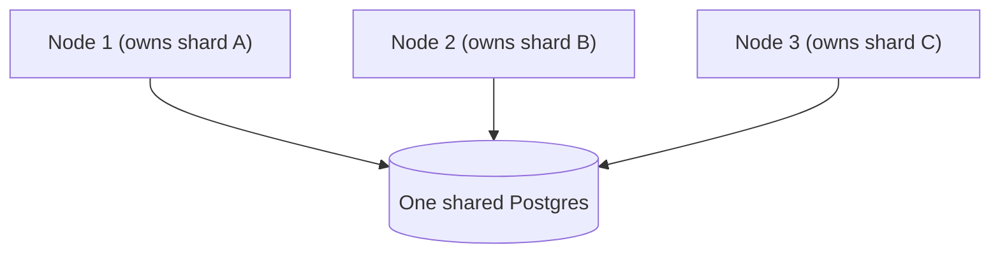

{/* diataxis: explanation */}

stackbase's performance is measured, not asserted. Every number on this page comes from a reproducible benchmark you can run yourself (`bun run bench:*`), reported with the conditions it was measured under.

The short version: a clean-room TypeScript engine that lands in the same league as the Rust reference implementation it's modeled on (Convex), with fast reactive push and honest, well-understood ceilings on one node and across many.

## How to read these numbers

Benchmarks are easy to get wrong, usually by accident, by comparing two things under different conditions. The classic trap: run your own system natively and the competitor inside a Docker container (which adds real overhead on a Mac), and you'll look dramatically faster. But you've measured the container, not the software.

<Callout type="warn" title="A benchmark we had to redo">

An early stackbase-vs-Convex run did exactly this and showed a 60x win. That win evaporated the moment both systems were put in identical containers.

</Callout>

So, reading this page:

- Numbers are from a single machine. Treat them as a ballpark, not a guarantee for your hardware.
- Comparisons are same-substrate (both systems in identical containers) or they're not reported.
- The honest headline is almost never "we beat X." It's "we're in the same ballpark, here's the cost of each feature, and here's the next ceiling."

Every result links to its full write-up, and [Reproduce it yourself](#reproduce-it-yourself) shows how to run each axis.

## Reactive push latency

The core product is push: when a mutation commits, every client subscribed to affected data gets the new result over its live connection. End to end, from a write committing to a watcher receiving the push, over a real network, that takes about 4 ms. Effectively instant.

In a fair, same-container comparison against Convex (measuring propagation p50):

| | stackbase | Convex |
|---|---|---|
| push latency (propagation p50) | **8.6 ms** | 13.4 ms |

The headline here isn't "faster than Convex." It's that a clean-room TypeScript engine landed in the same range as a polished commercial system written in Rust, which validates the architecture. Convex is more feature-complete and does more per operation, so "faster in one test on one laptop" doesn't mean "better."

**Fan-out stays cheap at scale.** A write only has to notify the subscriptions whose data it actually touched. The matcher that finds them is index-backed (an augmented interval tree), so it stays sub-millisecond even at 10,000 live subscriptions: matching cost grows with the log of the subscription count, not linearly. An earlier linear-scan version took about 9 ms at 10,000 subscriptions on a selective write. The interval-indexed matcher brought that down to about 0.24 ms.

## Write throughput

Every write is one serializable transaction through a single writer, one at a time, in strict order, so two writes can never clash and corrupt data. That's a correctness choice, and it shapes the numbers: on one node, throughput is a fixed rate, and concurrency adds queueing (waiting), not speed.

Measured against Convex (mutations per second, both containerized):

| simultaneous writers | stackbase | Convex |
|---|---|---|
| 1 | **2,321** | 353 |
| 16 | 1,553 | 365 |
| 32 | 1,849 | 279 |

Throughput stays roughly flat as writers pile up. That's the single-writer signature, and it's true for both systems. The difference: Convex enforces a hard cap of 16 concurrent writers, and throughput drops past it, while stackbase has no such wall and degrades gently instead.

**The overhead is lean.** stackbase adds history, reactivity, and safety around every write. Measured as three rungs of the same write on one machine:

| what | writes/sec |
|---|---|
| raw `INSERT` (bare database) | 1,980 |
| store commit (append-only history, no engine logic) | 561 |
| full mutation (your function + validation + indexes + history) | 464 |

The gap from raw to store commit (about 3.5x) is the cost of never overwriting. stackbase appends every version to an MVCC log, which is what makes time-travel and reactivity possible, and that cost is unavoidable by design. The gap from store commit to a full mutation is only +21%, and that's all the engine's own logic: running your function, validating, maintaining indexes. A wasteful engine would show a huge gap there. +21% means the reactive layer is efficient, not bloated.

## Connection scale

One sync node holds 10,000 concurrent subscribed connections, fully clean (every socket connected, zero failures), at about 7.69 KB per connection. That's roughly 73 MB of server memory at rest, rising to about 148 MB for all 10,000 live subscriptions. Idle CPU at 10,000 connections: 0.4%.

At that point the node wasn't the limit. Memory per connection keeps falling as the count grows (shared query state amortizes), so the ceiling is well above 10,000 on a single node.

## Scaling out across nodes

A single node's write rate is a fixed ceiling. To go past it, stackbase's Tier-2 fleet runs across multiple nodes with the data sharded: each node owns a set of shards and writes them independently, truly in parallel (see [Scaling](/docs/deploy/scaling)).



Total write throughput as nodes are added, each owning its own shards:

| nodes | total writes/sec | speed-up |
|---|---|---|
| 1 | 675 | 1.0x |
| 2 | 943 | 1.4x |
| 3 | 1,180 | **1.75x** |

Adding servers genuinely adds capacity. You're no longer stuck at one node's ceiling. But 3 nodes give 1.75x, not 3x, because in this configuration every node still writes to one shared Postgres, as the diagram above shows. The bottleneck moved from "one writer" to "one shared database." Splitting the database itself, so each shard has its own storage, is a known future direction, not yet built. This is honest sublinear scale-out: real, with a clearly identified next ceiling.

## Reconnect efficiency

When a client reconnects, it doesn't refetch everything. Each still-subscribed query echoes a fingerprint of what it last saw, and an unchanged query answers with a tiny "unchanged" marker instead of resending the full result, roughly a 99% reduction in reconnect bandwidth for unchanged data in the benchmark's ceiling case. This is automatic, with no configuration.

## The honest limits

- **One writer per node.** Single-node write throughput is a fixed rate; concurrency queues rather than parallelizes. This is a correctness guarantee, not a bug.
- **Multi-node scale-out is currently sublinear** (about 1.75x at 3 nodes) because nodes share one Postgres. True linear scaling needs per-shard storage, which isn't built yet.
- **Numbers are single-machine ballparks.** Your hardware, network, and workload will differ. Run the benchmarks on your own substrate before relying on any figure.

## Reproduce it yourself

The benchmark harness lives in `benchmarks/` and runs from the repo:

```bash
bun run bench:reactive       # reactive push latency + fan-out
bun run bench:writes         # write throughput + overhead + group commit
bun run bench:connections    # concurrent-connection scale
bun run bench:compare        # percentage-delta comparison vs a saved baseline
```

The same-substrate Convex comparison harness is under `benchmarks/convex-comparison/`. The full write-ups, including the methodology lessons behind every caveat above, are in `benchmarks/docs/` and `docs/dev/research/` (the reactive fan-out, the Convex comparison, multi-node throughput, and the connection-scale findings each have their own report).
