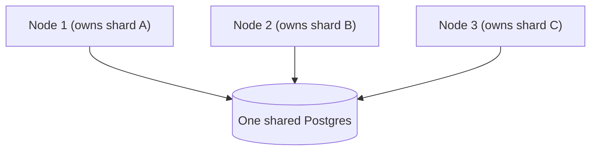

{/* diataxis: explanation */}

stackbase's performance is measured, not asserted. Every number on this page comes from a reproducible benchmark you can run yourself (`bun run bench:*`), reported with the conditions it was measured under.

The short version: a clean-room TypeScript engine that lands in the same league as the polished commercial Rust backend it's modeled on, with fast reactive push and honest, well-understood ceilings on one node and across many.

## How to read these numbers

Benchmarks are easy to get wrong, usually by accident, by comparing two things under different conditions. The classic trap: run your own system natively and the competitor inside a Docker container (which adds real overhead on a Mac), and you'll look dramatically faster. But you've measured the container, not the software.

<Callout type="warn" title="Ballparks, not guarantees">

An early run against a commercial competitor fell into exactly that trap and showed a 60x win. The win evaporated the moment both systems were put in identical containers. So, on this page: comparisons are same-substrate (both systems in identical containers) or they're not reported. Numbers come from a single machine; Docker Desktop on macOS taxes absolute latency, loopback has no WAN jitter, and several cells are co-located rather than genuinely distributed. The *shapes* (single-writer flatness, sub-linear scale-out, log-scaling fan-out) hold on other hardware. The absolute milliseconds will differ, so run the benchmarks on your own substrate before relying on any figure.

</Callout>

The honest headline is almost never "we beat X." It's "we're in the same ballpark, here's the cost of each feature, and here's the next ceiling." [Reproduce it yourself](#reproduce-it-yourself) shows how to run each axis.

## The numbers, by benchmark family

<Tabs items={['Reactive push', 'Writes & Postgres', 'Scaling out', 'Connections', 'Offline & reconnect', 'Cloudflare']}>

<Tab value="Reactive push">

The core product is push: when a mutation commits, every client subscribed to affected data gets the new result over its live connection. End to end, from a write committing to a watcher receiving the push, over a real network, that takes about 4 ms. Effectively instant.

In a fair, same-container comparison against a commercial Rust backend (50 subscribers, matched app):

| metric | stackbase | commercial baseline |
|---|---|---|
| propagation p50 | **8.6 ms** | 13.4 ms |
| propagation p99 | **13.7 ms** | 27.3 ms |

The headline here isn't "faster than the incumbent." It's that a clean-room TypeScript engine landed in the same range as a polished commercial system written in Rust, which validates the architecture. That system is more feature-complete and does more per operation, so "faster in one test on one laptop" doesn't mean "better."

**Fan-out stays cheap at scale.** A write only notifies the subscriptions whose data it actually touched. The matcher that finds them is index-backed (an augmented interval tree), so it stays sub-millisecond even at 10,000 live subscriptions. An earlier linear-scan version took about 6.72 ms p50 at 10,000 subscriptions on a selective write; the interval-indexed matcher brought that down to about 0.24 ms.

</Tab>

<Tab value="Writes & Postgres">

Every write is one serializable transaction through a single writer, one at a time, in strict order, so two writes can never clash and corrupt data. That's a correctness choice, and it shapes the numbers: on one node, throughput is a fixed rate, and concurrency adds queueing (waiting), not speed.

Measured against the same commercial backend (mutations per second, both containerized):

| simultaneous writers | stackbase | commercial baseline |
|---|---|---|
| 1 | **2,321** | 353 |
| 16 | 1,553 | 365 |
| 32 | 1,849 | 279 |

Throughput stays roughly flat as writers pile up. That's the single-writer signature, and it's true for both systems. The difference: the commercial baseline enforces a hard cap of 16 concurrent writers, and throughput drops past it, while stackbase has no such wall and degrades gently instead.

**The overhead is lean.** stackbase adds history, reactivity, and safety around every write. Measured as three rungs of the same write on one machine:

| what | writes/sec |
|---|---|
| raw `INSERT` (bare database) | 1,980 |
| store commit (append-only history, no engine logic) | 561 |
| full mutation (your function + validation + indexes + history) | 464 |

The gap from raw to store commit (about 3.5x) is the cost of never overwriting. stackbase appends every version to an MVCC log, which is what makes time-travel and reactivity possible, and that cost is unavoidable by design. The gap from store commit to a full mutation is only +21%, and that's all the engine's own logic: running your function, validating, maintaining indexes. A wasteful engine would show a huge gap there.

**Group commit** batches concurrent commits into shared fsyncs on Postgres, where the fsync dominates each commit's cost: **+39% throughput at 8 clients, +58% at 64**, neutral at 1 client. It's on by default on Postgres and off by default on SQLite, where there's no fsync to amortize and it's a net loss.

**Streaming reads on Postgres** (added in 1.7.0): paginated and limited reads (`.paginate()`, `.take(n)`) stream from a server-side cursor that stops fetching the moment the query engine has enough, instead of materializing the whole index range. Measured at 100k rows on the paginated shape: **−92% p50 wall-clock** and roughly 1000x fewer rows fetched. On by default, with a `STACKBASE_PG_STREAM=0` kill switch.

</Tab>

<Tab value="Scaling out">

A single writer's rate is a fixed ceiling. Two levers push past it, both built on sharding: run more shards in one process, or spread shards across a fleet of nodes (see [Scaling](/docs/deploy/scaling)).

**Single-node sharding** (Postgres, in-process): **~2.6 to 2.85x total write throughput at 8 shards**, sub-linear with a knee around 4 shards because every shard still shares one Postgres WAL.

**Multi-node fleet** (each node owning its own shards, one shared Postgres):



| nodes | total writes/sec | speed-up |
|---|---|---|
| 1 | 675 | 1.0x |
| 2 | 943 | 1.4x |
| 3 | 1,180 | **1.75x** |

Adding servers genuinely adds capacity. But 3 nodes give 1.75x, not 3x, because every node still writes to one shared Postgres. The bottleneck moved from "one writer" to "one shared database." Splitting the database itself, so each shard has its own storage, is a known future direction, not yet built. This is honest sublinear scale-out: real, with a clearly identified next ceiling.

Reactivity crosses the fleet too: when a writer on one node commits, a subscriber connected to a *different* node receives the push at **~15 to 16 ms p50**, flat across fleet widths of 1, 2, and 4 nodes.

</Tab>

<Tab value="Connections">

One sync node holds 10,000 concurrent subscribed connections, fully clean (every socket connected, zero failures), at about 7.69 KB per connection. That's roughly 73 MB of server memory at rest, rising to about 148 MB for all 10,000 live subscriptions. Idle CPU at 10,000 connections: 0.4%.

At that point the node wasn't the limit. Memory per connection keeps falling as the count grows (shared query state amortizes), so the ceiling is well above 10,000 on a single node.

**On a small container**, measured against the exact shipped `Dockerfile` with cgroup-enforced budgets: a **1 vCPU / 512 MB** node cleanly holds **2,000 concurrent subscribers** (hot-push p50 about 102 ms, under 12% of its CPU budget), and survives a full kill-all reconnect storm with a 100% resume rate. Larger budgets (2 vCPU/1 GB, 4 vCPU/2 GB) hold the same 2,000 at proportionally lower CPU.

</Tab>

<Tab value="Offline & reconnect">

**Reconnect resume.** When a client reconnects, it doesn't refetch everything. Each still-subscribed query echoes a fingerprint of what it last saw, and an unchanged query answers with a tiny "unchanged" marker instead of resending the full result: roughly a **99% reduction** in reconnect bandwidth for unchanged data in the benchmark's ceiling case. Automatic, no configuration. This is a bandwidth win, not a compute win; the query still re-executes server-side.

**The durable offline outbox** (queue mutations offline, survive a reload, drain exactly-once on reconnect) adds effectively no cost to the online path:

| axis | result |
|---|---|
| online round-trip latency, outbox on vs off | **~0 added** (0.121 ms vs 0.119 ms p50) |
| concurrent throughput with the outbox on | ~13,000 ops/s |
| 500-entry reload drain, time to empty | **~675 ms**, longest main-thread block **3.3 ms** |

See [Offline sync](/docs/client/offline-sync) for what the outbox actually guarantees.

</Tab>

<Tab value="Cloudflare">

On Cloudflare, the Durable-Object-native host co-locates the engine with DO-SQLite instead of round-tripping every commit through R2. Measured against real Cloudflare and real R2:

| path | write latency |
|---|---|
| DO-native (co-located DO-SQLite) | **~133 ms** |
| Containers (R2 CAS round trip) | ~1,500 ms |

That's roughly **11x faster on writes** for the DO-native path. See [Cloudflare](/docs/deploy/cloudflare) for what each path is and when you'd pick it.

</Tab>

</Tabs>

## The honest limits

- **One writer per shard.** Single-shard write throughput is a fixed rate; concurrency queues rather than parallelizes. This is a correctness guarantee, not a bug.
- **Scale-out is currently sublinear** (about 2.6 to 2.85x at 8 in-process shards, about 1.75x at 3 fleet nodes) because shards share one Postgres. True linear scaling needs per-shard storage, which isn't built yet.

## Reproduce it yourself

The benchmark harness lives in `benchmarks/` and runs from the repo:

```bash
bun run bench:reactive       # reactive push latency + fan-out
bun run bench:writes         # write throughput + overhead + group commit
bun run bench:sharded        # single-node sharding scale-out (Postgres)
bun run bench:connections    # concurrent-connection scale
bun run bench:dockerfleet    # cgroup-budgeted Docker capacity
bun run bench:compare        # percentage-delta comparison vs a saved baseline
```

The same-substrate comparison harness is under `benchmarks/convex-comparison/`. The full write-ups, including the methodology lessons behind every caveat above, are in `benchmarks/docs/` (the reactive fan-out, the commercial-backend comparison, multi-node throughput, the connection-scale and Docker-capacity findings each have their own report).
