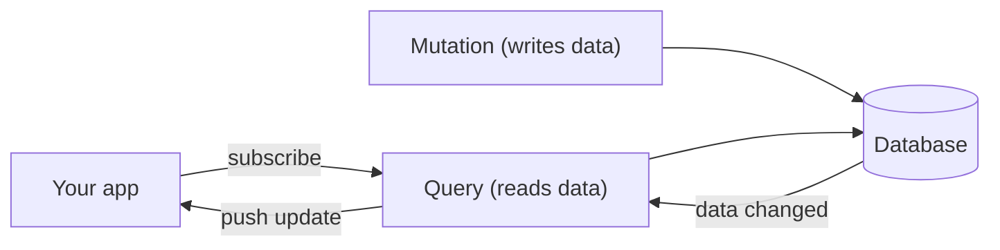

{/* diataxis: explanation */}

stackbase is an open-source, reactive backend you host yourself. You write your backend as regular
TypeScript functions, and stackbase keeps every user's screen up to date automatically.

Think of a Google Doc. When one person types, everyone else sees the change right away, with no
refresh button. stackbase gives your whole app that quality, for any data, and you barely have to
think about it.

## The idea in one minute

You write two kinds of functions. A **query** reads data. A **mutation** writes it. Your app
subscribes to a query, like "the messages in this chat."

When someone sends a message, they call a mutation. stackbase notices the mutation changed data your
query was reading, re-runs the query, and pushes the new result to everyone watching that chat. You
never write polling, WebSocket code, or cache-invalidation logic. That part is the whole product.



The developer experience is close to [Convex](https://convex.dev), with one big difference: you run
stackbase yourself, on your own infrastructure, with no managed cloud in the middle.

## You write your backend as functions

Your functions live in a `convex/` folder:

<Files>

<Folder name="convex" defaultOpen>

<File name="schema.ts" />

<File name="messages.ts" />

<Folder name="_generated" />

</Folder>

</Files>

Here's a query that lists messages and a mutation that adds one:

```ts title="convex/messages.ts"
import { v } from "@stackbase/values";
import { query, mutation } from "./_generated/server";

// Reads data. Your app subscribes to this and gets live updates.
export const list = query({
  handler: (ctx) => ctx.db.query("messages", "by_creation").collect(),
});

// Writes data. Runs as one transaction.
export const send = mutation({
  args: { author: v.string(), body: v.string() },
  handler: (ctx, args) => ctx.db.insert("messages", args),
});
```

There are three function types in total:

- **Query** reads data. Your app subscribes to queries and they update on their own.
- **Mutation** writes data. Each one runs as a single transaction: it all saves, or none of it does.
- **Action** is for everything else, like calling another API or sending an email. Actions can't read
  or write the database directly; they call your queries and mutations to do that.

You'll meet each one properly in [Queries](/docs/core-concepts/queries),
[Mutations](/docs/core-concepts/mutations), and [Actions](/docs/core-concepts/actions). If you want
to know *how* the live updates actually work, that's [How it works](/docs/get-started/how-it-works).

## What comes with it

stackbase is a full backend, not just a database. Everything here is built and ready to use today:

- [File storage](/docs/core-concepts/file-storage) for uploads, images, and downloads.
- [Authentication](/docs/components/auth): passwords, magic links, social login (Google, GitHub, and
  more), two-factor, and passkeys.
- [Authorization](/docs/components/authorization) for roles and permissions.
- [Notifications](/docs/components/notifications) by email, SMS, in-app inbox, and push.
- [Scheduled functions and crons](/docs/components/scheduling) for work that runs later or on a timer.
- [Workflows](/docs/components/workflows) for durable, multi-step processes.
- [Optimistic updates](/docs/client/optimistic-updates) and
  [offline support](/docs/client/offline-sync) on the client.
- A [dashboard](/docs/deploy/local-dev) to browse your data, read logs, and run functions.

Auth, notifications, and the rest are *components*: you turn on only the ones you need, in one config
file. See [Components](/docs/components/overview).

## Run it anywhere

The same app runs, unchanged, in all of these places:

- On your machine with [`stackbase dev`](/docs/deploy/local-dev).
- On a server with [Docker](/docs/deploy/self-hosting).
- As a [single downloadable binary](/docs/deploy/deploy-and-build).
- On [Cloudflare](/docs/deploy/cloudflare).

It stores data in SQLite by default, with no setup. When you want a managed database, point it at
[Postgres](/docs/deploy/postgres) with one flag and change nothing else.

## How it compares

If you know these tools, here's the short version:

<Tabs items={['Convex', 'Firebase/Supabase', 'SpacetimeDB']}>

<Tab value="Convex">

Same reactive model and the same style of functions, but you self-host it and your data
stays yours. stackbase also adds a few things Convex hadn't, like durable workflows and a Postgres
option. It's a clean-room build studied from Convex's public docs, not a fork.

</Tab>

<Tab value="Firebase/Supabase">

Both give you realtime, but through security rules or a stack of separate
services around a database. stackbase gets its live updates from your own functions, in one process.

</Tab>

<Tab value="SpacetimeDB">

Its functions are written in Rust or C#. stackbase's are plain TypeScript, and it
runs on ordinary infrastructure.

</Tab>

</Tabs>

For numbers, [Performance](/docs/get-started/performance) has a measured comparison against Convex,
with the caveats spelled out.

## A few honest limits

- **No full-text or vector search yet.** It's not built.
- **Functions run in-process**, so don't run untrusted code from different tenants on one shared
  deployment.
- **No built-in HTTPS.** Put a proxy like Caddy or nginx in front for that.
- **Multi-node scaling exists but isn't free-forever** the way single-node self-hosting is.

## Where to go next

<Cards>
  <Card title="Quickstart" href="/docs/get-started/quickstart" description="Install, write a function, and see it update live." />
  <Card title="How it works" href="/docs/get-started/how-it-works" description="The reactive model, explained." />
  <Card title="Core concepts" href="/docs/core-concepts/schema-and-tables" description="Schema, queries, mutations, and actions." />
  <Card title="Migrate from Convex" href="/docs/reference/migrate-from-convex" description="Bring an existing app over." />
</Cards>
