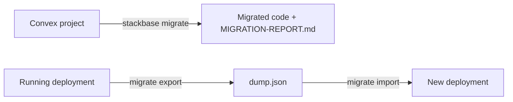

{/* diataxis: how-to */}

A Convex app already looks like a stackbase app. Same query and mutation handlers, the same
`defineSchema`/`defineTable` schema, the same client hooks. Porting one is mostly a matter of
rewriting imports, not rewriting your logic.

`stackbase migrate` automates the mechanical part: import specifiers, `package.json`,
`_generated/`. For everything it can't do for you, it gives you a concrete, file-and-line list.

Canonical imports in stackbase are `@stackbase/*`, never `convex/*` (see
[What is stackbase?](/docs/get-started/what-is-stackbase)). The `convex/` app-directory name is
kept only as a low-friction default. Migrating moves your app onto the native import surface; it
does not make stackbase execute `convex/*` imports unchanged. There's no compatibility shim to fall
back on. The codemod is the whole migration.

This page covers two independent things under one command: `stackbase migrate` rewrites a Convex
project's **code**, and `stackbase migrate export`/`import` moves an app's **data** between
storage topologies. Most projects only need the first.



## What stays the same

Nothing about your function bodies needs to change:

- `query`/`mutation`/`action` still come from `./_generated/server`. Your function bodies don't
  move.
- `convex/schema.ts` keeps its shape. `defineSchema`, `defineTable`, and indexes work the same way;
  only the import specifier moves.
- `useQuery`/`useMutation` keep the same signatures, imported from `@stackbase/client/react`
  instead of `convex/react`.

## Migrating a project's code

### Before you run it

The command detects a Convex project by either signal being present at the project root:

- `convex/schema.ts` exists, or
- `package.json` has a `convex` dependency.

It then refuses to touch a dirty git working tree:

```bash
$ stackbase migrate
refusing to migrate: /path/to/app has uncommitted changes (commit/stash first, or pass --force)
```

Commit or stash first, or pass `--force` to proceed anyway.

<Callout type="warn" title="No git repo at all?">

If the project directory isn't a git repo, `migrate` prints a warning and proceeds
unconditionally. There's no dirty check to run, and in that case a bad migration has no
`git checkout` to undo it:

```
warning: /path/to/app is not a git repo, changes will be made in place with no easy revert
```

</Callout>

The dirty check runs against the **parent** of `--dir` (the project root, one level above your
Convex app directory), the same directory `package.json` and `stackbase.config.ts` live in.

### Running it

```bash title="terminal"
stackbase migrate --from convex --dir convex
```

| Flag | Default | Meaning |
|---|---|---|
| `--from <source>` | `convex` | Migration source. Only `convex` ships today. See [The source-adapter seam](#the-source-adapter-seam) below. |
| `--dir <path>` | `convex` | The app directory to migrate. |
| `--dry-run` | off | Compute the plan and write `MIGRATION-REPORT.md`, but make no other changes. |
| `--force` | off | Proceed even with an uncommitted working tree. |

`--dry-run` is the safe way to preview a migration: it still writes the full report, but skips
every file edit, every scaffold, and `_generated/` regeneration entirely. Your `convex/` tree is
left byte-for-byte as it was.

```bash
$ stackbase migrate --dry-run --force
[dry-run] 3 files would change, 1 scaffolded. See MIGRATION-REPORT.md
```

A real run reports what it actually did, and how many items still need you:

```bash
$ stackbase migrate --force
migrated 3 files. 2 item(s) need manual attention, see MIGRATION-REPORT.md
```

### What it actually does, in order

<Steps>

<Step>

### Walk `convex/`

It recurses into every subdirectory except `_generated` and `node_modules`, collecting every
`.ts`/`.tsx` file.

</Step>

<Step>

### Rewrite imports and scan for divergences

Each file gets its import specifiers rewritten (see
[The import codemod](#the-import-codemod) below) and is scanned for divergences it does not
auto-fix (see [The divergence scan](#the-divergence-scan) below).

</Step>

<Step>

### Edit `package.json`

It drops the `convex` dependency and any `@convex-dev/*` dependency, then adds, at version
`"latest"`, whichever of `@stackbase/values`/`@stackbase/client` the rewrite actually introduced
into your source. Only those two packages are auto-added. See the
[scheduler gotcha](#the-scheduler-scaffold-doesnt-wire-your-crons-for-you) below for what isn't.

</Step>

<Step>

### Scaffold `stackbase.config.ts`, only if you use crons

This step runs *only* if it detected a `crons.ts` file or a `cronJobs(...)` call anywhere in your
source, and only if `stackbase.config.ts` doesn't already exist. An existing config file is never
overwritten.

</Step>

<Step>

### Write `MIGRATION-REPORT.md`

The report is written at the project root *before* anything else, so even a later regeneration
failure leaves you with it.

</Step>

<Step>

### Regenerate `_generated/`

It deletes the app's existing `_generated/` directory outright. A real Convex app ships
`_generated/{server.js,server.d.ts,api.js,api.d.ts,dataModel.d.ts}`, and if those stale `.js` files
were left in place, a JS-first module resolver would pick the stale `server.js` (which still
imports the now-uninstalled `"convex/server"`) over the regenerated `.ts`. It then loads the
rewritten project and regenerates fresh typed `Doc`/`Id`/`api` and server helpers, through the same
`loadConvexDir → push → writeGenerated` pipeline `stackbase codegen` uses.

If codegen fails, usually because an action-needed item wasn't fixed yet (for example, a
`.withIndex` left in place makes the load itself throw), the command exits `1`. Everything up to
that point, the import rewrite, `package.json`, the scaffold, and the report, has already been
written:

```
imports migrated, but codegen failed: <error>
See MIGRATION-REPORT.md; fix the flagged items, then run `stackbase codegen`.
```

</Step>

</Steps>

### The import codemod

The rewrite is symbol-aware, not a blind string replace. It operates on the quoted module
specifier, so `import`, `export … from`, `require()`, and dynamic `import()` are all handled, and
it inspects *which* named symbols a `convex/server` import pulls in before deciding how (or
whether) to rewrite it.

Three specifiers are unambiguous and always rewritten wherever they appear, quoted, in the file:

| From | To |
|---|---|
| `"convex/values"` | `"@stackbase/values"` |
| `"convex/react"` | `"@stackbase/client/react"` |
| `"convex/browser"` | `"@stackbase/client"` |

`"convex/server"` is different. Convex overloads that one module for schema builders, HTTP
routing, and crons, which map to three different places in stackbase:

| `convex/server` import | Rewrite |
|---|---|
| Only `defineSchema`/`defineTable` | `"@stackbase/values"` |
| Only `httpRouter`/`httpAction` | `"./_generated/server"` |
| Anything else (including a mix, or `cronJobs`) | Left unchanged, flagged `action-needed` with the specific fix |

```ts title="convex/schema.ts (before)"
import { defineSchema, defineTable } from "convex/server";
import { v } from "convex/values";

export default defineSchema({ notes: defineTable({ body: v.string() }) });
```

```ts title="convex/schema.ts (after migrate)"
import { defineSchema, defineTable } from "@stackbase/values";
import { v } from "@stackbase/values";

export default defineSchema({ notes: defineTable({ body: v.string() }) });
```

`./_generated/server` imports (`query`, `mutation`, `action`, `httpAction`) are never touched. A
Convex app already imports those from the same relative path stackbase uses.

A mixed `convex/server` import, say `import { defineSchema, cronJobs } from "convex/server"`, is
never guessed at. It's left exactly as written and reported `action-needed` with a fix naming each
symbol's real home. Any remaining bare `"convex/server"` occurrence the codemod's two passes didn't
match (a default import, an `export * from`, a `require()`) is also caught and flagged, so nothing
silently slips through as `unsupported`-by-omission.

### The divergence scan

Independent of the import rewrite, every walked file is also scanned line by line for Convex
runtime patterns that stackbase's engine doesn't accept, even after the import moves. Every finding
names the exact file and line.

**Action-needed.** A real stackbase equivalent exists, but you adapt the call site by hand:

| Convex pattern | Fix |
|---|---|
| `.withIndex(...)` | No `.withIndex`, use `ctx.db.query(table, "index").eq(f, v).gte(f, v).order("asc"\|"desc").collect()` |
| `ctx.db.patch(...)` | No `patch`, read the doc, spread-merge, `ctx.db.replace(id, { ...doc, ...changes })` |
| `.paginate(...)` | `paginate({ cursor, pageSize, maxScan? })` returns `{ page, nextCursor, hasMore, scanCapped }` |
| `ctx.auth` / `getUserIdentity()` | Identity is a string token via a context provider (e.g. `@stackbase/auth`'s `ctx.auth`), not a JWT-claims object |
| `crons.ts` file, or any `cronJobs(...)` call | Compose `defineScheduler()` in `stackbase.config.ts`; use `cronJobs()` |

**Unsupported.** No automatic path; you decide how, or whether, to proceed:

| Convex pattern | Why |
|---|---|
| `@convex-dev/auth`, or an import from `"convex/auth"` | Not auto-translated, use [`@stackbase/auth`](/docs/components/auth) or an external JWT/OIDC provider |
| `app.use(...)` (Convex Components), or a `convex.config.ts` file | Convex Components don't map 1:1. Recompose the equivalent stackbase component(s) via `stackbase.config.ts` |
| `.vectorIndex(...)` / `.searchIndex(...)` | Full-text and vector search are not shipped in stackbase |

`.withIndex`/`ctx.db.patch`/`.paginate`/`ctx.auth` are matched anywhere they appear as a substring
on a line, so, for example, a comment mentioning `.paginate(` is flagged too. The scanner is
line-based, not AST-based, so it's intentionally over-inclusive rather than risking a missed real
call.

### Reading the report

`MIGRATION-REPORT.md` groups every finding by severity, with a one-line count summary up top. A
section is omitted entirely if it has no entries:

```md title="MIGRATION-REPORT.md"
# Stackbase migration report

4 auto-fixed, 3 action-needed, 1 unsupported.

## Auto-fixed (4)

- `convex/schema.ts:1`: import "convex/server" (schema). **Fix:** rewritten to "@stackbase/values"
- `convex/schema.ts:2`: import "convex/values". **Fix:** rewritten to "@stackbase/values"
- `convex/messages.ts:1`: import "convex/react". **Fix:** rewritten to "@stackbase/client/react"
- `convex/http.ts:1`: import "convex/server" (http). **Fix:** rewritten to "./_generated/server"

## Action needed (3)

- `convex/messages.ts:14`: .withIndex(...) query. **Fix:** Stackbase has no .withIndex, use ctx.db.query(table, "index").eq(f, v).gte(f, v).order("asc"|"desc").collect()
- `convex/messages.ts:22`: ctx.db.patch(...). **Fix:** Stackbase has no patch, read the doc, spread-merge, ctx.db.replace(id, { ...doc, ...changes })
- `convex/crons.ts:1`: Convex crons (cronJobs). **Fix:** Compose defineScheduler() in stackbase.config.ts and use cronJobs() from "@stackbase/scheduler"

## Unsupported (1)

- `convex/search.ts:9`: vector/search index. **Fix:** search/vector is not yet supported in Stackbase (see roadmap)
```

Every finding, including the auto-fixed ones, is listed for visibility, not just the ones that need
work. It's a full diff of what the tool touched, in one file, without needing `git diff`.

### The scheduler scaffold doesn't wire your crons for you

<Callout type="warn" title="Scaffold only">

If `migrate` detects a `crons.ts` file (or a bare `cronJobs(...)` call anywhere), it scaffolds a
starting `stackbase.config.ts` (skipped if one already exists), but it doesn't wire your actual
cron definitions into it. That part is on you, in two small steps below.

</Callout>

```ts title="stackbase.config.ts (scaffolded)"
import { defineConfig } from "@stackbase/component";
import { defineScheduler } from "@stackbase/scheduler";

// Convex crons map to Stackbase's scheduler component. Move your cron definitions into
// a convex/crons.ts using cronJobs() from "@stackbase/scheduler".
export default defineConfig({ components: [defineScheduler()] });
```

Two things to do by hand from there, per [Scheduling](/docs/components/scheduling):

<Steps>

<Step>

### Add the packages yourself

Add `@stackbase/scheduler` and `@stackbase/component` to `package.json` yourself. Unlike
`@stackbase/values`/`@stackbase/client`, the scaffold's own dependencies aren't auto-added: the
`package.json` edit only reacts to what the import-rewrite pass introduced into your walked source
files, and the scaffolded config file isn't part of that pass.

</Step>

<Step>

### Wire your actual crons in

`cronJobs()` in stackbase is imported from `./_generated/server` (not `@stackbase/scheduler`
directly), and the registry it builds does nothing until it's passed to
`defineScheduler({ crons })`:

```ts title="convex/crons.ts"
import { cronJobs } from "./_generated/server";

const crons = cronJobs();
crons.interval("cleanup", { minutes: 5 }, internal.maintenance.purge, {});

export default crons;
```

```ts title="stackbase.config.ts"
import { defineConfig } from "@stackbase/component";
import { defineScheduler } from "@stackbase/scheduler";
import crons from "./convex/crons";

export default defineConfig({ components: [defineScheduler({ crons })] });
```

</Step>

</Steps>

The report's `action-needed` entry for crons points you at exactly this.

## Going deeper

<Accordions type="single">

<Accordion id="the-source-adapter-seam" title="The source-adapter seam">

`stackbase migrate --from <source>` is not hardcoded to Convex internally. It dispatches through a
small `MigrationSource` interface:

```ts
interface MigrationSource {
  id: string;
  detect(projectRoot: string): Promise<boolean>;
  analyze(projectRoot: string, appDir: string): Promise<MigrationPlan>;
}
interface MigrationPlan {
  edits: FileEdit[];       // existing files to overwrite
  scaffold: FileWrite[];   // new files to create (never overwrites an existing one)
  report: ReportEntry[];   // { severity: "auto-fixed" | "action-needed" | "unsupported", file, line?, what, fix }
}
```

`resolveSource(sources, id)` looks the requested `--from` value up in a registry and throws (with
the list of available ids) if it isn't found. v1 registers exactly one source:

```ts
const SOURCES: Record<string, MigrationSource> = { convex: convexSource };
```

`convex` is the only value `--from` accepts today. Passing anything else fails fast:

```bash
$ stackbase migrate --from supabase
unknown migration source "supabase" (available: convex)
```

Convex is a near-free first source specifically because stackbase's runtime already executes
Convex-shaped query/mutation/action functions. The whole migration is an import codemod plus a
report, never a data or logic transform. A source for a fundamentally different backend
(Supabase's relational SQL/RLS, Firebase's collection model) would need to translate the data
model itself, not just import specifiers. That's a much larger, separate effort, and not something
this seam has been asked to do yet. The seam exists precisely so such a source could be added later
as another `MigrationSource` implementation registered into `SOURCES`, without touching
`migrateCommand` itself.

</Accordion>

<Accordion id="a-caveat-on-project-detection" title="A caveat on project detection">

`detect()` looks for `convex/schema.ts` specifically, a hardcoded `convex` subdirectory name, not
whatever you pass to `--dir`. If your app's directory really is named something else *and* has no
`convex` dependency left in `package.json` to fall back on, detection fails with `no convex project
detected at <root>`. This only bites an already-renamed directory being re-migrated. A first-time
migration off a stock Convex project (whose directory is always `convex/` and whose `package.json`
always depends on `convex`) is unaffected.

</Accordion>

</Accordions>

## Moving data between deployments

`stackbase migrate export` and `stackbase migrate import` move an app's actual rows between two
running deployments. Most commonly this means moving between a portable
SQLite/Postgres/container deployment and a Cloudflare DO-native one, since [those two store data in
physically different topologies](/docs/deploy/cloudflare#moving-data-between-hosts) and data never
teleports between them on its own.

Both are HTTP clients, modeled on `stackbase deploy`, that call a **running** deployment's
bearer-gated admin endpoints (`GET /_admin/export`, `POST /_admin/import`), authenticated with the
same `STACKBASE_ADMIN_KEY` the dashboard and `stackbase deploy --allow-deploy` use. Both the
container `serve` path and the Cloudflare DO host expose the same `/_admin/*` handler, so one
client works in either direction. A stopped plain-SQLite file has no HTTP endpoint of its own:
point a throwaway `stackbase serve`/`stackbase dev` at its data directory first, export from that,
then tear it down.

```bash
stackbase migrate export --url <source-url> --out dump.json
stackbase migrate import --url <target-url> --in dump.json
```

| Flag | Applies to | Default | Meaning |
|---|---|---|---|
| `--url <url>` | both | (required) | The deployment to export from / import into |
| `--out <file>` | `export` | (required) | Where to write the dump |
| `--in <file>` | `import` | (required) | The dump file to read |
| `--admin-key <key>` | both | `$STACKBASE_ADMIN_KEY` | Overrides the env var |

`STACKBASE_ADMIN_KEY` (env or `--admin-key`) is required for both verbs. Missing it fails
immediately, before any network call:

```bash
$ stackbase migrate export --url http://localhost:3210 --out dump.json
✗ STACKBASE_ADMIN_KEY is required (or pass --admin-key)
```

A wrong key against a real deployment gets a clean `401`, not a stack trace:

```bash
$ stackbase migrate export --url http://localhost:3210 --out dump.json --admin-key wrong
✗ unauthorized, check STACKBASE_ADMIN_KEY / --admin-key
```

### Export

```bash
$ STACKBASE_ADMIN_KEY=… stackbase migrate export --url https://source.example.com --out dump.json
✓ exported 5 documents, 2 index rows → dump.json
```

The dump is a self-describing JSON file:

```json title="dump.json (shape)"
{
  "format": "stackbase-migration-dump",
  "documents": [ /* every document across every table, with its real _id and _creationTime */ ],
  "indexUpdates": [ /* … */ ],
  "tableNumbers": { "messages": 3, "users": 4 }
}
```

### Import

```bash
$ STACKBASE_ADMIN_KEY=… stackbase migrate import --url https://target.example.com --in dump.json
✓ imported 5 documents, 2 index rows
```

<Callout type="warn" title="Import is not a merge">

Import targets a **fresh** deployment. It is not a merge into existing data, and it is single-shard
only. Deploy the matching schema on the target first (same tables, same declared shape). Import
gates on a table-number collision guard and rejects outright, with everything left untouched, if
the dump's table numbers don't match the target's:

```bash
$ stackbase migrate import --url https://target.example.com --in dump.json --admin-key …
✗ import failed: wrong table number for "messages" (dump has 12348, target has 3)
```

</Callout>

A rejected import never applies partially. The target is exactly as it was before the call. Once a
dump imports cleanly, the target is immediately live: new mutations commit on top of the imported
rows without a timestamp collision, and every row, including `_id` and `_creationTime`, reads back
byte-identical to the source.

## After migrating

<Steps>

<Step>

### Work through `MIGRATION-REPORT.md`

Go top to bottom. Every `action-needed` and `unsupported` entry names the exact file, line, and
fix.

</Step>

<Step>

### Run `stackbase dev` and exercise the app

A broken `action-needed` fix (for example a leftover `.withIndex`) surfaces as a load error
immediately, not a silent runtime divergence.

</Step>

<Step>

### Port your tests, if you have them

`stackbase migrate` rewrites only your app's own `convex/` source. It does not touch
`convex-test` call sites. Switch those to [`@stackbase/test`](/docs/reference/testing) yourself.
The fixture shape (`createTestStackbase`) is different enough that it isn't auto-rewritten.

</Step>

<Step>

### Finish the scheduler config, if one was scaffolded

Finish wiring it per [the crons section above](#the-scheduler-scaffold-doesnt-wire-your-crons-for-you)
and add its packages to `package.json`.

</Step>

</Steps>

## Compatibility at a glance

One table for "will my app port?". Every "not available" row is exactly what the
[divergence scan](#the-divergence-scan) flags at the call site, so nothing here surprises you at
runtime.

| Feature | Convex | stackbase |
|---|---|---|
| Queries / mutations / actions / internal functions | Yes | Shipped, same `./_generated/server` authoring shape |
| Argument and return validators (`v.*`) | Yes | Shipped |
| `ctx.db.get` / `insert` / `replace` / `delete` | Yes | Shipped |
| `ctx.db.patch` | Yes | Not available: read, spread-merge, `replace` |
| `.withIndex` / `.filter(q => ...)` / `.first()` / `.unique()` | Yes | Not available: chain `.eq`/`.gt`/`.gte`/`.lt`/`.lte`/`.order`/`.where`/`.take(n)` on `ctx.db.query(table, index)` |
| Pagination | `{ page, isDone, continueCursor }` | Shipped, named `{ page, hasMore, nextCursor, scanCapped }` |
| Reactive subscriptions | Yes | Shipped, range-precise invalidation |
| Optimistic updates | Yes | Shipped, Convex-verbatim `withOptimisticUpdate` (promise resolves at commit, see below) |
| Durable offline mutations | No first-party equivalent | Shipped: durable outbox, client-supplied ids, cross-tab rendering |
| HTTP actions (`httpRouter`/`httpAction`) | Yes | Shipped (no automatic CORS, path params, or middleware, by design) |
| `ctx.scheduler.runAfter`/`runAt` and crons | Yes | Shipped via the `@stackbase/scheduler` component, composed explicitly |
| Durable workflows | `@convex-dev/workflow` | Shipped via `@stackbase/workflow`, including saga/compensation |
| File storage (`ctx.storage`) | Yes | Shipped (two-phase uploads; `store`/`get` are action-only) |
| Auth | Convex Auth, or third-party JWT | `@stackbase/auth` (sessions, OAuth, JWT/OIDC, MFA, passkeys); Convex Auth itself doesn't port |
| Convex Components (`app.use`) | Yes | Different model: compose `@stackbase/*` components in `stackbase.config.ts` |
| Full-text search / vector search | Yes | Not built; the migrator flags usage as `unsupported` |

## Honest compatibility notes

**Near-free, by design, not a coincidence.** stackbase's runtime already executes Convex-shaped
query/mutation/action functions natively, so migrating is overwhelmingly an import-specifier
rewrite plus `_generated/` regeneration, not a rewrite of your handlers, your schema shape, or your
client code.

The divergences that do exist are real, not cosmetic, and the scanner is built specifically to
catch every one of them at the call site rather than let them surface later as a runtime bug:

- **No `ctx.db.patch`.** stackbase's writer is `insert`/`replace`/`delete` only. A Convex `patch`
  call becomes a read, spread-merge, and `replace`. See [Mutations](/docs/core-concepts/mutations).
- **No `.withIndex(...)`.** stackbase's query builder is `ctx.db.query(table, index)` with chained
  `.eq`/`.gt`/`.gte`/`.lt`/`.lte`/`.order`/`.where`. See [Queries](/docs/core-concepts/queries).
- **A mutation's promise resolves at commit, not at gate-time.** If your client code relied on a
  Convex-specific gate-time resolution timing for optimistic-update sequencing, revisit it against
  [Optimistic updates](/docs/client/optimistic-updates)'s documented promise-timing migration note.
- **No full-text or vector search.** `.searchIndex(...)`/`.vectorIndex(...)` have no stackbase
  equivalent. The scan flags every occurrence as `unsupported` rather than silently dropping it.
- **Crons need an explicit component.** `cronJobs()` only takes effect once composed into
  `stackbase.config.ts` via `defineScheduler({ crons })`. Convex's implicit registration doesn't
  carry over.
- **`ctx.auth` is a string token, not a JWT-claims object**, resolved via a context provider (e.g.
  [`@stackbase/auth`](/docs/components/auth)) rather than baked into the runtime.
- **Convex Components and Convex Auth don't map 1:1.** Recompose the equivalent stackbase
  component(s): [`@stackbase/auth`](/docs/components/auth),
  [`@stackbase/scheduler`](/docs/components/scheduling),
  [`@stackbase/workflow`](/docs/components/workflows),
  [`@stackbase/triggers`](/docs/components/triggers),
  [`@stackbase/notifications`](/docs/components/notifications), via `stackbase.config.ts`.

`@stackbase/*` is the canonical surface, permanently. This isn't a temporary migration artifact.
The `convex/` directory name is kept only because it's a familiar, low-friction default for a
project's function directory. It is not, and was never meant to be, a promise that `convex/*`
imports keep working. There's no alias path back to `convex/*` imports to maintain: once migrated,
you're simply writing a native stackbase app.

## Related

- [What is stackbase?](/docs/get-started/what-is-stackbase): why the canonical surface is
  `@stackbase/*`, not `convex/*`.
- [CLI reference](/docs/reference/cli#migrate): the terse flag reference for every `stackbase`
  subcommand, including `migrate`/`migrate export`/`migrate import`.
- [Testing](/docs/reference/testing): `@stackbase/test` vs. `convex-test`.
- [Scheduling](/docs/components/scheduling): the full `cronJobs()`/`defineScheduler()` surface a
  migrated `crons.ts` needs.
- [Cloudflare](/docs/deploy/cloudflare#moving-data-between-hosts): why `migrate export`/`import`
  exists, to move data between the portable and DO-native storage topologies.
- [Queries](/docs/core-concepts/queries) and [Mutations](/docs/core-concepts/mutations): the real
  `ctx.db` surface a migrated app's `.withIndex`/`ctx.db.patch` call sites need to target.
