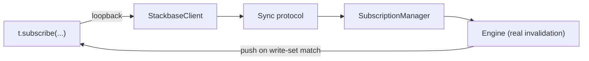

{/* diataxis: how-to */}

Most test harnesses mock the database and hope the mock behaves like the real thing. `@stackbase/test`
skips the hope. It runs your queries, mutations, and actions against a real `EmbeddedRuntime`: the
same MVCC SQLite storage, the same single-writer OCC transactor, and the same query engine that ships
in production. Compose a component and you get its real drivers too.

There's no mocked `ctx.db` and no simulated reactivity. `t.subscribe` drives the actual path (client,
sync protocol, `SubscriptionManager`, engine), all over an in-process loopback connection. A passing
test here is a claim about the shipped engine's real behavior, not about a stand-in for it.

This page is the complete reference for the harness. It covers every option `createTestStackbase`
takes, every method on the object it returns, how to test reactivity and time-based (scheduler and
cron) code, how to compose components, and the exact places behavior diverges from Convex's testing
tools.

<Steps>

<Step>

### Install the package

```bash
npm install -D @stackbase/test
```

</Step>

<Step>

### Write and run a test

```ts title="convex/messages.test.ts"
import { afterEach, expect, test } from "vitest";
import { createTestStackbase, type TestStackbase } from "@stackbase/test";
import * as messages from "./messages";
import schema from "./schema";

let t: TestStackbase;

afterEach(async () => {
  await t.close();
});

test("send then list", async () => {
  t = await createTestStackbase({
    modules: { "messages.ts": messages, "schema.ts": { default: schema } },
  });

  const id = await t.mutation("messages:send", { body: "hi" });
  const rows = await t.query<Array<{ _id: string; body: string }>>("messages:list", {});

  expect(rows.map((r) => r._id)).toContain(id);
});
```

`createTestStackbase` is async. Always `await` it, since it boots a real runtime: schema setup,
component composition, and driver `start()`.

Every call runs under plain vitest. There's no special CI setup beyond what your monorepo already has
for the rest of its tests.

<Callout type="warn" title="Always close it">
  Call `t.close()`, in a `try`/`finally` or an `afterEach`. It tears down the in-memory database,
  stops component drivers, and removes the temp directory backing file storage.
</Callout>

</Step>

</Steps>

## `createTestStackbase(opts)`

```ts
interface CreateTestOptions {
  modules: Record<string, unknown>;
  components?: ComponentDefinition[];
  schema?: SchemaDefinition | "auto" | false;
  now?: () => number;
  store?: DocStore;
}

function createTestStackbase(opts: CreateTestOptions): Promise<TestStackbase>;
```

<TypeTable
  type={{
    modules: {
      description: "A flat map from module path to that module's exports. Required.",
      type: "Record<string, unknown>",
    },
    components: {
      description: "Components to compose, the same ones your app opts into via stackbase.config.ts.",
      type: "ComponentDefinition[]",
      default: "[]",
    },
    schema: {
      description: "Where to resolve the schema from: auto-detect, an explicit definition, or none.",
      type: '"auto" | SchemaDefinition | false',
      default: '"auto"',
    },
    now: {
      description: "Your own clock function, instead of the harness's virtual clock.",
      type: "() => number",
    },
    store: {
      description: "The document store to run the real engine against.",
      type: "DocStore",
      default: "in-memory SqliteDocStore",
    },
  }}
/>

### `modules` (required)

A flat map from a Convex-style module path (`"messages.ts"`) to that module's exports. Two shapes
work:

```ts
// Explicit imports
import * as messages from "./messages";
import * as users from "./users";
import schema from "./schema";

const t = await createTestStackbase({
  modules: {
    "messages.ts": messages,
    "users.ts": users,
    "schema.ts": { default: schema },
  },
});
```

```ts
// Or let your bundler enumerate the directory: the non-eager form (a map of lazy
// loaders) works as-is; each entry is awaited before use.
const t = await createTestStackbase({
  modules: import.meta.glob("./convex/**/*.ts"),
});
```

Keys from `import.meta.glob` come back with leading path segments, like `./convex/messages.ts`. The
harness normalizes them: it strips `./`/`../` prefixes, a leading `convex/` root, and the file
extension, landing on the same `module:export` path your codegen'd `api`/bare-string refs already use.
A glob-sourced module registers under the exact path an explicit `{ "messages.ts": messages }` entry
would.

Only **named exports whose value is a registered function** (`query`/`mutation`/`action`/`httpAction`)
land in the dispatchable function map. A `schema.ts` module and an `http.ts` module are each handled
specially (see below and [`t.fetch`](#tfetch)). Everything else in a module is ignored.

### `schema`

- **`"auto"` (default):** resolves the schema from whatever `schema.ts` entry is in `modules` (its
  default export, expected to be a `defineSchema(...)` result). If there's no `schema.ts` in
  `modules`, this resolves to an empty schema.
- **An explicit `SchemaDefinition`:** overrides whatever `schema.ts` would have resolved to.
- **`false`:** no schema at all, an empty schema where only `_storage` (see below) exists.

```ts
import { defineSchema, defineTable, v } from "@stackbase/values";

const testSchema = defineSchema({
  docs: defineTable({ owner: v.string(), n: v.number() }).index("by_owner", ["owner", "n"]),
});

const t = await createTestStackbase({
  modules: { "mod.ts": mod },
  schema: testSchema, // explicit, no schema.ts needed in `modules` at all
});
```

The reserved `_storage` system table (backing [file storage](/docs/core-concepts/file-storage)) is
injected into the composed schema unconditionally. File storage is an always-on core feature in the
harness, exactly as it is in production. It's never opt-in.

### `components`

If your app opts into a component in `stackbase.config.ts` (the scheduler, workflow, triggers,
notifications, auth, and so on), list it the same way here. The harness composes it through the same
`composeComponents` the CLI's boot path uses:

```ts
import { defineScheduler } from "@stackbase/scheduler";

const t = await createTestStackbase({
  modules: { /* ... */ },
  components: [defineScheduler()],
});
```

Without a composed scheduler, `t.finishScheduledFunctions()`/`t.advanceTimers()` are harmless no-ops,
not errors. There's no driver to drive, so the harness treats "nothing scheduled" the same as "nothing
composed."

### `now`

Supplies your own clock function instead of the harness's own virtual clock:

```ts
let fakeNow = 1_700_000_000_000;
const t = await createTestStackbase({
  modules: { /* ... */ },
  now: () => fakeNow,
});
```

Every `ctx.now()` in app code, the scheduler's due-job checks, and `EmbeddedRuntime` itself all read
this function. Supplying `now` means you own time, not the harness. `t.advanceTimers` and
`t.finishScheduledFunctions` both throw immediately if `opts.now` was given, since mutating the
harness's own internal clock would have no effect on a caller-supplied `now`. Omit `opts.now` (the
default) to get the harness-owned virtual clock those two methods drive.

### `store`

The document store to run the real engine against. Defaults to an in-memory `SqliteDocStore` over
`NodeSqliteAdapter` (`:memory:`). Pass an alternative, for example a `PostgresDocStore`, to exercise
the exact same conformance assertions against a different backend:

```ts
import { PostgresDocStore } from "@stackbase/docstore-postgres";

const t = await createTestStackbase({
  modules: { /* ... */ },
  store: new PostgresDocStore(/* ... */),
});
```

The store must start empty. The harness calls its `setupSchema()` and owns its lifecycle from there,
closing it in `t.close()`. This is how Stackbase's own suite proves read-your-own-writes parity on
Postgres (`packages/docstore-postgres/test/ryow-runtime.test.ts`). It's not a hypothetical: the
harness genuinely doesn't care which `DocStore` it's driving.

## `TestStackbase`, the returned object

```ts
interface TestStackbase {
  query<T = unknown>(ref: FunctionReference | string, args?: Args): Promise<T>;
  mutation<T = unknown>(ref: FunctionReference | string, args?: Args): Promise<T>;
  action<T = unknown>(ref: FunctionReference | string, args?: Args): Promise<T>;
  run<T>(fn: (ctx: any) => Promise<T>): Promise<T>;
  fetch(request: Request): Promise<Response>;
  subscribe<T = any>(ref: FunctionReference | string, args?: Args): TestSubscription<T>;
  withIdentity(identity: string): TestStackbase;
  finishScheduledFunctions(): Promise<void>;
  advanceTimers(ms: number): Promise<void>;
  close(): Promise<void>;
}
```

### Function references

Anywhere a `ref` is expected, both a `"module:fn"` string and a typed `FunctionReference` work
interchangeably (your codegen'd `api`/`internal`, or an `anyApi` cast when you don't have generated
types in the test). They resolve to the exact same dispatchable path:

```ts
import { anyApi } from "@stackbase/client";

await t.query("messages:list", {});
await t.query((anyApi as any).messages.list, {});
```

### `t.query` / `t.mutation` / `t.action`

Call a function exactly as a client would, through the public gate. Whatever identity
`t.withIdentity` set (or none, by default) is the ambient identity for the call. These are the three
you'll use for most assertions: call a mutation, then query the result.

### `t.run(fn)`

Runs `fn` with a full, privileged database-writer `ctx` (the engine's real `MutationCtx`), inside one
real transaction, bypassing the public function-dispatch gate entirely. It's backed by an internal
`_test:_run` system mutation whose handler invokes whatever callback you last handed it, so you get a
genuine writer context without declaring an app-level mutation just for test setup:

```ts
const id = await t.run(async (ctx) => ctx.db.insert("messages", { body: "seeded" }));

// A privileged raw scan is the same shape: useful for asserting against a
// component's own internal (non-app) tables:
const rows = await t.run(async (ctx) => ctx.db.query("docs", "by_creation").collect());
```

`t.run` is always privileged (no ambient identity) regardless of which `withIdentity` view it's
called on. It's a setup/assertion escape hatch, not a way to test identity-scoped behavior.

### `t.fetch(request)`

Routes a `Request` through your app's `http.ts` router exactly as the real `stackbase dev`/`serve`
HTTP handler dispatches to an `httpAction`, returning a `Response`. An unmatched method and path gets
a plain 404, never a throw:

```ts
const res = await t.fetch(new Request("http://test/webhook", { method: "POST", body: "{}" }));
expect(res.status).toBe(200);
```

Identity threading: the calling view's identity (set via `withIdentity`) is passed as the httpAction's
`ctx` identity, taking precedence over the request's own `Authorization` header if both are present.
If no view identity is set, the request's raw `Authorization` header is used as a fallback, Bearer-
stripped (`Bearer abc123` becomes `abc123`; anything else becomes `null`). That's the same
Bearer-passthrough behavior the real engine uses at the raw-HTTP layer, where there is no session
concept to fall back on:

```ts
const asAda = t.withIdentity("ada-token");
const res = await asAda.fetch(new Request("http://test/whoami")); // httpAction sees identity "ada-token"

// Or rely purely on the header, with no withIdentity view involved:
const res2 = await t.fetch(
  new Request("http://test/whoami", { headers: { authorization: "Bearer raw-token" } }),
); // httpAction sees identity "raw-token"
```

`http.ts`'s default export (an `HttpRouter`) is resolved once at `createTestStackbase` time; a route
handler that isn't an exported function from one of your `modules` entries throws immediately, at
harness-build time, rather than silently 404ing later.

### `t.withIdentity(identity)`

Returns a view of the **same** backend whose `query`/`mutation`/`action`/`fetch` calls carry
`identity` (a plain string) as the ambient session token:

```ts
const asAda = t.withIdentity("some-token");
await asAda.mutation("messages:send", { body: "hi" });
```

The identity reaches function code only through a context provider (for example `@stackbase/auth`'s
`ctx.auth`, or any component that reads `cctx.identity` off the composed context). It's never a bare
`ctx.identity` on a plain UDF's context. What the token actually resolves to (a user document, a
session record, nothing) is entirely up to whatever context provider your composed components wire
in. `run` and `close` are shared with the underlying backend, not per-view. There's one database and
one set of drivers no matter how many `withIdentity` views you make of it, and two identities on the
same backend never see each other's ambient state:

```ts
const asA = t.withIdentity("A");
const asB = t.withIdentity("B");

await asA.mutation("profile:setName", { name: "Ada" });
await asB.mutation("profile:setName", { name: "Bea" });
// asA's own state is untouched by asB's call, and the base `t` (no identity) has none of either.
```

### `t.subscribe`, testing reactivity

```ts
interface TestSubscription<T> {
  value(): T | undefined;
  onChange(cb: (v: T) => void): () => void;
  unsubscribe(): void;
}
```

`t.subscribe(ref, args)` opens a live subscription over the real path: client, sync protocol,
`SubscriptionManager`, engine invalidation, all via an in-process loopback connection
(`runtime.connect()` plus a loopback transport). It's the same wiring `examples/chat`'s own test suite
uses, not a simulated re-render:



```ts
const sub = t.subscribe("messages:list", {});
sub.onChange((rows) => {
  // fires on the first compute and every subsequent reactive re-run
});

await t.mutation("messages:send", { body: "hi" });
// sub.value() is now re-computed and re-pushed, because the write's write set
// intersected the query's recorded read set, not because anything was polled.

sub.unsubscribe();
```

`value()` returns the latest pushed value. It's `undefined` until the first compute lands
(subscribing and the first push are asynchronous, so wait for a change before asserting on it in a
fast test). `onChange` registers a listener fired on every reactive re-run, including the first, and
returns a remover. `unsubscribe()` tears down the underlying query subscription.

Because invalidation is genuinely range-precise (not table-level), this is the harness's standout
capability over a logic-only mock: you can assert that one write **does** invalidate a subscription
and a different write on the same table **doesn't**:

```ts
const sub = t.subscribe("mod:byRoom", { room: "general" });
let fires = 0;
sub.onChange(() => { fires++; });
await waitForFirstValue(sub);

await t.mutation("mod:insert", { room: "other", body: "unrelated" });
await sleep(70); // grace period, no push is expected
expect(fires).toBe(0); // the write's key was outside this subscription's read set, no re-fire

await t.mutation("mod:insert", { room: "general", body: "hello" });
await waitFor(() => sub.value()?.length === 1);
expect(fires).toBe(1);
```

One `StackbaseClient` is shared across every `t.subscribe(...)` call on a backend and all of its
`withIdentity` views. This is a v1 limitation: `subscribe` always uses the base, no-identity client
regardless of which view it's called from, since there is no per-identity subscription yet. It's
built lazily on first use and closed in `t.close()`, before the runtime's drivers are stopped, so no
loopback session ever outlives the runtime it's connected to.

A subscription also fans out correctly when the write comes from a scheduled mutation, not just a
directly-called one. A `ctx.scheduler.runAfter(...)` job's write, once it commits, invalidates a live
subscription exactly the same way a direct `t.mutation(...)` call would.

### Time control: `t.finishScheduledFunctions()` / `t.advanceTimers(ms)`

Deterministic time control for `@stackbase/scheduler` jobs and crons, with no real timers or sleeps
involved. Both are driven by the harness's own virtual clock (starting at a fixed epoch millisecond,
mutable only through these two calls). Both are also clean no-ops if no `@stackbase/scheduler`
component was composed via `opts.components`, since there's simply nothing to drive.

```ts
import { defineScheduler } from "@stackbase/scheduler";

const t = await createTestStackbase({
  modules: { /* ... */ },
  components: [defineScheduler()],
});

await t.mutation("reminders:schedule", {}); // ctx.scheduler.runAfter(60_000, "reminders:fire", {})

await t.advanceTimers(60_000);       // moves the virtual clock by exactly 60s, drives one pass
await t.finishScheduledFunctions();  // drains EVERYTHING due (incl. cascades) to completion
```

- **`advanceTimers(ms)`** advances the clock by exactly `ms` and drives one scheduler-driver pass.
  It's the one-shot counterpart to `finishScheduledFunctions`: mirroring a real fake-timer
  `advanceTimersByTime`, it will **not** itself drain a job scheduled further out than `ms`. It always
  advances the clock (or throws, per the `now` rule below) regardless of whether a scheduler is
  composed, since advancing time is a general harness primitive, not scheduler-specific.
- **`finishScheduledFunctions()`** repeatedly advances the virtual clock in large steps and drives a
  driver pass, stopping as soon as a scan of the scheduler's internal `jobs` table shows nothing left
  outstanding (`"pending"`/`"inProgress"`). It drains every currently and eventually due job,
  **including cascades** (a job that itself schedules another). It's bounded at a fixed iteration cap,
  so a recurring cron or a self-rescheduling chain that would never fully settle throws a clear error
  instead of hanging the test forever:

  > `finishScheduledFunctions: scheduled jobs did not settle after 100 iterations (advancing the
  > virtual clock by 3600000ms each time). Check for a cron or a runAfter chain that keeps
  > rescheduling itself forever.`

- **Both throw if `opts.now` was supplied** to `createTestStackbase`. With a custom clock, the caller
  owns time, and the harness has no internal clock left to mutate. Omit `opts.now` (the default) to
  use time control.

```ts
// Throws immediately: the harness doesn't own the clock here:
const t = await createTestStackbase({ modules: { /* ... */ }, now: () => Date.now() });
await t.advanceTimers(1000); // Error: advanceClock/advanceTimers/finishScheduledFunctions require...
```

### `t.close()`

Always call this, in a `try`/`finally` or an `afterEach`. It closes the shared loopback subscription
client before stopping drivers, so no connection races driver shutdown, stops every component driver,
closes the underlying document store, and removes the temp directory backing file storage. Skipping
it doesn't corrupt any *other* instance (see Isolation below), but it will leak resources across a
long test run.

## Isolation

Every `createTestStackbase()` call is a fully independent backend: its own SQLite `:memory:` database
(or its own `store`, if supplied), its own temp file-storage directory, its own set of component
drivers. Two instances in the same test file never see each other's writes:

```ts
const a = await createTestStackbase({ modules /* ... */ });
const b = await createTestStackbase({ modules /* ... */ });

await a.mutation("messages:send", { body: "only in a" });
expect(await a.query("messages:list", {})).toHaveLength(1);
expect(await b.query("messages:list", {})).toHaveLength(0); // b never saw a's write
```

This holds under repeated create and close cycles too. Creating and closing dozens of instances in a
loop leaves no leaked handles, temp dirs, or drivers behind, as long as every instance is `close()`d.

## Composing components in a test

Any component your app opts into via `stackbase.config.ts` (the scheduler, workflow, triggers,
notifications, auth, or a component you wrote yourself) composes into a test the same way:

```ts
import { defineScheduler } from "@stackbase/scheduler";
import { defineWorkflow } from "@stackbase/workflow";

const t = await createTestStackbase({
  modules: { /* ... */ },
  components: [defineScheduler(), defineWorkflow()], // workflow requires scheduler, same as production
});
```

Composition goes through the exact same `composeComponents` the CLI's own boot path uses, so a
component's tables, context providers, drivers, and boot steps all wire up identically to how they
would under `stackbase dev`/`serve`. File storage (`ctx.storage`, the `_storage` table, the orphan
reaper driver) is composed unconditionally, without needing to be listed. It's always-on in
production too.

## Conformance suite

Stackbase's own repository ships a conformance suite: a large body of tests, all written against
`@stackbase/test`, whose entire purpose is to pin down and regression-guard the shipped engine's
actual behavior across ten behavioral areas: db CRUD, index reads, pagination, validators, identity,
scheduler, ids, errors, reactivity, and the HTTP router. Every assertion in it runs through the same
harness this page documents. There's no separate, lower-fidelity mechanism-only test path.

The suite grew from an initial 47 assertions to **117, with zero skipped**. Every one of those 117
runs against the real, shipped engine and passes. None is a placeholder or a known-divergence stub
left disabled. Two representative things it pins down as correct, by regression test:

- **Range-precise reactivity invalidation.** A write outside a subscribed index range genuinely does
  not re-fire that subscription. The core "range, not table" invalidation guarantee has an actual
  regression net, not just a design doc asserting it.
- **`maxScan`/`scanCapped` pagination**, descending-cursor pagination, validator strictness for
  `int64`/`float64`/`bytes`/array/record types, and scheduler retries, `onComplete`, idempotency,
  crons, and failure isolation.

The rule the suite holds itself to: assert real, observed Convex-parity behavior, and where behavior
genuinely diverges, document the divergence explicitly (see the next section) rather than silently
asserting the wrong thing to keep a test green.

## Differences from Convex's testing tools

If you're porting tests written against Convex's `convex-test`, here are the specific places behavior
diverges. Each one was discovered by writing the conformance suite against real Convex-derived
expectations and finding the actual shipped behavior differs.

<Accordions type="single">

<Accordion title="1. Identity is a raw string token, not a JWT-claims object">

```ts
// Convex: t.withIdentity({ subject: "user_1", name: "Ada" })
// Stackbase:
const asAda = t.withIdentity("some-token");
```

The token is surfaced to function code only through a context provider (for example
`@stackbase/auth`'s `ctx.auth`, or a component reading `cctx.identity`). There is no bare
`ctx.identity` populated from JWT claims on a plain UDF context. What the token resolves to is
entirely up to your composed auth component.

</Accordion>

<Accordion title="2. Index reads use a chained query builder, not .withIndex(cb)">

```ts
// Stackbase:
ctx.db
  .query("docs", "by_owner")
  .eq("owner", "a")
  .gte("n", 1)
  .lt("n", 3)
  .order("asc")
  .collect();
```

Range predicates (`.eq`/`.gte`/`.gt`/`.lte`/`.lt`) chain directly off `ctx.db.query(table, index)`;
there's no separate index-selector callback.

</Accordion>

<Accordion title="3. Pagination returns a different result shape">

```ts
// Stackbase: .paginate({ cursor, pageSize, maxScan? }) returns:
{ page: Doc[], nextCursor: string | null, hasMore: boolean, scanCapped: boolean }

// not Convex's { page, isDone, continueCursor }
```

`hasMore` is `!isDone`; `nextCursor` is `continueCursor`. `scanCapped` (Convex has no equivalent) is
`true` when the page's underlying scan hit `maxScan` before filling `pageSize`. That's a signal that
more matching rows may exist beyond what this page found.

</Accordion>

<Accordion title="4. There is no ctx.db.patch">

A partial update is a read, a spread-merge, then a full `ctx.db.replace(id, merged)`:

```ts
const cur = await ctx.db.get(id);
await ctx.db.replace(id, { ...cur, body: "updated" });
```

</Accordion>

<Accordion title="5. Schema document validation is runtime-enforced">

An insert or `replace` whose document is wrong-typed, has an extra field, or is missing a required
field is rejected at write time with a `DocumentValidationError` ("document in "&lt;table&gt;" does
not match schema: ..."), not silently accepted:

```ts
await expect(t.mutation("mod:insert", { n: "not-a-number" })).rejects.toThrow(/does not match schema/);
```

Disable it for an entire schema with `defineSchema(tables, { schemaValidation: false })`, or loosen
one field with `v.any()`.

</Accordion>

</Accordions>

`stackbase migrate` rewrites your Convex import specifiers automatically, but it does **not**
translate `convex-test` calls to `@stackbase/test`. See
[Migrate from Convex](/docs/reference/migrate-from-convex) for what it does and doesn't handle.

## Other error shapes worth knowing

A few error behaviors, beyond the schema-validation divergence above, that show up often enough in
tests to call out directly:

- **A query attempting a write** throws `ForbiddenOperationError` (`code: "FORBIDDEN"`). But the
  load-bearing guarantee is structural, not just a guard: a query's `ctx.db` has no
  `insert`/`replace`/`delete` methods at all (`typeof ctx.db.insert === "undefined"`), so ordinary app
  code can't reach the write path regardless of the kernel-level check.
- **`ctx.db.get` of a well-formed but absent id** resolves to `null`. It never throws.
- **`ctx.db.replace`/`delete` of a well-formed but never-existed (or already-deleted) id** throws
  `DocumentNotFoundError` (`code: "DOCUMENT_NOT_FOUND"`), distinct from `get`'s `null`.
- **Calling a nonexistent function path** throws `FunctionNotFoundError` (`code:
  "FUNCTION_NOT_FOUND"`).
- **A wrong-typed argument against an opt-in `args` validator** throws `ArgumentValidationError`
  (`code: "ARGUMENT_VALIDATION"`), distinct from `DocumentValidationError`, which is about the
  document being written, not the arguments a function was called with.
- **A mutation that writes, then throws, rolls back the entire transaction**, including the pre-throw
  write. There's no partial-commit state to clean up in a `finally`. Assert against `t.run` or a
  follow-up query to confirm nothing persisted.

## E2E testing against a running server

`@stackbase/test`'s in-process harness (everything above) is the right tool for function and
reactivity logic. It's fast (in-memory, no process boundary) and exercises the real engine.

For transport- or process-level behavior it structurally can't reach (hot reload, the raw wire
protocol, Docker boot, `stackbase deploy`'s live hot-swap, cross-runtime Bun vs. Node behavior), start
a real `stackbase dev`/`serve` as a child process and drive it with `@stackbase/client` over a real
WebSocket, or `POST /api/run` over HTTP. This is exactly the pattern Stackbase's own end-to-end tests
use. See `packages/cli/test/*-e2e.test.ts` in the repo for worked examples (scheduler, actions,
workflow, `httpAction`s, deploy, storage, and more), each proven against the real shipped CLI
entrypoint rather than a mechanism-only unit test.

There is no `stackbase run` command and no separate `createStackbase` testing API. Use
`@stackbase/test` for in-process tests, and `POST /api/run`, the dashboard's function runner, or the
client SDK for driving a real running server.

## See also

- [Client SDK](/docs/client/client-sdk): the same `useQuery`/`useMutation` hooks a test's
  `t.subscribe` stands in for.
- [Actions](/docs/core-concepts/actions) and
  [Scheduled Functions](/docs/components/scheduling): what `t.action` and
  `t.finishScheduledFunctions`/`t.advanceTimers` are testing.
- [File Storage](/docs/core-concepts/file-storage): `ctx.storage` behaves identically in tests (a
  temp filesystem-backed blob store, torn down in `t.close()`).
- [Configuration](/docs/reference/configuration): the full `v.*` validator list referenced above.
- [Schema & tables](/docs/core-concepts/schema-and-tables): `defineSchema`, indexes, and
  `schemaValidation`.
- [Migrate from Convex](/docs/reference/migrate-from-convex): what `stackbase migrate` rewrites
  automatically, and what it leaves for you (including porting `convex-test` calls by hand).
