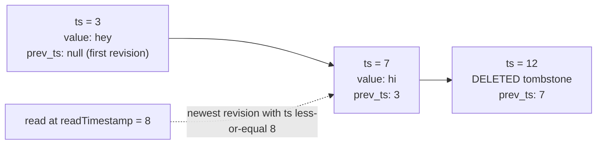
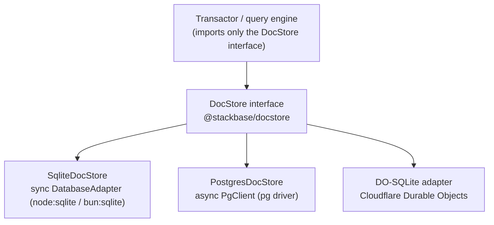
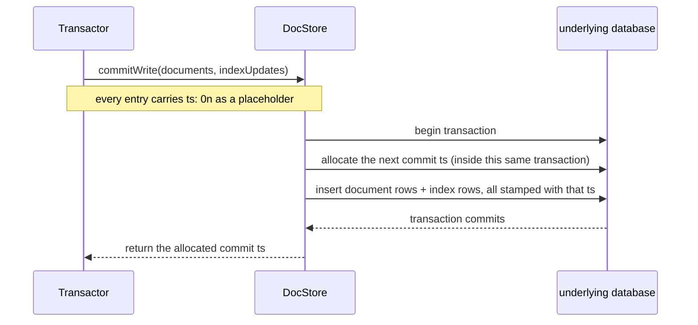
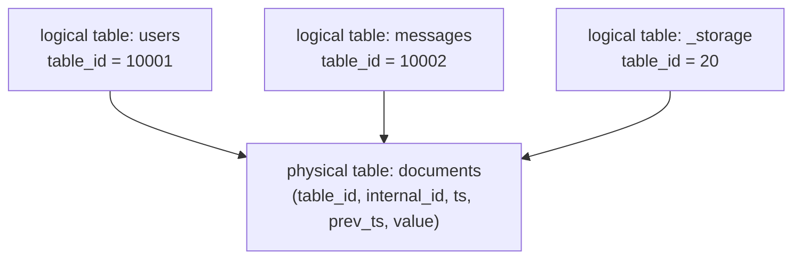

{/* diataxis: explanation */}

Everything in Stackbase — queries, mutations, reactivity, the dashboard's data browser — ultimately
bottoms out in one thing: a log of document revisions on disk. If you understand how that log
works, the rest of the engine makes a lot more sense. This page walks through it from the ground
up: no prior Stackbase knowledge assumed.

## The one thing to understand first: nothing is ever overwritten

Most databases store the *current* value of a row and overwrite it in place when it changes.
Stackbase's storage layer does something different: it **never overwrites**. Every write —
insert, update, or delete — appends a brand-new entry to a log. The "current" value of a document
is just whichever entry for it happened most recently.

Concretely, every write appends a `DocumentLogEntry`:

```ts
interface DocumentLogEntry {
  ts: bigint;                       // the logical commit time of this revision
  id: InternalDocumentId;           // which document
  value: ResolvedDocument | null;   // the new body — or null for a delete
  prev_ts: bigint | null;           // the ts of this document's PREVIOUS revision
}
```

A `null` value is called a **tombstone** — it marks the document as deleted as of that `ts`,
without erasing its history. The `prev_ts` field is a pointer back to the entry that came before
it, so every document's history forms a **backward-linked chain through time**: newest, pointing
at the one before it, pointing at the one before that, all the way back to its first revision
(`prev_ts: null`).



That's one document's entire history: it was created at `ts=3`, edited at `ts=7`, then deleted at
`ts=12`. Nothing was ever mutated in place — each step just appended a new row.

## Reading "as of" a moment in time

Because old revisions are never thrown away, you can ask a very useful question: "what did this
document look like at some earlier point?" That's a **snapshot read**, and the rule for answering
it is simple:

> Take the newest revision whose `ts` is less than or equal to your `readTimestamp`. If that
> revision is a tombstone, the document doesn't exist at that snapshot.

In the diagram above, reading at `readTimestamp = 8` lands on the `ts = 7` revision — the `ts = 12`
delete hasn't happened yet as of time 8, so it's invisible to that read. Reading at
`readTimestamp = 20` would land on the tombstone, and the document would appear deleted.

This one rule is the whole of **snapshot isolation** in Stackbase: the same scan, run again later
at the same `readTimestamp`, always returns exactly the same answer — no matter how many more
writes have landed since. Nothing about the past ever changes. That stability is what makes two
other big features possible:

- **Deterministic replay.** If a query function ever needs to be re-run (for example, to check
  whether a mutation's read set actually changed — see
  [Transactions & consistency](/docs/contributing/architecture/transactions)), running it again at
  the same timestamp is guaranteed to produce the same result. No "well, it depends when you ask."
- **Reactivity.** The [reactivity](/docs/contributing/architecture/reactivity) engine can safely
  cache "this query, at this snapshot, produced this result" and only worry about whether a new
  write's range overlaps what the query read — never about the read silently going stale on its
  own.

## Indexes are versioned the same way

A document table needs indexes to be queried efficiently (by field, by range, and so on) — see
[the query engine](/docs/contributing/architecture/query-engine) for how those get built and used.
The important thing here is that **index entries follow the exact same append-only, timestamped
discipline as documents**. A `DatabaseIndexUpdate` is:

```ts
interface DatabaseIndexUpdate {
  indexId: string;
  key: Uint8Array;                                       // the encoded index key
  value: { type: "NonClustered"; docId: InternalDocumentId } | { type: "Deleted" };
}
```

Each update is stamped with a `ts`, just like a document revision. So "what did this index look
like at `readTimestamp`" is answered by the identical rule: newest entry per key with
`ts <= readTimestamp`, skip it if it's a `Deleted` marker. A document's row and its index entries
are always written in the very same commit, at the very same `ts` — so an index scan and a direct
document read at the same snapshot can never disagree with each other.

## The DocStore seam: one interface, several backends

All of the above — the log, the tombstones, the versioned indexes — is *implemented* by something
called a `DocStore` (defined in `packages/docstore/src/types.ts`). This is the single interface
the rest of the engine (the transactor, the query engine, the scheduler, everything) is written
against. Crucially: **the engine only ever imports this interface, never a specific database
driver.** Whatever can satisfy `DocStore` — do an ordered, point-in-time range scan and an atomic
batch write — is a valid storage backend.



`DocStore` has a fair number of methods, but they group into a handful of concerns. Here's the
whole surface, grouped for a first read:

**Setup.** `setupSchema(options?)` creates the physical tables if they don't exist yet. It's
idempotent — calling it on an already-set-up store is a harmless no-op — and is run once when the
store opens.

**Writing.** There are three ways to write, because they solve slightly different problems:
- `write(documents, indexUpdates, conflictStrategy)` is the low-level "insert these already-stamped
  rows" primitive — used when the caller (e.g. a replica applying someone else's committed rows)
  already knows the exact `ts` each row belongs at. Its `conflictStrategy` (`"Error"` or
  `"Overwrite"`) says what to do if a row at that exact `(table_id, internal_id, ts)` already
  exists: `"Error"` refuses the write, while `"Overwrite"` replaces it in place — used by tooling
  like the migration importer, which re-inserts documents at their real, already-known `ts` and
  needs a second pass over the same rows to be a safe no-op rather than a duplicate-key failure.
- `commitWrite(documents, indexUpdates)` is what an ordinary transaction commit calls. The
  documents and index updates arrive with `ts: 0n` as a placeholder, and **the store itself
  allocates the real commit timestamp, inside its own transaction**, before writing the rows. That
  detail matters: if the timestamp were handed out earlier by some outside clock and *then* the
  write landed, there'd be a brief window where a timestamp had been promised but nothing was
  actually written yet — a crash in that window would be a real headache. By making allocation and
  writing one atomic step, that window simply doesn't exist.
- `commitWriteBatch(units)` is the same idea for committing several transactions' worth of rows in
  one go (a "group commit") — each unit still gets its own distinct, strictly-increasing timestamp,
  but they all land together in a single underlying database transaction. This mostly matters for
  scaled-out deployments doing many small commits per second; a single-node deployment can ignore
  it.
- `addCommitGuard(guard)` lets other parts of the system (for example, the offline mutation outbox
  described in the product docs) hook a bit of logic to run *inside* every commit's transaction —
  useful for things like "also write a receipt row, atomically with this commit." Most deployments
  never register one.



**Reading.** This is the hot path, since it runs on every query:
- `get(id, readTimestamp?)` — one document's newest visible revision, or `null`.
- `index_scan(indexId, tableId, readTimestamp, interval, order, limit?)` — the primary read
  primitive. It's an **async generator** — a function you loop over with `for await`, which
  produces results one at a time instead of building a giant array up front — that walks an index's
  key range in order and yields `[keyBytes, latestDocument]` pairs, applying the snapshot rule
  above as it goes.
- `scan(tableId, readTimestamp?)` and `count(tableId)` — a whole table's live documents, and how
  many there are.
- `maxTimestamp()` — the highest commit timestamp the store has ever seen. Used on startup to make
  sure a restarted engine never hands out a timestamp it's already used before (more on this below).

**The change feed.** `load_documents(range, order, limit?)` tails the raw log over a timestamp
range — every revision, tombstones included, not deduplicated to "latest per key" the way
`index_scan`/`scan` are. This is the primitive that reactive subscriptions and any future
replication/change-stream feature are built on: "give me everything that happened between these
two timestamps."

**OCC support.** `previous_revisions(queries)` answers "what was this document's revision
immediately before some timestamp?" for a batch of documents at once. This is raw material the
transactor's optimistic-concurrency-control (OCC) validation consumes when checking whether
something a transaction read has since changed — see
[Transactions & consistency](/docs/contributing/architecture/transactions) for how that validation
actually works. The `DocStore` itself doesn't validate anything; it just answers the question
honestly.

**A small key-value store.** `getGlobal`/`writeGlobal`/`writeGlobalIfAbsent` are a tiny
string-to-JSON side table for engine bookkeeping — things like schema metadata or one-time
bootstrap flags. `writeGlobalIfAbsent` is a compare-and-set: it only writes if the key doesn't
already exist, which is exactly what a "run this setup step exactly once" check needs.

**Client mutation receipts.** `DocStore` also carries a handful of methods
(`getClientVerdict`/`recordClientVerdict`/`pruneClientMutations`, and friends) that back the
durable offline mutation outbox — how a client's replayed mutation gets recognized as "already
applied" instead of running twice after a reconnect. That's a whole feature in its own right — the
short version here is just that these receipts live in the same store, right alongside documents
and indexes, so they commit atomically with the writes they're receipting. See
[Offline sync](/docs/client/offline-sync) for how the outbox itself uses these.

## The TimestampOracle: where commit timestamps come from

Every commit needs a `ts` that's guaranteed to be strictly greater than every `ts` that came
before it — that's what makes "newest revision with `ts <= readTimestamp`" a well-defined,
stable answer. The component responsible for that is the `TimestampOracle`, one per store (one per
shard at Tier 2's scaled-out deployments):

- `getCurrentTimestamp()` — the latest timestamp allocated so far (which might still be an
  in-flight commit that hasn't landed yet).
- `getLastCommittedTimestamp()` — the latest timestamp that has actually, fully committed — the
  safe snapshot a new read can use right now.
- `observeTimestamp(ts)` — nudges the oracle's clock forward to at least `ts`, and never lets it
  go backward. This is what makes restarts safe: when the store reopens, it reads back the highest
  `ts` it ever committed (via `maxTimestamp()`) and calls `observeTimestamp` with it *before*
  allocating anything new — so a crash and restart can never reuse or rewind a timestamp that
  already means something.

`ts` is purely a logical counter, not a wall-clock time — it only has to increase, never repeat.
(A document's separate `_creationTime` field is the actual wall-clock timestamp developers see; the
two are unrelated.)

## Why the seam is this narrow, on purpose

Look back at the `DocStore` interface: it's really just "ordered point-in-time range scans" plus
"atomic batch writes" plus a tiny KV store. Nothing about SQL, nothing about a specific database
product. That narrowness is deliberate — it's what lets Stackbase claim **deploy anywhere** without
the engine's transaction logic, query planner, or reactivity code ever needing to change. Any
backend that can answer "give me the newest row per key up to this timestamp, in order" and "write
this batch atomically" is a legal `DocStore`. A leak of SQLite- or Postgres-specific behavior above
this seam would be a design bug, not a shortcut.

## Two shipped adapters, one synchronous and one async

Stackbase ships two database backends today (plus a Cloudflare-native adapter, below), and the two
databases intentionally look different under the hood because their underlying drivers do:

**`SqliteDocStore`** (`packages/docstore-sqlite`) sits on top of a small **synchronous**
`DatabaseAdapter` seam (`exec`/`prepare`/`transaction`) — matching `node:sqlite`/`bun:sqlite`, which
are themselves synchronous APIs. Its commit allocates the next timestamp with a plain
`MAX(ts) + 1` computed inside its own transaction; because Stackbase enforces a single writer at a
time, that read-then-increment can never race with another writer.

**`PostgresDocStore`** (`packages/docstore-postgres`) sits on an **async** `PgClient` seam instead,
because talking to Postgres always means awaiting network round trips. Its commit calls
`nextval('stackbase_ts')` inside the same transaction as the row inserts, so the timestamp becomes
visible atomically with the rows it stamps. It also takes a Postgres advisory lock on startup, so a
second engine instance pointed at the same database fails fast instead of silently corrupting
things by writing concurrently. Because index scans can't rely on SQLite's per-row logic, they're
rewritten as set-based `DISTINCT ON`/`LATERAL` queries that do the same "newest row per key" dedup
in one round trip.

There's also a **`DO-SQLite`** adapter (`packages/docstore-do-sqlite`) for running inside a
Cloudflare Durable Object. It doesn't reimplement the MVCC log logic at all — it reuses
`SqliteDocStore` verbatim and just supplies a different `DatabaseAdapter` that talks to the
Durable Object's own embedded SQLite (`ctx.storage.sql`) instead of `node:sqlite`/`bun:sqlite`. That
reuse is the seam paying off exactly as intended: a brand-new deployment target for basically free,
because only the narrow adapter had to change.

Selecting between SQLite and Postgres is a deployment-time choice — `--database-url`/
`STACKBASE_DATABASE_URL` — with no code changes and no migrations, since the physical schema (next
section) is identical either way. See [self-hosting](/docs/deploy/self-hosting) and
[Postgres](/docs/deploy/postgres) for how that's configured in practice, and
[Writing a storage adapter](/docs/contributing/extending/storage-adapter) if you want to add a new
backend yourself.

## Physically schemaless: a fixed set of tables holds everything

Here's a detail that surprises people coming from a typical SQL database: adding a new app table in
your `schema.ts` never runs any `CREATE TABLE`. Under the hood there are always exactly the same
small set of physical tables — `documents`, `indexes`, `persistence_globals`, plus the client-receipt
tables — no matter how many logical tables or indexes your app defines. A logical table is just a
`table_id` value that happens to appear in the `documents` rows; a logical index is just an
`index_id` value in the `indexes` rows. Defining a new table or index is a **metadata operation** —
allocate it a number, start writing rows tagged with that number — never a schema migration.



Every row above lives side by side in the very same physical table, distinguished only by the
`table_id` column — there's no per-table SQL object for the engine to create, alter, or migrate.

This is also why Stackbase never needs a migration step as your app's `schema.ts` evolves: there's
no DDL to run in the first place. (Additive schema changes are still validated at deploy time — see
[Deploy & build](/docs/deploy/deploy-and-build) — but that validation is a code-level check, not a
database one.)

## Document identity: ids that validate themselves

One more piece worth understanding: what a document id actually *is*. Internally, a document's
identity is just `{ tableNumber, internalId }` — a small number identifying its table, plus 16
random bytes. The `k57x3n8j...`-looking string you see in application code is produced by encoding
that pair:

```
base32( varint(tableNumber)  ++  internalId (16 bytes)  ++  fletcher16-checksum (2 bytes) )
```

- **`varint(tableNumber)`** packs the table number into as few bytes as possible (1 byte for small
  numbers, more for large ones) — since most apps have far fewer than 128 tables, this keeps ids
  short in the common case.
- **The 16-byte `internalId`** is generated from a cryptographically secure random source, so ids
  are unguessable and effectively collision-free without any coordination between writers.
- **The trailing 2-byte checksum** (a Fletcher-16 over everything before it) means a mistyped or
  truncated id string is caught immediately, by the codec alone — no database round trip needed to
  discover it's invalid.
- The whole byte string is then encoded in **Crockford Base32**, a text alphabet that deliberately
  skips the letters `i`, `l`, `o`, and `u` to avoid confusion with `1`, `0`, and `v`.

Table numbers are partitioned by range: **1–9999 are reserved for Stackbase's own internal system
tables** (for example, the file-storage table lives permanently at table number 20), and
**user-defined tables start at 10001**. Because the table *number* — not its name — is what's baked
into every id, renaming a table in `schema.ts` never invalidates any existing document id.

## Where this fits in the bigger picture

The storage layer deliberately knows nothing about transactions, query planning, or reactive
subscriptions — it just offers ordered snapshots and atomic writes. Everything more interesting is
built one layer up:

- [Transactions & consistency](/docs/contributing/architecture/transactions) — how a mutation
  becomes one serializable transaction on top of `commitWrite`, including OCC validation and
  conflict retry.
- [The query engine](/docs/contributing/architecture/query-engine) — how `.filter()`/index
  selection turns into calls to `index_scan`.
- [Reactivity](/docs/contributing/architecture/reactivity) — how a write's range gets compared
  against a subscribed query's read set to decide whether to re-run it.
- [Writing a storage adapter](/docs/contributing/extending/storage-adapter) — a practical guide if
  you want to implement `DocStore` for a new backend.
