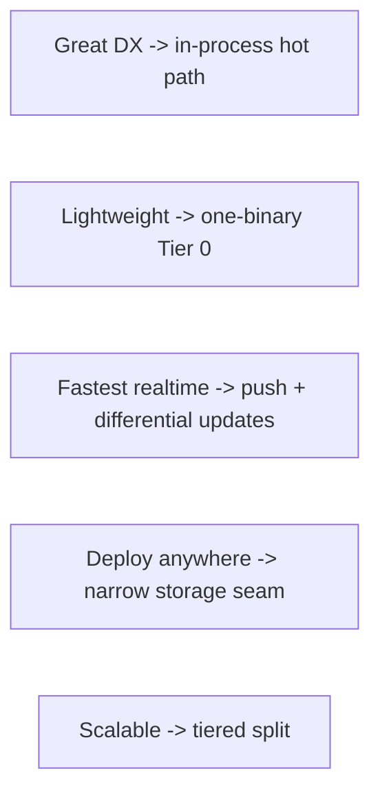
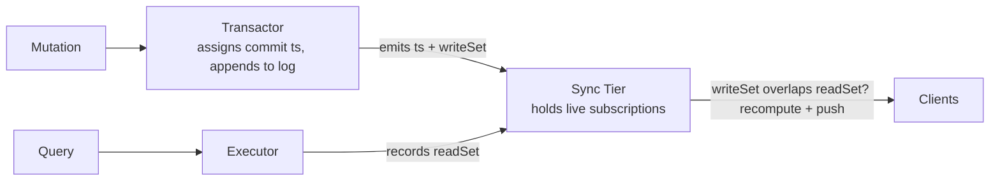
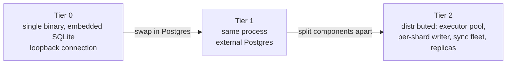

{/* diataxis: explanation */}

This page is the map. It explains the one idea that everything else in Stackbase's engine is built around, and how that one idea lets a tiny single-binary app and a large distributed one share the exact same code. The other pages under **Architecture** ([reactivity & sync](/docs/contributing/architecture/reactivity), [transactions](/docs/contributing/architecture/transactions), [storage](/docs/contributing/architecture/storage), [query engine](/docs/contributing/architecture/query-engine), [execution](/docs/contributing/architecture/execution), [runtimes & topology](/docs/contributing/architecture/runtimes)) each zoom into one piece of this picture in depth.

## The thesis, in plain terms

Think about a typical backend: an app server, a database, a cache, a message queue, and a realtime/pub-sub broker, each a separate process talking to the others over the network. Most of the latency you feel and most of the complexity you maintain lives in those network seams, not in your actual business logic.

Stackbase's bet is simple: **remove the seams.** Your query and mutation functions run *in the same process* as the storage engine, hidden behind one narrow interface instead of a database driver. There's no separate cache to invalidate and no message broker to wire up — when data changes, the engine already knows exactly which subscribed clients care, and pushes them an update directly.

## Five goals that don't obviously fit together

Stackbase is trying to be all of these at once:

| Goal | What it means in practice |
|---|---|
| **Great developer experience** | Reactive `useQuery`, end-to-end TypeScript types, a fast `stackbase dev` loop |
| **Lightweight** | One binary, an embedded database, no sidecar services — runs on a cheap VPS or a laptop |
| **Fastest realtime** | Updates are pushed the instant they happen, never polled for |
| **Deploy anywhere** | The same artifact runs on Docker, Bun, Node, or as a compiled standalone binary |
| **Scalable** | Reads and writes can grow horizontally when an app outgrows one machine |

Read that list again and notice the tension: "one lightweight binary" and "horizontally scalable distributed system" sound like opposite designs. Most backends pick one lane — a scrappy single-binary tool that hits a wall, or a scalable platform that's heavy to run on day one.

Stackbase's answer is not to pick a lane. It makes both **the same system at two different operating points**, connected by a handful of stable internal interfaces. Growing from one to the other is a deployment and configuration change — never a rewrite of your functions.

Each goal above maps to one concrete mechanism. The rest of this page explains those five mechanisms.

## The core primitive: reactive transactions over an ordered log

This is the one idea to really understand. Everything else — the storage seam, the tiers, the sync protocol — is built on top of it.

- **There is exactly one logical writer, the transactor.** Every committed write is stamped with a commit timestamp that only ever goes up, and appended to an ordered log. Because writes are strictly ordered, a hard concurrency problem ("make these transactions serializable") collapses into an easy one ("append in order").
- **Queries are read-only and deterministic** — same inputs always produce the same output, with no network calls, no randomness, and no clock reads. While a query runs, the engine quietly records its **read set**: exactly which rows and index ranges it looked at. Determinism matters here for a concrete reason: it's what makes that read set trustworthy, and what makes it safe to transparently re-run the query later.
- **Mutations are read/write transactions that run under optimistic concurrency control (OCC).** A mutation executes against a snapshot of the data, and only commits if nothing it read has changed in the meantime — otherwise the engine transparently retries it. When a mutation commits, it produces a **write set**: the ranges it actually changed.
- **Reactivity is just set intersection.** A live subscription is a query plus the read set it recorded. When a transaction commits with write set `W`, the engine checks every open subscription: does its read set overlap `W`? If yes, that query is recomputed and the new result is pushed to the client. If no, nothing happens — that client isn't touched at all.

No polling, no hand-written cache invalidation, no pub/sub topics to configure by hand. One mechanism gives you both correctness (OCC) and live updates (invalidation) for free.

This whole diagram is **storage-independent** — it talks about timestamps and ranges, never about SQLite or Postgres directly. That's on purpose, and it's the next section.

## Three kinds of functions, and why one of them can't touch the database directly

Stackbase functions come in three flavors, and the difference between them is entirely about determinism:

| Kind | Deterministic? | Can read/write the database? | Can call `fetch`, read the clock, use randomness? |
|---|---|---|---|
| **Query** | Yes | Read-only | No |
| **Mutation** | Yes | Read + write, via OCC | No |
| **Action** | No | Only indirectly, via `ctx.runQuery`/`ctx.runMutation` | Yes |

Queries and mutations are deterministic on purpose: it's the only way a recorded read set stays meaningful, and the only way a conflicting mutation can be safely replayed instead of just failing outright. The moment you let a query call `fetch` or read `Date.now()`, replaying it could produce a different answer than the one a subscribed client already saw — and the whole reactivity guarantee falls apart.

Actions are the deliberate escape hatch: real side effects — calling a third-party API, sending an email, reading the system clock — need to happen *somewhere*. Actions run entirely **outside** the transactor, with no direct database access, so nothing non-deterministic can ever leak into the reactive core. See [Actions](/docs/core-concepts/actions) for the user-facing side of this, and [Execution](/docs/contributing/architecture/execution) for how the executor enforces the split internally.

## The storage seam: one interface, more than one database

The engine never imports a database driver directly. All persistence goes through a small interface — internally called `DocStore` — and that interface only needs to support one thing: an **ordered, point-in-time range scan** ("give me everything in this range, as of this timestamp") plus a write path that carries enough information to detect an OCC conflict.

That's a deliberately narrow contract. Anything that can satisfy it is a valid backend, and today two things do: **embedded SQLite** (the zero-config default) and **Postgres** (the scale-up option). Adding a third backend later means writing an adapter, not touching the transactor, the query engine, or the sync tier. See [Storage & the MVCC log](/docs/contributing/architecture/storage) for the actual data model behind it.

If you ever find code in the engine that behaves differently depending on which database is underneath it, that's not a quirk — it's a bug. The whole point of the seam is that the engine genuinely does not know which database it's talking to.

## The tiers: how "one binary" and "scalable" coexist

The transactor, the executors (which run your query/mutation code), and the sync tier (which holds subscriptions and pushes updates) are the same three components at every scale. What changes across tiers is only how they're arranged.

- **Tier 0 — the default.** One executable: the transactor, executors, sync tier, and dashboard all run in the same process, over embedded SQLite. A client on the same machine talks to the engine over an in-memory loopback connection instead of a real network socket — there's no network hop at all. This is what makes `stackbase dev`, a self-contained Docker container, and a compiled single-file binary all possible.
- **Tier 1 — same process, real database.** Identical to Tier 0 except the adapter underneath is Postgres instead of SQLite. Still one writer, still one process — this is usually the "we outgrew a single SQLite file" step, with no code changes.
- **Tier 2 — split apart.** The executors become a stateless, horizontally-scaled pool. The transactor stays a single logical writer, but now *per shard* — write throughput scales by adding shards, not by weakening consistency. The sync tier becomes its own standalone service, so connection count and query-recompute load can scale independently of storage. Postgres gains read replicas.

The promise across all three: moving up a tier changes deployment configuration and which adapters are plugged in — **never** your query/mutation/action functions. That promise, not any single piece of tech, is the actual product.

## What's real today, and what's still maturing

Being straight about this matters more than making the diagram look complete:

- **Tier 0 and Tier 1 are real, shipped, and tested** — the single-binary/Docker path most self-hosted apps will actually run on.
- **Tier 2 exists and runs**, but it's a newer, still-maturing part of the system (parts of it live in the commercial `ee/` tree rather than the open-core engine). A log-fed fleet of writers coordinates through Postgres-backed leases, and replicas tail the commit log to stay current. Measured multi-node throughput on a shared Postgres backing store tops out around **1.75x at 3 nodes** today — useful, but it means the practical path to real write scale is adding *shards* (each with its own single writer), not just adding more nodes against one shared store.
- **The wire protocol is JSON, not a custom binary format.** An early sketch of this design considered a compact binary delta protocol; what actually shipped instead is JSON carrying *differential* updates (only what changed, not the whole result set again) — see [Reactivity & sync](/docs/contributing/architecture/reactivity) for how that differential path works. It gets most of the bandwidth win without the complexity of a bespoke wire format.

## What Stackbase deliberately does not do

- **No sprawl of a dozen containers.** One engine process with pluggable adapters, not a ring of microservices each needing its own deploy story.
- **No hidden single-node ceiling.** The in-process Tier 0 design is one configuration of a system built to scale, not a wall you hit later.
- **No durability shortcuts by default.** Writes go through a real, ordered, durable log. Speed comes from keeping the hot path in-process, not from skipping the parts that keep your data safe.
- **No database-specific behavior leaking out of an adapter.** Covered above — it's a design bug if it happens.
- **Nothing here implies full sandboxing, search/vector indexes, or edge-network termination.** The executor runs in-process today (it's designed to be portable to a stricter sandbox later, but that isolation isn't built yet), and search/vector and TLS termination aren't part of the engine — see the honest status notes in the project's build log if you want the full list of what's deferred.

## Where to go next

- [Reactivity & sync](/docs/contributing/architecture/reactivity) — the read-set/write-set matcher and the WebSocket sync protocol in detail.
- [Transactions](/docs/contributing/architecture/transactions) — the OCC commit pipeline and conflict retries.
- [Storage & the MVCC log](/docs/contributing/architecture/storage) — the append-only log and the `DocStore` seam.
- [Query engine](/docs/contributing/architecture/query-engine) — how index scans become read sets, and stable pagination.
- [Execution](/docs/contributing/architecture/execution) — the query/mutation/action split enforced at runtime.
- [Runtimes & topology](/docs/contributing/architecture/runtimes) — Tier 0 through Tier 2, concretely.
- [Scaling](/docs/deploy/scaling) and [Deploy & build](/docs/deploy/deploy-and-build) — the user-facing side of moving up a tier.
- [Queries](/docs/core-concepts/queries), [Mutations](/docs/core-concepts/mutations), and [Actions](/docs/core-concepts/actions) — the function types from an app author's point of view.
