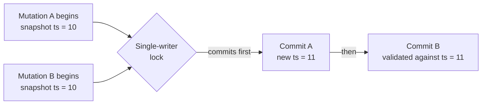
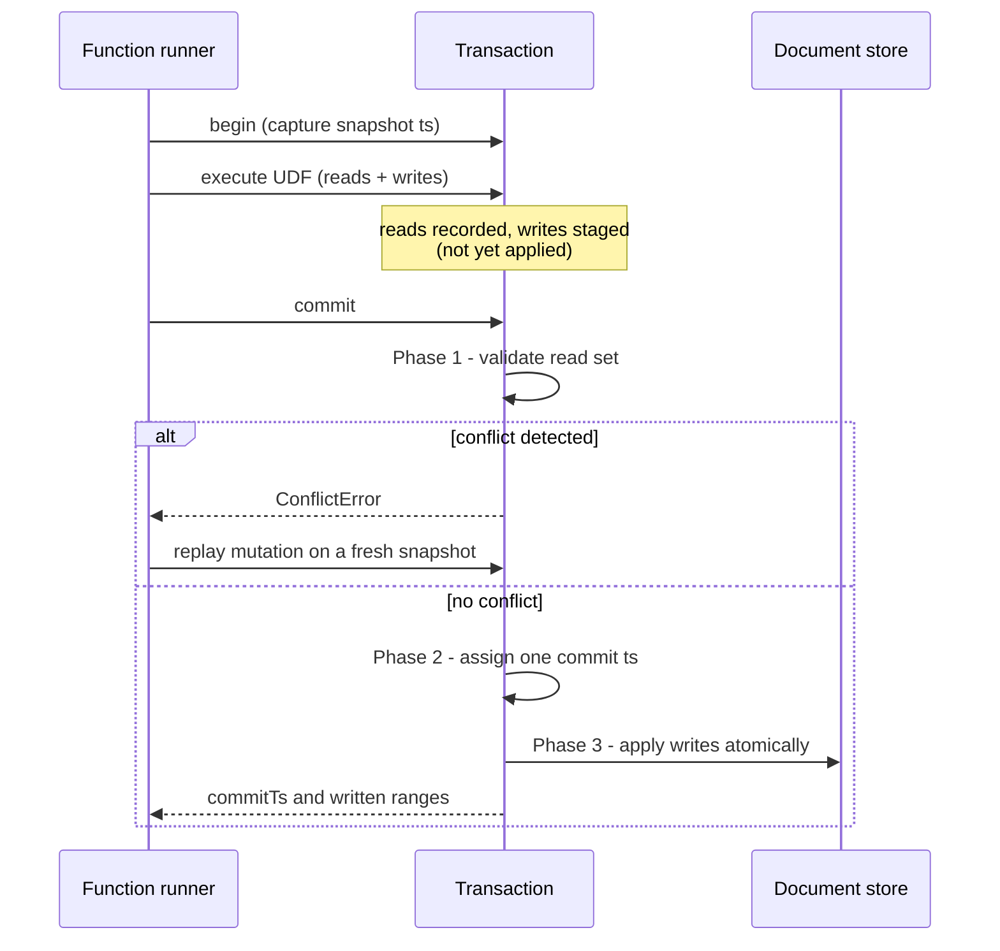
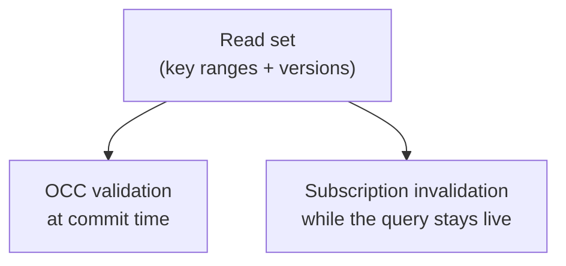
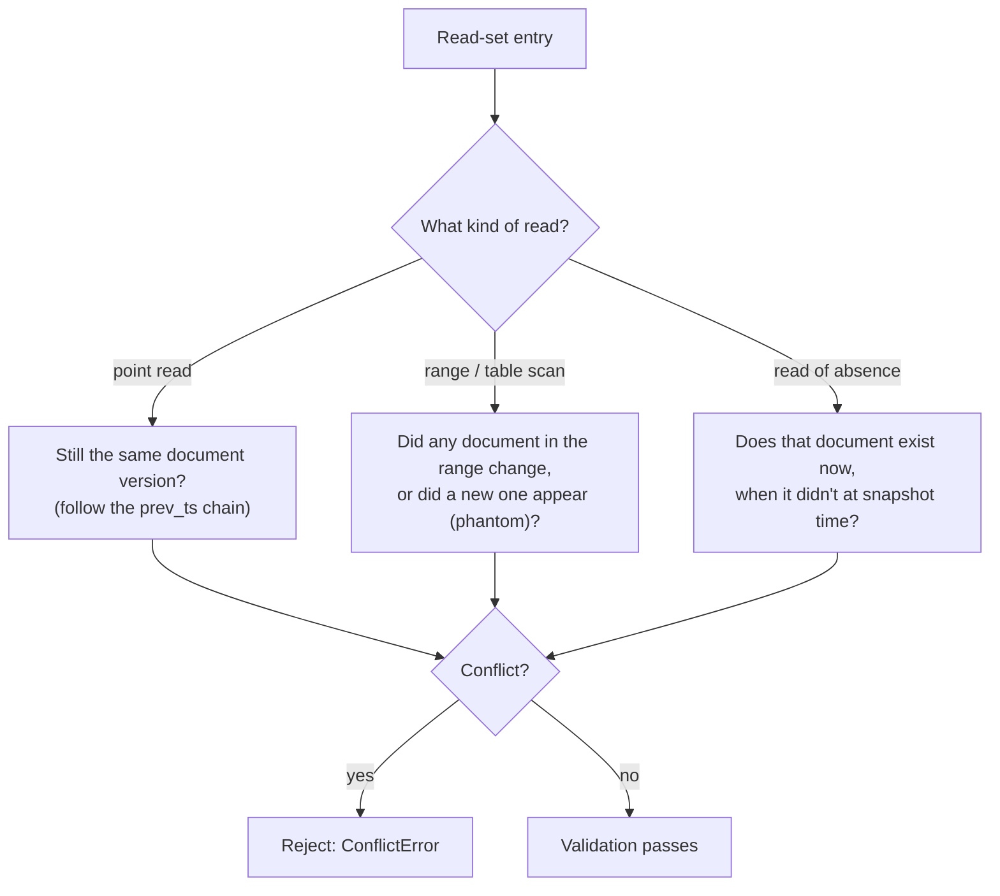

{/* diataxis: explanation */}

Every mutation you write — a `ctx.db.insert(...)`, a `ctx.db.patch(...)` — runs inside a transaction. This page explains how that transaction is made safe (no two mutations can silently step on each other) and cheap (no locks while reading, no waiting) at the same time, and how the same bookkeeping that makes this safe is reused to power live queries.

If you haven't read `/docs/core-concepts/mutations` yet, start there for the developer-facing view. This page is the "how it works under the hood" companion — useful once you're reading engine source, writing a component, or just curious.

## The one trick: only one writer at a time, per shard

Stackbase's engine is organized into **shards**. In the default single-binary setup there is exactly one shard, so for now just think of it as "the database." (Sharding is how Stackbase scales writes horizontally at Tier 2 — see `/docs/contributing/architecture/runtimes` — but everything on this page applies per-shard either way.)

Inside one shard, Stackbase makes a deliberate simplifying choice: **only one transaction is allowed to commit at a time.** A per-shard lock (`AsyncMutex`, in `packages/transactor/src/shard-writer.ts`) makes sure commits happen one after another, never in parallel. Alongside that lock sits a **monotonic clock** — an oracle that only ever hands out ever-increasing numbers ("timestamps"). Every committed transaction gets a timestamp strictly greater than every timestamp committed before it on that shard.

Why does this combination matter? It turns a normally-hard problem — "did someone else change the data I depended on?" — into a cheap one. With commits serialized and timestamps strictly increasing, a transaction only has to ask one question at commit time: **"has anything I read changed since I started?"** There is no other writer to coordinate a lock with, no deadlock detection, no distributed consensus. This technique is called **optimistic concurrency control (OCC)**: assume no conflict, do the work, and check for a conflict only right before committing.



Both `A` and `B` read concurrently, lock-free — reads never wait on anything. Only the brief commit step is serialized, and it is deliberately short: validate, stamp a timestamp, write. Nothing else happens while the lock is held.

## The lifecycle of a mutation

Every transaction goes through the same four steps. Keep this shape in mind — it's the mental model for the rest of this page. The class that implements it is `SingleWriterTransactor` (`packages/transactor/src/single-writer-transactor.ts`), which delegates the actual mechanics to a per-shard `ShardWriter`.



1. **Begin.** The transaction captures a *snapshot timestamp* — the last timestamp that was fully committed on this shard. Every read this transaction makes is answered "as of" that moment, no matter how long the transaction takes to run.
2. **Execute.** Your mutation's code runs. Reads go to the document store at the snapshot timestamp — but first they check whether *this same transaction* already wrote that document (more on that below, it's called read-your-own-writes). Every read is recorded. Every write is *staged* — held in memory — not yet written to the store.
3. **Commit.** A three-phase process, covered in detail in the next section, that either succeeds and applies everything atomically, or fails with a conflict.
4. **Rollback.** If anything goes wrong (or a conflict is detected), the staged writes and recorded reads are simply discarded. Nothing was ever visible to anyone else, so there's nothing to undo.

A transaction that only reads (a `query` function, or a mutation that happens to write nothing) skips straight past the commit machinery — there's nothing to validate or apply, so it never touches the single-writer lock at all.

## Read set and write set: the same shape, two jobs

As a mutation runs, the transaction keeps track of two things:

- The **read set** — every document, index range, or table scan the mutation looked at.
- The **write set** — every document the mutation is about to change.

Both are recorded using the exact same representation: a **key range**. A key range is just "this table (or index), from this byte-encoded key to that byte-encoded key." A single document read is a range that starts and ends at the same key (a "point" range); a `.collect()` over an index is a range spanning many keys; a full table scan is the widest possible range for that table. Keys are byte-encoded so that comparing two ranges for overlap is a cheap, ordinary comparison — no per-type logic needed.

This shared representation is not an implementation shortcut — it is the elegant core of the whole system, because the *same* read set is used for two completely different jobs at two completely different times:



- **At commit time**, the read set (with the *version* each read saw) is what Phase 1 validation checks against — "did anything in here change since my snapshot?"
- **While a query is subscribed**, that same read set is handed to the sync tier. When a later commit's write set arrives, the sync tier intersects it against every live subscription's read set — any overlap means "this query might now return something different, re-run it and push the update." See `/docs/contributing/architecture/reactivity` for that half of the story.

One recorded read set, two consumers. Get this representation right and both correctness (OCC) and reactivity fall out of it almost for free.

## The three-phase commit

Commit is where the interesting work happens, and it is intentionally short so the single-writer lock is held for as little time as possible.

**Phase 1 — Validate.** For every entry in the read set, ask: has a newer, conflicting write landed since my snapshot?

- If the answer is yes for *anything* read, the whole transaction is rejected with a `ConflictError` — nothing is applied.
- The transaction's own staged writes are excluded from this check. Reading back something you yourself just wrote in the same transaction is expected, not a conflict.

**Phase 2 — Assign a commit timestamp.** If validation passes, the transaction is given exactly *one* new timestamp from the shard's monotonic clock. Every document and index entry this transaction writes gets stamped with that single timestamp, so they all appear to happen at one instant, together.

**Phase 3 — Apply.** All staged documents and index updates are written to the document store in one atomic operation, at the assigned commit timestamp.

Only after Phase 3 succeeds does the transaction return its result — the commit timestamp, plus the write set (the "written ranges") that becomes the input to reactive invalidation.

A transaction that staged no writes at all (a pure read) short-circuits before Phase 1 — there is nothing to validate and nothing to apply, so it never takes the lock and never burns a timestamp.

## How a conflict is actually detected

Validation has to handle a few different shapes of read, each checked slightly differently:



- **Point read of one document.** Every document revision carries a back-pointer, `prev_ts`, to the revision it replaced — a little linked list of history. Validation checks whether a newer revision has landed since the snapshot. If it has, the document changed under you: conflict.
- **Range scan or table scan.** The mutation recorded which document IDs it saw when it ran the scan. Validation re-checks: did any of those documents change? Did a document that wasn't there before now fall inside the scanned range (a "phantom" row)? Either one is a conflict — a table scan that missed a brand-new matching row would silently produce a wrong answer, so phantoms have to be caught too.
- **Read of absence.** If your mutation checked "does this document exist?" and got "no," and a matching document has since been created, that's also a conflict — you made a decision based on it being absent, and that's no longer true.

In every case, **the transaction's own writes are excluded** — you never conflict with yourself.

As a shortcut, each shard also tracks the highest commit timestamp that touched each table (its "write watermark"). If nothing was written to a table since your snapshot, validation skips re-checking any read against that table entirely — most reads in most mutations validate in constant time, and only tables that actually changed pay the cost of a closer look.

## Deterministic replay: how a conflict gets resolved

Here's the part that surprises people new to this design: **the transaction itself never retries.** When Phase 1 throws a `ConflictError`, the transactor's job stops there — it rolls back and hands the error back to its caller, the function runner.

The function runner is the one that retries: it discards everything from the failed attempt, takes a brand new snapshot, and **runs your entire mutation function again from the top** — same arguments, fresh reads, fresh writes. This is safe, and not wasteful in the way it might sound, for one reason: **mutations are required to be deterministic functions of the database and their arguments.** No `Math.random()`, no `Date.now()`, no network calls. Given the same inputs and the same database state, a mutation always produces the same writes. So replaying it on a fresh snapshot after a conflict is not a guess or a workaround — it's simply re-deriving the correct answer against up-to-date data.

This replay is bounded (a default retry ceiling), so a mutation that keeps colliding under heavy contention eventually surfaces the conflict to the caller instead of retrying forever. It is also exactly why queries and mutations can't touch the clock, randomness, or the network directly — that non-determinism has to live in [actions](/docs/core-concepts/actions) instead, which run outside a transaction and are never replayed this way.

## Read-your-own-writes

Within a single mutation, this needs to work:

```ts
await ctx.db.patch(userId, { credits: 10 });
const user = await ctx.db.get(userId);
// user.credits is 10 — even though nothing has been committed yet
```

The write to `userId` is only *staged* at this point — it hasn't reached the document store. But the very next read has to see it anyway, or the mutation's own logic would be reading stale data mid-execution. Stackbase handles this by checking the transaction's own staged writes *before* falling through to the document store: a `get()` call first asks "did this transaction already write this document?" and only asks the store if the answer is no.

The same idea applies to scans: a `.collect()` over an index merges the transaction's pending writes over the persisted results, so a document you just inserted shows up in a scan you run afterward, in the right sorted position, and a document you just deleted disappears from one — all before anything is actually committed. This keeps a mutation's view of the database internally consistent from its own perspective, even though nothing it has written is visible to anyone else yet.

## From write set to reactivity

When Phase 3 finishes, the commit produces exactly the payload the rest of the system needs: the assigned commit timestamp, plus the write set — the key ranges that were just written, described the same way read sets are. That pair is handed off (Stackbase calls it an "oplog delta") to the sync tier, whose job is to intersect it against every live subscription's stored read set and decide who needs a fresh push. That intersection logic — not the WebSocket plumbing around it — is the actual reactivity engine, and it's covered in `/docs/contributing/architecture/reactivity`.

The important thing to internalize here is that reactivity is not a bolt-on notification system layered over the database. It falls directly out of the same read-set/write-set bookkeeping that OCC already needed for correctness. There is only one source of truth about "what changed" and "what did this query depend on," and both correctness and liveness are computed from it.

## Limits: protecting the one writer you have

Because every mutation on a shard funnels through a single lock and a single retry loop, a single runaway mutation could, in principle, monopolize it — scanning millions of rows, staging an unbounded number of writes, or retrying forever. Stackbase bounds this with a per-transaction resource budget (a `HeadroomTracker`, in `packages/transactor/src/headroom.ts`): a cap on documents read, and a separate, tighter cap on documents written.

Writes are capped more tightly than reads for a specific reason: every written document also has to be checked against every live subscription's read set when it commits. A read only costs *this* transaction; a write costs the whole reactive fan-out downstream of it. Exceeding either limit aborts the mutation immediately with a resource error — this is deliberately **not** treated as a conflict and is never retried, since retrying a mutation that is simply too big would just fail the same way again.

These limits exist for two reasons at once: they keep one mutation from starving the single-writer shard for everyone else, and they put a ceiling under the OCC retry loop above — a transaction whose read set keeps growing without bound would otherwise be increasingly likely to conflict with something, retry, grow further, and never converge.

## What this page didn't cover

Two things are deliberately out of scope here, each covered elsewhere:

- **How the write set actually gets turned into pushed updates to subscribed clients** — that's the sync tier's job, described in `/docs/contributing/architecture/reactivity`.
- **How index-range scans, filters, and pagination decide exactly which key ranges to record** — that's the query engine's job, described in `/docs/contributing/architecture/query-engine`.

Both build directly on the read-set/write-set machinery this page describes; neither changes how commits themselves work.
