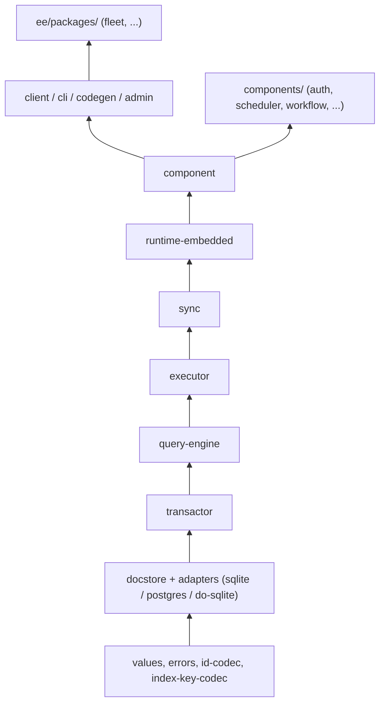
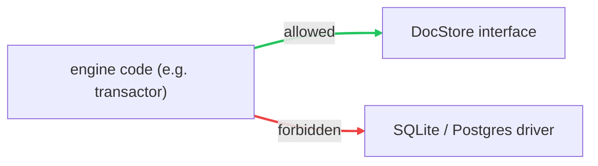

{/* diataxis: explanation */}

Stackbase lives in one repository. That's not an accident — it's the same "everything in one place, split into small pieces" idea as the reactive engine itself. This page is the map: what's in the repo, why it's split the way it is, and the one rule that keeps it from turning into a ball of mud as it grows.

If you're about to open a PR, read this first — it'll save you from importing the wrong thing.

## The layout at a glance

Think of the repo as four buckets, each with a different job:

| Bucket | What lives there | How many | Opt-in? |
|---|---|---|---|
| `packages/` | The engine, the client SDK, and the CLI | ~30 packages | No — this is the product |
| `components/` | Self-contained mini-backends (auth, scheduler, ...) | 6 packages | Yes, per project |
| `ee/packages/` | Paid, scale-out features under a separate license | 3 packages | Yes, and separately licensed |
| `apps/` + `examples/` | The dashboard app, and runnable sample apps | 1 app, 4 examples | — |

`apps/dashboard` is the live data browser, logs viewer, and function runner you get with every `stackbase dev`/`serve`. `examples/` (`chat`, `auth-demo`, `offline-demo`, `optimistic-demo`) aren't just demos — they double as end-to-end integration tests that run against the real CLI, so a regression in wiring the pieces together shows up there, not just in unit tests.

Here's the real `packages/` list, as of this writing:

```
packages/
  values                  errors                  id-codec
  index-key-codec         docstore                docstore-sqlite
  docstore-postgres       docstore-do-sqlite       transactor
  query-engine            executor                sync
  runtime-embedded        runtime-cloudflare       component
  blobstore               blobstore-fs             blobstore-s3
  blobstore-r2            storage                  objectstore
  objectstore-fs          objectstore-s3           receipts
  codegen                 admin                     client
  deploy                  test                     cli
```

That's ~30 packages. Most are small on purpose — a few hundred lines each — because a small package is easy to read start-to-finish, and a small package is also the *only* thing a dependency-direction rule (below) needs to check.

<Callout title="A note if you've read the old design docs" type="warn">
An earlier internal design note (`docs/dev/architecture/foundation/monorepo-tooling-skeleton.md`) describes a single `@stackbase/contracts` package holding all the cross-package interfaces. **That package was never built** — the repo evolved differently as it grew. What actually shipped:

- The storage interface (`DocStore`) lives in **`packages/docstore`**, not `contracts`.
- The value/validator/schema system (`Value`, `v`, `defineSchema`) lives in **`packages/values`**.
- The error hierarchy (`StackbaseError`) lives in **`packages/errors`**.

If you're reading an internal doc that mentions `@stackbase/contracts`, mentally substitute the real names above — the *idea* (pure, dependency-free contracts at the bottom of the graph) is exactly what shipped, just under different package names.
</Callout>

## The mental model: layers, bottom to top

The single most useful thing to internalize about this repo is that packages form **layers**, and a layer may only depend on the layers below it, never above. Once you know the layers, you can guess which package a piece of code lives in before you even open a file.

From the bottom up:

1. **Pure contracts** — `values`, `errors`, `id-codec`, `index-key-codec`. No dependencies on anything else in the repo. These define the vocabulary everyone else speaks: what a `Value` is, what an `Id` looks like, how errors are shaped.
2. **The storage seam** — `docstore` (the interface) plus its adapters `docstore-sqlite`, `docstore-postgres`, `docstore-do-sqlite` (the implementations). This is where "which database am I talking to" gets decided, and nowhere else.
3. **`transactor`** — the single-writer transaction manager: assigns commit order, runs optimistic-concurrency retries.
4. **`query-engine`** — executes queries, tracks what they read, handles cursor pagination.
5. **`executor`** — the sandboxed runtime that actually calls your query/mutation/action functions.
6. **`sync`** — the reactive tier: holds live subscriptions, matches a commit's write set against them, decides who gets pushed an update.
7. **`runtime-embedded`** (and the newer **`runtime-cloudflare`**) — a host that wires the layers above into one running process, over a chosen transport (loopback, WebSocket, or a Cloudflare Durable Object).
8. **`component`** — the composition layer that lets optional features (below) plug into a running app.
9. **The top** — `client` (SDK + React hooks), `cli` (the `stackbase` command), `codegen` (typed `Doc`/`Id`/`api`), `admin` (the dashboard's API).

`components/` (auth, scheduler, workflow, ...) and `ee/packages/` (fleet, ...) both sit *above* this stack — they're built using `component` and `executor`, never the other way around.



You don't need to memorize this chain to be productive — but when you're wondering "where would the code for X live," asking "what layer is X" usually answers it in one step.

## The golden rule: dependencies only point one way

Here's the rule the layering above exists to enforce, stated as plainly as possible:

> **The engine imports interfaces. It never imports a specific database, host, or socket.**

Concretely: `transactor`, `query-engine`, `executor`, and `sync` are allowed to import `docstore` (the interface), but none of them are allowed to import `docstore-sqlite` or `docstore-postgres` (the actual drivers) directly. Only a *leaf* package — something like `runtime-embedded`, which is responsible for wiring a real app together — is allowed to pick a concrete adapter.



*A leak out of an adapter is a design bug, caught in CI — not a code-review hope.*

Why this matters more than it might seem: **package boundaries are the tier-split points.** Want to run Stackbase on Postgres instead of SQLite? That's a new leaf package (`docstore-postgres`), not an edit to `transactor`. Want to run on Cloudflare Durable Objects instead of an embedded process? That's a new leaf (`runtime-cloudflare`, `docstore-do-sqlite`), not a rewrite of `query-engine`. The engine never learns which database or host it's running on — and because it structurally *can't* learn that (it never imports the packages that would tell it), the "engine is portable" property survives contributors who don't happen to remember the rule. See [Architecture: runtimes](/docs/contributing/architecture/runtimes) for how this plays out across Tier 0 (single binary) and beyond.

## A one-line tour of the load-bearing packages

You won't need all of these on day one, but here's what to reach for when you need it:

| Package | What it's for |
|---|---|
| `values` | The value system: `Value`, `v` validators, `defineSchema`/`defineTable` |
| `errors` | The `StackbaseError` hierarchy — every thrown error knows its HTTP status |
| `id-codec` | Encodes/decodes document ids (`Id<"table">` `<->` the stored bytes) |
| `index-key-codec` | Order-preserving key encoding, the interval-index matcher, and cursors |
| `docstore` | The storage seam — the `DocStore` interface everything above it relies on |
| `transactor` | The single-writer transaction manager (optimistic concurrency, commit order) |
| `query-engine` | Query execution and cursor pagination |
| `executor` | The sandboxed runtime that calls your query/mutation/action functions |
| `sync` | The reactive tier and the WebSocket wire protocol |
| `runtime-embedded` | The Tier 0 host: wires engine + adapter + transport into one running process |
| `component` | Composition: namespaced tables, the driver seam, `stackbase.config.ts` wiring |
| `codegen` | Generates the typed `Doc`/`Id`/`api` your app code imports |
| `client` | The framework-agnostic client, plus React hooks (`useQuery`, `useMutation`) |
| `cli` | The `stackbase` command: `dev`, `serve`, `deploy`, `build`, `codegen` |
| `deploy` | The pluggable `DeployTarget` seam (`serve`/`cloudflare`/`docker`) behind `stackbase deploy` |
| `blobstore` + `storage` | The byte-storage seam and the always-on `ctx.storage` file API |
| `admin` | The API the dashboard app talks to |
| `receipts` | The Receipted Outbox's server-side TTL reaper — sweeps expired dedup rows off `DocStore` |

If a name isn't in this table, it's either a leaf adapter (`docstore-postgres`, `blobstore-s3`, ...) whose job is obvious from its name, or test-only scaffolding (`test`).

## Components: opt-in mini-backends

`components/` holds six packages — **auth**, **authz**, **scheduler**, **workflow**, **triggers**, **notifications** — each a self-contained feature with its own tables, functions, and (where relevant) background work. None of them are on by default; a project turns one on by composing it in `stackbase.config.ts`. Under the hood, every one of them is built the same way: on top of the `component` package's composition seam and the `executor`'s function-calling machinery — nothing about them is special-cased in the engine.

If you want to build your own, [Building a custom component](/docs/contributing/extending/custom-component) walks through the seams (`schema`, `context`, `modules`, `driver`, `boot`, `httpRoutes`) that `defineComponent` gives you — the same ones auth and friends use.

## `ee/`: the reserved paid-scale area

Three packages — **fleet** (distributed Tier 2 scale-out), **objectstore-substrate**, and **runtime-cloudflare-shard** — live under `ee/packages/`. They're source-available, but under a **separate commercial license** that does not convert to Apache like the rest of the repo does. This is the "gate scale, not self-hosting" line: single-node self-hosting is free forever, and the `ee/` code is what a paid license key unlocks on top of it. See [Licensing & the ee/ split](/docs/contributing/licensing) for the full story.

## The tooling

- **Bun workspaces** — Bun is both the package manager and the runtime. The workspace globs (`packages/*`, `components/*`, `ee/packages/*`, `apps/*`, `examples/*`, plus `benchmarks/convex-comparison` and `benchmarks/runner`) and a shared dependency **catalog** (pinned versions for things like `typescript` and `vitest`, so every package asks for the same version) both live in the root `package.json`. Internal cross-package dependencies use `workspace:*`, so they always resolve to the local source, not a published version.
- **Turborepo** — `turbo.json` defines the task graph: `build`, `test`, `typecheck`, `lint`, `dev`. The key line is `"dependsOn": ["^build"]` on the `test` and `typecheck` tasks — the `^` means "build my dependencies first," which is what makes `bun run build` (and `bun run test`) run every package in the right order automatically, instead of you having to know the order yourself.
- **vitest, run under Node** — even though Bun is the primary runtime, the test suite runs under Node via vitest. That means a test that only works with a Bun-specific API won't get caught by the normal `bun run test` — worth knowing if you're testing something Bun-only.

<Callout title="Rebuild after editing a dependency" type="warn">
Cross-package tests import their dependencies from the built `dist/` output, not from `src/`. If you edit `packages/values/src/...` and then run `packages/query-engine`'s tests without rebuilding, you're testing against the *old* compiled `values`. Run `bun run build` (or `bun run --filter @stackbase/values build`) after editing a package other tests depend on.
</Callout>

Common commands:

```bash
bun install                              # bootstrap the whole workspace
bun run build                            # build every package, topologically
bun run test                             # run all tests (vitest, under Node)
bun run typecheck                        # tsc --noEmit across every package
bun run --filter @stackbase/values test  # just one package's tests
```

See [Development setup](/docs/contributing/codebase/development) for the full clone-to-running-tests walkthrough, and [System design](/docs/contributing/architecture/system-design) for why the engine is shaped this way in the first place.
