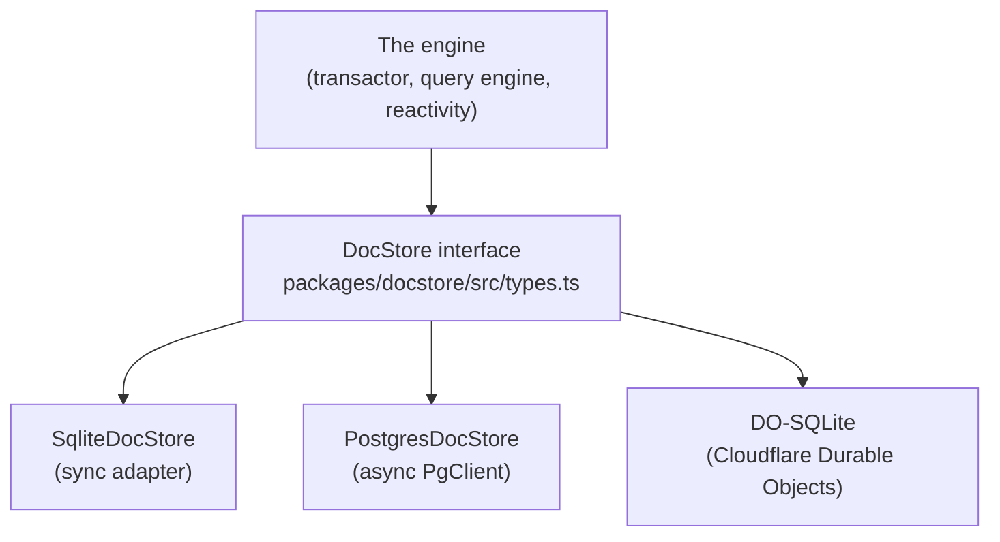
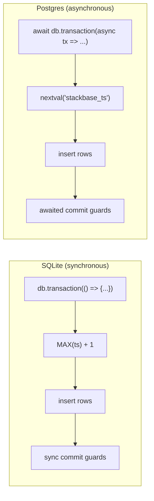

{/* diataxis: how-to */}

## Why this seam exists

Stackbase's engine — the transactor, the query engine, reactivity — never talks to a database directly. It talks to one narrow TypeScript interface called `DocStore`. Whatever sits behind that interface (SQLite, Postgres, a Durable Object's embedded SQLite, something you write) is invisible to everything above it.

That's the whole pitch of this page: **to back Stackbase with a different database, you implement one interface, and nothing else in the engine has to change.**



The engine only ever imports `DocStore`. It has no idea whether reads are coming from a local file or a Postgres cluster three availability zones away — and that's the point. If you're new to the codebase, read this alongside `docs/dev/architecture/internals/01-storage.md`, which goes deeper into the historical reasoning; this page sticks to what's actually shipped and how to build against it.

The three implementations shipped today all reuse the same MVCC (multi-version concurrency control) data model described below — they only differ in *how* they talk to their underlying storage. `SqliteDocStore` and the DO-SQLite backend actually share the exact same class; only the low-level driver underneath differs.

## The data model in one paragraph

Every write is an **append**, never an in-place update. When a document changes, the store adds a new dated revision; it never edits the old one. A delete is also an append — a special "tombstone" revision meaning "as of this moment, this document doesn't exist." Reading a document "as of time T" just means: find the newest revision with a timestamp `<= T`. This is called MVCC (multi-version concurrency control), and it's what lets many readers see a consistent snapshot of the world while writes keep happening — nobody's read ever gets torn or half-updated.

Because nothing is overwritten, a document's history forms a backwards linked list through time (each revision points at `prev_ts`, the timestamp of the revision before it). This is what makes it cheap to answer "what changed since I last looked."

## The DocStore contract, grouped by job

The full interface lives in `packages/docstore/src/types.ts`. It's long, but it breaks into a handful of jobs. If you're implementing a new backend, this is the order to tackle them in.

### 1. Set up the physical schema

```
setupSchema(options?: SchemaSetupOptions): Promise<void>
```

Create whatever fixed physical tables your backend needs. This must be **idempotent** — safe to call every time the engine boots, whether the tables already exist or not. It is not called once per app table; see "physically schemaless," below, for why.

### 2. The write path

This is the part worth spending the most design time on, because it's where correctness lives.

- **`write(documents, indexUpdates, conflictStrategy, shardId?)`** — append revisions with a timestamp the *caller* already picked. This is used for replaying already-committed data (for example, applying a replica's log), not for normal application writes.
- **`commitWrite(documents, indexUpdates, shardId?, opts?)`** — the normal path a mutation takes. The documents and index rows arrive with a placeholder timestamp (`0n`); your store allocates the *real* commit timestamp itself, inside its own transaction, and returns it. This detail matters: allocating the timestamp and writing the rows happen as one atomic step, so there's never a moment where a timestamp has been claimed but its rows haven't landed yet.
- **`commitWriteBatch(units, shardId?)`** — the same idea, but for committing several independent "units" of work in one go (group commit). Each unit gets its own timestamp, strictly increasing, all inside one transaction. `commitWrite` is implemented as a one-unit call to this, so there's really only one code path to get right.
- **`addCommitGuard(guard)`** — lets other parts of the system (for example, a feature tracking exactly-once delivery) hook a function into the commit transaction itself. A guard runs inside the same atomic commit as the row inserts; if it throws, the whole commit is rolled back. `addCommitGuard` returns an "unregister" function to remove that guard later.

### 3. The read path

- **`get(id, readTimestamp?)`** — fetch one document as it looked at a given timestamp (or the latest, if omitted).
- **`index_scan(indexId, tableId, readTimestamp, interval, order, limit?)`** — this is the hot path: an ordered, point-in-time walk over an index's key range, yielding `[key, document]` pairs. Every query the engine runs eventually bottoms out here.
- **`scan(tableId, readTimestamp?)`** and **`count(tableId)`** — read (or count) every live document in a table.
- **`maxTimestamp()`** — the highest commit timestamp your store has ever seen. Used as a restart high-water mark, so the engine's internal clock never goes backwards after a crash and restart.

### 4. Log tailing (the change feed)

- **`load_documents(range, order, limit?)`** — an async generator over every raw revision (including tombstones) whose timestamp falls in a range. This is how the reactivity system and other log-consumers "tail" the log forward to learn what changed, rather than polling.

### 5. Optimistic concurrency control (OCC) support

- **`previous_revisions(queries)`** — given a set of `{id, timestamp}` pairs, return what was visible at each one. The transactor uses this to check whether anything it read has since changed before it commits (the "optimistic" half of optimistic concurrency control).

### 6. A tiny key-value store

- **`getGlobal`/`writeGlobal`/`writeGlobalIfAbsent`** — a small string-to-JSON side table for engine bookkeeping, independent of any application table.

### 7. Client mutation receipts

- **`getClientVerdict`, `getClientFloor`, `recordClientVerdict`, `updateClientVerdictValue`, `pruneClientMutations`, `sweepExpiredClientMutations`** — a dedicated, durable record of "did this client's mutation number N already run, and what happened." This backs the offline mutation outbox (see `/docs/client/offline-sync`) so a resent mutation is recognized and not re-executed. If you're implementing a new backend primarily to try out the storage model, you can treat this group as the last thing you wire up — but it does need to exist for the outbox feature to work.

### 8. Cleanup

- **`close()`** — release whatever the backend is holding (a file handle, a connection).

### Its companion: the TimestampOracle

`DocStore` is paired with a `TimestampOracle` interface — the thing that hands out the ever-increasing commit timestamps the whole log is ordered by. In practice, the store itself now allocates timestamps directly inside `commitWrite`/`commitWriteBatch` (see below), and the oracle mostly tracks "what's the newest timestamp we've allocated or fully applied" for the rest of the engine to read.

## The invariants you must not break

A backend that gets these wrong will not throw an obvious error — it will corrupt data silently, sometimes only under concurrent load. Treat this list as non-negotiable.

1. **Append-only.** Never `UPDATE` or `DELETE` a row in place. A change is always a new row with a new timestamp; a deletion is a new row whose value is `null` (a tombstone).
2. **Snapshot semantics.** A read at `readTimestamp` must return the newest revision of each key with `ts <= readTimestamp` — nothing newer, nothing skipped.
3. **Strictly increasing commit timestamps, allocated inside your own transaction.** Two commits must never get the same timestamp, and a timestamp must never become visible before its own rows do. This is only safe because Stackbase is single-writer: at most one writer is ever committing to a given store at a time (see the `pg_advisory_lock` discussion below for how Postgres enforces this).
4. **`index_scan` must yield keys in encoded byte order**, and only the revision that was actually visible at the requested timestamp — never a newer one that happens to exist.
5. **Documents and their index rows commit together, atomically.** A crash (or a concurrent reader) must never see a document without its index entry, or vice versa.

## The two shipped reference implementations

Both implementations model the exact same three logical concerns — `documents` (the revision log), `indexes` (the MVCC index entries), and `persistence_globals` (the KV side table) — plus the client-receipt tables from job 7 above. Where they differ is *how* they talk to their underlying SQL engine, and that difference is the most important thing to internalize before writing a third one.

### docstore-sqlite: synchronous

`@stackbase/docstore-sqlite`'s `SqliteDocStore` sits on top of a small synchronous `DatabaseAdapter` seam (`exec`, `prepare`, `transaction`) — see `packages/docstore-sqlite/src/adapter.ts`. Two concrete adapters exist today: a Node one (`node-adapter.ts`, built on `node:sqlite`) and a Bun one, sharing the same base `SqliteDocStore` logic. Because the underlying driver is synchronous, a commit guard registered here **must also be synchronous** — there is no `await` inside a single-transaction SQLite commit, and returning a promise from a guard is treated as a caller bug.

The commit timestamp is allocated as `MAX(ts) + 1`, computed inside the same transaction as the writes. Since Stackbase enforces single-writer, no other writer can race in a higher timestamp between the `MAX(ts)` read and the insert — the whole thing is race-free by construction, not by locking.

### docstore-postgres: asynchronous

`@stackbase/docstore-postgres`'s `PostgresDocStore` sits on a narrow *async* seam called `PgClient` (`query`, `transaction`, `acquireWriterLock`, `close` — see `packages/docstore-postgres/src/pg-client.ts`), implemented concretely by `node-pg-client.ts` on top of the `pg` driver. Commit guards here are always awaited — async is the native mode.

Two things make single-writer safety hold on a database that, unlike SQLite, could physically accept multiple concurrent writers:

- **A `pg_advisory_lock`**, taken once at boot (`acquireWriterLock`). If a second engine process tries to start against the same database, it fails fast instead of silently corrupting state.
- **A Postgres sequence** (`nextval('stackbase_ts')`), drawn from inside the same commit transaction as the row inserts — the async equivalent of SQLite's `MAX(ts) + 1`, but using Postgres's own atomic counter instead of a table scan.

Reads lean on set-based SQL (`DISTINCT ON`, `LATERAL` joins) to resolve "the newest visible revision per key" in one query, rather than one round trip per row — worth knowing if you're tuning a Postgres-shaped backend for latency.



Both sides land on the same guarantee — one strictly-increasing timestamp per commit, allocated where the rows are written, never before — they just get there with the primitives their own database gives them.

### DO-SQLite: the same class, a different driver

Cloudflare Durable Objects ship their own embedded SQLite (`ctx.storage.sql`). Rather than reimplement the MVCC logic a third time, `@stackbase/docstore-do-sqlite` reuses `SqliteDocStore` **verbatim** and only supplies a new `DatabaseAdapter` (`DoSqliteAdapter`) that talks to the Durable Object's SQL surface instead of `node:sqlite`. This is the cleanest illustration of why the adapter seam is drawn where it is: SQLite-shaped logic (schema, query building, transaction semantics) lives once in `docstore-sqlite`; only the thin driver differs per platform.

## Physically schemaless: the pattern to copy

If you build a new backend, copy this shape. A Stackbase app can define any number of tables and indexes in its `schema.ts`, but the physical database underneath never grows new tables or columns to match. Instead:

- **One `documents` table** holds every logical table's rows, discriminated by a `table_id` column.
- **One `indexes` table** holds every logical index's entries, discriminated by an `index_id` column.

Both are versioned by `ts`, exactly as described above. Adding an application table or field is a **data** change (a new value of `table_id` starts appearing), never a schema migration. This is precisely why the Postgres adapter needs no per-app migration step as `schema.ts` evolves — there is nothing to migrate; the physical schema was already general enough to hold it.

## How a new adapter gets accepted: the conformance suite

`packages/docstore/test-support/conformance.ts` exports a single shared test suite — every behavioral rule from "the invariants" section above, expressed as runnable tests — and both shipped backends run it: SQLite directly, and Postgres against both a real driver and PGlite (an embedded, in-process Postgres used so the tests don't need a real Postgres server to run).

A new backend is considered "done" when:

1. It passes the shared conformance suite unmodified.
2. If it's meant to be a real deployment target (not just a local experiment), it also has an end-to-end test through the real `stackbase serve` entrypoint, ideally against a real instance of the backing database — not just an in-process fake.

This is the acceptance bar, not a suggestion: passing your own hand-written tests is not the same claim as passing the same suite every other backend passes.

## How the runtime picks an adapter

The `stackbase` CLI doesn't ask you to choose an adapter in code. It selects one by configuration, at startup:

- No flag set → SQLite (the zero-config default for local dev and single-node deploys).
- `--database-url postgres://...` or the `STACKBASE_DATABASE_URL` environment variable set → Postgres. The flag wins if both are present.

This is the same "select by config, not by code" pattern Stackbase uses for its file-storage backend seam (see `/docs/contributing/extending/providers`) — the engine and your application code never need to know or care which one is active. For the Postgres flag details and a worked example, see `/docs/deploy/postgres`; for the general self-hosting story, see `/docs/deploy/self-hosting`.

## What's deliberately out of scope

- **Search and vector indexes are not part of this contract.** `SchemaSetupOptions` reserves `searchIndexes`/`vectorIndexes` fields for a future capability interface, but no shipped backend implements full-text or vector search today. Don't build against them; they're placeholders, not a real seam yet.
- **True per-tenant sandboxing** (running untreated application code in a fully isolated V8 isolate) is a separate concern from storage entirely, and isn't part of `DocStore`.

If you're building a new adapter and get stuck on the shape of a specific method, the two shipped implementations (`packages/docstore-sqlite/src/sqlite-docstore.ts` and `packages/docstore-postgres/src/postgres-docstore.ts`) are meant to be read side by side — they solve the same problem twice, which is often the fastest way to see what's essential versus what's driver-specific.

## See also

- `/docs/contributing/extending/providers` — the same select-by-config pattern applied to file storage backends.
- `/docs/contributing/architecture/storage` and `/docs/contributing/architecture/transactions` — how the transactor and query engine sit above this seam.
- `/docs/deploy/postgres` — using the shipped Postgres adapter in a real deployment.
- `/docs/deploy/self-hosting` — the general self-hosting story, including the SQLite default.
- `/docs/client/offline-sync` — the feature that depends on the client mutation receipt methods.
