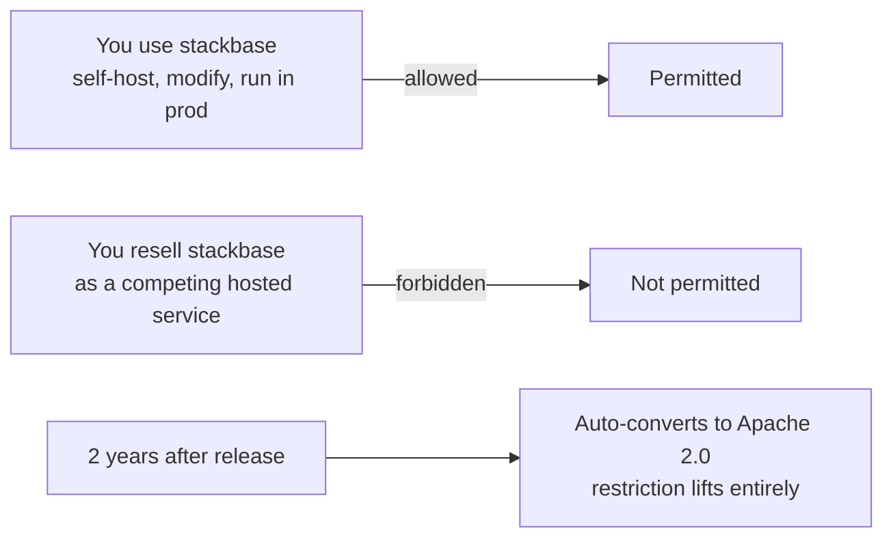
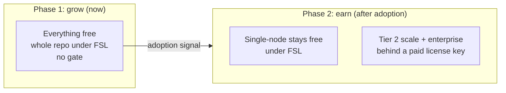
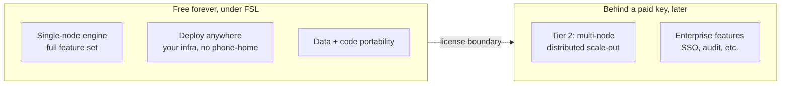

{/* diataxis: explanation */}

If you're evaluating stackbase for a real project, the first question is usually: "what am I actually allowed to do with this, and will that change later?" This page answers both, plainly.

The short version: everything you need to build and run a real application is free forever, including self-hosting at scale on your own infrastructure. The one thing you can't do is take stackbase and resell it as your own competing hosted service. That's it.

## The license in plain language

Stackbase ships under the **Functional Source License (FSL-1.1-Apache-2.0)**. The full text lives in the repository's `LICENSE` file. Here's what it means without the legalese.

You can run stackbase in your product, your company, or your side project, at no cost and with no approval needed. You can deploy it on your own server, your own cloud account, or an air-gapped box with no internet access at all. You can fork it, patch it, and read every line of it, since it's all open source.

<Callout type="info" title="The one restriction">

You may not take stackbase and offer it back out as a competing hosted product or service, something like "Stackbase Cloud, run by someone who isn't us." That's the only thing FSL forbids.

</Callout>

The restriction also expires, in your favor. Two years after each release, it lifts automatically, and that release converts to the plain, fully permissive Apache 2.0 license. Nothing you use today stays FSL-restricted forever.

If this sounds familiar, it should. It's the same license [Convex](https://convex.dev) uses: a well-understood, developer-friendly middle ground, not an exotic legal experiment.

## Why FSL, and not plain MIT or Apache

"Free" doesn't have to mean "permissive." Those are two different things, and stackbase picks free to use but not free to strip-mine.

The engine is the product here. Take a project like Supabase: its real moat is Postgres, something it doesn't own. Stackbase is different, its entire value is the reactive engine itself. A permissive license (MIT or Apache) would let any well-funded cloud provider take that engine, host it, and compete directly with stackbase's own future business, without contributing anything back. FSL closes that gap and changes nothing for ordinary users and self-hosters.

Relicensing later is a trap, not a fallback. It's tempting to start fully permissive to maximize adoption, then restrict the license once you need to protect the business. History says that doesn't buy time, it burns trust:

- Redis relicensed from permissive to restrictive, and the community forked it into **Valkey**.
- Elastic did the same and got forked into **OpenSearch**, by AWS.
- HashiCorp's Terraform license change produced **OpenTofu**.

In every case, the backlash wasn't about adding paid features. Companies like n8n and GitLab add paid features constantly and nobody minds. The backlash was about changing the rules on code people already had in production. Once you promise permissive terms, you can't credibly walk them back.

Stackbase avoids that trap by setting the protective license once, from the very first commit, before there's a community to betray. Any future paid feature is then just a normal new release under terms that were already public, not a reversal.

## What's free forever

This is the part worth being precise about, since it's the whole trust proposition. Under FSL, permanently, with no future gate planned:

- The full single-node engine: functions, the reactive query and subscription system, durable workflows and saga compensation, file storage, the scheduler, actions and webhooks, the Postgres adapter, the single-binary build, and the dashboard. That's a complete, production backend for most real applications, not a trial.
- Deploy anywhere: your laptop, your own VPS, any cloud, or an air-gapped facility with no outbound network at all. There's no phone-home requirement, ever.
- Your data and your code stay portable: plain HTTP APIs, open formats, `stackbase migrate` to bring data in, and nothing stopping you from taking it back out. You're never locked in.

None of this requires a license key today, and none of it is expected to require one later. See [Getting started](/docs) for what the full engine actually includes, and [Self-hosting](/docs/deploy/self-hosting) for how deploy-anywhere works in practice.

## The business model: free now, gate scale later

Stackbase isn't a charity. It needs a way to fund ongoing development, so the plan is sequenced on purpose: win adoption first with a genuinely complete free product, and only later, after real popularity rather than a fixed date, introduce a paid unlock for one specific thing. That thing is running stackbase's distributed, multi-node scale-out tier, plus a bundle of enterprise features like SSO and audit logging.

This is often called the n8n / GitLab-EE model: sell license keys, not compute. There's no managed cloud hosting business planned. You still deploy the paid tier on your own infrastructure, the same as everything else. The key unlocks a capability, not a place to run it: the rough shape is a signed key, verified offline at startup with no network call back to stackbase, so a self-hosted or air-gapped deployment is never at the mercy of a phone-home check to keep running. (The mechanics are designed but not built. More on that in the caveats below.)

The trigger for Phase 2 isn't a calendar date. It's meaningful adoption plus real demand for multi-node scale. Until that signal shows up, everything, including any distributed features that get built, ships free.

## Free forever vs. what a paid key unlocks

Laid out side by side, this is the whole boundary:

The `ee/` directory in the repository (short for "enterprise edition," the same convention GitLab popularized) is where this future paid code will live. It already exists today as a placeholder: `ee/packages/fleet`, the distributed multi-node coordination package for Tier 2 scale-out, is reserved there, but the paid gate itself isn't built or active yet. Nothing in `ee/` currently requires a license key to use.

Code under `ee/` is **not** covered by FSL. It's under a separate commercial license from the start. This matters because FSL's two-year Apache conversion only applies to the FSL-licensed core. If the paid tier were also under FSL, it would automatically become free after two years too, which would defeat the entire point. Keeping `ee/` on its own, non-converting license from day one avoids that leak.

## Why the sequencing matters more than the mechanism

The single most important decision here isn't FSL itself. It's the order of operations: set the protective license now, write the paywall code later. Never the reverse.

A license change on code people already run feels like a betrayal, even when the new terms are reasonable. A new paid feature shipping under terms that were already public just feels like a normal product release. FSL, plus requiring a CLA (Contributor License Agreement) or DCO (Developer Certificate of Origin) from every contributor from day one, are both about the same thing: keeping stackbase's future licensing options fully open, so Phase 2 never has to touch a license anyone is already relying on. See the [contributing guide](/docs/contributing/contributing-guide) for what the CLA/DCO means in practice when you submit a change.

## Honest caveats

A few things worth being upfront about, rather than glossing over.

This isn't a recurring-revenue model. A managed cloud earns continuously as customers grow. A license key earns once at purchase, or once a year depending on the pricing shape chosen later. The ceiling is lower than a hosting business, and that's an accepted tradeoff for a small team that doesn't want to run infrastructure or be on call for anyone else's production database.

Enforcement is legal and social, not DRM. Because the source is fully visible, including the future gate check itself, a sufficiently motivated person could in principle patch it out. That's a known tradeoff, not an oversight. It's exactly how n8n, GitLab, and Sentry operate today. A real business isn't going to risk a license violation to avoid a modest fee, and a hobbyist determined enough to patch a check out isn't the customer for multi-node scale anyway. There's no plan to build unbreakable copy protection.

The gate mechanics are designed but deliberately not built yet. The rough shape, for reference: a signed key (an offline-verifiable token, not a phone-home check) carrying entitlements and an expiry, verified locally at startup with no network call required, so self-hosted and air-gapped deployments are never broken by license checking. This is documented intent, not a shipped feature. Nothing in stackbase checks for a license key today.

## Related pages

- [Contributing guide](/docs/contributing/contributing-guide): the workflow for proposing and landing a change, including the CLA/DCO.
- [Architecture](/docs/contributing/architecture): how the engine that this license protects is put together.
- [Self-hosting](/docs/deploy/self-hosting): the free-forever deploy-anywhere story in practice.
