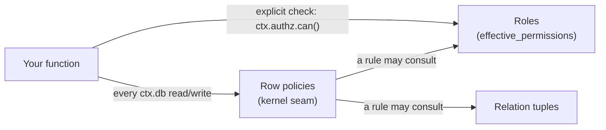
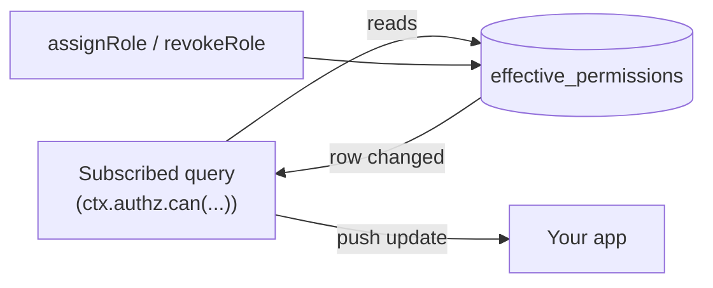

{/* diataxis: explanation */}

Say your `documents` table needs three kinds of access: some people can read everything, some can
read only their team's documents, and some can read only what's been shared with them directly.
`@helipod/authz` is how you express all three without hand-rolling permission checks inside every
query and mutation.

It gives you three tools: role-based access control (RBAC) with inheritance and scoped grants,
relationship-based access control (ReBAC) for sharing-style permissions, and declarative row
policies that filter what a query returns and gate what a mutation writes.

| You want to say | Reach for | Looks like |
|---|---|---|
| "Editors can update documents" | RBAC: [roles](#roles-and-permissions), optionally [scoped](#scoped-role-assignments) | `roles: { editor: { documents: ["read", "update"] } }` |
| "Bob shared this doc with Alice" | ReBAC: [relation tuples](#rebac-relationship-tuples) | `addRelation(alice, "viewer", doc)` |
| "Queries only ever return rows the caller may see" | [Row policies](#row-policies) | `policies: { documents: { read, write } }` |



All three are enforced by the engine itself, at the same `ctx.db` seam that already enforces
component table namespacing. A permission check is just a data read, so it participates in the
reactive read-set like any other query. Revoke a role or unshare a document, and every live
subscription that depended on it re-runs. No polling, nothing for you to invalidate.

It composes on top of `@helipod/auth` (`requires: ["auth"]`). Every check resolves the caller's
identity through `ctx.auth.getUserId()`, so authz has no identity model of its own. See
[Auth](/docs/components/auth) for that layer.

## Enabling it

`defineAuthz(config)` is a Helipod component. Compose it in `helipod.config.ts` alongside auth:

```ts title="helipod.config.ts"
import { defineConfig } from "@helipod/component";
import { defineAuth } from "@helipod/auth";
import { defineAuthz } from "@helipod/authz";

const auth = defineAuth({});
const authz = defineAuthz({
  roles: {
    viewer: { documents: ["read"] },
    editor: { inherits: "viewer", documents: ["read", "update"] },
    admin: { inherits: "editor", authz: ["manage"] },
  },
});

export default defineConfig({ components: [auth, authz] });
```

`config` takes three optional keys: `roles` (see below), `policies` (row policies, see below), and
`permissions`, a documentation-only vocabulary hint (`{ resource: string[] }`). Nothing *enforces*
`permissions` at runtime; the enforced source of truth is what a role's entries actually grant. It
does feed the boot-reconcile's config hash, though, so editing it triggers a full
effective-permissions rebuild on the next boot (see
[Materialized effective permissions](#materialized-effective-permissions)).

Composing `authz` wires a typed `ctx.authz` facade into every query, mutation, and action, and
installs your declared row policies at the kernel's read/write seam.

## Roles and permissions

A **permission** is a `"resource:action"` string. A **role** maps resources to the actions it
grants, and can `inherit` from other roles, either one name or an array, resolved recursively:

```ts
defineAuthz({
  roles: {
    viewer: { documents: ["read"] },
    editor: { inherits: "viewer", documents: ["read", "update"] },
    admin: { inherits: "editor", documents: ["delete"], authz: ["manage"] },
    god: { "*": ["*"] }, // wildcard resource AND action
  },
});
```

Either half of a permission can be the wildcard `"*"`. `documents: ["*"]` grants every action on
`documents`; `"*": ["*"]` grants everything. Wildcards are stored and matched verbatim (see
[Materialized effective permissions](#materialized-effective-permissions) below). They are not
expanded into a concrete action list.

<Callout type="info" title="Fails closed by construction">

- An unknown role grants nothing. Assigning a role name that isn't in `config.roles` produces no
  effective permissions at all. There's no error, it's simply a no-op grant.
- An unassigned or unmatched permission is denied, not allowed. There's no implicit grant. A
  `can()` check with no matching role or scope returns `false`.

</Callout>

## Scoped role assignments

A role can be granted **globally** or **scoped** to one resource: an org, a team, a single
document. Every assignment is a row in `role_assignments`, keyed by `(userId, role, scopeType,
scopeId)`:

```ts
await client.mutation(anyApi.authz.assignRole, { userId, role: "editor" });                                    // global
await client.mutation(anyApi.authz.assignRole, { userId, role: "editor", scope: { type: "org", id: orgId } }); // scoped to one org
await client.mutation(anyApi.authz.revokeRole, { userId, role: "editor", scope: { type: "org", id: orgId } });
```

`scope` is `{ type: string, id: string }`. Omit it entirely for a global grant. A global grant is
stored internally as `scopeType: "", scopeId: ""`, which is why an explicit scope must have both
`type` and `id` non-empty: `assignRole`/`revokeRole` reject a scope where either half is `""`, so a
real scope can never collide with, or be spoofed as, the global sentinel.

`assignRole` and `revokeRole` are themselves gated: the caller must hold `authz:manage` in the
target scope (or globally) before either call succeeds. Role management can't be used to escalate
privilege, and a scope-level admin can only grant within their own scope:

```ts
// Identity is per-connection, set once with setAuth, not per-call.
mallorysClient.setAuth(mallorysToken);

// Mallory holds no role at all: this throws "Forbidden: authz:manage"
await mallorysClient.mutation(anyApi.authz.assignRole, { userId: malloryId, role: "admin" });
```

Both calls are idempotent: assigning a role the user already holds (in that scope) is a no-op on
`role_assignments`, and revoking a role they don't hold is a no-op too. Neither throws.

## Bootstrapping the first admin

Because `assignRole` itself requires `authz:manage`, there is no way to grant the *first* role
through the gated path since nobody holds `authz:manage` yet. `bootstrapFirstAdmin` is the
one-time, trust-on-first-use exception:

```ts
await client.mutation(anyApi.authz.bootstrapFirstAdmin, { userId, role: "admin" });
```

It does three things, in order, inside one transaction:

1. **Validates the role actually grants `authz:manage`** (via the same role-inheritance expansion
   `can()` uses). `bootstrapFirstAdmin({ userId, role: "editor" })` throws `authz: role "editor"
   does not grant authz:manage` if `editor` doesn't.
2. **Refuses if any admin already exists.** It scans `effective_permissions` for any row matching
   `authz:manage`'s [candidate keys](#materialized-effective-permissions); if one is found, it
   throws `authz: an admin already exists; use assignRole`.
3. **Seeds both `role_assignments` and `effective_permissions` atomically**, at the global scope.

Call it once, right after your first real user signs up, before anyone has a role. Every subsequent
admin is created normally, by an already-bootstrapped admin calling `assignRole`.

## Materialized effective permissions

Rather than re-walking role inheritance on every check, authz **materializes** permissions at
*write* time (when a role is assigned or revoked) into an `effective_permissions` table. A check
(`can`) is then at most four indexed point-reads (the candidate keys `res:act`, `res:*`, `*:act`,
`*:*`), never a graph walk.

The internals are tucked away below; you don't need them to use the component.

<Accordions type="single">

<Accordion title="Candidate keys, revoke reconciliation, and the pattern cap">

The table shape:

```ts
// components/authz/src/schema.ts (shape)
effective_permissions: { userId, scopeType, scopeId, permission }
  .index("byLookup", ["scopeType", "scopeId", "userId", "permission"])
  .index("byUser", ["userId"])
```

A role's patterns are expanded once, on assignment (`expandRolePatterns`), and stored as declared,
wildcards kept verbatim. An `admin` role with `documents: ["*"]` materializes the single row
`documents:*`, not one row per concrete action.

Each check looks up at most four **candidate keys** for the permission being asked about, each a
single indexed point-read via `byLookup`:

```ts
candidateKeys("documents:read"); // => ["documents:read", "documents:*", "*:read", "*:*"]
```

`revokeRole` reconciles rather than blindly deleting: it recomputes the full desired pattern set
from every *remaining* role the user holds in that scope, deletes only the rows no longer
justified, and leaves alone any pattern still granted by another role. So if a user holds both
`editor` (which grants `documents:update`) and `viewer` (`documents:read`) in the same scope,
revoking `editor` removes `documents:update`, but `documents:read` survives, because `viewer`
still grants it.

A single role is capped at expanding to **1000 permission patterns**. A role whose inheritance
chain would exceed that throws at assignment time rather than silently truncating.

</Accordion>

<Accordion title="Boot reconcile: role edits take effect without a migration">

A `meta` table stores a stable, order-independent hash of the current `roles`/`permissions`
config. At boot, `defineAuthz`'s `boot` hook compares the stored hash to the current one:

- **Unchanged**: the hook returns immediately. No table scan, no writes. This is the steady-state
  cost on every ordinary restart.
- **Changed** (you redeployed with different role definitions): it rebuilds the *entire*
  `effective_permissions` index from the current `role_assignments`, drops any
  `effective_permissions` rows for a `(user, scope)` that no longer has an assignment, and stamps
  the new hash. This is how a role definition change (say, `editor` newly grants
  `documents:delete`) takes effect for every already-assigned user without you writing a
  migration.

There is also a manually-callable `rebuild` mutation (gated by `authz:manage`) that forces the
same full reconciliation on demand.

</Accordion>

</Accordions>

## Checking permissions: `ctx.authz`

Every query, mutation, and action gets a typed, read-only `ctx.authz` facade:

```ts
export const listDocs = query({
  handler: async (ctx) => {
    if (!(await ctx.authz.can("documents:read"))) return [];
    return ctx.db.query("documents", "by_creation").collect();
  },
});
```

<TypeTable
  type={{
    can: {
      description: "Checks the caller's effective permissions. Returns false for an unauthenticated caller.",
      type: '(permission, scope?) => Promise<boolean>',
    },
    require: {
      description: 'The same check as can, but throws Error("Forbidden: <permission>") instead of returning false.',
      type: '(permission, scope?) => Promise<void>',
    },
    roles: {
      description: "The caller's assigned role names in a scope, or globally if scope is omitted.",
      type: '(scope?) => Promise<string[]>',
    },
    scopesWith: {
      description: 'Every scope id the caller holds permission in, optionally filtered to one scope type.',
      type: '(permission, type?) => Promise<string[]>',
    },
    hasRelation: {
      description: 'Whether there is a (possibly userset-indirect) relation tuple from subject to object.',
      type: '(subject, relation, object) => Promise<boolean>',
    },
    objectsWith: {
      description: 'Object ids of objectType the caller relates to via relation, direct or via a group they belong to.',
      type: '(relation, objectType) => Promise<string[]>',
    },
  }}
/>

`hasRelation` and `objectsWith` are covered in detail in
[ReBAC](#rebac-relationship-tuples) below.

### Global-grant fallback

`can(permission, scope)` checks the **scoped** grant first. If `scope` was given and the scoped
check misses, it falls back to checking the **global** grant before answering `false`:

```ts
await ctx.authz.can("documents:read", { type: "org", id: orgId });
// 1. is there an effective_permissions row at (orgId scope, this user, a candidate key)?
// 2. if not, is there one at the GLOBAL scope ("", "")?
// 3. only then: false
```

A caller with a global `admin` role therefore passes every scoped check without needing a
per-scope assignment. The fallback is one-directional: a check with **no** scope only ever looks
at the global scope. It does not enumerate or aggregate a caller's scoped grants.

This same asymmetry matters for `scopesWith`. It returns the scope ids where a **scoped** grant
exists, filtered to the given `type`. Omit `type`, and the global scope's own empty-string scope
id shows up in the result set too. So a read policy that means "every org I can read documents in"
should always pass a `type`, and short-circuit separately on a global grant:

```ts
read: async ({ auth }) =>
  (await auth.can("documents:read"))
    ? true // a global grant → unrestricted
    : { orgId: { in: await auth.scopesWith("documents:read", "org") } },
```

### `roles(scope?)`

Returns the caller's role *names*: `role_assignments` rows for that user, filtered to rows that
are either global (`scopeType === "" && scopeId === ""`) or match the requested scope exactly.
Like `can`, an omitted `scope` means "global only." It does not also include scoped roles.

## ReBAC: relationship tuples

For sharing-style permissions that don't fit a role (Alice can view *this* document because Bob
shared it with her, or because she's on the `eng` team and the team was granted access), authz
stores relation tuples in a `relations` table, shaped `object#relation@subject`:

```ts
await client.mutation(anyApi.authz.addRelation, {
  subject: { type: "user", id: aliceId },
  relation: "viewer",
  object: { type: "document", id: docId },
});
```

`addRelation`/`removeRelation` require the caller hold `<objectType>:share` (here
`document:share`) scoped to that exact `{ type, id }` object, with the same [global-grant
fallback](#global-grant-fallback), so a global role that grants `document:share` covers every
object. A typical pattern is to grant that permission scoped to the object itself at creation time
(`assignRole(ownerId, "owner", { type: "document", id: docId })` where `owner` includes
`document: ["share"]`), so the creator (and only the creator, unless granted more broadly) can
share it on. Both calls are idempotent: adding an existing tuple, or removing a missing one, is a
no-op.

A **subject** is either a direct user (`{ type: "user", id }`) or a **userset**, another object's
own relation, e.g. `{ type: "team", id: "eng", relation: "member" }` (read as `team:eng#member`).
There is nothing special about "team" as a type. A userset is just any tuple whose object happens
to be the subject of another tuple. Membership itself is expressed the same way relations are:

```ts
// Alice is a member of the eng team:
await client.mutation(anyApi.authz.addRelation, {
  subject: { type: "user", id: aliceId }, relation: "member", object: { type: "team", id: "eng" },
});
// eng is a viewer of the doc:
await client.mutation(anyApi.authz.addRelation, {
  subject: { type: "team", id: "eng", relation: "member" }, relation: "viewer", object: { type: "document", id: docId },
});
```

Now every direct member of `eng` inherits `viewer` on the document, with zero additional writes
per member.

```ts
await ctx.authz.hasRelation({ type: "user", id: aliceId }, "viewer", { type: "document", id: docId }); // true
await ctx.authz.objectsWith("viewer", "document"); // every document id the CALLER can view via a relation
```

`hasRelation(subject, relation, object)` checks an **arbitrary** subject/object pair. It isn't
anchored to the current caller, so it works the same from a mutation checking whether the target
user already has this relation as from a query checking the caller's own access. It resolves in
two steps: a direct tuple match, then (only for a direct subject, one with no `relation` of its
own) one level of userset expansion through the groups that subject directly belongs to. A userset
subject (one that already carries a `relation`) is checked directly only. Nested groups (a group
that is itself a member of another group) are **not** expanded.

`objectsWith(relation, objectType)` is anchored to the caller: it returns every object id of
`objectType` the signed-in caller relates to via `relation`, direct or via one level of group
membership, the shape you want inside a read policy or an admin listing.

## Row policies

A component (or your own app, via `defineAuthz({ policies })`) declares `read`/`write` rules per
table. A `read` policy compiles to a filter merged into **every** read of that table
(`ctx.db.get`, `.query(...).collect()`, paginated scans), and a `write` policy gates whether an
insert, replace, or delete is allowed. (One deliberate exception: a relation lookup a policy
resolves *through* does not re-apply the related table's own read policy; see
[Relation clauses](#relation-clauses-inside-a-policy) below.)

```ts
const authz = defineAuthz({
  roles: { editor: { documents: ["read", "update"] } },
  policies: {
    documents: {
      read: ({ auth }) => auth.can("documents:read"),   // boolean → allow/deny everything
      write: ({ auth }) => auth.can("documents:update"),
    },
  },
});
```

- **`read(ctx) => WhereInput | boolean | undefined`.** `true`/`undefined` = no restriction added by
  this policy; `false` = deny everything (zero rows); a `WhereInput` object narrows to a subset of
  rows.
- **`write(ctx, row) => boolean`** receives the row being written. On **insert** it's the new row;
  on **delete** it's the existing row; on **replace** it is called **twice**, once against the
  existing row and once against the resulting row, so a rule like `row.ownerId === auth.userId`
  blocks reassigning a document out of your own visibility even though you currently own it, and
  blocks writing into someone else's row even if the write itself would otherwise be well-formed.

Both `read` and `write` receive a `RuleContext`: `{ auth, db }`. `auth` exposes `userId` (`null`
if anonymous), `identity` (the raw claims), and the same
`can`/`roles`/`scopesWith`/`hasRelation`/`objectsWith` methods `ctx.authz` does, so a policy can
express "only rows this user owns" exactly as easily as "only if this permission is held." `db`
is a read-only reader over the same transaction, for resolving arbitrary related-row lookups
inside a policy body.

Two practical notes. Policies can't cover `.global()` tables yet: a read of a global table that a
read policy would gate throws (`read policies are not yet supported on .global() tables`) rather
than silently going unenforced. And the policy types (`TablePolicy`, `WhereInput`, `FieldOps`,
`PolicyPredicate`) are re-exported from `@helipod/authz`, so a policy file never needs to import
`@helipod/executor` directly.

### `WhereInput`: the predicate shape

A field maps to either a bare value (shorthand for `eq`) or a `FieldOps` object:

```ts
type FieldOps = { eq?; ne?; lt?; lte?; gt?; gte?; in?: Value[]; notIn?: Value[]; isNull?: boolean };
type WhereInput = { AND: WhereInput[] } | { OR: WhereInput[] } | { NOT: WhereInput } | { [field: string]: Value | FieldOps };
```

```ts
read: ({ auth }) => ({ ownerId: auth.userId });                                       // eq shorthand
read: ({ auth }) => ({ orgId: { in: await auth.scopesWith("documents:read", "org") } }); // in
read: ({ auth }) => ({ OR: [{ ownerId: auth.userId }, { visibility: "public" }] });      // logical OR
```

<Callout type="warn" title="isNull is not the same as absent">

`isNull: true` matches an explicit stored `null`. It does not match a field that's simply missing
from the document.

</Callout>

### Relation clauses inside a policy

A `WhereInput` field can also be a **relation clause** instead of a field predicate:
`some`/`none`/`every` for a declared to-many relation, `is`/`isNot` for a to-one `v.id` reference:

```ts
policies: {
  documents: {
    read: ({ auth }) => ({ sharedWith: { some: { userId: auth.userId } } }),
  },
},
```

```ts title="schema.ts"
documents: defineTable({ title: v.string() }).relation("sharedWith", { table: "document_shares", field: "documentId" }),
document_shares: defineTable({ documentId: v.id("documents"), userId: v.string() }),
```

`some`/`none` collect the parent ids whose related rows *do*/*don't* match the leaf. `every`
collects parents where **all** related rows match. Watch the vacuous truth: `every` is satisfied
by a parent with *zero* related rows, so "at least one, and all match" needs
`{ AND: [{ sharedWith: { some: {} } }, { sharedWith: { every: leaf } }] }`.

`is`/`isNot` work the same way over a `v.id` field, with no extra schema declaration needed.
Leaves can themselves contain relation clauses, chaining through multiple tables, for example a
document shared with a *team* the caller belongs to:

```ts
read: ({ auth }) => ({
  sharedWith: { some: { team: { is: { members: { some: { userId: auth.userId } } } } } },
}),
```

Nesting is capped at **4 relational levels**; a deeper policy throws at query time. The lookup
scans the related table's true data. It does **not** apply that table's own read policy while
resolving the clause, so a caller can't be denied a resource they were actually granted just
because they can't otherwise read the underlying share rows.

### Enforcement is per-row, not per-query

Because policies hook the kernel's `ctx.db` read/write path directly (the same seam that enforces
component table namespacing), every table access is checked, whichever function triggered it:

- `ctx.db.get(id)` returns `null` (not the row) if the row exists but the policy's compiled filter
  rejects it.
- `.query(...).collect()`/`.paginate()` get the compiled predicate AND-merged into their filters,
  narrowing what's scanned rather than post-processing an already-returned array.
- `insert` checks the write policy against the new row; `delete` against the existing row;
  `replace` against **both** the old and the new row (see above).

## Reactive enforcement

Nothing about authorization is special-cased in the reactivity model. It works because checks and
policies are ordinary reads.



- `ctx.authz.can(...)` reads the `effective_permissions` table via an indexed lookup. That read
  enters the subscribed query's read-set exactly like any other read. When `assignRole`/
  `revokeRole` changes the exact row(s) a check depends on, the write intersects that read-set and
  the subscription re-runs: a revoked `documents:update` flips a subscribed
  `can("documents:update")` query from `true` back to `false`, live, without the client refetching
  anything.
- Because the index is keyed `(scopeType, scopeId, userId, permission)`, invalidation is
  **surgical**: revoking one permission re-runs only the subscriptions that actually checked
  *that* permission for *that* user in *that* scope. An unrelated subscription checking a
  different permission for the same user does not re-run.
- A row policy's compiled filter is merged into the query the same way any other filter is, so
  its read-set is the query's read-set. Revoking a role that a `read` policy's `auth.can(...)`
  depends on re-runs and re-filters every live subscription over that table: rows the caller can
  no longer see disappear from the result on the next push.
- A relation clause's semi-join reads the related table, so a write to that table (a new share, a
  team membership change) is itself a write the engine can intersect against the subscription.
  Adding someone to a team reveals, live, every document shared with `team:<id>#member`, with zero
  writes to the documents themselves.

## Putting it together

A small multi-tenant example combining scoped roles, a row policy, and sharing:

```ts title="helipod.config.ts"
import { defineConfig } from "@helipod/component";
import { defineAuth } from "@helipod/auth";
import { defineAuthz } from "@helipod/authz";

const auth = defineAuth({});
const authz = defineAuthz({
  roles: {
    member: { documents: ["read"] },
    org_admin: { inherits: "member", documents: ["read", "update", "share"] },
    admin: { inherits: "org_admin", authz: ["manage"] },
  },
  policies: {
    documents: {
      read: async ({ auth }) =>
        (await auth.can("documents:read"))
          ? true
          : {
              OR: [
                { orgId: { in: await auth.scopesWith("documents:read", "org") } },
                { sharedWith: { some: { userId: auth.userId } } },
              ],
            },
      write: ({ auth }, doc) => auth.can("documents:update", { type: "org", id: doc.orgId as string }),
    },
  },
});

export default defineConfig({ components: [auth, authz] });
```

```ts title="schema.ts"
documents: defineTable({ title: v.string(), orgId: v.string() })
  .relation("sharedWith", { table: "document_shares", field: "documentId" }),
document_shares: defineTable({ documentId: v.id("documents"), userId: v.string() }),
```

A user with `org_admin` scoped to `{ type: "org", id: orgId }` sees and edits every document in
that org. Anyone else sees only documents individually shared with them via `document_shares`.
Both paths update live as roles are granted, revoked, or shares added and removed.
