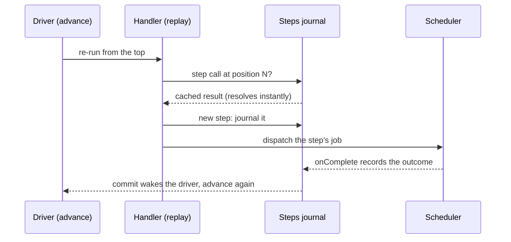
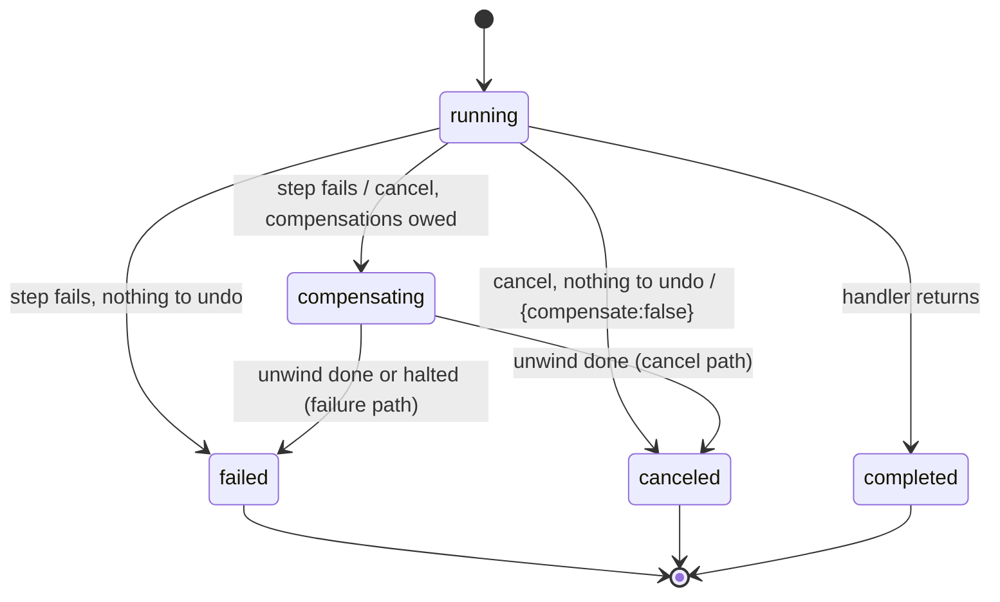

{/* diataxis: explanation */}

Some jobs take more than one step. Reserve the stock, charge the card, mark the order fulfilled,
maybe with a sleep or a wait for an external signal in between. `@helipod/workflow` runs that
whole sequence durably.

A workflow survives a process restart because it isn't held in memory. Each step's outcome is
journaled to a durable table, and helipod **replays the whole handler from the top** every time
the run advances. A step that already succeeded resolves instantly from the journal, so only a
genuinely new step does real work.

It's built on [`@helipod/scheduler`](/docs/components/scheduling) (`requires: ["scheduler"]`),
not a replacement for it. Every step dispatches through the scheduler's own job queue, so it
inherits the scheduler's retry and backoff, dead lettering, and cascading cancel.

## The model: deterministic replay, not checkpointing

There's no continuation capture, no serialized stack, no special workflow interpreter. The
mechanism is simple:

1. A workflow's handler is an ordinary async function that calls `step.runMutation`/`step.runAction`/etc.
2. Every step call is recorded in a durable `steps` journal, keyed by `(workflowId, stepNumber)`.
3. Advancing a run means re-running the handler from the very first line, in order. Each step
   call first checks the journal at its position:
   - **Already succeeded** → resolves synchronously with the recorded result. No re-dispatch, no
     side effect runs twice.
   - **Already failed** → rejects synchronously with the recorded error.
   - **Still pending** (dispatched, not yet done) → the handler suspends here. This poll ends.
   - **Not in the journal yet** → a genuinely new step. It gets journaled and dispatched through
     the scheduler; the handler suspends here too.
4. The handler races forward through every already-resolved step in one microtask burst, then
   blocks on the first pending-or-new step. That's "suspend": there's no explicit yield keyword,
   just a promise that never resolves this poll.
5. When a dispatched step's job completes, the scheduler's `onComplete` callback journals the
   result and re-enqueues the advance, which reruns the handler from the top again, one step
   further this time.



<Callout type="warn" title="A workflow handler must be deterministic">

Because of step 3, a workflow handler has to call the same sequence of steps, with the same
arguments, on every replay. Non-deterministic work, like `fetch`, `Math.random()`, or `Date.now()`,
must never appear directly in the handler body. It belongs inside a step (`step.runAction`), the
same purity rule queries and mutations already follow, applied here to replay.

</Callout>

If a replayed call doesn't match what's journaled at that position (different function, different
kind, different args), the engine throws rather than silently diverging:

```
Journal entry mismatch at step 1: expected app:charge/mutation, got app:refund/mutation.
The workflow handler must be deterministic (no random/network/clock calls, no reordering steps).
```

## Enabling it

`@helipod/workflow` requires `@helipod/scheduler` to be composed first (or at least alongside
it: compose order across `requires` is resolved automatically):

```ts title="helipod.config.ts"
import { defineConfig } from "@helipod/component";
import { defineScheduler } from "@helipod/scheduler";
import { defineWorkflow, workflow } from "@helipod/workflow";

const fulfillOrder = workflow.define({
  handler: async (step, { orderId }: { orderId: string }) => {
    await step.runMutation("orders:_reserveStock", { orderId });
    await step.runAction("payments:_charge", { orderId });
    await step.runMutation("orders:_markFulfilled", { orderId });
  },
});

export default defineConfig({
  components: [
    defineScheduler(),
    defineWorkflow({
      workflows: { "workflows:fulfillOrder": fulfillOrder },
      // maxParallelism: 16, // default: caps a fan-out's steps-per-poll (see "Fan-out" below)
    }),
  ],
});
```

- **`workflows`** is a map from the workflow's registered function path (you choose the name
  yourself; it doesn't have to match a real module path, though matching your file layout is the
  convention) to a `workflow.define({...})` definition.
- **`maxParallelism`** (default `16`) bounds how many new steps a single `Promise.all([...])`
  fan-out dispatches in one poll. See [Fan-out and fan-in](#fan-out-and-fan-in-promiseall).

Composing `defineWorkflow()` without `defineScheduler()` throws at compose time (`requires:
["scheduler"]`), just like composing `@helipod/scheduler` without a store adapter would fail
elsewhere. The dependency is enforced structurally, not by convention.

## `ctx.workflow`: starting, canceling, signaling

Every mutation gets a `ctx.workflow` facade once the component is composed:

```ts
export const placeOrder = mutation({
  handler: async (ctx, { orderId }) => {
    const runId = await ctx.workflow.start("workflows:fulfillOrder", { orderId });
    return runId;
  },
});
```

- **`ctx.workflow.start(ref, args)`** → `Promise<runId>`. Inserts a new `workflows` row
  (`state: "running"`, `generationNumber: 0`, plus a `recoveryAttempts` counter initialized to `0`,
  a crash-recovery accounting field on the row) in the **calling mutation's own transaction**, and
  enqueues the first `workflow:_advance` poll through the scheduler. The same `contextWrite`-backed
  pattern `ctx.scheduler.runAfter` uses: if the calling mutation rolls back, the workflow never
  started at all.
- **`ctx.workflow.cancel(runId, opts?)`** → `Promise<void>`. Cancels a running workflow. See
  [Canceling](#canceling) below for the full compensation interaction.
- **`ctx.workflow.sendEvent(runId, name, payload?)`** → `Promise<void>`. Resolves a parked
  `step.waitForEvent(name)`. See [`waitForEvent`](#waitforevent-the-durable-signal) below.

`ref` in `start` is a `FnRef`: a bare function-path string (`"workflows:fulfillOrder"`) or a
codegen'd `api`/`internal` reference, exactly like `ctx.scheduler`'s own `fnRef` argument. `cancel`
and `sendEvent` don't take a function reference at all: their first argument is the `runId` string
that `start` returned.

### From an action too

`ctx.workflow` also works from an **action**. An action has no `ctx.db`, so `start`/`cancel`/
`sendEvent` there each delegate to an internal `workflow:_start`/`_cancel`/`_sendEvent` mutation via
`ctx.runMutation`, mirroring exactly how `@helipod/scheduler`'s own action-mode facade delegates
to `scheduler:_enqueue`/`_cancel`. The calling code looks identical either way:

```ts
export const kickOffFulfillment = action({
  handler: async (ctx, { orderId }) => {
    const res = await fetch(`https://payments.example/verify/${orderId}`);
    if (!res.ok) throw new Error("verification failed");
    return ctx.workflow.start("workflows:fulfillOrder", { orderId });
  },
});
```

## The `step` API

A workflow handler receives `step` (a `WorkflowHandlerCtx`) as its first argument, and whatever
arguments `ctx.workflow.start` was called with as its second:

```ts
workflow.define({
  handler: async (step, args: { orderId: string }) => {
    // ...
  },
});
```

The six methods at a glance (each covered in detail below):

<TypeTable
  type={{
    'runMutation(ref, args?, opts?)': {
      type: 'Promise<T>',
      description: "Dispatches a mutation as a durable step. opts: { maxAttempts?, compensate? }. args defaults to {}.",
    },
    'runQuery(ref, args?)': {
      type: 'Promise<T>',
      description: "Dispatches a query as a durable step. args defaults to {}.",
    },
    'runAction(ref, args?, opts?)': {
      type: 'Promise<T>',
      description: "Dispatches an action as a durable step, with the scheduler's at-most-once contract. opts: { maxAttempts?, compensate? }. args defaults to {}.",
    },
    'sleep(ms)': {
      type: 'Promise<void>',
      description: "Durable relative timer. The due time is computed from the poll's deterministic clock, never Date.now().",
    },
    'sleepUntil(ts)': {
      type: 'Promise<void>',
      description: "Durable absolute timer (epoch ms).",
    },
    'waitForEvent(name, opts?)': {
      type: 'Promise<T>',
      description: "Parks durably, with no scheduler job at all, until ctx.workflow.sendEvent(runId, name, payload) resolves it. opts.timeoutMs is not implemented yet.",
    },
  }}
/>

### `step.runMutation` / `step.runQuery` / `step.runAction`

```ts
step.runMutation<T>(ref: FnRef, args?: Record<string, unknown>, opts?: { maxAttempts?: number; compensate?: FnRef }): Promise<T>
step.runQuery<T>(ref: FnRef, args?: Record<string, unknown>): Promise<T>
step.runAction<T>(ref: FnRef, args?: Record<string, unknown>, opts?: { maxAttempts?: number; compensate?: FnRef }): Promise<T>
```

Each dispatches one durable step through the scheduler and awaits its result:

```ts
const chargeId = await step.runMutation("payments:_charge", { orderId, amount });
const receipt = await step.runAction("payments:_emailReceipt", { orderId });
const order = await step.runQuery("orders:_get", { orderId });
```

- **`opts.maxAttempts`** caps that step's own retries. It becomes the scheduler's
  `retry: { maxFailures }` for that step's dispatch, reusing the scheduler's existing
  jittered-backoff retry rather than inventing a second one.
- **`opts.compensate`** (mutation and action steps only) declares an "undo" handler for the saga
  unwind. See [Saga: per-step compensation](#saga-per-step-compensation) below.
- **`runAction` is at-most-once by default**: it dispatches a `kind: "action"` scheduler job, and
  actions carry the scheduler's own at-most-once contract. Without `maxAttempts`, a single clean
  failure dead-letters the step; a crash mid-flight always dead-letters, since an action's side
  effects aren't transactional. Declaring `maxAttempts` is your opt-in that the action is safe to
  re-run, and its clean failures then retry with backoff (a crash still dead-letters).
- **`runMutation`/`runQuery` steps are exactly-once** in the sense that matters for a durable
  journal: once a step's row is `"success"`, replay never re-dispatches it.

Every step is journaled by `stepNumber`, in call order. This is what makes the handler safe to
re-run from the top on every poll. A cached step resolves instantly; an in-flight or new one
suspends the replay.

### `step.sleep` / `step.sleepUntil`

```ts
step.sleep(ms: number): Promise<void>
step.sleepUntil(ts: number): Promise<void>
```

Durable timers: the workflow parks until a scheduled job actually fires at that time:

```ts
await step.runMutation("orders:_markShipped", { orderId });
await step.sleep(24 * 60 * 60 * 1000); // 1 day
await step.runAction("notifications:_sendFollowUp", { orderId });
```

The due time is computed from the **current poll's fixed clock** (the mutation's own deterministic
`ctx.now()`), never `Date.now()`. A replay must compute the same due time every time it reaches
this step. Under the hood, `sleep`/`sleepUntil` dispatch the same way a step does, targeting a
trivial internal no-op mutation (`workflow:_sleep`). The durability comes entirely from the
scheduler's own `runAt` semantics, not a new timer mechanism.

### `waitForEvent`: the durable signal

```ts
step.waitForEvent<T>(name: string, opts?: { timeoutMs?: number }): Promise<T>
```

This is the differentiator: **no scheduler job is dispatched at all.** The workflow parks by
writing an `events` row (`state: "waiting"`) and leaving the step's journal row without a
`scheduledJobId`. Nothing is polling, nothing is armed on a timer. It sits durably idle until
`ctx.workflow.sendEvent(runId, name, payload)` is called from anywhere: another mutation, a webhook
handler, an admin action.

```ts
// in the workflow:
const approval = await step.waitForEvent<{ approved: boolean }>("manager-approval");
if (!approval.approved) throw new Error("rejected");

// from an unrelated mutation, whenever the signal actually arrives:
export const approve = mutation({
  handler: async (ctx, { runId }) => {
    await ctx.workflow.sendEvent(runId, "manager-approval", { approved: true });
  },
});
```

`sendEvent` finds the matching `"waiting"` `events` row, flips it `"received"` with the payload,
journals the `waitForEvent` step `"success"` with that payload as its result, and re-enqueues the
advance. The commit fan-out wakes the driver, which replays the handler and now resolves
`waitForEvent` from the cached journal row, same as any other step. It's a no-op, not an error, if
there's no matching waiting event: an event already delivered, sent before the workflow reached
that `waitForEvent`, or sent to an unknown run, all silently do nothing.

<Callout type="info" title="opts.timeoutMs isn't implemented yet">

Passing it throws immediately rather than silently dispatching an unbounded wait:

```
step.waitForEvent's timeoutMs is not implemented yet (Task 6 scope: unbounded wait only)
```

A `waitForEvent` that's never sent parks forever, or until the run is canceled. Build your own
timeout today with a preceding `step.sleep` and a `Promise.race`-style pattern in your own app
code if you need one, or cancel the run externally.

</Callout>

## Fan-out and fan-in (`Promise.all`)

Multiple steps issued before the handler's first `await` yields are dispatched **in the same
poll**:

```ts
workflow.define({
  handler: async (step) => {
    const [a, b] = await Promise.all([
      step.runMutation("app:a", {}),
      step.runMutation("app:b", {}),
    ]);
    return [a, b];
  },
});
```

Both `runMutation` calls run synchronously up to the point they return their (unresolved)
promises, so both land in the same batch of new steps for that poll: journaled and dispatched
together, not one-at-a-time across separate polls. The handler joins once both have completed (in
either order), exactly like a normal `Promise.all`.

**`maxParallelism`** caps how many new steps get dispatched in a single poll. A fan-out wider than
the cap (say, 5 steps with `maxParallelism: 2`) dispatches in capped waves (2, then 2, then 1)
rather than all 5 at once or an error. Nothing is dropped: the steps that don't fit this wave
simply aren't journaled yet, so `runReplay` re-emits them as "new" on the next poll (triggered once
the current wave's steps complete), spreading the fan-out across `ceil(N / maxParallelism)` polls
instead of one. A console warning is logged when the cap is exceeded, but the run proceeds and
eventually completes correctly.

## Checking status: the live `workflow:status` query

`workflow:status` is a registered query, reactive like any other:

```ts
const status = await client.query(anyApi.workflow.status, { runId });
// { state: "running" | "compensating" | "canceled" | "completed" | "failed", result?, error? }
```

```tsx
import { useQuery } from "@helipod/client/react";
import { anyApi } from "@helipod/client";

function OrderStatus({ runId }: { runId: string }) {
  const status = useQuery(anyApi.workflow.status, { runId });
  if (status === undefined) return <p>Loading…</p>;
  if (status === null) return <p>No such run.</p>;
  return <p>{status.state}{status.error ? `: ${status.error}` : ""}</p>;
}
```

Subscribe to it for a reactive "is my order done yet?" view with no polling. Every state
transition (`running` → `compensating` → `failed`, or `running` → `completed`) fans out over the
same commit fan-out mechanism every other reactive query rides. `result`/`error` are only present
once the run has actually produced them. `status` returns `null` for an unknown `runId`.

## Canceling

```ts
ctx.workflow.cancel(runId: string, opts?: { compensate?: boolean }): Promise<void>
```

Cancels a running workflow. It's a no-op, not an error, if the run is already terminal
(`completed`/`failed`/`canceled`) or already `"compensating"` from a prior cancel or failure. That
makes it safe to call `cancel` more than once, including mid-unwind, without racing or restarting
the unwind.

Canceling **cascades**: any pending forward step's own scheduler job is canceled, and (if the run
was already mid-unwind) an in-flight compensation job is canceled too, the same cascade
`ctx.scheduler.cancel` already performs for a job's children.

By default, canceling a workflow that has completed steps still owing a `{ compensate }` handler
compensates first (see the next section), reaching `"canceled"` only once every owed compensation
has actually run. Pass `{ compensate: false }` to skip straight to `"canceled"` instead:

```ts
await ctx.workflow.cancel(runId, { compensate: false }); // skip the unwind, cancel immediately
```

If there's nothing recorded to undo, cancel goes straight to `"canceled"` regardless of `opts`.
There's nothing for the unwind to do.

## Saga: per-step compensation

A step declares an "undo" handler with `{ compensate: FnRef }`:

```ts
await step.runMutation("orders:_reserveStock", { orderId }, { compensate: "orders:_releaseStock" });
await step.runMutation("payments:_charge", { orderId, amount }, { compensate: "payments:_refund" });
await step.runMutation("orders:_markFulfilled", { orderId }); // no compensate: nothing to undo
```

The compensation is recorded on the step's journal row (`compensateFnPath`) the moment the step
completes successfully. A step that never succeeds has nothing to compensate.

**Reverse-order unwind.** If a later step in the same run fails (after exhausting its own
retries), or the workflow is canceled while steps have already succeeded, the workflow enters
`"compensating"` and walks its completed steps **backwards** by `stepNumber`, dispatching each
owed `{ compensate }` handler through the scheduler, one at a time, highest `stepNumber` first.
The undo handler receives the original step's own inputs and output:

```ts
export const refund = mutation({
  handler: async (ctx, { args, result }: { args: { orderId: string; amount: number }; result: string }) => {
    // args = the original charge call's args; result = the charge id it returned
    await ctx.db.insert("refunds", { chargeId: result, amount: args.amount });
  },
});
```

This is **compensate-by-default**: a step that declares `{ compensate }` gets its undo run
whenever the run doesn't reach a clean success, with no extra opt-in beyond declaring it. Opt out
per-cancel with `{ compensate: false }` on `ctx.workflow.cancel`, shown above. There's no per-step
"skip this one" escape once an unwind has started. Every owed compensation runs, in order.

**Halt-on-failed-compensation.** If a compensation handler itself exhausts its own retries, the
unwind halts. It does not continue undoing earlier steps, and it does not hang. The run
terminal-fails with the halt reason recorded alongside the original error:

```
compensation failed at step 0: payment gateway declined; original workflow error: shipment failed
```

**A step's own `{ maxAttempts }` also caps its compensation's retries.** If you declared
`step.runMutation(ref, args, { maxAttempts: 1, compensate: undoRef })`, the compensation dispatch
also gets `retry: { maxFailures: 1 }`. One declared cap governs both the forward attempt count and
the undo's, rather than the undo silently falling back to the scheduler's default backoff.

**Cascade-cancel of an in-flight compensation.** If a workflow is canceled again while a
compensation job is actually in flight, that job is canceled too, mirroring the cascade already
applied to a pending forward step's job.

### Workflow states



`cancel` is idempotent against a workflow that's already `"compensating"`. A second cancel call
mid-unwind is a safe no-op, not a restart or a race (see [Canceling](#canceling) above).

### A complete saga example

```ts title="helipod.config.ts"
import { defineConfig } from "@helipod/component";
import { defineScheduler } from "@helipod/scheduler";
import { defineWorkflow, workflow } from "@helipod/workflow";

const placeOrder = workflow.define({
  handler: async (step, { orderId, amount }: { orderId: string; amount: number }) => {
    await step.runMutation("orders:_reserveStock", { orderId }, { compensate: "orders:_releaseStock" });
    await step.runMutation("payments:_charge", { orderId, amount }, { compensate: "payments:_refund" });
    await step.runMutation("orders:_markFulfilled", { orderId });
    return { orderId, status: "fulfilled" };
  },
});

export default defineConfig({
  components: [
    defineScheduler(),
    defineWorkflow({ workflows: { "workflows:placeOrder": placeOrder } }),
  ],
});
```

If `orders:_markFulfilled` (or anything after the charge) fails, the run enters `"compensating"`,
runs `payments:_refund` then `orders:_releaseStock`, in that reverse order, and lands on
`"failed"` with both the original error and (if the refund itself failed) the halt reason. If
nothing fails, neither compensation ever runs and the run reaches `"completed"` normally.

## The `generationNumber` OCC guard

Every `workflows` row carries a `generationNumber`, bumped whenever a cancel is issued. It exists
to prevent two race classes:

- **Double-advance**: replaying a handler drains through a real microtask/timer barrier that can
  take actual wall-clock time, during which another transaction (a concurrent cancel) could
  commit. Before writing its outcome, an advance re-reads the row and checks `generationNumber`
  still matches what it started with. A stale replay outcome can never clobber a since-canceled or
  since-restarted run.
- **Stale-cancel resurrection**: a step dispatched before a cancel carries that cancel's
  *pre-bump* generation in its `onComplete` context. If it completes after the cancel already
  landed, its completion callback's generation check fails and it self-discards instead of
  resurrecting a canceled run.

This is invisible in normal use. You never read or set `generationNumber` yourself, but it's why
canceling a workflow is safe even while steps are actively in flight.

## What workflows are not

- **Not a general task queue.** For "run this once, later," reach for
  [`ctx.scheduler`](/docs/components/scheduling) directly. A workflow is for coordinating
  *multiple* durable steps, with replay and (optionally) compensation. A one-shot job with no
  sequencing needs is unnecessary overhead as a workflow.
- **No sub-workflows.** A workflow can't currently start and await another workflow as one of its
  own steps. (The `workflows` row does carry `onComplete`/`context` fields, a completion-callback
  round-trip primitive the engine already uses internally for step dispatch, but they are not yet
  exposed as options on `ctx.workflow.start`, so there's no public way to be notified when a run
  you started finishes. Poll [`workflow:status`](#checking-status-the-live-workflowstatus-query)
  instead.)
- **No replay-debugging UI.** There's no built-in tool to step through or visualize a run's
  journal beyond querying `workflow:status` and browsing the `workflows`/`steps`/`events` tables
  directly (e.g. via the dashboard's data browser).
- **No handler versioning.** A workflow's registered handlers are fixed for the deployment's
  lifetime, the same constraint crons and triggers have. Changing a workflow's step sequence after
  runs are already in flight against the old sequence is unsupported. A mismatched replay throws
  the journal-mismatch error shown earlier rather than silently reinterpreting history.

These are deferred, not ruled out. None of the shipped mechanism (journal shape, `step` API, saga
unwind) precludes adding them later.

## Related

[Scheduling](/docs/components/scheduling) covers the underlying job dispatch every step rides on:
retry/backoff, at-most-once actions, and cascading cancel all come from there.

[Triggers](/docs/components/triggers) pairs naturally with workflows. React to a data change by
starting a durable run instead of doing multi-step work inline in the trigger handler.

[Actions](/docs/core-concepts/actions) covers the non-deterministic escape hatch `step.runAction`
dispatches into.
