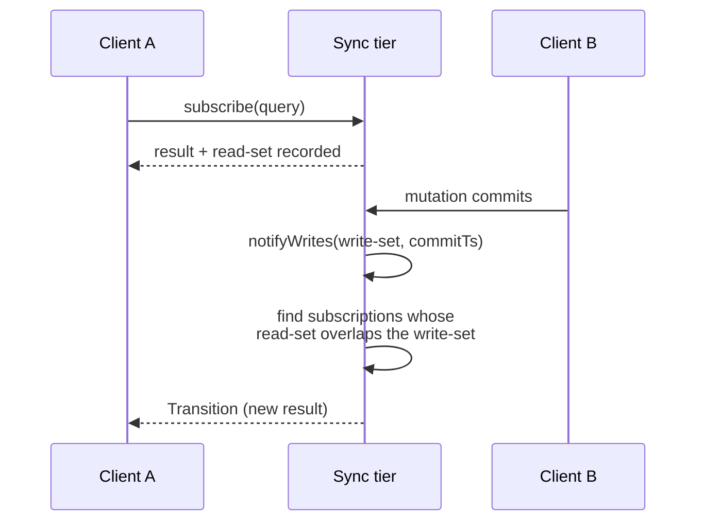
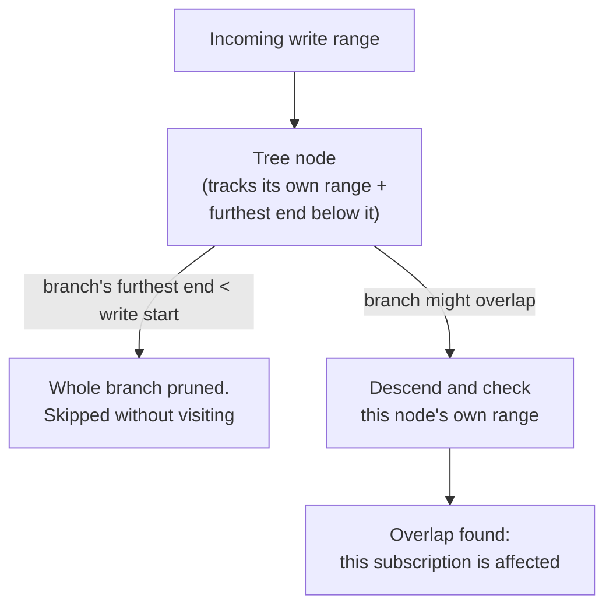
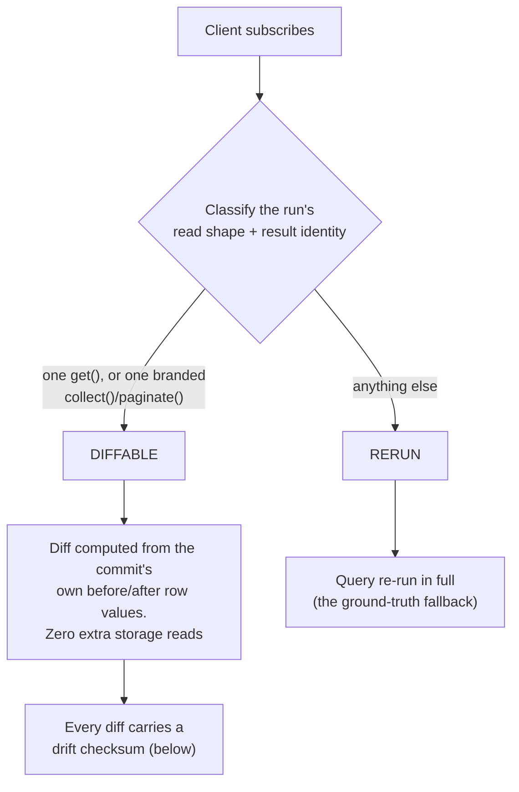
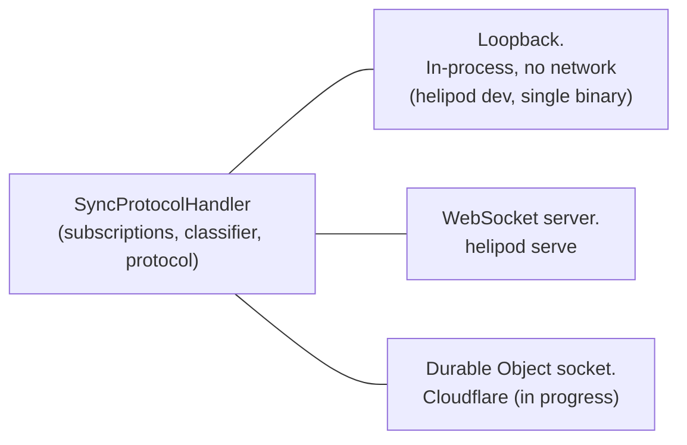

{/* diataxis: explanation */}

## The one-sentence version

A **subscription** is just a query plus a receipt of exactly which data it
touched. When a mutation commits, the sync tier compares what it just wrote
against every subscription's receipt. Anything that overlaps gets re-run (or
diffed) and pushed to the client watching it. Nothing else moves.

That's the whole reactivity model. Everything else on this page (the
interval-indexed matcher, the row-diffing fast path, the resume registry, the
wire protocol) exists to make that one sentence fast and correct at scale. The
code lives mostly in `packages/sync/src`.

If you're looking for the user-facing explanation of how to write a live
query, see [Reactivity](/docs/core-concepts/reactivity) instead. This page is
about the machinery underneath it.

## Start here: a subscription is a query plus a read-set

When a client calls a query function, the engine doesn't just run it and hand
back a value. It also records the **read set**: the exact index ranges and
point reads the query touched while it ran. (How that recording happens is
covered in [The query engine](/docs/contributing/architecture/query-engine);
this page picks up right after.)

The sync tier holds onto that read set for as long as the client stays
subscribed. Later, when a mutation commits, it produces a **write set**: the
ranges it actually changed. The sync tier's whole job, on every commit, is:

> Does this write set overlap that read set? If yes, re-run (or diff) the
> query and push the new result. If no, do nothing.



Client A never polls. Client B's commit is the only thing that triggers any
work, and only for the subscriptions it actually affects. A million idle
subscriptions to unrelated data cost nothing when this write lands.

## The `SubscriptionManager`: who holds the receipts

`SubscriptionManager` (`packages/sync/src/subscription-manager.ts`) is the
registry of live subscriptions. Each entry is keyed by
**`(sessionId, queryId)`**: one entry per subscription per session. Ten tabs
running the same query hold ten entries, and an affected query is re-run per
subscription. (The one place identical queries *do* share state is the resume
registry described later, which keys on `(identity, path, args)` for
reconnect bookkeeping, not for shared re-runs.)

Each `Subscription` stores the tables its read set touched, its serialized
read ranges, and (if the classifier below said so) a diffable read
descriptor. Read ranges are deserialized **once**, at `add()` time, never
re-parsed per write.

Given a commit, the manager's job is to answer, precisely, which
`(session, query)` pairs need attention:

```ts title="packages/sync/src/subscription-manager.ts (shape)"
findAffectedByRanges(
  writeRanges: readonly SerializedKeyRange[],
  writeTables: readonly string[],
): Subscription[]
```

That answer, not the WebSocket plumbing, is the part worth understanding.

## Finding affected subscriptions without scanning everything

Comparing the write set against every subscription one by one is correct but
doesn't scale. That linear scan was the shipped v0 behavior, and the
`fanout-selective-10000` benchmark made its cost visible: with 10,000 live
subscriptions and exactly one matching each write, propagation p50 was
**6.72 ms**, even though only one subscriber ever needed recomputing.

The fix (DLR Stage 1, and what the rest of the docs mean by "range-precise
invalidation") is a per-keyspace **augmented interval tree**
(`IntervalIndex`, `packages/index-key-codec/src/interval-index.ts`): a
search structure built for exactly this question, "which of these stored
ranges overlap this incoming range?", answered in roughly `O(log n + k)`
instead of `O(n)`, where `k` is the number of actual matches.

Picture each subscription's read range as a horizontal bar on a number line
(the "number line" here is a keyspace's byte-encoded key space). The tree is
a treap keyed by each range's `start` byte-key, and every node is augmented
with the furthest-right `end` anywhere in its subtree. When a write range
arrives, the search prunes an entire branch the instant it sees that branch's
furthest endpoint doesn't reach the write's start. No bar in that branch can
possibly overlap, so none of them are visited.

Two implementation details worth knowing:

- **Node priorities are deterministic**, an FNV-1a hash over the entry's own
  `(start, end, value)` identity, never `Math.random()`. The tree's shape is
  a pure, reproducible function of its contents, while still staying balanced
  in expectation regardless of insertion order.
- **Ranges are bucketed by keyspace first.** A write to one table's index can
  never overlap a read range in a different table, so each lookup only
  searches the one tree that could possibly contain a match.



One fallback rides alongside the tree. A subscription that recorded **zero**
read ranges goes into a plain `byTable` fallback set instead, and matches on
any write to a table it read. This is deliberately narrow: a subscription
with even one recorded range is matched purely through the interval index,
never double-matched at the table level. (An unbounded scan doesn't land
here, by the way: the query engine records a full-interval *range* for it, so
it's still range-matched. The fallback exists so a read that genuinely
produced no ranges can never under-report and silently miss a write.)

Measured, same machine, before and after the indexed matcher:
`fanout-selective-10000` propagation p50 went from **6.72 ms to 0.24 ms**
(`CHANGELOG.md` 0.0.1).

## The subscribe/notify race: one serial tail

There's an awkward gap hiding in the sequence diagram above: subscribing and
reacting to commits are concurrent code paths over shared per-session state.
Handled naively, a concurrent invalidation could push a *newer* value to a
session and then an in-flight subscribe response could deliver an *older*
one, under version brackets that still look contiguous. A silent regression,
with no protocol signal, and with optimistic updates in play it's user
visible: your own confirmed write appears to vanish for a frame.

The fix (internally called **G1**) is serialization, not a handshake. The
handler keeps one serial promise chain, `notifyTail`, and *both* operations
run on it: every commit's fan-out (`notifyWrites`) and every
`ModifyQuerySet` (subscribe/unsubscribe) are enqueued onto the same tail
(`packages/sync/src/handler.ts`). A subscribe therefore executes strictly
after whatever notify was in flight, reads the session's version at
execution time, and brackets contiguously off it. Subscribing just waits
behind pending notifies; that latency is the accepted cost.

There is no per-table "latest write timestamp" check and no
register-then-recheck dance. Ordering the two paths on one queue is the
entire mechanism.

## The classifier: reuse the write instead of re-reading it

Finding *which* subscriptions are affected is only half the cost. The other
half is what happens next: by default, an affected query is **re-run from
scratch** and its whole result re-sent. For a query watching one document, or
a list of a hundred rows, that's a lot of repeated work to communicate a
change of maybe one row.

Here's the trick: when a mutation commits, the engine already has each
changed row's before-and-after value in memory, from building the commit in
the first place. For a provably safe shape of subscription, the sync tier
computes exactly what changed in the *result* directly from those in-hand
values. No storage re-read, no re-running the query handler at all.

That safe shape is decided at subscribe time (`packages/sync/src/classify.ts`),
from the run's own recorded read set and returned value:

- **`DIFFABLE_BYID`**: the read set is exactly one point range and the result
  was a single document (or `null`). The shape of `ctx.db.get(id)`.
- **`DIFFABLE_RANGE`**: exactly one `.collect()` over one index range ran, no
  `.take()`/limit, no row-level read policy merged into the scan, and the
  handler returned **the exact array the collect returned**, proven by object
  *identity*: the executor brands the array with a non-enumerable token, and
  any `.slice()`/`.filter()`/`.map()`/spread produces a fresh, unbranded
  array. Content equality was deliberately rejected: a post-op that happens
  to be a no-op on today's data (say `docs.filter(d => d.big)` when every row
  currently is big) would classify as diffable and then silently exclude a
  future row forever, a wrong answer no checksum could catch.
- **`DIFFABLE_PAGE`**: the same, for one `.paginate()` call, with the brand
  extended to the whole `PaginationResult` object, plus one extra guard: a
  page whose scan hit its `maxScan` cap (`scanCapped`) is never diffable,
  because its cursor can resume from beyond the page's own diffable bounds.
- **`RERUN`**: everything else. Multiple reads, post-processing, joins,
  unbounded shapes with filters, policies. The ordinary full re-run path,
  always correct, just not the fast path.

The differ itself lives in `packages/sync/src/commit-differ.ts`:
`byIdChangesFor` derives a 0-or-1-row change from the commit's own written
document, and `rangeChangesFor` diffs the commit's written docs against the
subscription's membership map. Not previously in the map, now in-bounds and
filter-passing: `add`. Still qualifying: `edit`. No longer qualifying:
`remove`. Never in, still not in: no change at all.



Measured: `diffbytes-scan` went from **2,647 to 482 bytes/update** (an 82%
cut), and `diffbytes-paginate` lands at **475 bytes/update**. In both cases
the per-update cost is proportional to the change, not the collection size,
so the saving grows with list size (`CHANGELOG.md` 0.0.2 and 0.0.3).

## The `Change` vocabulary and the drift checksum

Every diffable shape emits the same row-change vocabulary
(`packages/sync/src/change.ts`), applied identically on server and client by
one shared `applyChanges` function, which is what keeps the two sides from
drifting on what a diff means:

```ts title="packages/sync/src/change.ts"
export type Change =
  | { t: "add"; key: string; row: JSONValue; ts: number; orderKey?: string }
  | { t: "remove"; key: string }
  | { t: "edit"; key: string; row: JSONValue; ts: number; orderKey?: string };
```

`key` is the document's `_id`. There is **no separate `"move"` wire type**: a
reorder (a write that changes the fields a range is sorted by, without
changing membership) is an `edit` whose `orderKey` differs from the previous
one. `orderKey` is the row's index-entry key, produced by the same
`extractIndexKey` the query engine uses to build real index entries, so it
already includes the `_creationTime`/`_id` tiebreak. The client sorts its
materialized map by it, so a changed `orderKey` is what actually moves the
row.

Every `QueryDiff` also carries a **drift checksum**: an order-independent
FNV-1a XOR fold over `(key, ts, orderKey)` for every row currently in the
subscription's materialized map:

```ts title="packages/sync/src/change.ts"
export function driftChecksum(rows: Map<string, RowVersion>): string
```

The client recomputes the same fold after applying a diff. Folding
`orderKey` in means a *missed reorder* gets caught too, not just a missed
add/edit/remove. On a mismatch the response is never to guess or crash: that
one query throws away its diffed state and resyncs from a full re-run.

One honest caveat: the checksum catches a bug in the differ or the apply
path. It structurally *cannot* catch a misclassified handler, since a
checksum over an already-wrong value is internally self-consistent on both
sides. The classifier's identity-based conservatism above is the real
defense; the checksum is the safety net behind it.

## Pagination: the pinned page

A reactive `.paginate()` subscription needs its page to stay stable while
data shifts around it, and there's no cursor journal on the wire to make
that happen (look at `QueryRequest` below: it has no such field). The
mechanism is server-side.

Diffing a *count*-bounded page has a pull-in problem: a deleted row would
need to pull in whatever the next unseen row past the boundary is, and that
means a storage read, which the diff path forbids. So instead, at load time
the page is pinned to the fixed **`[startBound, endBound)` key interval** it
actually covered, held as server-side page metadata on the subscription. From
then on it's diffed as an ordinary two-sided-bound range, reusing
`rangeChangesFor` unchanged.

`nextCursor`/`hasMore`/`scanCapped` are captured at that load and carried
through every incremental diff untouched; they only move on the next real
reset. A page's row count can drift from its original page size under live
edits. That's correct reactive behavior: an insert inside the pinned bounds
grows the page, a delete shrinks it, and the boundary never moves underneath
page N+1.

## The client side, briefly

The client mirrors each diffable subscription as a keyed
`Map<docId, RowVersion>` (`packages/client/src/layered-store.ts`) and renders
it into the value `useQuery` sees: the sole row (or `undefined`) for by-id,
a sorted array for a range (sorted by `orderKey` through a byte comparator,
`compareKeyBytes`, so client order reproduces the engine's index order
exactly), and the sorted array wrapped back into
`{ page, nextCursor, hasMore, scanCapped }` for a page. `orderKey` travels
as base64 and is decoded with the exact decoder-half of the codec the server
encodes through. Every render mints a fresh array or object, the same
reference-inequality contract the optimistic-update layer relies on.

## Reconnecting: both halves of resume

A client that goes offline and comes back doesn't re-download, and mostly
doesn't even re-compute, results that didn't change. Two mechanisms compose,
and both have shipped.

**The bandwidth half.** Every pushed result carries a server-minted content
fingerprint (`"sha256:" +` hex over the JSON-serialized value, minted in
`packages/sync/src/handler.ts`). The client stores it and echoes it back as
`resultHash` on the matching resubscribe. If the server's fresh run hashes
identically, it answers with a tiny `QueryUnchanged` marker instead of the
value. This fires only from `ModifyQuerySet` handling (a resubscribe), never
from a live push. Measured at the all-unchanged ceiling: roughly 99% less
reconnect bandwidth (`CHANGELOG.md` 0.0.1). An old server that predates the
field simply never sees an echoed hash and sends full results.

**The compute half (DLR Stage 3).** The bandwidth half still pays for the
re-run before it can hash. The compute half skips the re-run itself. On
reconnect the client also stamps each resubscribe with `sinceTs`, its own
maximum observed commit timestamp. Server-side, a `ResumeRegistry`
(`packages/sync/src/resume-registry.ts`) tracks, per
`regKey(identity, path, args)`:

```ts title="packages/sync/src/resume-registry.ts (shape)"
interface ResumeEntry {
  readRanges: readonly SerializedKeyRange[];
  tables: readonly string[];
  globalTables: readonly string[];
  lastInvalidatedTs: number;
  wasDiffable: boolean;
  refCount: number;
  expiresAtMs?: number;
}
```

`advanceOnCommit` runs on **every commit**, over the same interval-index and
table-fallback matcher shape the `SubscriptionManager` uses, and advances
`lastInvalidatedTs` for a matching entry **even when it currently has zero
live subscribers**. Entries are retained for `TTL_MS` (60 seconds) after
their last subscriber releases them, and they stay indexed the whole time.
Otherwise a write landing during the disconnect gap would go unrecorded and
a resuming client would trust a stale result.

On a resubscribe carrying `sinceTs`, if the registry has an entry and:

- the query is **not** diffable (`wasDiffable === false`; diffable subs keep
  their own fingerprint/`QueryDiff` resume path, and mixing the two would
  bypass their reset-seeding invariants), and
- it read no global (D1-backed) tables (those live in a different timestamp
  domain the registry can't vouch for), and
- `entry.lastInvalidatedTs <= sinceTs`,

then the server registers the subscription straight from the **retained
read-set** and answers `QueryUnchanged`, with no call into the query
executor at all. A missing entry, a newer `lastInvalidatedTs`, or a diffable
sub all fall straight through to a normal re-run. Conservative by
construction.

One subtlety that earned its own fix: the registry has to track the *live*
read-set, not the subscribe-time one. A query like `get(user)` followed by a
range keyed on `user.currentRoom` shifts its read-set across re-runs, and a
registry frozen at subscribe time would never see a gap write to the new
range, then wrongly answer `QueryUnchanged` for stale data (with no drift
checksum to catch it, since RERUN subs have none). So every live re-run
re-upserts the registry entry, and `SetAuth` re-keys it to the new identity.

Measured: 50 unchanged RERUN subscriptions re-execute **0** handlers on
reconnect with the skip on, versus 50 with it off; a partial-change variant
re-executes exactly 1 (`CHANGELOG.md` 0.0.4).

## The wire protocol: versions, not just messages

Messages between client and server are small, typed JSON packets
(`packages/sync/src/protocol.ts`). A few are worth knowing by name because
you'll see them in logs and tests:

**Client to server:**

- `Connect`: opens or resumes a session.
- `ModifyQuerySet`: adds or removes subscriptions. Critically, this is a
  **diff**, not a full resend: a client with a thousand active subscriptions
  that adds one more sends one small message. Each added query is a
  `QueryRequest`:

  ```ts title="packages/sync/src/protocol.ts"
  export interface QueryRequest {
    queryId: number;
    udfPath: string;
    args: JSONValue;
    resultHash?: string; // bandwidth-half resume echo
    sinceTs?: number;    // compute-half resume checkpoint
  }
  ```

- `Mutation` / `Action`: a write request, or a side-effecting action call.
- `SetAuth`: updates the session's identity.

**Server to client:**

- `Transition`: the actual reactive push. Carries one or more of
  `QueryUpdated` (full new value), `QueryDiff` (an incremental row diff),
  `QueryUnchanged` (the resume cases above), or `QueryRemoved`.
- `MutationResponse` / `ActionResponse`: the direct reply to a write,
  correlated by a request id.

What makes this more than just convenient is that every `Transition` is
**version-bracketed**: it says "you're at version X, this moves you to
version Y." A client tracks its own current version, and a `Transition` that
doesn't start where the client currently is means a frame was missed (for
example, dropped under backpressure, below). The fix is never to patch
around a gap: the client resyncs from scratch. A slow or flaky connection
degrades to an occasional full refresh, never to silently wrong data.

## Your own commit is never stale

Two invariants (informally G1 and G4 in the engine's design history) keep a
session's view of *its own* mutation from ever appearing to lag behind what
it just did:

- **G1** is the serial-tail serialization described earlier: subscribe
  handling and commit fan-out are strictly ordered on one queue, so an
  in-flight subscribe can never deliver an older value after a newer push.
- **G4 (origin-frontier).** After a session's own mutation commits, that
  session's observed version must advance to at least the commit's
  timestamp, and never before it has been sent every modification that
  commit implies for its own subscriptions. If the commit touched some of
  the session's subscriptions, the ordinary push already satisfies this. If
  it touched **none** of them, the engine still emits a standalone, empty,
  ts-advancing `Transition`, so a client's own commit is never invisible to
  its own optimistic-update gate just because nothing it subscribes to
  changed. A fleet-forwarded mutation whose origin tag can't ride the local
  fan-out is handled by a pending-frontier fallback with the same guarantee.

On top of those, the diffable path adds **response-before-Transition**
ordering: a session's own reactive `Transition` for a commit it just made is
held behind that commit's `MutationResponse` on the wire, via a per-commit
microtask gate (never a timer, which a tight mutation loop can starve).
Together these are what make the
[optimistic updates](/docs/client/optimistic-updates) no-flicker guarantee
hold under the diff and resume machinery above.

## Session guardrails: one bad client can't take down the rest

A live connection is state the server holds open, and two per-session
controllers (`packages/sync/src/session-controllers.ts`) keep any single
client from becoming everyone else's problem:

- **Heartbeat** (`SessionHeartbeatController`): a periodic transport ping
  (every 30 seconds by default). After two consecutive unanswered pings the
  session is declared dead and cleaned up, so a silently vanished TCP
  connection can't leak forever. A socket without a ping capability (the
  in-process loopback) is exempt.
- **Backpressure** (`SessionBackpressureController`): every outbound frame
  goes through one chokepoint. When a client can't keep up, frames queue to
  a bound; past the bound the newest frame is *dropped* rather than
  exhausting server memory, and a sustained episode abandons the whole
  queue. This is safe precisely because of the version brackets above: a
  drop becomes a detected gap, which the client resyncs from.
  `MutationResponse`/`ActionResponse` frames are exempt from dropping (a
  write's outcome must always reach its caller), with their own separate
  overflow budget.

That's the whole set. There is no per-session rate limiter and no
subscription-count cap in the sync tier today.

## The transport seam: the same brain, three sockets

Everything above (the subscription manager, the classifier, the protocol)
never talks to a real network socket directly. It talks to a small abstract
interface (`send`, `close`, `readyState`, roughly), and something else
adapts that interface to an actual transport. That's what lets the identical
reactive logic run in more than one place:



- **Loopback** is a same-process, no-network transport: `send` is just a
  function call. This is what powers `helipod dev` and the single-binary
  build, full reactivity with zero sockets, which is also why local
  development feels instant.
- **A real WebSocket server** is what `helipod serve` runs for a standalone
  deployment.
- **A Cloudflare Durable Object** socket is the newest of the three, part of
  the ongoing Cloudflare-native hosting work: the same handler, wired into a
  DO's own WebSocket handling instead.

Because the reactive brain only ever sees the abstract interface, none of the
logic above had to change to add that third transport.

## Where the design is still moving

<Callout type="warn" title="Honest boundaries">

- The `ResumeRegistry` is per-node, in-memory. A reconnect that lands on a
  *different* fleet node finds no entry and safely falls through to a normal
  re-run. Cross-node resume is correct by falling back, not by resuming;
  fleet per-shard resume fragments are an explicitly deferred future stage.
- Fleet-forwarded mutations fall back to `RERUN` for the diff path: a
  commit's written docs only ride the in-process fan-out on the node that
  owns the write, so a receiving node has nothing to diff against. Wire
  savings only; correctness is unaffected.
- Durable Object sync hosting (the third transport above) is active,
  in-progress work, not a finished production path the way the loopback and
  WebSocket-server transports are.

</Callout>

## Related pages

- [Reactivity](/docs/core-concepts/reactivity): the user-facing guide to
  writing live queries.
- [The query engine](/docs/contributing/architecture/query-engine): how read
  sets get recorded in the first place.
- [Transactions & consistency](/docs/contributing/architecture/transactions):
  where write sets and commit timestamps come from.
- [Optimistic updates](/docs/client/optimistic-updates) and
  [Offline sync](/docs/client/offline-sync): client-side features built on
  top of the protocol described here.
