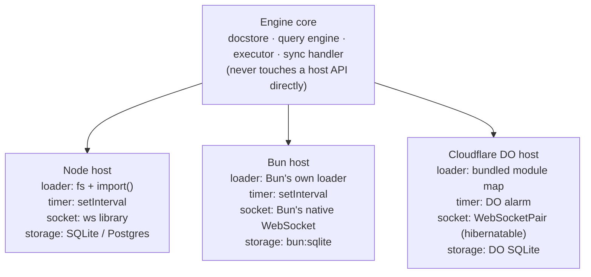
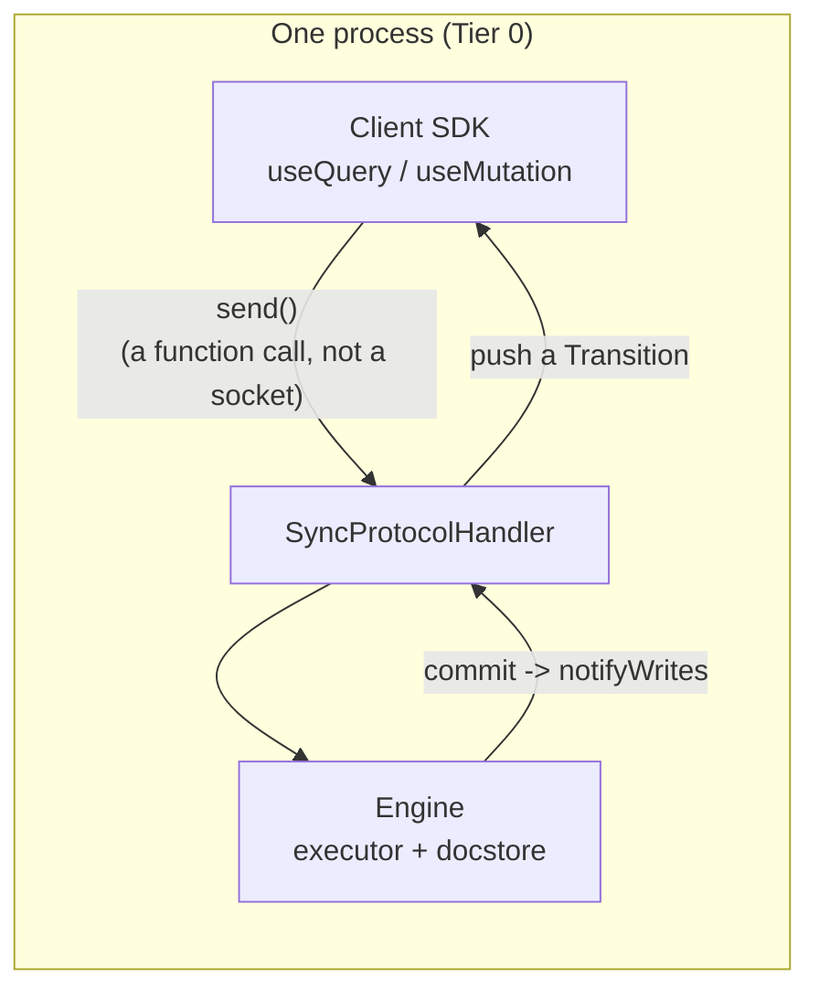
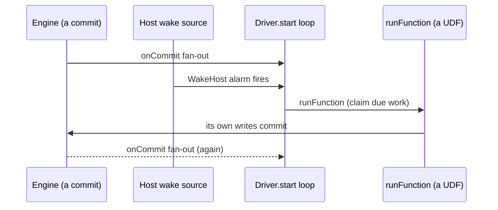
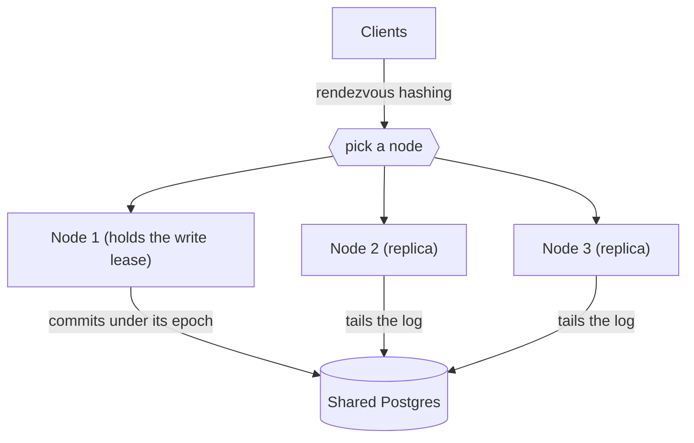

{/* diataxis: explanation */}

Helipod's engine (the docstore, query engine, executor, and sync handler) is written once. It runs, byte-for-byte the same, inside a single binary on your laptop, across a fleet of nodes sharing one Postgres database, and inside a single Cloudflare Durable Object.

This page explains how that's possible, and what changes (and what doesn't) as you move between those shapes.

If you haven't read [Reactivity & sync](/docs/contributing/architecture/reactivity) or [System design](/docs/contributing/architecture/system-design) yet, skim those first. This page assumes you already know what a read set, a write set, and a commit are.

## The one idea: a host is just four adapters

Think of the engine as an appliance and a "host" as the wall socket it plugs into. The appliance never changes. What changes is four small adapters:

1. **Module loader**: how the engine finds and loads your `helipod/` functions and schema.
2. **Timer source**: how the engine gets woken up at a future point in time.
3. **Socket type**: how a client's WebSocket connection is represented.
4. **Storage binding**: which `DocStore` (SQLite, Postgres, Durable Object storage) it reads and writes.

The engine core never imports `node:fs`, never imports a WebSocket library, and never talks to a Cloudflare binding directly. It only calls these four seams.

That means adding a new host means writing a new thin package that fills in the four adapters. You never fork or rewrite the engine itself.

("Hibernatable" is Cloudflare's term for a WebSocket that stays open while the Durable Object holding it is unloaded from memory; the DO is revived when the next message arrives. More on that in the Durable Object section below.)

<Callout type="warn" title="What's not built yet">

The executor itself runs in-process today, not inside a real V8 isolate sandbox. The syscall boundary between a function and the engine is already shaped so a true isolate host is a seam swap later, not a rewrite, but it isn't built yet.

Keep that in mind whenever this page says "the same engine everywhere." It means the same *logic*, running with today's in-process execution model on every host.

</Callout>

## Tier 0: everything in one process

The simplest host is also the default one. `packages/runtime-embedded` exports `EmbeddedRuntime`, which composes the docstore, the transactional executor, the sync protocol handler, and the HTTP handler into one process. No sidecar, no extra service, no network hop between them.

This is what `helipod dev`, `helipod serve`, and a compiled `helipod build` binary all run underneath. See [Deploy & build](/docs/deploy/deploy-and-build) for how those three entrypoints differ operationally: they all share this same runtime core.

Because it's one process, "the database" is just a function call away from "the code that answers your queries." There's no client-server round trip inside the box.

## The Tier-0 magic trick: a WebSocket that isn't a socket

Here's the fun part. The Helipod client library (the same one your app imports) expects to talk to a server over a WebSocket and `fetch`.

When your app runs against the embedded runtime, it gets handed a `LoopbackConnection` (`packages/runtime-embedded/src/loopback.ts`) instead of a real socket. That's an object with the exact same `send()` / `onMessage()` shape, wired directly into the sync handler in memory.

There's no TCP connection, no port, no serialization onto a wire. The "network" between your client code and the engine is a plain function call.

A few things ride along with this loopback wiring:

- **Write fan-out to in-process subscribers.** When a mutation commits, the runtime's `notifyWrites` walks every live subscription in the same process, re-runs the ones whose read set overlaps the write, and pushes updates straight back through the loopback connection. No polling, no queue.
- **Hot reload via `setModules(...)` / `setTableNumbers(...)`.** When you edit your functions or `schema.ts` in dev, the CLI re-resolves them and calls these two `EmbeddedRuntime` methods (`packages/runtime-embedded/src/runtime.ts`) to swap the function registry and the table-number map in place, **without** dropping any open WebSocket session. Your browser tab keeps its live subscriptions; they just re-run against the new code. This is what makes the `helipod dev` edit-save-see-it loop fast, and it's the same pair of calls a live `helipod deploy` uses.

Every other tier below is really just: keep this same sync handler and executor, but swap in a *different* transport and a *different* storage binding.

## The driver seam: how recurring work runs on every host

Some features aren't triggered by a request at all: a scheduled job firing at 3am, a `@helipod/triggers` handler watching a table, the storage orphan reaper, a notifications retry sweep.

Helipod calls this recurring shape a **`Driver`** (`packages/component/src/define-component.ts`). It's the same abstraction on every host, just woken by a different clock.

A `Driver` is started once, after boot, and given a `DriverContext` with a small set of capabilities:

- `onCommit(cb)`: get called every time *anything* commits, anywhere in the app. A driver decides for itself which tables it cares about.
- `setTimer(atMs, cb)` / `clearTimer(handle)`: ask to be woken at a specific wall-clock instant.
- `runFunction(path, args)`: run one of the app's registered functions, privileged and outside of any client request. This is how a driver actually does its work: enqueue a job, deliver a batch, reclaim a lease.
- `readLog({ afterTs, tables, limit })`: read committed changes out of the append-only MVCC log after a given timestamp. This is the durable, gap-free change feed `@helipod/triggers` is built on. A missed change is structurally impossible, because the driver is reading the log itself, not consuming an at-most-once queue.

The clever part is what happens on a host that doesn't run continuously. A Durable Object can be put to sleep between requests, so it can't just leave a `setInterval` running.

To handle that, every driver's timer requests get funneled down to **one single pending wake** (`WakeHost.armWake(atMs)`), and the host is the only thing allowed to fire it. On Node or Bun, that's just a real `setTimeout` under the hood: nothing changes.

On the Cloudflare Durable Object host, it's the one alarm a Durable Object gets (`ctx.storage.setAlarm`). The DO wakes, runs whatever's due, and re-arms the next one.

`@helipod/scheduler`, `@helipod/triggers`, the file-storage reaper, and `@helipod/notifications`' delivery driver are all built on exactly this one mechanism. Same functions, same `Driver` interface, just a different timer source depending on where they're deployed.

## Tier 2: the distributed fleet

Everything above assumes one process, one storage engine. `ee/packages/fleet` is where that assumption is lifted: many identical nodes, sharing one Postgres database, acting as a single logical deployment.

<Callout type="info" title="This package lives in ee/">

This package lives in `ee/`, a reserved area under a separate commercial license, not the open FSL core, because distributed write scale-out is where the paid entitlement gate will eventually live. See [Licensing](/docs/contributing/licensing) for the "free now, gate scale later" model.

</Callout>

The fleet is **symmetric**: every node runs the exact same binary. There's no separate coordinator process. Instead:

- A **lease**, held in a `shard_leases` table in the shared Postgres database, elects exactly one node as the write owner for each shard. A node acquires the lease with a Postgres advisory lock plus an `epoch` counter; if that node dies or hangs, its lease expires and a survivor fences it out and takes over. The store itself is the coordinator. There's no extra service to keep alive.
- Every **other** node runs as a **replica**: it tails the shared commit log (`ReplicaTailer`) and applies each committed write into its own local embedded docstore, verbatim, so it can serve reactive queries locally without hitting the writer for every read.
- A **write forwarder** on a non-owning node sends a mutation over to whichever node currently holds that shard's lease, so a client can talk to any node and still get correct, single-writer semantics.
- **Clients are routed to nodes by rendezvous hashing**, a consistent-hashing scheme where a given client id always lands on the same node (as long as that node is alive). Its subscriptions don't bounce around as the fleet scales up or down.

<Callout type="warn" title="Where this stands today">

Multi-node **write** scale-out is real but still maturing. Measured throughput is roughly 1.75x at 3 nodes sharing one Postgres, not a linear win yet. Reads and cross-node reactivity scale well. Commits are still bottlenecked by however many shards you run and how fast Postgres itself can commit.

Don't reach for the fleet package expecting Tier-0-times-N write throughput. Reach for it when you need more connections and more read capacity than one node can hold, or you need failover.

</Callout>

## The Cloudflare Durable Object host

`packages/runtime-cloudflare` puts the **same** engine inside a single Cloudflare Durable Object. No fork, no parallel implementation of the sync protocol. It swaps in:

- **`@helipod/docstore-do-sqlite`** as the storage binding, backed by `ctx.storage.sql` (the DO's built-in SQLite).
- The **DO alarm** (`ctx.storage.setAlarm`) as the one timer source every driver's wake gets multiplexed down to, exactly as described above.
- **`WebSocketPair` and hibernatable sockets** (`do-socket.ts`) as the socket type. A Durable Object can go to sleep with its WebSocket connections still technically "open," then wake up and reconstruct each session's subscriptions from a small serialized attachment before it processes the next message.

Because the DO is a single-threaded object, its own event loop **is** the write mutex. There's no separate locking needed the way a multi-node fleet needs a Postgres lease.

This has been proven end-to-end in a real `workerd` runtime (Cloudflare's actual Workers engine, not just a mock), not merely unit-tested against fakes.

The point to take away: this is a **different topology**, not different application code. Your `schema.ts`, your query and mutation functions, your components: none of it changes to run on a Durable Object instead of a single binary.

## The through-line promise

The same app code runs unmodified on Tier 0 (one binary), Tier 2 (a fleet), and the edge (a Durable Object). Only configuration and which adapter package you load changes. That invariant is the whole point of factoring the engine this way. It's the rule to hold onto if you're adding a new host yourself:

**You subclass the four seams: module loader, timer, socket, storage binding. You never edit the engine core to make a new host work.**

If you're building a new adapter, see [Extending: storage adapters](/docs/contributing/extending/storage-adapter) and [Extending: custom components](/docs/contributing/extending/custom-component) for the seams components and storage backends plug into. For how the transaction and reactivity machinery this page assumes works, see [Transactions & consistency](/docs/contributing/architecture/transactions) and [Reactivity & sync](/docs/contributing/architecture/reactivity). For the operational side of Tier 0 vs. Tier 2 (what you actually run in production), see [Self-hosting](/docs/deploy/self-hosting) and [Scaling](/docs/deploy/scaling).
