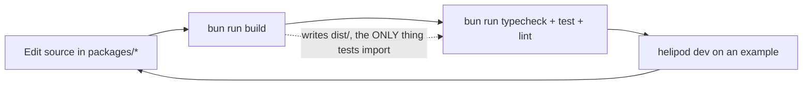
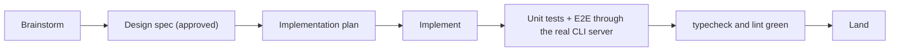

{/* diataxis: how-to */}

This page is for people working on helipod's own codebase, not people building an app with
it. If you're building an app, you want the [Quickstart](/docs/get-started/quickstart) instead.

Everything below is real. Every command is copied from an actual `package.json` or `turbo.json`
in the repo, not aspirational.

## Prerequisites

- **Bun >= 1.2.** Bun is both the package manager and the runtime for the day-to-day workflow
  (`bun install`, `bun run build`, `helipod dev`). Install it from [bun.sh](https://bun.sh) if
  you don't have it.
- **Node >= 22** is a fully-supported *target* for the published packages. End users can run
  helipod on Node, but as a contributor you develop and run the tooling on Bun.

<Callout title="Why Bun for development but Node as a target?">
  Helipod's engine is written to be runtime-agnostic behind small seams (like the storage
  adapter), so it genuinely runs on both. Bun is just the faster, single-tool choice for the
  contributor loop: one binary that installs packages, runs scripts, and executes TypeScript
  directly with no separate transpile step.
</Callout>

## Bootstrap the repo

```bash
git clone <your-fork-url>
cd helipod
bun install
```

(`<your-fork-url>` is a placeholder. Clone whichever fork or remote you're actually working
from.)

`bun install` reads the Bun workspace defined in the root `package.json`. Every package under
`packages/`, `components/`, `examples/`, `apps/`, and `ee/packages/` is one workspace, installed
and linked together in a single pass.

## The core loop commands

These are the top-level scripts every contributor uses, run from the repo root. They're all
orchestrated by [Turborepo](https://turbo.build) (`turbo.json`), which understands the
dependency graph between packages and runs things in the right order.

```bash
bun run build       # Turborepo, topological: builds every package's dist/
bun run test        # all unit tests (vitest, under Node, see the gotcha below)
bun run typecheck   # tsc --noEmit across every package
bun run lint        # lint checks
bun run dev         # watch-build every package (re-runs build on save)
```

Working on one package at a time? Scope any script to it with `--filter`:

```bash
bun run --filter @helipod/values test
bun run --filter @helipod/values typecheck
```

There's also a separate end-to-end test command, covered in its own section below because it has
a different rule attached to it:

```bash
bun run test:e2e    # cross-package E2E suites, run one at a time (concurrency 1)
bun run test:all    # test + test:e2e together
```

## The inner dev loop

Day to day, the loop looks like this:



The dotted annotation on the build step is the single most important thing to internalize
before you touch this codebase. It's the subject of gotcha #1 below.

## Two gotchas that will bite you

These are both hard-won lessons from the project's own history. Read them now and save
yourself an hour of confusion later.

### 1. Cross-package tests import from `dist/`, not `src/`

When package A depends on package B (say, `@helipod/cli` depends on `@helipod/values`), A's
tests resolve B through B's **built** `dist/` output, the same way a real npm consumer would,
not through B's `src/`.

That means: if you edit `packages/values/src/index.ts` and immediately run
`bun run --filter @helipod/cli test`, your edit is invisible. Nothing breaks, nothing updates.
The test just silently keeps running against whatever was in `dist/` before your edit. You have
to `bun run build` (or `bun run --filter @helipod/values build`) first to refresh `dist/`.

<Callout title="git checkout won't save you either" type="warn">

  `dist/` is gitignored. If you're debugging something that seems to have "reverted itself," a
  `git checkout` on the source doesn't touch the stale `dist/` sitting on disk. You still need to
  rebuild.

</Callout>

### 2. `bun run test` runs vitest under Node, not Bun

Even though Bun is the primary runtime, the shared test suite (`bun run test`) runs vitest
**under Node**: `globalThis.Bun` is `undefined` inside those tests. Two consequences follow.

- Don't write assertions in the shared suite that depend on a Bun-only global or API. They'll
  fail (or worse, silently no-op) because that suite never runs on Bun.
- The actual Bun runtime path is comparatively under-tested by the shared suite. It gets its own
  separate smoke test instead. For example, `docstore-sqlite` has a `bun run` smoke test that
  only runs on Bun.

If you're touching anything that behaves differently on Bun vs. Node (SQLite bindings, file
APIs), check whether there's a Bun-specific smoke test near that package, and add one if not.

## Run an example end to end

The fastest way to see whether your change actually works, not just whether it typechecks, is to
run it inside a real example app.

```bash
cd examples/chat
bun run dev
```

That `dev` script is really:

```bash
bun ../../packages/cli/dist/bin.js dev --dir helipod --web web --port 3210
```

Here's what happens when it starts:

1. It boots the **embedded runtime**, an in-process engine (storage, transaction manager, query
   engine, WebSocket sync server), all in one Bun process. No separate database to start.
2. It watches the `helipod/` folder (`--dir helipod`) for function and schema changes.
3. On every save, it re-bundles your functions, re-runs codegen (regenerating the typed
   `_generated/api` your app code imports), and pushes the new code into the running engine,
   without dropping open WebSocket subscriptions. A page with a live query just updates.
4. It serves the sync WebSocket, the HTTP API, and the dashboard, all on one port
   (`--port 3210`), and serves the example's static frontend (`--web web`).

If you only changed a function in `helipod/` you don't need to do anything else. The watch loop
picks it up. If you changed a package under `packages/` that the example depends on, remember
gotcha #1: rebuild that package first, or the example keeps running the old code.

To regenerate the typed API by hand (without starting the dev server):

```bash
bun run codegen   # from inside examples/chat
```

See [the CLI reference](/docs/reference/cli) for the full flag list, and
[Local development](/docs/deploy/local-dev) for the end-user-facing version of this workflow.

## E2E tests and the cardinal testing rule

`packages/cli/test/*-e2e.test.ts` are a different animal from ordinary unit tests. Each one boots
a **real** `helipod dev` (or `helipod serve`) server, the actual CLI entrypoint an end user
runs, and drives it over a real WebSocket or HTTP connection.

```bash
bun run test:e2e   # concurrency 1: E2E suites boot real servers/ports, so they don't run in parallel
```

The project's cardinal testing rule follows directly from this:

<Callout title="Any cross-package feature must be proven through the real CLI server">

  A mechanism that only passes in isolation, a unit test exercising some internal class directly
  and never wired through `helipod dev`/`serve` the way a real user's request would travel, has
  repeatedly hidden real bugs in this project's history. Things like a feature built correctly
  but never actually plumbed into the command that's supposed to use it, or a privilege check
  that only fires on one of two code paths into the same functionality. If your change crosses a
  package boundary, it needs an E2E test alongside its unit tests, not instead of them.

</Callout>

## Working conventions

A few conventions every contributor is expected to follow. These aren't style preferences,
they're how bugs get caught before they ship.

**Spec first, then plan, then code.** Each build-order slice (see
[the architecture overview](/docs/contributing/architecture/system-design)) gets a design spec
under `docs/superpowers/specs/`, reviewed and approved, before any implementation plan or code.
Don't jump straight to coding a new slice. The spec is where architectural mistakes get caught
cheaply, before they're locked into shipped code.

**DX is the feature, not polish.** Error messages from the CLI and SDK, the quality of type
inference, and how fast `helipod dev` starts up are treated as core product surface. If a
change makes an error message vaguer, or slows down startup, or blunts a generated type, weigh
that cost explicitly. Don't treat it as an acceptable side effect of an unrelated fix.

**Two documentation audiences, never mixed.** `docs/enduser/` is the public, end-user product
documentation (this site): how someone *uses* helipod. `docs/dev/` and `docs/superpowers/` are
internal engineering docs (specs, architecture decisions, plans): how helipod itself is
*built*. A change to one should never leak into the other.

**Storage-seam purity.** The engine must never know which database it's running on. Anything
that leaks a SQLite- or Postgres-specific detail out of an adapter package
(`packages/docstore-sqlite`, `packages/docstore-postgres`, and so on) and into engine code is
treated as a design bug, not a style nit. See [the storage architecture](/docs/contributing/architecture/storage)
for why this boundary matters.

## The contribution process, visually



Every step is real work, not ceremony. The brainstorm and spec are where a bad approach gets
rethought while it's still cheap to change. The E2E step is where a feature that "should work"
gets proven against the actual server a user would run.

## Where new work goes

If you're adding something new, here's how to decide where it lives.

| You're adding... | It goes in... |
|---|---|
| A new core engine subsystem (storage, transactions, query engine, sync) | A new package under `packages/` |
| A new opt-in feature (like scheduling, workflows, triggers) | A new **component** under `components/`, built on the component seam. See [Building components](/docs/contributing/extending/custom-component) |
| A new database backend | A new adapter package implementing the `DocStore` interface (the shared cross-backend contract from `packages/docstore`). Under that seam, adapters differ: `docstore-sqlite` sits on a small synchronous `DatabaseAdapter`, while `docstore-postgres` sits on an async `PgClient`. See [Writing a storage adapter](/docs/contributing/extending/storage-adapter) |
| A new object-storage backend | A new adapter package (implementing the `BlobStore` seam) |

The guiding rule is the same one that keeps this codebase navigable at ~30 packages: **keep
packages small and single-purpose.** A package should be understandable on its own, without
having to read the CLI or another package's internals first.

## Next steps

- [The monorepo](/docs/contributing/codebase/monorepo): a tour of the packages, components, and
  how they depend on each other.
- [Architecture overview](/docs/contributing/architecture/system-design): the reactive-transaction
  core and the tiered architecture.
- [Building components](/docs/contributing/extending/custom-component): the seam new opt-in
  features are built on.
- [Contributing guide](/docs/contributing/contributing-guide): how to actually propose and land a
  change (PRs, CLA/DCO).
