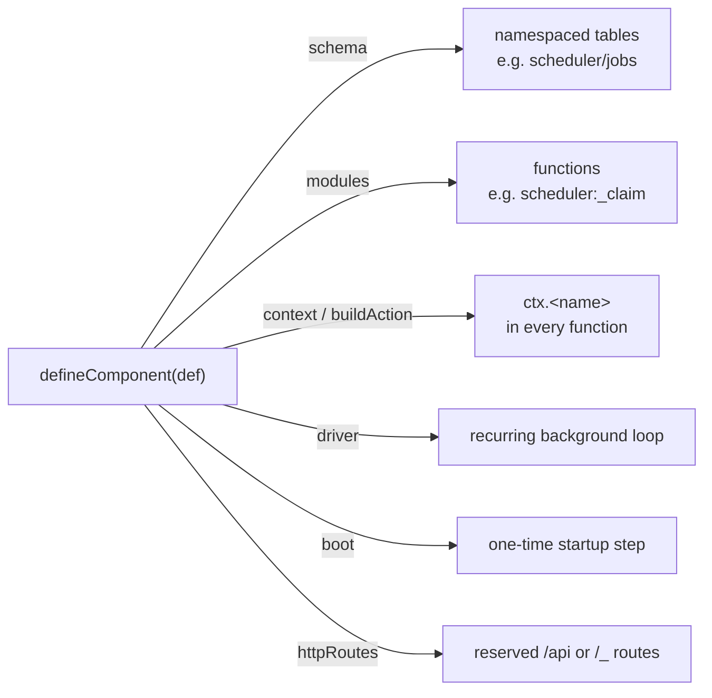
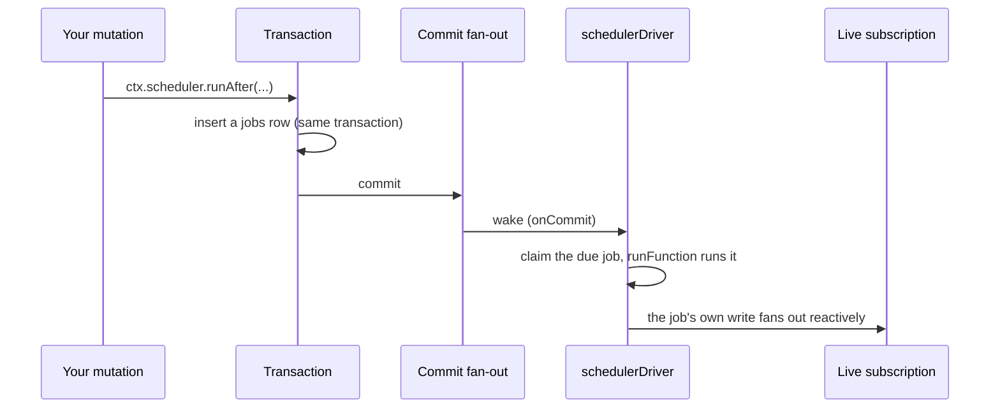
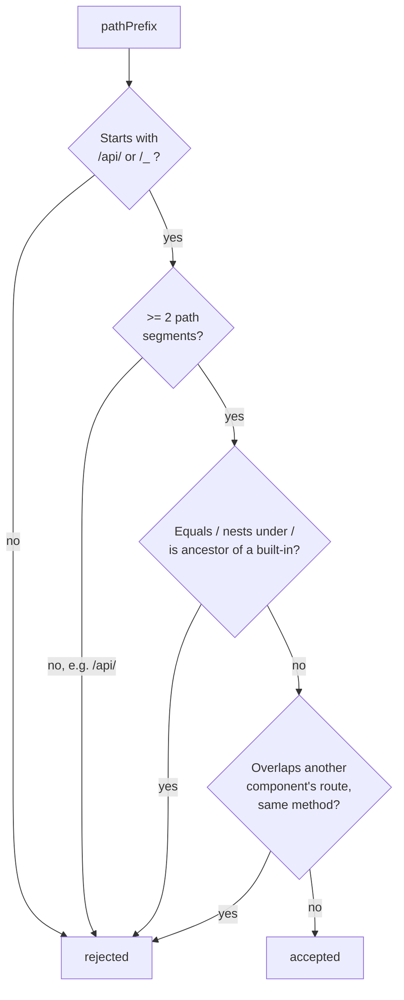
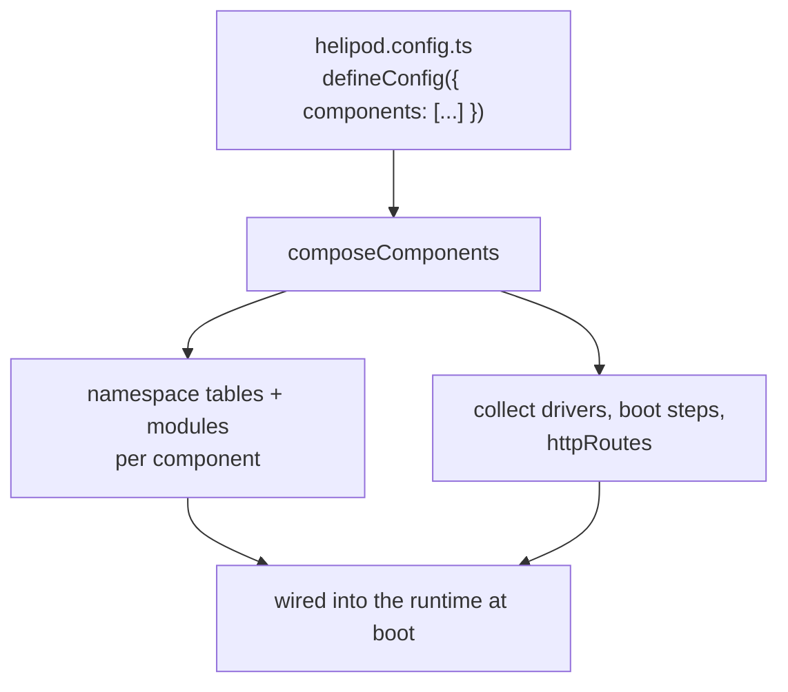

{/* diataxis: how-to */}

This is a how-to for building your own component: a package shaped like `@helipod/scheduler` or
`@helipod/auth` that a project opts into from its `helipod.config.ts`. It assumes you already
know what a component is as a concept and focuses purely on the mechanics of authoring one.

<Callout type="info" title="New to components?">

Read [Components](/docs/components/overview) first for the conceptual overview. This page picks up
from there.

</Callout>

## What a component is

Think of a component as a self-contained mini-backend that plugs into the engine. It can bring:

- its own database tables (namespaced so they never collide with your app's tables or another
  component's),
- its own query/mutation/action functions,
- an optional `ctx.<name>` object that every function in the project gets to call (a "facade"),
- an optional background loop that runs even when nobody's making a request,
- an optional one-time startup step,
- and optional HTTP routes at reserved paths.

Every piece is optional except a name, a schema, and a set of functions. A component can be as small
as a couple of tables and a background loop (`@helipod/triggers`), or as full-featured as tables, a
facade, an action-mode facade, HTTP routes, and a boot step (`@helipod/auth`). The six components
that ship today (scheduler, triggers, auth, authz, workflow, notifications) aren't special-cased by
the engine in any way. They're built on exactly the seam described on this page, so they double as
the best reference material for building your own.

A component is opt-in per project: it does nothing until a project lists it in its
`helipod.config.ts`. Nothing is auto-installed, and nothing about the engine itself needs to change
to add a new component to the ecosystem.

## The entry point: `defineComponent`

A component package exports one factory function, like `defineScheduler()`, `defineAuth(opts)`, or
(for yours) `defineMyThing(opts)`. It builds a plain object and hands it to `defineComponent`:

```ts title="packages/component/src/define-component.ts (shape)"
function defineComponent(def: ComponentDefinition): ComponentDefinition
```

`defineComponent` doesn't do anything clever. It validates `def` and returns it unchanged. Nothing
runs yet, the object is just data. The validation it performs targets exactly the footguns that are
easy to hit and painful to debug later:

- **Name rules.** `def.name` must be non-empty, match `^[a-zA-Z][a-zA-Z0-9_]*$` (letters, digits,
  underscores only: no `/` or `:`, since those are the namespace separators the compose step uses),
  and can't be `"app"` (reserved for your own project code) or start with `_` (reserved for
  internal/non-user-callable paths).
- **`contextType` needs `context`.** Declaring a TypeScript type for `ctx.<name>` without actually
  providing the function that builds it is rejected. A typed-but-undefined facade is a worse failure
  than no type at all.
- **HTTP route sanity.** Every entry in `def.httpRoutes` is checked against the same
  `assertValidComponentRoutePrefix` guard described under
  [`httpRoutes`](#seam-6-httproutes-reserved-endpoints) below, and each route's `handler` must
  actually name an `httpAction` in `def.modules`.

If your factory function calls `defineComponent` and none of these throw, your component is
structurally sound. The rest of this page is about what to put into each field.

### The shape, at a glance



Each arrow is a separate, independent seam. A component can use one, several, or (rarely) all of
them. The rest of this page walks each one in the order you'll likely reach for it.

## Seam 1: `schema` (your own namespaced tables)

**When you need this:** whenever your component stores anything at all, which is nearly always.

```ts
interface ComponentDefinition {
  schema: SchemaDefinition;
  // ...
}
```

This is an ordinary `SchemaDefinition`, defined exactly the way you'd define tables in an app's own
`schema.ts` (see [Schema & tables](/docs/core-concepts/schema-and-tables)). The only thing that's
different is what happens at compose time: every table you declare gets namespaced under your
component's name. If your component is named `"widget"` and you declare a table called `items`, the
actual table on disk is `widget/items`. That way, an app with its own `items` table, or another
composed component that also calls a table `items`, can never collide with yours.

Table numbers are allocated once, in composed order, by `composeTables`
(`packages/component/src/compose.ts`). Declaring the same full table name twice (a bug, not a
feature) is a compose-time error, never a silent overwrite.

## Seam 2: `modules` (your component's own functions)

**When you need this:** always. Every component ships at least one function, whether it's called by app code, your own driver, or your facade.

```ts
interface ComponentDefinition {
  modules: Record<string, RegisteredFunction>;
  // ...
}
```

`modules` is a map of query/mutation/action/httpAction functions, just like the functions your app
registers in its own files. The only difference: these are namespaced with `:` instead of `/`. A
`tick` mutation in a component named `scheduler` becomes reachable at the path `scheduler:tick`.

The convention every built-in component follows: prefix a function name with `_` when it's an
internal implementation detail that only your own driver or facade should call, not something an app
or a client is meant to invoke directly. `@helipod/scheduler`'s own dispatch loop, for example,
calls three internal mutations in sequence: `_peekDue`, `_claim`, and `_complete`. None of those are
meant to be called from application code; they exist purely so the driver (seam 4, below) has
something to run.

## Seam 3: `context` / `buildAction` (the facade users actually touch)

**When you need this:** when app code should call your component ergonomically, as `ctx.widget.doThing(...)`, instead of invoking your module paths by hand.

This is the seam that puts `ctx.scheduler`, `ctx.auth`, or (for your component) `ctx.widget` into
every query, mutation, and action in the project.

```ts
interface ComponentDefinition {
  context?: (cctx: ComponentContext) => object;
  contextType?: { import: string; type: string };
  contextWrite?: boolean;
  buildAction?: (api: ActionApi) => object;
  serverExports?: string[];
}
```

`context` is a function that's handed a `ComponentContext`: your component's own namespaced view of
the current transaction (its own tables, a fixed `now()`, and a `functionKind` resolver). It returns
whatever plain object should show up as `ctx.<name>`. That object's methods can read through
`cctx.db`, which behaves exactly like the `ctx.db` your own query/mutation code already uses, just
scoped to your component's own tables.

```ts title="packages/executor/src/executor.ts (shape)"
interface ComponentContext {
  readonly db: GuestDatabaseReader;
  readonly identity: string | null;
  readonly now: number; // fixed per OCC attempt, never wall-clock
  readonly components: Record<string, unknown>; // facades built before this one
}
```

By default, `cctx.db` is read-only, even inside a mutation. That's deliberate: most facades (like
`@helipod/authz`'s permission checks) only ever need to read. If your facade needs to write (insert
a job row, record a session), set `contextWrite: true` on your `ComponentDefinition`. With that flag,
`cctx.db` becomes writable during a mutation call. It stays read-only during a query, since queries
never write at all.

<Callout type="info" title="A facade write runs inside the calling transaction">

This is the single most important detail for a facade that does real work: a write your facade makes
runs inside the calling mutation's own transaction. It commits or rolls back together with everything
else that mutation does. Once it commits, it fans out to reactive subscriptions exactly like any
other write. Nothing special has to happen for `ctx.scheduler.runAfter(...)`'s side effect to show up
live in a subscribed query.

</Callout>

`contextType` and `serverExports` are purely for codegen, not runtime behavior:

- `contextType: { import, type }` tells `helipod codegen` which package and type name to import so
  it can type `ctx.<name>` correctly in the generated `_generated/server.ts`. Declaring `contextType`
  without `context` is rejected by `defineComponent` (see above); the two must travel together.
- `serverExports: string[]` lets you re-export a helper alongside `query`/`mutation`/`action` from
  `_generated/server.ts`, sourced from the same `contextType.import` path. `@helipod/scheduler` sets
  `serverExports: ["cronJobs"]` so an app's `crons.ts` can write
  `` import { cronJobs } from "./_generated/server" `` without a separate import from
  `@helipod/scheduler` itself.

### Actions need a second implementation: `buildAction`

Actions run *outside* the transaction (see [Actions](/docs/core-concepts/actions)), so there's no
`ctx.db` at all inside one. If you want `ctx.widget` to also work from inside an action, you need a
second builder with the **same method signatures** as `context`'s object. Implement it by calling
your own component's internal mutations through `api.runMutation`/`api.runQuery` instead of touching
a transaction directly:

```ts
buildAction?: (api: ActionApi) => object;
```

`ActionApi` mirrors an action's own `ctx`: `runQuery`/`runMutation`/`runAction` (each a fresh,
independent top-level call) plus the ambient `identity`. It deliberately has no `db`:

```ts title="packages/executor/src/executor.ts (shape)"
interface ActionApi {
  runQuery<T>(ref: FunctionReference | string, args?: Record<string, unknown>): Promise<T>;
  runMutation<T>(ref: FunctionReference | string, args?: Record<string, unknown>): Promise<T>;
  runAction<T>(ref: FunctionReference | string, args?: Record<string, unknown>): Promise<T>;
  identity: string | null;
}
```

This is exactly the pattern `@helipod/scheduler`'s `schedulerActionContext` and
`@helipod/workflow`'s `workflowActionContext` both use: an action-mode facade delegates to an
internal (`_`-prefixed) mutation that does the real work in its own fresh transaction. The payoff:
`ctx.scheduler.runAfter(...)` reads identically whether the code calling it is a mutation or an
action, even though two different objects sit behind `ctx.scheduler` depending on which one you're
in.

## Seam 4: `driver` (the recurring background loop)

**When you need this:** when your component has work no single request triggers, like a due job, a retry, or a sweep.

Most of the interesting components need to do work that isn't triggered by any single request:
running a job whose time has come, retrying a failed delivery, sweeping for something stuck. That's
what `driver` is for:

```ts
interface Driver {
  name: string;
  start(ctx: DriverContext): void | Promise<void>;
  stop?(): void | Promise<void>;
}
```

`start` is called exactly once, after the project boots. `DriverContext` is the toolbox your driver
gets to actually do things outside of any request:

- **`onCommit(cb)`**: a callback that fires on every commit anywhere in the running project, with the
  list of tables/ranges it touched. This is how a driver reacts to writes instantly instead of
  polling. A driver typically filters this down to "did this commit touch one of *my* tables?"
- **`setTimer(atMs, cb)` / `clearTimer(handle)`**: arms a wake at an absolute wall-clock instant,
  never a relative delay (see the seam's own doc comment in
  `packages/component/src/define-component.ts` for why absolute-only avoids clock-skew bugs on
  restart). Every driver's timers collapse down to a single pending wake under the hood, so a host
  only ever needs to implement one alarm.
- **`runFunction(path, args)`**: runs one of your registered functions, privileged, outside of any
  client request. This is how a driver actually dispatches work.
- **`readLog({ afterTs, tables?, limit? })`**: reads committed changes from the underlying change log
  after a given timestamp. This is the seam a "react to every insert/update/delete on a table"
  component (like `@helipod/triggers`) is built on, described further below. Each returned change in
  the batch looks like:

  ```ts title="packages/component/src/define-component.ts (shape)"
  interface LogChange {
    table: string;                            // e.g. "messages"
    id: string;
    op: "insert" | "update" | "delete";
    newDoc: JSONValue | null;                  // null for a delete
    oldDoc: JSONValue | null;                  // null for an insert
    ts: number;                                // commit timestamp of this revision
    changeId: string;                          // "<table>:<id>:<ts>", stable across redelivery
  }
  ```
- **`now()`** / **`backstopMs(defaultMs)`**: the driver's clock, and a hook for declaring "this timer
  is a pure fallback poll, not real work" (a long-lived host leaves it unchanged; a host where every
  wake costs a cold start can stretch it).

### Walking through it: the scheduler end to end

The clearest way to see why the driver seam exists is to follow one `ctx.scheduler.runAfter(...)`
call all the way through:



The insert that `ctx.scheduler.runAfter` makes happens inside your mutation's own transaction. That's
the `contextWrite: true` facade seam from above. Once that transaction commits, the commit fan-out
wakes the scheduler's driver (it's watching for any commit touching its own `scheduler/*` tables). The
driver claims the now-due job and calls `runFunction` on whatever function path you scheduled. That
function is an ordinary mutation: its own writes commit as their own transaction, and fan out to any
subscription watching that data exactly like any other write would.

No polling loop is scanning a `jobs` table on an interval anywhere in this picture. The whole path is
either "woken by a commit" or "woken by a wall-clock timer armed to the next due timestamp."

### A simpler driver: `@helipod/triggers`

Not every driver needs a writable facade. `@helipod/triggers` has no `context` at all: you configure
it declaratively (`{ table: { handler } }` in `helipod.config.ts`), and its driver is just a cursor
walking forward through `readLog`, calling your handler function with batches of changes as it goes,
advancing its own cursor once your handler returns successfully. It's a good second reference
alongside the scheduler: same `driver` seam, no facade, no HTTP routes. Proof that you don't need
every seam to build something useful.

## Seam 5: `boot` (one-time startup work)

**When you need this:** when config declared in code needs reconciling into your tables once per process start, before any request is served.

```ts
boot?: (ctx: BootContext) => Promise<void>;
```

`boot` runs once per process start, before your driver's `start` is called and before the project
starts serving requests. `BootContext` gives it `{ db, now }`: a writer scoped to your component's own
boot-time transaction, and a clock. This is for reconciling some piece of config into a table:
`@helipod/scheduler` uses it to read an app's declared `cronJobs()` schedule and write matching rows
into its `crons` table (`reconcileCrons`) so the driver has something concrete to dispatch against,
rather than re-parsing the config file on every tick.

## Seam 6: `httpRoutes` (reserved endpoints)

**When you need this:** when the outside world has to call your component directly, like an OAuth callback or a delivery provider's webhook.

```ts
interface ComponentHttpRoute {
  method: string;
  pathPrefix: string;
  handler: string; // a bare httpAction name in this component's own `modules`
}
```

If your component needs a raw HTTP endpoint (an OAuth callback, a delivery-provider webhook), you
declare it here instead of asking app authors to wire it into their own `http.ts`. `handler` names an
`httpAction` inside your own `modules` (see [Actions](/docs/core-concepts/actions) for what an
`httpAction` is).

Three rules keep this from ever becoming a foot-gun, enforced both when `defineComponent` builds your
definition and again, defense-in-depth, when the project composes it:

1. **Must live under a reserved namespace.** `pathPrefix` has to start with `/api/` or `/_`. Your
   users' own `http.ts` mounts everywhere else, so a component route can never collide with an app
   route.
2. **Must have at least two path segments.** `/api/widget/` is fine. `/api/` or `/_` alone is
   rejected outright, so a careless component can't accidentally shadow an entire reserved namespace.
3. **Must not collide with a built-in engine prefix** (`/api/run`, `/api/health`, `/api/sync`,
   `/api/storage/`, `/_admin/`, `/_fleet/`, `/_dashboard`), checked in both directions. Your prefix
   can't equal, nest under, or sit as an ancestor of one of these.

At compose time, two different components' routes for the same HTTP method are also rejected if their
prefixes overlap at all, so which one wins is never a silent, declaration-order accident.



For example, `/api/widget/` (two segments, no overlap with `/api/run` etc.) passes; `/api/` alone
fails rule 2, and `/api/storage/extra` fails rule 3 (it nests under the reserved `/api/storage/`).

## The lighter seams

A few more fields round out `ComponentDefinition`, each smaller than the six above:

<TypeTable
  type={{
    requires: {
      type: 'string[]',
      description: 'Names other components yours needs composed alongside it. @helipod/workflow declares requires: ["scheduler"] because it dispatches its steps through the scheduler\'s job queue. The composing project gets a clear compose-time error (component "widget" requires "scheduler", which is not enabled) instead of a confusing runtime failure the first time your facade is touched.',
    },
    config: {
      type: 'Validator<unknown>',
      description: 'A validator for whatever options your defineWidget(opts) factory accepts, if you want them validated the same way document fields are.',
    },
    grants: {
      type: 'Record<string, { read?: string[]; write?: string[] }>',
      description: 'Declares what your component touches on other tables, for tooling and introspection purposes.',
    },
    policies: {
      type: '(paired with policyContext)',
      description: 'How a component like @helipod/authz attaches row-level read/write rules to an app\'s own tables, and contributes fields (like the caller\'s identity) into every policy\'s evaluation context. Most components never touch this pair at all.',
    },
  }}
/>

## Worked example: `@helipod/scheduler`

Here's every seam wired up at once, from `defineScheduler()` in `components/scheduler/src/index.ts`:

```ts title="components/scheduler/src/index.ts (trimmed)"
export function defineScheduler(opts?: { crons?: CronJobs }): ComponentDefinition {
  return defineComponent({
    name: "scheduler",
    schema: schedulerSchema,                              // seam 1
    modules: { _peekDue, _claim, _complete, _reclaim, _cronTick, _enqueue, _cancel }, // seam 2
    context: (cctx) => schedulerContext(cctx),             // seam 3
    contextType: { import: "@helipod/scheduler", type: "SchedulerContext" },
    serverExports: ["cronJobs"],
    contextWrite: true,                                    // seam 3, writable
    driver: schedulerDriver(),                              // seam 4
    boot: (ctx) => reconcileCrons(ctx, opts?.crons),        // seam 5
    buildAction: (api) => schedulerActionContext(api),      // seam 3, action-mode twin
  });
}
```

Reading straight down that object is the whole component: `jobs`/`job_args`/`crons` tables namespaced
under `scheduler/`; a handful of `_`-prefixed internal mutations only the driver calls; a writable
`ctx.scheduler` facade (`runAfter`/`runAt`/`cancel`); a driver that's reactive on any `scheduler/*`
commit plus a wall-clock timer to the next due job; a boot step that reconciles an app's `crons.ts`
into the `crons` table once; and an action-mode twin so `ctx.scheduler` works identically from a
mutation or an action.

The facade itself (`components/scheduler/src/facade.ts`) is a good template for the transactional
write pattern from seam 3: `runAfter` boils down to one insert:

```ts title="components/scheduler/src/facade.ts (shape)"
async runAfter(delayMs, fnRef, args) {
  return enqueueInternal(db, now, FACADE_TABLES, fnRef, args, {
    runAt: now() + Math.max(0, delayMs),
  }, kindOf);
}
```

`enqueueInternal` just does a `db.insert` into the (namespaced) `jobs`/`job_args` tables, nothing more
exotic than that. Everything after "the row is inserted" (the driver waking up, claiming it, running
it, and that job's own write fanning out reactively) is the sequence diagram from seam 4, above.

## Composing your component into a project

Once your `defineWidget(opts)` factory exists, a project uses it exactly like a built-in component, by
listing it in `helipod.config.ts`:

```ts title="helipod.config.ts"
import { defineConfig } from "@helipod/component";
import { defineScheduler } from "@helipod/scheduler";
import { defineWidget } from "@my-org/helipod-widget";

export default defineConfig({
  components: [defineScheduler(), defineWidget({ /* your options */ })],
});
```

(This mirrors `examples/auth-demo/helipod.config.ts`, which composes `auth`, `scheduler`, and
`workflow` together as its own reference pattern.)



The CLI runs `composeComponents` (`packages/component/src/compose.ts`) once, at boot: it namespaces
every component's tables and modules, topologically orders components by their `requires` edges, and
collects every driver/boot-step/HTTP-route into the flat lists the runtime actually wires up.

This composed set is fixed at boot. Adding or removing a component from `helipod.config.ts` needs a
restart (`helipod serve` again, or a fresh `helipod build`); there's no live "activate this
component" call. That's a deliberate, narrower boundary than `helipod deploy`'s live hot-swap of
your app's own functions and additive schema changes. See [Deploy & build](/docs/deploy/deploy-and-build)
for exactly where that line is drawn.

## Checklist for building your own

<Steps>

<Step>

### Pick a name

Letters, digits, and underscores only. Not `"app"`, not `_`-prefixed.

</Step>

<Step>

### Declare your schema

Your tables will be namespaced under `<name>/` automatically.

</Step>

<Step>

### Write your modules

Prefix anything internal-only with `_`.

</Step>

<Step>

### Add a facade, if you need one

If you want `ctx.<name>`, write `context` (and `contextType` for codegen). Set `contextWrite: true`
if it needs to write. Add `buildAction` if it should also work from actions.

</Step>

<Step>

### Add background work, if you need it

Write a `driver`: react to `onCommit`, arm `setTimer` for time-based work, or walk `readLog` for a
change-feed style component.

</Step>

<Step>

### Add startup reconciliation, if you need it

Write `boot`.

</Step>

<Step>

### Add a raw endpoint, if you need one

Add an entry to `httpRoutes` under a `/api/<name>/` prefix.

</Step>

<Step>

### Wrap it and export it

Wrap it all in `defineComponent({...})` inside your own `defineWidget(opts)` factory, and export that
factory as your package's public API.

</Step>

</Steps>

## Where to go next

- [Components](/docs/components/overview): the conceptual overview, composition rules, and the table
  of everything shipped today.
- [Reactivity & sync](/docs/contributing/architecture/reactivity): how a committed write actually
  finds and updates a live subscription, which is what makes a facade's write "just work" reactively.
- [Custom storage adapter](/docs/contributing/extending/storage-adapter): the other major extension
  seam, for backing the engine with a different database entirely.
- [Scheduling](/docs/components/scheduling) and [Triggers](/docs/components/triggers): the two
  components this page walks through in the most depth, from the product-docs side.
