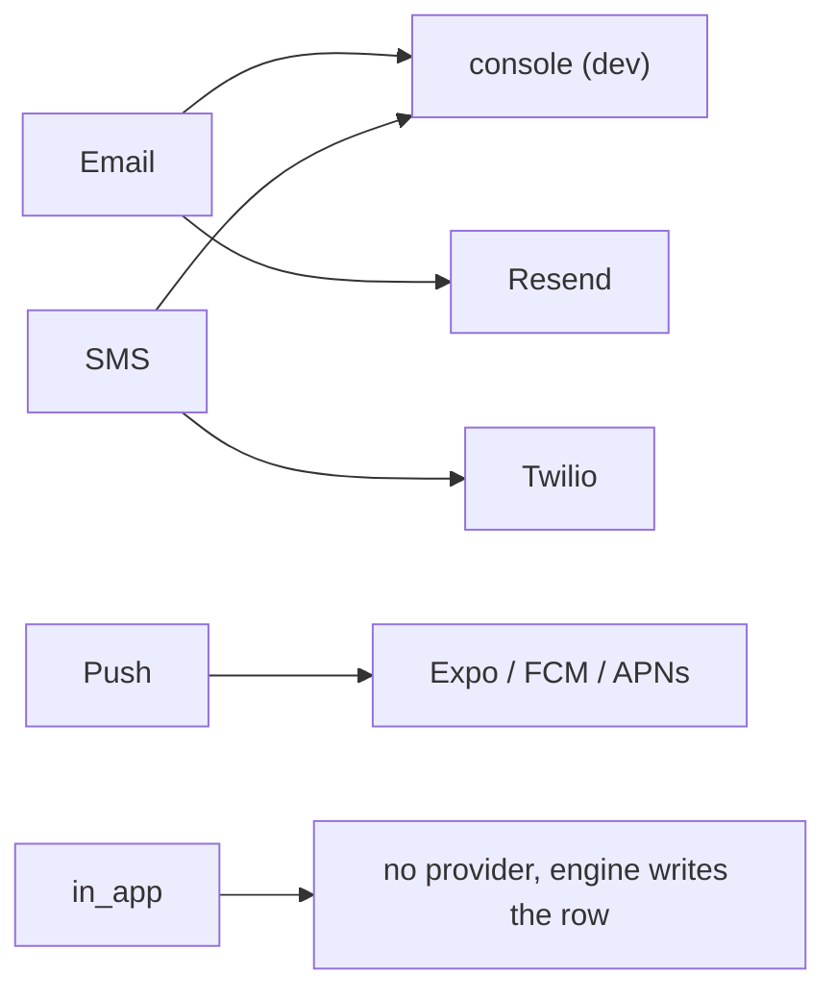
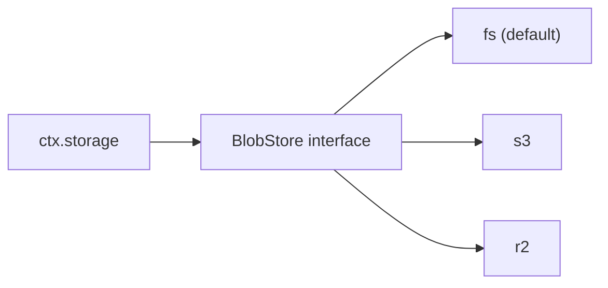
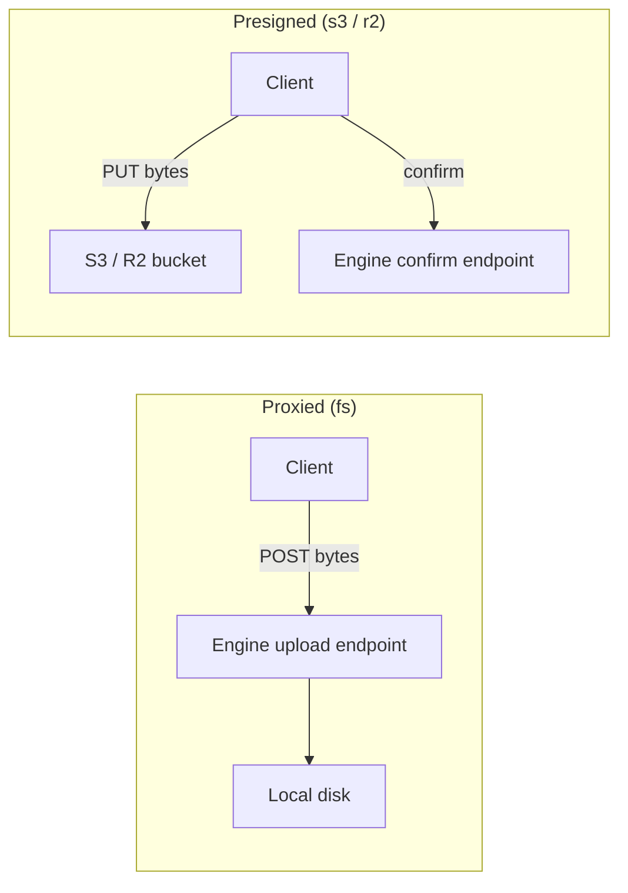

{/* diataxis: how-to */}

## The idea in one sentence

A handful of components need to talk to the outside world: send an email, text a phone, verify a
Google login, store an uploaded file. Instead of hard-wiring one vendor's SDK into the engine,
each of these components defines a small **provider interface** and lets you plug in an
implementation. The vendor SDK never touches core code; it lives in a "leaf" you write or pick off
the shelf.

This is the exact same idea you'll find at [Custom storage adapter](/docs/contributing/extending/storage-adapter)
for databases (`DatabaseAdapter`), just applied to email/SMS/push, OAuth logins, and file bytes
instead of rows. If you understand one, you understand all of them: **a typed interface, a
throw-to-signal convention for failure, and a vendor chosen in config, never imported by the
engine.**

By the end of this page you'll be able to:

- Write a custom email/SMS/push provider for `@helipod/notifications`
- Add a new OAuth provider to `@helipod/auth`
- Write a custom `BlobStore` for file storage

## Notifications: one interface per channel

`@helipod/notifications` groups delivery into **channels**: `email`, `sms`, `push`, and
`in_app`. A channel is *what kind of message this is*; a **provider** is *who actually sends it*.
Resend and a plain `console.log` are both email providers; Twilio is an SMS provider; Expo, FCM,
and APNs are push providers. `in_app` is the odd one out: there's no vendor to call at all. The
engine just inserts a row into the recipient's inbox table.



Source: `components/notifications/src/provider.ts`.

Each channel's provider is a plain object shape, with no base class and no vendor SDK type
leaking into the signature:

```ts
export interface EmailProvider {
  channel: "email";
  send(m: EmailMessage): Promise<SendResult>;
  webhook?: ProviderWebhook; // optional: handle delivery-status callbacks
  name?: string;
}

export interface SmsProvider {
  channel: "sms";
  send(m: SmsMessage): Promise<SendResult>;
  webhook?: ProviderWebhook;
  name?: string;
}

export interface PushProvider {
  channel: "push";
  send(m: PushMessage): Promise<PushSendResult>; // no webhook: invalid tokens come back synchronously
}

export interface PushSendResult extends SendResult {
  invalidTokens?: string[]; // dead device tokens to stop sending to, gathered before any throw
}
```

`SendResult` is just `{ providerMessageId?: string }`: an optional id you can use later to match
up a delivery-status webhook. `PushSendResult` adds an `invalidTokens` array so a provider can tell
the driver "these device tokens are dead, stop sending to them" in the same response.

### How a provider says "it worked" or "it didn't"

There's no status-code return value to check. The convention is a plain **throw**:

- `send` **returns** a `SendResult` on success.
- `send` **throws** on failure. A plain `Error` (or `NotificationSendError` with no options) is
  treated as **retryable**: the built-in retry driver backs off and tries again.
- Throwing `new NotificationSendError(message, { retryable: false })` marks the failure as
  **permanent** (for example, a 4xx "bad recipient" response), and the driver dead-letters the
  message immediately instead of wasting retries on something that will never succeed.

```ts
// permanent failure: the vendor returned a 4xx "bad recipient" response
throw new NotificationSendError("recipient rejected", { retryable: false });
```

This is the whole failure-signaling contract. You don't need to touch the retry queue, backoff
schedule, or dead-letter table yourself. Throwing the right kind of error is enough. The two
shipped adapters agree on where the line is: `resendEmail` and `twilioSms` both treat `5xx` and
`429` (rate limited) as retryable and everything else as permanent.

If your provider also supports delivery-status webhooks (bounce, open, click), implement the
optional `webhook` field:

```ts
export interface ProviderWebhook {
  // MUST return false on a missing/invalid signature: the HTTP route 401s before any write happens.
  verify(args: WebhookVerifyArgs): boolean | Promise<boolean>;
  // Maps the vendor's payload to normalized events. Throw on a malformed body → the route answers 400.
  parse(rawBody: string): WebhookEvent[];
}
```

<Callout type="warn" title="Verify is a security boundary">

`verify` is not a nicety. The shipped `resendEmail` adapter verifies a Svix HMAC signature with a
constant-time comparison and a 5-minute timestamp-skew check before it will let a webhook event
anywhere near a write. Copy that shape rather than skipping verification.

</Callout>

### Writing a minimal custom email provider

A provider is just a function that returns an object matching the interface. Nothing needs to be
registered anywhere else. The object *is* the plugin.

```ts
import type { EmailProvider } from "@helipod/notifications";

export function myEmailProvider(apiKey: string): EmailProvider {
  return {
    channel: "email",
    async send(m) {
      const res = await fetch("https://my-email-vendor.example/send", {
        method: "POST",
        headers: { authorization: `Bearer ${apiKey}` },
        body: JSON.stringify({ to: m.to, from: m.from, subject: m.subject, text: m.text }),
      });
      if (!res.ok) throw new Error(`send failed: ${res.status}`); // retryable by default
      const json = await res.json();
      return { providerMessageId: json.id };
    },
  };
}
```

### How a component consumes a provider

The provider is wired in at config time, not imported deep inside the engine:

```ts title="helipod.config.ts"
import { defineNotifications, twilioSms } from "@helipod/notifications";
import { myEmailProvider } from "./my-email-provider";

defineNotifications({
  channels: {
    email: { provider: myEmailProvider(process.env.MY_VENDOR_KEY!), from: "no-reply@app.test" },
    sms: { provider: twilioSms({ accountSid: "...", authToken: "..." }), from: "+15551234567" },
  },
});
```

From there the component's send path calls `provider.send(...)` and its retry driver decides what
to do with whatever the call returns or throws. You never edit the notifications component itself
to add a vendor. See the shipped references for the full pattern, including chunking, auth token
caching, and idempotency-key passthrough where a vendor supports it:

- `provider-console.ts`: zero-config dev default, logs to stdout
- `provider-resend.ts`: email, plus a signed webhook
- `provider-twilio.ts`: SMS/WhatsApp, plus a signed webhook
- `provider-expo.ts` / `provider-fcm.ts` / `provider-apns.ts`: push, one adapter per platform

All live under `components/notifications/src/`. For the full channel model, preferences, topics,
and the reactive inbox, see [Notifications](/docs/components/notifications).

## Auth: the same email seam, plus OAuth and third-party JWT

`@helipod/auth` needs external systems too: it sends OTP/magic-link/verification emails, and it
needs to verify "yes, this really is that person's Google account." Both are provider seams, and
both live in `components/auth/src`.

### Email: the same shape, a separate copy

Auth's own `EmailProvider` (`components/auth/src/email/provider.ts`) is the same
`send(msg): Promise<void>` shape as notifications' console/Resend adapters: `consoleEmail` for
dev, `resendEmail` for production. It's a deliberately independent copy: if you also compose
`@helipod/notifications` in your project, auth's verification/reset/magic-link/OTP emails
automatically route through the notifications provider instead (so you configure a vendor once);
without notifications composed, auth falls back to its own copy, untouched. Either way, writing a
custom email provider for auth uses the exact same recipe as the notifications section above.

### OAuth: describing a login provider, not calling one directly

Signing in with Google or GitHub means redirecting the user to that provider, getting a code back,
exchanging it for tokens, and mapping whatever claims come back to a normalized identity. An
`OAuthProvider` is the config object that describes how to do all of that for one vendor.
`components/auth/src/oauth.ts` ships `googleProvider`, `githubProvider`, `microsoftProvider`,
`discordProvider`, `facebookProvider`, and `appleProvider` built on this seam, plus the generic
`oauthProvider()` builder underneath all of them.

```ts
export interface OAuthProvider {
  // "oidc" = discover endpoints + verify a signed id_token; "oauth2" = explicit endpoints + a userinfo call
  kind: "oidc" | "oauth2";
  issuer?: string;                    // oidc: the discovery issuer
  authorizationEndpoint?: string;     // oauth2: explicit endpoints (no discovery document)
  tokenEndpoint?: string;
  userinfoEndpoint?: string;
  clientId: string;
  clientSecret: string | (() => string | Promise<string>); // a function, for a vendor like Apple that needs a freshly-minted secret
  scopes: string[];
  mapClaims: (claims: Record<string, unknown>) => ExternalIdentity; // vendor claims → { accountId, email, emailVerified, name }
}
```

Two protocol details worth knowing before you write a new one:

- **`mapClaims` is the only vendor-specific logic you usually write.** Everything else (building
  the authorize URL, exchanging the code, verifying the token's signature against the vendor's
  published keys) is shared plumbing (`oauth4webapi` + `jose`) that every provider reuses.

<Callout type="warn" title="Endpoints must be HTTPS">

A plain `http://` endpoint is rejected at config time unless it points at `localhost`/
`127.0.0.1` (for local testing). This isn't optional per-provider behavior: it's a shared guard
(`assertProviderEndpointsSecure`) that runs for every provider, built-in or custom, so a
production deployment can't accidentally point a login provider at an unencrypted endpoint.

</Callout>

Sketch of adding a new OIDC-based provider (an identity provider that already speaks standard
OpenID Connect discovery, e.g. a corporate SSO tenant):

```ts
import { oauthProvider } from "@helipod/auth";

export function myCompanySsoProvider(opts: { clientId: string; clientSecret: string }) {
  return oauthProvider({
    kind: "oidc",
    issuer: "https://sso.mycompany.example",
    clientId: opts.clientId,
    clientSecret: opts.clientSecret,
    scopes: ["openid", "email", "profile"],
    // Optional: the default mapClaims already covers a standard OIDC claim set.
    mapClaims: (c) => ({
      accountId: String(c.sub ?? ""),
      email: typeof c.email === "string" ? c.email : undefined,
      emailVerified: c.email_verified === true,
      name: typeof c.name === "string" ? c.name : undefined,
    }),
  });
}
```

For a vendor that *doesn't* speak OIDC discovery (no `.well-known` document, no signed
`id_token`; GitHub, Discord, and Facebook are all like this), use `kind: "oauth2"` with explicit
endpoints and write a `mapClaims` that reads whatever shape that vendor's userinfo endpoint
returns, the way `githubProvider` / `discordProvider` / `facebookProvider` do.

### Third-party JWT / OIDC issuers

If your client already holds a signed JWT from some other identity provider (Clerk, Auth0, your
own separate auth service) rather than doing an OAuth redirect through helipod, that's the `jwt`
config block instead of `oauth`. You list trusted issuers; `verifyIdToken`
(`components/auth/src/jwt.ts`) fetches that issuer's public keys (a JWKS document) and checks the
token's signature, issuer, audience, and expiry, once at sign-in, not on every request. A verified
token is then exchanged for a helipod session the same way an OAuth login is, through the shared
identity-resolution path both transports funnel into. The same non-loopback-`http://` guard from
OAuth applies here too, on the JWKS URL.

For the full sign-in flows, session model, and device management, see [Auth](/docs/components/auth)
and [Authorization](/docs/components/authorization).

## File storage: the BlobStore seam

Every other component in this page talks to an external service on your behalf. File storage is
the same idea applied to *bytes*: `ctx.storage` is what your query/mutation/action code calls, and
underneath it sits a narrow `BlobStore` interface that any backend can implement.



Which adapter is active is decided purely by configuration: set `HELIPOD_STORAGE_BUCKET` (or
`--storage-bucket`) and you get the S3/R2-compatible adapter; leave it unset and you get the
zero-config filesystem adapter. The engine and your app code never know or care which one is live.

```ts
export interface BlobStore {
  createUploadTarget(key: string, opts: CreateUploadTargetOpts): Promise<UploadTarget>;
  store(key: string, bytes: ReadableStream<Uint8Array> | Uint8Array, opts?: { contentType?: string }): Promise<StoredBlob>;
  finalizeUpload(key: string): Promise<StoredBlob | null>;
  read(key: string, range?: ByteRange): Promise<ReadableStream<Uint8Array> | null>;
  delete(key: string): Promise<void>;
  signGetUrl(key: string, opts: SignUrlOpts): Promise<string | null>;
  publicUrl(key: string): string | null;
}
```

### Why upload has two shapes

`createUploadTarget` doesn't just hand back a URL. It hands back one of two different upload
*strategies*, and the difference is where the bytes physically travel:



- **Proxied** (the filesystem adapter): there's no bucket for the browser to reach directly, so the
  client `POST`s the file's bytes straight to our own engine endpoint, which stores them and
  finalizes the row in one round trip.
- **Presigned** (S3/R2): the client `PUT`s the bytes straight to the bucket, bypassing the engine
  entirely. That's better for large files and lower server load. Since the engine never sees the
  bytes go by, the client makes one extra call afterward (`POST` to a `confirmUrl`) to tell the
  engine "the upload finished, flip this file to ready."

Your app code doesn't need to know which shape it got back; both are represented by the same
`UploadTarget` union, and the client SDK handles either.

### How `ctx.storage` uses this seam

`ctx.storage` (`packages/storage/src/context.ts`) is the always-on facade every project gets. It's
not opt-in like the components above. It wraps `BlobStore` with the parts a raw byte store
shouldn't know about: minting a `_storage` row, signing HMAC capability tokens so a private file's
URL can't be guessed or replayed for the wrong purpose, and reclaiming abandoned uploads with a
background reaper. Two facades come out of it: `generateUploadUrl` / `getUrl` / `getMetadata` /
`delete` inside queries and mutations (transactional, deterministic, no direct byte I/O, since a
mutation must stay replay-safe), and `store` / `get` / `getUrl` / `getMetadata` inside actions,
where actual byte I/O is allowed.

Writing your own `BlobStore` (say, for Google Cloud Storage) means implementing that interface
once and pointing the storage component at it. It's the same recipe as a custom `DatabaseAdapter`;
see [Custom storage adapter](/docs/contributing/extending/storage-adapter). For the
end-user-facing upload/download flows, capability tokens, and reaper behavior, see
[File storage](/docs/core-concepts/file-storage).

## The pattern, once more

Every seam on this page is the same three ingredients:

1. **A small typed interface** (`EmailProvider`, `OAuthProvider`, `BlobStore`) describing exactly
   the operations the component needs, nothing vendor-specific in the shape.
2. **A throw-to-signal convention** for failure, so the caller doesn't need a side channel to know
   what went wrong or whether to retry.
3. **The vendor SDK stays out of the engine.** It's imported only inside the leaf function you
   write (`resendEmail`, `googleProvider`, `blobstore-s3`), and selected in your project's config,
   never inside core code.

Once you've internalized that shape, adding a new vendor anywhere in helipod is always "write a
new leaf," never "edit the engine." If you want to see the same idea applied to a whole component
(not just one seam inside it), read [Build a custom component](/docs/contributing/extending/custom-component)
next.
