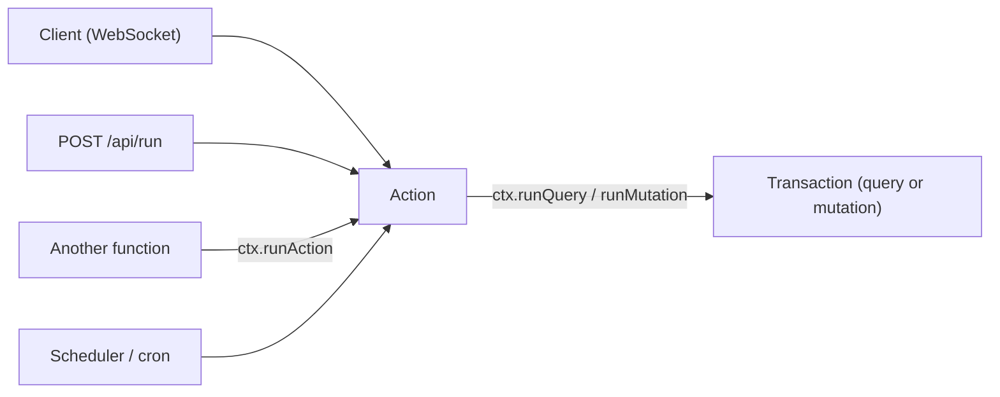

{/* diataxis: explanation */}

[Queries](/docs/core-concepts/queries) and [mutations](/docs/core-concepts/mutations) are
deterministic on purpose. That's what makes reactivity and OCC conflict replay trustworthy: rerun
the same handler on the same inputs and you get the same result, every time.

But real apps need to call third-party APIs, send an email, generate a true random id, or wait on a
timer. None of that can be deterministic. An action is where you do it.

Think of an action as the engine's one escape hatch from the determinism rule. It gives up a
transaction, `ctx.db`, and reactivity. In exchange, it gets native `fetch`, `Date`, `Math.random()`,
and timers. Understanding that trade is the whole model.

## Actions run outside the transaction

A query or a mutation runs inside `transactor.runInTransaction`. It gets a consistent snapshot, the
engine tracks every table and range it reads and writes, and on conflict the engine can safely
replay the handler because it's a pure function of its inputs.

An action runs outside all of that. There's no snapshot, no read set, no write set, and no commit
for the action itself. That also means an action's result is never subscribed to: only a query's
read set can drive a reactive subscription, and an action has none.

Structurally, this shows up as `ActionCtx` having no `ctx.db`. Not a restricted one. An absent one.

```ts
export interface ActionCtx {
  runQuery<T = unknown>(ref: FunctionReference | string, args?: Record<string, unknown>): Promise<T>;
  runMutation<T = unknown>(ref: FunctionReference | string, args?: Record<string, unknown>): Promise<T>;
  runAction<T = unknown>(ref: FunctionReference | string, args?: Record<string, unknown>): Promise<T>;
}
```

There's nothing to read or write directly. All data access goes through the three `runX` methods
below.

Every call to an action is a fresh, independent top-level run. Calling an action a second time,
whether from the client, the scheduler, or another function, doesn't resume or join anything from
the first call. Each invocation gets its own `ActionCtx`, its own outer try/catch, and (if it calls
`runMutation`) its own separate commits.

## Defining an action

```ts title="helipod/tasks.ts"
import { v } from "@helipod/values";
import { action } from "./_generated/server";

export const sendReminder = action({
  args: { taskId: v.id("tasks") },
  handler: async (ctx, { taskId }) => {
    const task = await ctx.runQuery("tasks:get", { id: taskId });
    const res = await fetch("https://api.email.example.com/send", {
      method: "POST",
      body: JSON.stringify({ subject: `Reminder: ${task.title}` }),
    });
    return res.ok;
  },
});
```

`args` and `returns` validators work exactly as they do for queries and mutations (see
[Queries](/docs/core-concepts/queries) and [Mutations](/docs/core-concepts/mutations)). Declare
`args`, and the engine validates a call's arguments before the handler ever runs, rejecting a
mismatch with an `ArgumentValidationError` (surfaced to an HTTP caller as a 400). This validation is
opt-in per function, and applies to actions exactly like it applies to queries and mutations. The one
function type it doesn't apply to is `httpAction` (below): its input is a raw `Request`, not typed
args, so there's nothing to validate against.

A function reference can be either a typed `api.tasks.sendReminder`-style reference from the
generated `api`/`internal` objects, or its bare `"module:export"` path string, as used above.

### Native non-determinism is allowed

Inside an action's handler, capabilities that queries and mutations block all work normally, because
nothing here needs to replay identically on conflict:

- `fetch` for real network calls to any URL.
- `Date.now()` / `new Date()` for real wall-clock time, not the transaction's fixed snapshot time.
- `Math.random()` / `crypto.randomUUID()` for real entropy, not the seeded deterministic RNG queries
  and mutations get.
- `setTimeout`/`setInterval` and other timers.

This is the direct trade for giving up `ctx.db`. An action can safely do anything a normal async
TypeScript function can do, because the engine never has to re-run it to resolve a conflict. There's
no conflict to resolve, since it never opened a transaction of its own.

## Reaching the database: runQuery, runMutation, runAction

An action has no direct database access, so it orchestrates through three methods on `ctx`. Each one
starts a brand-new, independent top-level run of the target function: its own transaction for a
query or mutation, or its own action execution for a nested action.

<TypeTable
  type={{
    runQuery: {
      description: 'Runs a query and returns its result.',
      type: '(ref, args?) => Promise<T>',
    },
    runMutation: {
      description: "Runs a mutation as its own transaction, commits it, and returns its result.",
      type: '(ref, args?) => Promise<T>',
    },
    runAction: {
      description: 'Runs another action.',
      type: '(ref, args?) => Promise<T>',
    },
  }}
/>

```ts title="helipod/orders.ts"
export const checkout = action({
  args: { cartId: v.id("carts") },
  handler: async (ctx, { cartId }) => {
    const cart = await ctx.runQuery("carts:get", { id: cartId });
    const charge = await fetch("https://api.stripe.example.com/charges", {
      method: "POST",
      body: JSON.stringify({ amount: cart.total }),
    });
    if (!charge.ok) throw new Error("payment failed");
    // Commits as its OWN transaction: a separate write-set, a separate round of invalidation.
    await ctx.runMutation("orders:markPaid", { cartId });
  },
});
```

<Callout type="warn" title="Actions can't group writes atomically">

Because each `runMutation` call is its own commit, there's no way to group several writes into one
atomic transaction from inside an action. If `checkout` above called `runMutation` twice, say,
`orders:markPaid` and then `inventory:decrement`, and the process crashed between them, the first
write is durable and the second never happened. There's no rollback spanning both.

</Callout>

If several writes must succeed or fail together, put them in a single mutation and have the action
call that one mutation once. Actions are for orchestrating non-deterministic work around your data.
Grouping writes is what a mutation's own transaction is for.

`runQuery`/`runMutation`/`runAction` also reach internal (`_`-prefixed) functions: a module or export
path with any `:`-separated segment starting with `_` (for example, `"reminders:_send"`). The public
entry points below (client calls and `POST /api/run`) reject a `_`-prefixed path outright. The only
way to reach one is from inside another function via these three methods, or from the scheduler. This
is the mechanism for writing a function that's meant to be called only by your own action, workflow,
or trigger code, never directly by a client.

<Callout title="Only ActionCtx has these methods">

Queries and mutations have no `runQuery`/`runMutation`/`runAction` at all. That escape hatch exists
solely on `ActionCtx`, precisely because an action is already outside any transaction and has
somewhere to delegate to. A query or mutation can only read or write through its own `ctx.db`. It
cannot call into another function.

</Callout>

## Where an action can be called from

An action isn't reachable through the reactive subscription path. There's no read set, so there's
nothing to subscribe to. But it's callable from everywhere else a query or mutation is:



<Tabs items={['Client', 'HTTP', 'Another function', 'Scheduler']}>

<Tab value="Client">

Over the same WebSocket sync connection as queries and mutations, with a plain non-reactive call:

```tsx title="web/ReminderButton.tsx"
import { useAction } from "@helipod/client/react";
import { api } from "../helipod/_generated/server";

function ReminderButton({ taskId }: { taskId: string }) {
  const sendReminder = useAction(api.tasks.sendReminder);
  return <button onClick={() => void sendReminder({ taskId })}>Send reminder</button>;
}
```

`useAction`, like `useMutation`, isn't reactive. It returns a plain async callback that resolves once
the action finishes, unlike `useQuery`'s live subscription.

The underlying client method is `client.action(ref, args)`, returning `Promise<Value>`. On the wire,
the client sends an `Action` message and waits for an `ActionResponse`. A failed action arrives as
`{ type: "ActionResponse", success: false, error }`, and the client rejects the promise with
`new Error(error)`.

`ActionResponse` frames, like `MutationResponse`, are undroppable. The sync session never discards
one under backpressure, so a slow client still eventually learns its action's outcome instead of the
connection silently losing the response.

</Tab>

<Tab value="HTTP">

`POST /api/run` with the action's path runs it directly, no WebSocket required. It's handy for a
server-to-server call or a script:

```bash
curl -X POST http://localhost:3000/api/run \
  -H 'content-type: application/json' \
  -d '{"path": "tasks:sendReminder", "args": {"taskId": "..."}}'
```

The response is `{ value, committed, commitTs }` on success, or `{ error, code }` with the matching
HTTP status on failure (an `ArgumentValidationError` comes back as 400, for example).

`/api/run` dispatches to whichever function type is registered at that path. The same endpoint runs
queries, mutations, and actions, and you don't declare the kind in the request. Send an
`Authorization: Bearer <token>` header to pass an identity through, exactly like the WebSocket path
does.

</Tab>

<Tab value="Another function">

Any action, or recursively, an action it calls, can call another action with `ctx.runAction(ref,
args)` (see the previous section). This is also the only way to invoke an internal (`_`-prefixed)
action from outside the scheduler.

</Tab>

<Tab value="Scheduler">

`ctx.scheduler.runAfter`/`runAt`, and a `cronJobs()` recurring schedule, run a target function later,
exactly as if a client had called it, with no caller waiting on the result. The target can be a
mutation or an action: the scheduler resolves which and dispatches accordingly. See
[Scheduling](/docs/components/scheduling) for the full surface: delays, cron expressions, retry
policy, and cascading cancellation.

The dispatch guarantee differs by what failed, and the difference matters for actions specifically:

| what happened | scheduled mutation | scheduled action |
|---|---|---|
| handler threw an error | retried (jittered exponential backoff, then dead-lettered) | **not retried by default**: dead-lettered on the first failure, unless the job explicitly opted into retries |
| process crashed mid-run | safely retried: a transaction either committed or it didn't | **not retried**: the job is dead-lettered (at-most-once) |

Both action rows follow from the same fact: an action's side effects, like an email sent or a
charge made, aren't transactional, so re-running one that already did external work could double
the side effect. Retries for an action are an explicit opt-in (the scheduler's low-level
`retry: { maxFailures }` option, which is also how a workflow step's `maxAttempts` works), and
opting in is your statement that the action is idempotent. If
you need "this multi-step process eventually finishes even if a node dies partway through," that's
what the [Workflows](/docs/components/workflows) durable step journal is for, not a bare scheduled
action.

</Tab>

</Tabs>

## Errors propagate to the caller

An action's handler is a plain `async` function. Throwing from it, or returning a rejected promise,
is how you signal failure. There's no commit to roll back, so an uncaught error simply propagates:

- A client `useAction`/`client.action()` call's promise rejects with the thrown error's message.
- `POST /api/run` responds with the corresponding HTTP status and `{ error, code }`.
- A calling function's `ctx.runAction(...)` await throws the same error, so a parent action can
  `try`/`catch` around a nested action or mutation call exactly like any other `await`.
- A scheduled action's failure goes through the scheduler's retry/dead-letter path described above,
  rather than surfacing to any waiting caller (there is none).

Nothing about an action's own execution is ever partially applied. There's no partial commit to worry
about, unlike a mutation. But if an action already called `ctx.runMutation` successfully and then
threw (say, the reminder email's `fetch` failed after the earlier `runMutation` already committed),
that earlier mutation's write is real and stays committed. Handle that ordering deliberately: do the
risky non-deterministic work first, and commit the mutation only once you know it succeeded, rather
than the other way around.

## Component action-mode facades

A composed component's context object, like `ctx.storage`, `ctx.scheduler`, or `ctx.workflow`, is
built differently depending on whether the calling function is a mutation or an action. Only a
mutation has a `ctx.db` for the in-transaction facade to write through.

Inside a mutation, a component's facade writes directly into the calling mutation's own transaction.
`ctx.scheduler.runAfter(...)` inserting a job row commits (or rolls back) atomically with the rest of
that mutation, for example.

Inside an action, there's no transaction to write into. So the same-named facade is instead built as
an action-mode variant that delegates every read and write to that component's own internal
(`_`-prefixed) mutations and queries, via `runQuery`/`runMutation`. This happens invisibly: a function
body calling `ctx.scheduler.runAfter(...)` is portable between a mutation and an action without
changing a line.

`ctx.storage` is the clearest example of why this split exists. The action-mode facade is exactly
four methods: `store`/`get`/`getUrl`/`getMetadata`. `getUrl` and `getMetadata` are metadata-only
and appear on both variants with identical signatures (`delete` is a write, so it exists only on
the mutation-mode facade). `store`/`get` do actual byte I/O against the blob backend, and are
action-only: fetching or pushing bytes over the network is exactly the kind of non-determinism a
mutation may never perform, so they simply don't exist on the mutation-mode facade's type. This is
the same "no non-determinism in a transaction" rule as `fetch`, expressed as a capability that's
structurally present in one context and absent in the other, rather than as a runtime check:

```ts title="helipod/images.ts"
export const resize = action({
  args: { id: v.id("_storage") },
  handler: async (ctx, { id }) => {
    const stream = await ctx.storage.get(id);          // byte I/O, action only
    const resized = await resizeImage(stream);
    const newId = await ctx.storage.store(resized, { contentType: "image/png" });
    return newId;
  },
});
```

`ctx.scheduler` and `ctx.workflow` follow the same pattern: `ctx.scheduler.runAfter`/`runAt`/`cancel`
and `ctx.workflow.start`/`cancel`/`sendEvent` all work from an action, each delegating to an internal
mutation under the hood, so scheduling or starting a workflow is available from action-orchestrated
code exactly as it is from a mutation. See [File storage](/docs/core-concepts/file-storage),
[Scheduling](/docs/components/scheduling), and [Workflows](/docs/components/workflows) for each
facade's full surface.

## httpAction: the Request/Response variant

`httpAction` is an action whose input and output are a raw Web `Request`/`Response` instead of typed
JSON args and a return value:

```ts title="helipod/http.ts"
import { httpAction, httpRouter } from "./_generated/server";

export const receiveWebhook = httpAction(async (ctx, request) => {
  const body = await request.json();
  await ctx.runMutation("messages:send", { author: body.author, body: body.body });
  return new Response(JSON.stringify({ ok: true }), { status: 200 });
});
```

Everything above about actions applies unchanged: no `ctx.db`, the same
`runQuery`/`runMutation`/`runAction`, the same native `fetch` and clock.

Two things differ. The I/O shape is `Request` in and `Response` out, instead of args in and a value
out. And how it's invoked is different too: a `httpAction` isn't called by path through the sync
connection or `/api/run` at all. It's routed by method and URL path through a conventional
`http.ts`'s `httpRouter()`, which is how you expose a public webhook endpoint for a third party that
can't speak the sync protocol.

`httpAction` also has no `args` validator. There's no typed-args slot to validate: the handler parses
its own `Request` body. See [HTTP & webhooks](/docs/core-concepts/http-and-webhooks) for routing,
reserved paths, and the full webhook recipe.

## No non-determinism in a transaction: the rule this all exists to enforce

Zoom out and everything above is one rule wearing different clothes. A query or a mutation must be
deterministic, because its correctness depends on being safely re-runnable: a mutation on OCC
conflict, a query whenever a subscription's read set is invalidated.

`fetch`, `Date.now()`, `Math.random()`, and timers are all blocked inside a query or mutation handler
for the same reason: none of them would replay to the same result. An action is where that
constraint lifts, in exchange for giving up the one thing determinism buys you: a transaction, a
read/write set, and reactivity.

Reach for a query to read, a mutation to write, and an action only for the part of your logic that
genuinely needs the network, the clock, real randomness, or a timer. Keep that part as small as you
can, and orchestrate the actual data changes through `runMutation` calls to real mutations.
